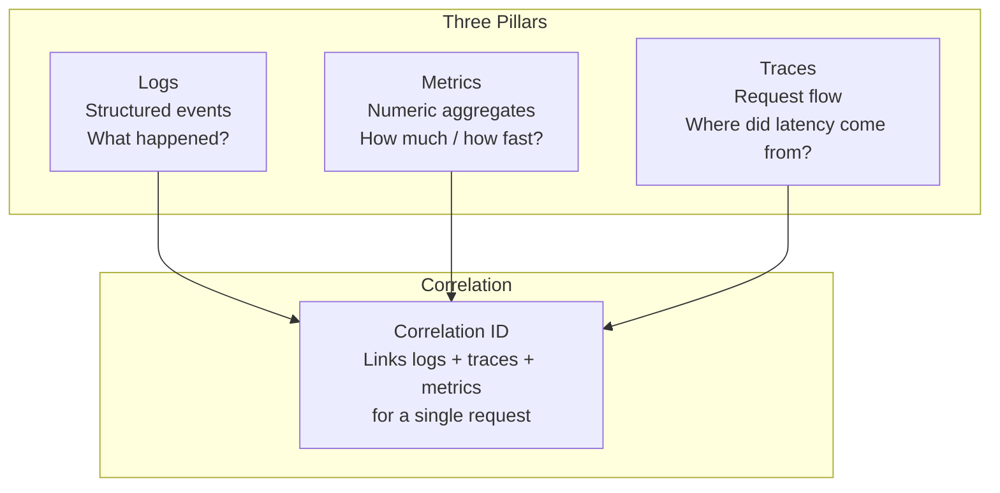
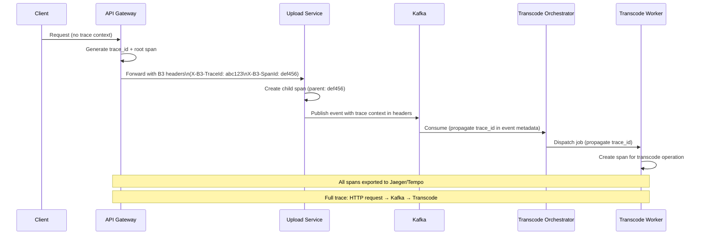
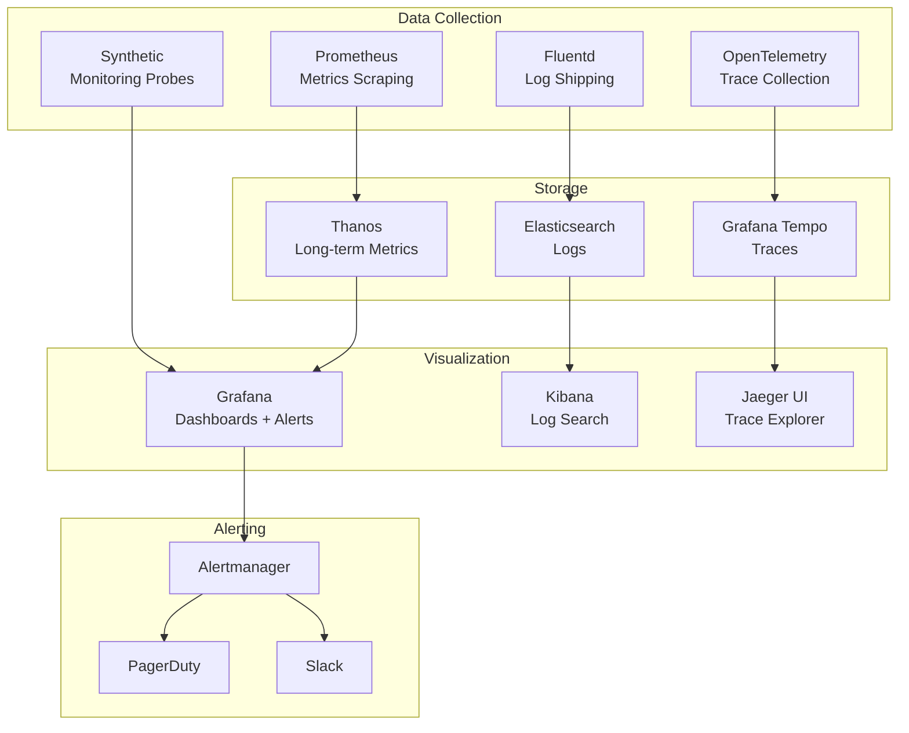

# 12 — Observability: Video Streaming Platform

---

## Objective

Define the complete observability strategy: structured logging, distributed tracing, metrics and dashboards, alerting policies, SLI/SLO/SLA definitions, and the monitoring stack. Observability is not debugging after the fact — it is the ability to understand system state from its outputs alone, without modifying code.

---

## 1. Observability Pillars



---

## 2. SLI / SLO / SLA Definitions

### 2.1 SLI (Service Level Indicators) — What We Measure

| Service | SLI | Measurement Method |
|---|---|---|
| Video streaming | Time To First Frame (TTFF) | P50/P95/P99 latency from manifest request to first segment delivered |
| Video streaming | Rebuffering ratio | Seconds of buffering / total watch time |
| API availability | Success rate | (5xx responses / total requests) ≤ threshold |
| Upload | Upload success rate | Successful completions / initiated uploads |
| Transcoding | Processing time | P50/P95 time from upload complete to first rendition available |
| Search | Query latency | P50/P95/P99 response time |
| CDN | Cache hit ratio | CDN hits / total CDN requests |

### 2.2 SLO (Service Level Objectives) — Targets

| Service | SLO | Error Budget (30-day) |
|---|---|---|
| Video start latency | P99 TTFF < 2 seconds | 0.1% requests may exceed 2s |
| API availability | 99.99% success rate | 4.3 minutes downtime/month |
| Upload success | 99.9% of uploads complete | 43 minutes/month degradation |
| Transcode P95 | Standard video available within 15 min | 5% may take longer |
| Search P99 | < 500ms | 0.1% queries may exceed |
| CDN hit ratio | > 95% | Can drop below 15 min/month |
| Rebuffering ratio | < 0.5% on average | |

### 2.3 SLA (Service Level Agreements) — Contractual Commitments

| Tier | Availability SLA | Penalty |
|---|---|---|
| Platform uptime | 99.9% monthly | Service credits per contract |
| Creator upload processing | 99.5% within 30 min | Creator dashboard compensation |
| CDN delivery | 99.99% (CDN provider SLA) | CDN provider credits |

**Error Budget Policy**: If error budget for any SLO drops below 50% with 10 days remaining in the month, all non-critical feature deployments are frozen. Team focuses on reliability work until budget is restored.

---

## 3. Structured Logging

### 3.1 Log Format

All services emit JSON-structured logs (not plaintext):

```json
{
  "timestamp": "2026-05-17T14:22:10.543Z",
  "level": "INFO",
  "service": "upload-service",
  "version": "2.4.1",
  "instance_id": "upload-service-us-east-1a-pod-7d8f9b",
  "trace_id": "4bf92f3577b34da6a3ce929d0e0e4736",
  "span_id": "00f067aa0ba902b7",
  "user_id": "usr_ghi789",
  "upload_id": "upl_abc123",
  "event": "upload_chunk_received",
  "chunk_number": 12,
  "chunk_size_bytes": 10485760,
  "duration_ms": 45,
  "message": "Chunk 12/256 received and stored"
}
```

**Required Fields on Every Log Line**:
- `timestamp` (ISO 8601, milliseconds)
- `level` (DEBUG, INFO, WARN, ERROR)
- `service`, `version`, `instance_id`
- `trace_id`, `span_id` (from distributed trace context)
- `event` (machine-readable event type)
- `message` (human-readable)

**Never Log**:
- Passwords, tokens, API keys (even partially)
- Full credit card numbers
- Raw IP addresses (log hashed)
- Video content or user-generated text (PII risk)

### 3.2 Log Levels and Volumes

| Level | Usage | Estimated Rate |
|---|---|---|
| DEBUG | Detailed diagnostic (only in dev/staging, not production) | Off in prod |
| INFO | Normal operations (request received, event published) | ~10K/sec across cluster |
| WARN | Recoverable issues (retry needed, near limit) | ~100/sec |
| ERROR | Request failures, exceptions | < 10/sec (alert if higher) |
| FATAL | Service unable to start/continue | < 1/day |

### 3.3 Log Pipeline

```
Application Pod
    ↓ stdout/stderr
Fluentd DaemonSet (per K8s node)
    ↓ parse, enrich with K8s metadata
Kafka (logs.ingest topic)
    ↓ stream processing
Logstash / Flink
    ↓ filter, transform, route
Elasticsearch / OpenSearch
    ↓ indexed by service + timestamp
Kibana
    ↓ dashboards + search

Retention:
  Hot (ES): 7 days (fast search)
  Warm (ES with fewer replicas): 30 days
  Cold (S3 archived): 1 year
  Compliance logs: 7 years (S3 Object Lock)
```

---

## 4. Distributed Tracing

### 4.1 Tracing Architecture



### 4.2 OpenTelemetry Implementation

All services instrumented with **OpenTelemetry SDK** (vendor-neutral):

```
Auto-instrumentation:
  - HTTP clients/servers (Spring Web)
  - Database calls (JDBC)
  - Redis operations (Lettuce client)
  - Kafka producer/consumer

Manual spans for business-critical operations:
  - Video upload completion
  - Transcode job start/end
  - CDN manifest generation
  - DRM license validation

Sampling strategy:
  - 100% of error traces sampled
  - 100% of slow traces sampled (> 1 second)
  - 1% of successful traces sampled (too expensive to keep all)
  - Always sample for critical user flows (upload, DMCA)
```

### 4.3 Trace Context Propagation Across Services

```
HTTP services: W3C TraceContext standard headers
  traceparent: 00-4bf92f3577b34da6a3ce929d0e0e4736-00f067aa0ba902b7-01

Kafka messages: Custom trace header in Kafka record headers
  otel-traceparent: 00-4bf92f3577b34da6a3ce929d0e0e4736-00f067aa0ba902b7-01

gRPC services: gRPC metadata propagation (built into OpenTelemetry gRPC plugin)
```

---

## 5. Key Metrics

### 5.1 Upload Service Metrics

| Metric | Type | Labels | Alert Threshold |
|---|---|---|---|
| `upload.sessions.initiated` | Counter | region, client_type | - |
| `upload.sessions.completed` | Counter | region | - |
| `upload.sessions.abandoned` | Counter | failure_reason | > 5% abandon rate |
| `upload.chunk.latency_ms` | Histogram | region | P99 > 2000ms |
| `upload.active_sessions` | Gauge | region | > 50K (capacity) |

### 5.2 Transcoding Service Metrics

| Metric | Type | Labels | Alert Threshold |
|---|---|---|---|
| `transcode.queue_depth` | Gauge | rendition_tier | > 5000 (scale-up trigger) |
| `transcode.job.duration_seconds` | Histogram | rendition, codec | P95 > 1800s (30 min) |
| `transcode.job.failures_total` | Counter | failure_reason | > 10/min |
| `transcode.permanent_failures_total` | Counter | - | > 0 (alert immediately) |
| `transcode.worker.cpu_utilization` | Gauge | worker_id | > 95% sustained |

### 5.3 CDN and Streaming Metrics

| Metric | Type | Labels | Alert Threshold |
|---|---|---|---|
| `cdn.hit_ratio` | Gauge | region, content_type | < 90% (warn), < 80% (page) |
| `cdn.origin_requests_per_sec` | Gauge | region | > 50K (scale origin) |
| `streaming.ttff_ms` | Histogram | region, quality | P99 > 2000ms |
| `streaming.rebuffering_ratio` | Gauge | region | > 1% |
| `streaming.concurrent_viewers` | Gauge | region | Capacity planning |
| `streaming.error_rate` | Gauge | error_type | > 0.1% |

### 5.4 Database Metrics

| Metric | Type | Labels | Alert Threshold |
|---|---|---|---|
| `db.query.duration_ms` | Histogram | service, query_name | P99 > 500ms |
| `db.connection_pool.active` | Gauge | instance | > 80% of max |
| `db.replication_lag_seconds` | Gauge | replica_id | > 5 seconds |
| `db.slow_queries_total` | Counter | query_name | > 10/min for any query |
| `redis.hit_ratio` | Gauge | cache_name | < 80% |
| `redis.memory_used_bytes` | Gauge | shard | > 85% of max |

### 5.5 Kafka Metrics

| Metric | Type | Labels | Alert Threshold |
|---|---|---|---|
| `kafka.consumer.lag` | Gauge | group, topic, partition | > 100K (warn), > 1M (page) |
| `kafka.producer.send_failures` | Counter | topic | > 10/min |
| `kafka.broker.under_replicated_partitions` | Gauge | broker | > 0 (alert immediately) |
| `kafka.broker.offline_partitions` | Gauge | - | > 0 (page immediately) |
| `kafka.consumer.records_per_second` | Gauge | group, topic | Capacity planning |

### 5.6 Business Metrics (Real-Time KPIs)

| Metric | Refresh | Dashboard | Audience |
|---|---|---|---|
| Concurrent viewers | 30s | Operations | Ops |
| Videos uploaded/min | 1 min | Operations | Ops |
| Transcode queue depth | 30s | Operations | Ops |
| CDN egress GB/sec | 1 min | Operations | Ops |
| P99 video start time | 1 min | Performance | Engineering |
| Error rate by service | 30s | Alerting | On-call |
| New user registrations/min | 5 min | Business | Product |
| Daily active users | 10 min | Business | Product/Exec |

---

## 6. Dashboards

### 6.1 Platform Health Dashboard (Operations Room)

```
Panels:
  - Concurrent Viewers (gauge + sparkline)
  - CDN Hit Ratio by Region (gauge)
  - P99 Time To First Frame by Region (heatmap)
  - API Error Rate by Service (multi-line)
  - Kafka Consumer Lag (per critical group)
  - Transcode Queue Depth (gauge + trend)
  - Active Alarms (list)
```

### 6.2 Upload Pipeline Dashboard

```
Panels:
  - Upload Initiation Rate (last 24h)
  - Upload Success/Fail Rate
  - Active Upload Sessions
  - Average Upload Duration by File Size
  - Transcode Processing Time P50/P95/P99
  - Transcode Failures by Reason
  - Worker Scaling Events (scale-up/down events)
```

### 6.3 Database Performance Dashboard

```
Panels:
  - Query Latency P50/P99 per service
  - Slow Query Log (top 10 slowest queries last hour)
  - Connection Pool Utilization per service
  - Read Replica Lag per replica
  - Redis Hit Ratio per cache namespace
  - Redis Memory per shard
  - PostgreSQL Table Bloat (weekly)
```

### 6.4 CDN and Delivery Dashboard

```
Panels:
  - CDN Hit Ratio by Region and Content Type
  - Origin Request Rate (cache miss traffic)
  - Segment Delivery Latency P50/P99
  - Rebuffering Rate by Region
  - Bandwidth Egress (CDN + Origin) in Tbps
  - 4K vs 1080p vs 720p traffic split
```

---

## 7. Alerting Strategy

### 7.1 Alert Severity Levels

| Severity | Definition | Response SLA | Channel |
|---|---|---|---|
| **P1 Critical** | Customer-facing outage; streaming unavailable; security incident | 5 min acknowledge, 30 min mitigate | PagerDuty + SMS + War room |
| **P2 High** | Significant degradation; SLO breach imminent; data loss risk | 15 min acknowledge, 2 hr mitigate | PagerDuty + Slack |
| **P3 Medium** | Partial degradation; SLO at risk; performance regression | 4 hr acknowledge, 1 day mitigate | Slack + ticket |
| **P4 Low** | Informational; trend concerns; capacity warning | Next business day | Ticket |

### 7.2 Alert Definitions

```
P1 Alerts:
  - video.streaming.error_rate > 5% for 2 consecutive minutes
  - kafka.broker.offline_partitions > 0
  - db.primary.health_check failed × 3
  - dmca.takedown.dlq received any message
  - cdn.hit_ratio < 50% for 5 minutes
  - redis.full_cluster.unavailable for 30 seconds

P2 Alerts:
  - streaming.ttff_p99 > 3 seconds for 5 minutes
  - kafka.consumer.lag.transcode_workers > 10000
  - transcode.permanent_failures_total rate > 5/hour
  - db.replication_lag > 30 seconds on any replica
  - upload.failure_rate > 2% for 10 minutes
  - redis.memory_used > 85% on any shard

P3 Alerts:
  - cdn.hit_ratio < 90% for 15 minutes
  - kafka.consumer.lag.view_events > 100000
  - db.slow_queries_total rate > 50/minute
  - transcode.queue_depth > 5000 (scale-up needed)
  - search.query.p99_latency > 1 second

P4 Alerts:
  - storage.raw_uploads_bucket usage > 70%
  - transcode.worker.cpu_utilization > 90% (average)
  - certificate expiry within 30 days
```

### 7.3 Alert Noise Reduction

- **Deadband**: Alert fires only when threshold crossed for N consecutive minutes (prevents flapping)
- **Deduplication**: Same alert cannot fire again within 15 minutes after acknowledgment
- **Alert grouping**: Related alerts grouped into single incident (e.g., all DB metrics in one PagerDuty incident)
- **Business hours**: P3/P4 alerts suppressed outside business hours; only P1/P2 wake on-call
- **Maintenance windows**: Alert suppression during planned deployments

---

## 8. Monitoring Stack

| Layer | Tool | Purpose |
|---|---|---|
| Metrics collection | Prometheus | Pull-based metrics scraping from all services |
| Metrics storage | Prometheus + Thanos | Long-term metrics storage (Thanos extends Prometheus for multi-region) |
| Dashboards | Grafana | Visualization, dashboards, on-call display |
| Distributed tracing | Jaeger / Tempo | Trace storage and query |
| Log aggregation | ELK Stack (Elasticsearch + Logstash + Kibana) | Log indexing and search |
| Log shipping | Fluentd DaemonSet | Collects logs from all pods |
| Alerting | Prometheus Alertmanager + PagerDuty | Alert routing and on-call management |
| Synthetic monitoring | Grafana k6 / Datadog Synthetics | External probes simulating user actions |
| APM | OpenTelemetry (vendor-neutral) | Auto-instrumentation for traces and metrics |
| Uptime monitoring | Pingdom / StatusCake | External availability monitoring |



---

## 9. Correlation ID Strategy

Every request entering the system receives a **Correlation ID** (UUID v4) generated at the API Gateway:

```
Header: X-Correlation-ID: 4bf92f3577b34da6a3ce929d0e0e4736

Propagation:
  - HTTP: Passed as request header to every downstream service
  - Kafka: Included in event payload and Kafka record headers
  - Logs: Every log line includes correlation_id field
  - Metrics: Labels include correlation_id for debugging (not for all metrics — cardinality)
  - DB: Passed as PostgreSQL application_name for query attribution

Benefit:
  - Support team can trace a viewer complaint ("video wouldn't play at 2:30 PM")
  - to the specific API Gateway request → Upload Service → S3 → CDN → client
  - across 10+ services without manual correlation
```

---

## 10. Creator-Facing Observability (Analytics)

While the above is internal monitoring, creators need observability into their own content:

**Creator Analytics Dashboard** (in the product):

| Metric | Granularity | Retention |
|---|---|---|
| Total views | Per video, per day | Forever |
| Watch time (hours) | Per video, per day | Forever |
| Average view duration | Per video, per day | 2 years |
| Audience retention curve | Per video | 2 years |
| Traffic source breakdown | Per video, per week | 2 years |
| Subscriber gained/lost | Per video publish event | Forever |
| Geographic distribution | Per video, per country | 1 year |
| Revenue (if monetized) | Per day | 7 years (tax) |

**Data Freshness**: Creator analytics dashboard updates with a 24-48 hour delay (batch processed). Real-time view counts are shown separately (from Redis, approximate).

---

## 11. Interview-Level Discussion Points

- How do you debug a P1 incident where some users in APAC cannot start videos? (Approach: check CDN hit ratio for APAC region; check CDN origin health for APAC; check Grafana TTFF for APAC; pull traces for failed manifest requests from APAC users — trace shows exactly which component is failing; check Kafka consumer lag for APAC region events)
- What is the difference between an SLI, SLO, and SLA in concrete terms for this platform? (SLI = P99 TTFF measurement; SLO = P99 TTFF < 2 seconds 99.9% of the time; SLA = contractual commitment with penalty if SLO violated over a billing period)
- Why do you sample only 1% of successful traces? (Storing 100% of traces at 70K RPS = 70,000 traces/second × average 20 spans/trace = 1.4M spans/second. At ~200 bytes/span, that is 280 MB/second of trace data = 24 TB/day. 1% sampling = 240 GB/day — still substantial. Errors are always sampled for full debuggability)
- How do you detect a gradual performance regression vs. a sudden outage? (Gradual regression: trend alerting on 7-day moving average vs. current P99; anomaly detection (ML-based in Grafana or Datadog). Sudden outage: rate of change alerts — P99 jumped 200% in 1 minute)
- What is the risk of high-cardinality labels in Prometheus? (Each unique label combination creates a time series. If you label by user_id, you get 500M time series — Prometheus runs out of memory and crashes. Labels should have bounded cardinality: region, service, status_code — not user_id, video_id, request_id)
