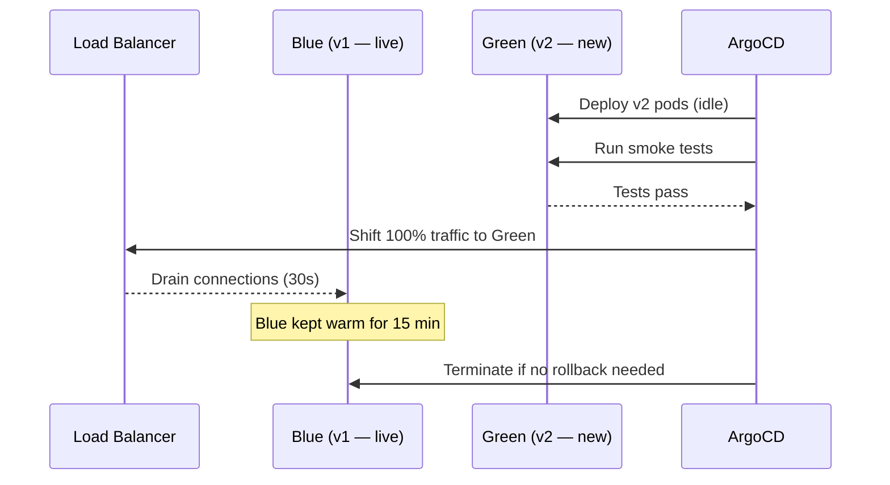

# 13 — Deployment Architecture: Video Streaming Platform

## Objective
Define the complete deployment strategy for a production-grade video streaming platform — covering containerization, Kubernetes orchestration, CI/CD pipeline, multi-region topology, autoscaling policies, and environment management. Every decision must account for the platform's dual demands: high-throughput video processing (CPU/GPU-intensive) and globally low-latency video delivery.

---

## Infrastructure Overview

```mermaid
graph TB
    subgraph "Global Edge Layer"
        CDN["CDN PoPs (CloudFront / Fastly)<br/>200+ edge locations"]
    end

    subgraph "Region: us-east-1 (Primary)"
        LB1["AWS ALB / NLB"]
        subgraph "EKS Cluster — API Plane"
            US["Upload Service (pods)"]
            VS["Video Service (pods)"]
            SS["Search Service (pods)"]
            RS["Recommendation Service (pods)"]
            NS["Notification Service (pods)"]
        end
        subgraph "EKS Cluster — Processing Plane"
            TW["Transcode Workers (GPU node pool)"]
            PW["Preview/Thumbnail Workers"]
            AW["Analytics Workers"]
        end
        subgraph "Data Layer"
            PG["Aurora PostgreSQL (Multi-AZ)"]
            RD["ElastiCache Redis (Cluster Mode)"]
            ES["OpenSearch (3-node cluster)"]
            KF["MSK Kafka (3-broker)"]
            S3["S3 (video chunks + manifests)"]
        end
    end

    subgraph "Region: eu-west-1 (Secondary)"
        LB2["AWS ALB"]
        EKS2["EKS Cluster (read + delivery)"]
        PG2["Aurora Global DB (read replica)"]
        S3R["S3 Replication Bucket"]
    end

    subgraph "Region: ap-southeast-1"
        LB3["AWS ALB"]
        EKS3["EKS Cluster (read + delivery)"]
        PG3["Aurora Global DB (read replica)"]
        S3R2["S3 Replication Bucket"]
    end

    CDN -->|"Cache miss"| LB1
    CDN -->|"Cache miss"| LB2
    CDN -->|"Cache miss"| LB3
    LB1 --> EKS Cluster
    LB2 --> EKS2
    LB3 --> EKS3
    PG -->|"Global replication"| PG2
    PG -->|"Global replication"| PG3
    S3 -->|"CRR"| S3R
    S3 -->|"CRR"| S3R2
```

---

## Kubernetes Cluster Strategy

### Two-Plane Design

| Cluster | Purpose | Node Types |
|---------|---------|------------|
| **API Plane** | Stateless services (upload, stream, search, reco, notification) | t3.xlarge / c5.2xlarge, spot instances |
| **Processing Plane** | Transcode workers (CPU/GPU), thumbnail gen | c5.9xlarge (CPU transcode), g4dn.xlarge (GPU), on-demand only |

- Transcode workers are on **on-demand nodes** — spot interruption during a 4-hour transcode job is catastrophic.
- API services use **spot instances** with appropriate PodDisruptionBudgets.

### Node Pools

```
api-pool:          t3.xlarge,  spot,     min=3  max=50
transcode-cpu:     c5.9xlarge, on-demand, min=2  max=30
transcode-gpu:     g4dn.xlarge,on-demand, min=0  max=10
analytics:         m5.2xlarge, spot,     min=1  max=20
```

---

## Autoscaling Strategy

### Horizontal Pod Autoscaler (HPA)

| Service | Scale Trigger | Min Pods | Max Pods |
|---------|--------------|----------|----------|
| Upload Service | CPU > 60% | 3 | 30 |
| Video Service | RPS > 5000/pod | 5 | 100 |
| Transcode Workers | Kafka `transcode-requests` lag > 100 | 2 | 30 |
| Search Service | CPU > 70% | 3 | 20 |
| Recommendation Service | CPU > 65% | 2 | 15 |

### KEDA (Kafka-driven scaling for Transcode Workers)
- KEDA ScaledObject watches `transcode-requests` consumer group lag.
- If lag > 100 messages → scale up by 5 pods.
- Scale-down only after lag = 0 for 5 minutes (avoid flapping).

### Cluster Autoscaler
- Watches unschedulable pods → provisions new EC2 nodes within 2–3 minutes.
- Scale-down grace period: 10 minutes to avoid prematurely killing long transcode jobs.

---

## CI/CD Pipeline

```mermaid
graph LR
    Dev["Developer Push<br/>(feature branch)"]
    PR["Pull Request + Code Review"]
    CI["GitHub Actions CI"]
    subgraph "CI Steps"
        Build["Build JAR / Docker image"]
        Test["Unit + Integration Tests"]
        Scan["SAST (SonarQube)<br/>+ Container Scan (Trivy)"]
        Push["Push to ECR (image:sha)"]
    end
    Dev --> PR --> CI
    CI --> Build --> Test --> Scan --> Push

    CD["ArgoCD (GitOps)"]
    Staging["Staging EKS<br/>(smoke tests)"]
    Canary["Canary (5% traffic)"]
    Prod["Production (100%)"]

    Push --> CD --> Staging --> Canary --> Prod
```



### Deployment Strategy per Service

| Service | Strategy | Rollback |
|---------|----------|----------|
| Video Service (read path) | Blue-Green | Instant switch back |
| Upload Service | Canary (5% → 25% → 100%) | Traffic shift back |
| Transcode Workers | Rolling update | Drain + restart |
| Recommendation Service | Canary + feature flag | Flag off instantly |
| Database migrations | Expand-Contract pattern | Never destructive |

---

## Multi-Region Deployment

### Data Residency Strategy

| Data Type | Storage | Replication |
|-----------|---------|-------------|
| Video chunks (S3) | Primary region + S3 Cross-Region Replication | Eventually consistent to 2 other regions |
| Metadata (PostgreSQL) | Aurora Global DB — primary + 2 read replicas | Async, ~1s lag |
| Video manifests (S3) | Replicated + served via CDN | Edge-cached |
| User sessions (Redis) | Per-region, no replication | Login re-auth on region fail |
| Search index | Per-region ES cluster, updated from Kafka | Eventually consistent |

### Traffic Routing
- Route 53 Latency-based routing → nearest API region.
- If primary region is unhealthy → failover to secondary (Aurora Global DB promotes read replica → new primary in ~1 min).

---

## Environment Separation

| Environment | Purpose | Data | Scale |
|-------------|---------|------|-------|
| **local** | Developer machine | H2 + MinIO (S3-compatible) | 1 pod each |
| **dev** | Integration testing | Shared RDS + S3 dev bucket | 1 replica |
| **staging** | Pre-production validation | Prod-like data (anonymized) | 20% prod capacity |
| **production** | Live traffic | Real data, full replication | Full scale |

### Local Development Setup
- Docker Compose: PostgreSQL, Redis, Kafka, MinIO (S3-compatible), Elasticsearch.
- Mocked CDN: Nginx serving local S3 files.
- Truncated test video set (< 100 MB each) for transcode testing.
- Feature flags default to OFF in dev/staging.

---

## Secrets Management

| Secret Type | Tool | Rotation |
|-------------|------|----------|
| DB credentials | AWS Secrets Manager → K8s ExternalSecrets | 30 days |
| S3 IAM roles | EC2 instance profiles + IRSA (no static keys) | N/A (role-based) |
| JWT signing key | AWS KMS + Secrets Manager | 90 days |
| DRM license keys | AWS KMS (HSM-backed) | Manual, audited |
| API keys (3rd party) | Secrets Manager | On rotation |

---

## CDN Integration

- **Origin Shield**: Single origin request aggregation layer between CDN and S3 → reduces S3 GET costs by 60–80%.
- **Cache-Control headers**: video chunks (`max-age=31536000, immutable`), manifests (`max-age=5` — frequently updated for live).
- **CDN Invalidation**: On video deletion or DMCA takedown, invalidate all edge caches via CDN API within 60 seconds.
- **Signed URLs**: All video content requires CDN-signed URL (6-hour TTL) to prevent hotlinking.

---

## Blue-Green Deployment Detail (Video Service)



---

## Disaster Recovery

| Scenario | RTO | RPO | Strategy |
|----------|-----|-----|----------|
| Single pod failure | < 30s | 0 | K8s self-healing |
| AZ failure | < 2 min | 0 | Multi-AZ pods + DB |
| Region failure | < 5 min | < 1s | Route 53 failover + Aurora Global DB promote |
| S3 bucket corruption | < 1 hour | < 1 hour | S3 Versioning + CRR |
| Kafka cluster failure | < 10 min | < 1 min | MSK multi-AZ, consumer replay from offset |

---

## Feature Flags

- LaunchDarkly (or Unleash for self-hosted) for all new features.
- Recommendation algorithm changes: always behind a flag + 1% → 10% → 100% rollout.
- Live streaming feature: flag-gated per user tier.
- New transcode quality profiles: flag-gated before full rollout.

---

## Risks and Operational Burdens

| Risk | Mitigation |
|------|-----------|
| GPU node pool cost | Aggressive KEDA scale-to-zero when queue empty |
| Long transcode jobs lost on spot interruption | On-demand only for transcode |
| CDN cache poisoning | Signed URLs + WAF rules |
| Cross-region data consistency lag | Read-your-own-writes routing for creator dashboard |
| K8s upgrade disruption | PodDisruptionBudgets + maintenance windows |

---

## Interview-Level Discussion Points

- **Why two separate EKS clusters?** — Processing plane has GPU nodes and very different scaling triggers (queue depth) vs API plane (RPS/CPU). Mixing them creates scheduling complexity and cost inefficiency.
- **How do you deploy without downtime?** — Blue-green for stateless services. Expand-Contract for DB schema changes (never breaking existing service in one deploy).
- **How does KEDA differ from HPA for transcode workers?** — HPA scales on CPU/memory. KEDA scales on Kafka consumer lag — directly tied to work backlog, which is the correct signal for queue-driven workers.
- **What's your RTO for a full region failure?** — ~5 minutes: Route 53 health check detects failure → DNS failover → Aurora Global DB promotes read replica to primary.
- **How do you handle secrets rotation without downtime?** — ExternalSecrets Operator polls Secrets Manager, injects updated secret as K8s Secret, triggers rolling pod restart with zero-downtime policy.
