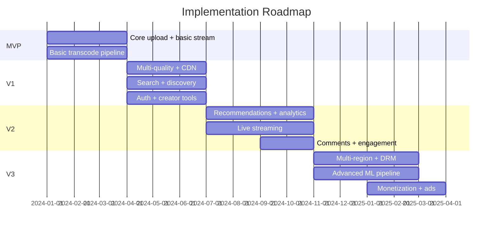

# 15 — Implementation Roadmap: Video Streaming Platform

## Objective
Define a phased, realistic implementation path from MVP to global-scale streaming platform. Each phase covers features, architecture evolution, infrastructure, team requirements, risks, and complexity growth. This roadmap reflects how real streaming platforms actually evolved, not a theoretical ideal.

---

## Phase Overview

---

## MVP — Core Streaming (Months 1–3)

### Goal
A working platform where users upload and watch videos. No recommendations, no search, no CDN optimization. Prove the upload → transcode → stream loop works.

### Features
- User registration and login (JWT auth)
- Single video upload (up to 500 MB, MP4 only)
- Basic transcoding to 480p and 720p (single quality initially)
- Simple HLS manifest generation
- Video playback (single quality, no adaptive bitrate)
- Basic video listing page (creator's own videos)
- Manual moderation (admin dashboard to approve/reject)

### Architecture
- **Monolith** — Spring Boot single deployable with modules: upload, transcode, player, user.
- PostgreSQL for all metadata.
- S3 (or MinIO locally) for video storage.
- FFmpeg on the same server as the app (later extracted).
- No Kafka yet — synchronous transcode (acceptable for small file sizes in MVP).
- Basic NGINX as reverse proxy.

### Infrastructure
- Single VPC, 2 EC2 instances (app + database), S3 bucket.
- No CDN, no Redis, no Kafka.
- Manual deployment (SSH + JAR copy).
- Local Docker Compose for development.

### Team
- 2–3 engineers: 1 backend (upload/transcode), 1 frontend (player UI), 1 infra/devops part-time.

### Risks
- Synchronous transcode blocks upload API thread for large files → limit to 500 MB in MVP.
- No reliability guarantees — transcode fails = video lost.
- No CDN = bad playback experience for geographically distant users.

### Success Criteria
- Upload a 100 MB video → watch it within 2 minutes.
- Zero data loss on upload.

---

## V1 — Production-Ready Single Region (Months 4–6)

### Goal
Real production quality: multi-quality adaptive streaming, CDN delivery, Kafka-based async transcode, creator tooling, basic search.

### New Features
- Chunked resumable upload (presigned S3 URLs, multipart)
- Async transcode pipeline (Kafka-driven, dedicated worker pods)
- Multi-quality transcoding: 360p / 480p / 720p / 1080p HLS
- Adaptive bitrate playback (HLS.js on web)
- CloudFront CDN for video delivery
- Elasticsearch-based search (title, description, tags)
- Creator dashboard (upload status, view counts, video management)
- Content moderation hooks (manual review queue)
- Email notifications (transcode complete, new comment)
- Storage quota per user (5 GB free tier)
- Rate limiting on upload API

### Architecture Evolution
- Extract **Upload Service** and **Transcode Worker** from monolith.
- Kafka introduced for transcode event pipeline.
- Redis for upload session state and view count buffering.
- Elasticsearch cluster for search.
- Remaining monolith handles metadata, user, player APIs (still acceptable at V1 scale).

### Infrastructure
- EKS cluster (API + transcode node pools separated).
- Kafka (MSK or self-managed, 3 brokers).
- ElastiCache Redis (1 primary + 1 replica).
- OpenSearch cluster (3 nodes).
- Aurora PostgreSQL (Multi-AZ).
- CloudFront CDN with S3 origin shield.
- GitHub Actions CI/CD + ArgoCD.

### Team
- 5–7 engineers: upload service owner, transcode pipeline owner, search/discovery, frontend, DevOps/infra, QA.

### Risks
- Kafka operational complexity for small team — consider managed MSK.
- CDN cache invalidation bugs on video re-upload.
- Elasticsearch mapping changes require re-index (plan schema carefully).

### Success Criteria
- Upload 5 GB video → available for playback within 10 minutes.
- Search returns results in < 500 ms.
- 10,000 concurrent viewers on a single video without origin overload.

---

## V2 — Engagement & Scale (Months 7–10)

### Goal
Recommendations, live streaming, comments/engagement, advanced analytics, and 10× scale readiness.

### New Features
- **Recommendations**: collaborative filtering (baseline) → two-tower ML model (V2.5)
- **Live streaming**: RTMP ingest → HLS packaging → CDN delivery (10s latency)
- **Comments and likes**: threaded comments, emoji reactions, comment moderation ML
- **Analytics pipeline**: real-time view counts, watch time, drop-off analysis
- **Chapters and transcripts**: auto-generated captions via Whisper (or AWS Transcribe)
- **Notifications**: push, email, in-app for subscriptions and comments
- **Subscription management**: channel subscriptions, notification preferences
- **Content ID**: basic fingerprint-based duplicate detection

### Architecture Evolution
- Extract Recommendation Service (consumes view events from Kafka, builds user-video affinity).
- Extract Live Streaming Service (RTMP ingest via Nginx-RTMP, separate scaling profile).
- Extract Notification Service from monolith.
- Analytics Consumer reads all Kafka events → Apache Flink or Kafka Streams for real-time aggregation → ClickHouse or BigQuery for analytics.
- Feature store for ML signals (Redis Online Store + S3 Offline Store).

### Infrastructure
- Separate EKS node pool for live streaming (low-latency requirement, dedicated hosts).
- Flink cluster for stream analytics.
- ClickHouse for time-series analytics.
- GPU node pool for ML inference (recommendation serving).
- Feature store (Redis + S3).
- Multi-AZ for all databases.

### Team
- 10–15 engineers: recommendations team (2–3 ML + 1 backend), live streaming team (2), analytics team (2), platform/infra team (2–3), content safety team (1–2).

### Risks
- Live streaming RTMP ingest introduces stateful infrastructure — hard to scale horizontally.
- ML recommendation model requires training pipeline, feature engineering, online serving — significant ML engineering investment.
- ClickHouse operational complexity.

### Success Criteria
- Recommendations increase average watch time by 15%.
- Live stream end-to-end latency < 10 seconds.
- Analytics dashboard refreshes within 60 seconds of event.

---

## V3 — Global Scale & Monetization (Months 11–18)

### Goal
Multi-region, DRM, monetization, creator monetization program, advanced ML, and operational excellence.

### New Features
- **Multi-region active-passive** (US + EU + APAC)
- **DRM** (Widevine + FairPlay) for premium/licensed content
- **Ads integration**: server-side ad insertion (SSAI), pre-roll and mid-roll
- **Creator monetization**: revenue share, channel memberships, Super Chat for live
- **Advanced recommendations**: session-based, real-time personalization, diversity controls
- **Content moderation at scale**: ML classifier for policy violations, automated takedown pipeline
- **Offline download** (mobile app, DRM-protected)
- **A/B testing framework**: for ranking, UI, feature experiments
- **SLO enforcement**: automated alerting and runbooks for <5 min MTTR

### Architecture Evolution
- Fully decomposed microservices with service mesh (Istio).
- Global Aurora DB + per-region read replicas.
- S3 Cross-Region Replication for video chunks.
- Ads service (SSAI) integrated into CDN delivery pipeline.
- ML pipeline: feature store → offline training (SageMaker/Vertex AI) → model registry → online serving (Triton Inference Server).
- Creator analytics separated into dedicated data warehouse (Snowflake or BigQuery).
- Event-driven DMCA takedown pipeline (< 60s propagation globally).

### Infrastructure
- 3-region EKS federation.
- Route 53 latency-based routing.
- Global Accelerator for websocket connections (live chat).
- DRM license server fleet.
- SSAI server integration with CDN.

### Team
- 40–60 engineers across platform, ML, content, ads, monetization, infra, security, SRE.

### Risks
- DRM integration has high complexity — requires device-specific SDKs.
- SSAI at scale requires CDN-level integration (not trivial).
- Multi-region data consistency edge cases (concurrent creator edits).
- Regulatory compliance per region (GDPR, COPPA, country-specific content laws).

### Success Criteria
- P99 video start time < 2s globally.
- DRM-protected content unplayable without license.
- Ads delivering correct targeting with < 200ms decision latency.
- Zero unplanned outages in primary region per month.

---

## Architecture Evolution Summary

| Phase | Architecture Style | Key Tech Added |
|-------|--------------------|----------------|
| MVP | Monolith | Spring Boot, PostgreSQL, S3, FFmpeg |
| V1 | Partial microservices | Kafka, Redis, Elasticsearch, CDN, EKS |
| V2 | Full microservices | Flink, ClickHouse, GPU ML, Feature Store |
| V3 | Global microservices + mesh | Multi-region, DRM, SSAI, Istio |

---

## Complexity Growth Warning

| Phase | Engineering Complexity | Operational Complexity |
|-------|----------------------|----------------------|
| MVP | Low | Low |
| V1 | Medium (Kafka is a jump) | Medium |
| V2 | High (ML pipeline, live) | High |
| V3 | Very High (multi-region, DRM) | Very High |

**FAANG vs Startup Difference**: A startup should stay in V1 for as long as possible. Adding ML recommendations before you have 100K DAU is premature optimization — no training data, no business impact, high cost. FAANG companies had to reach V3 because the business demanded it after 100M+ users.

---

## Interview-Level Discussion Points

- **Why not start with microservices?** — Monolith in MVP means faster iteration, lower infra cost, simpler debugging. Extract services only when a specific service becomes the bottleneck or team boundary demands it.
- **When would you introduce Kafka?** — When async transcode becomes necessary (files > 500 MB or transcode > 30s). Also when multiple consumers need the same event (analytics, notifications, search index).
- **What's the right time to add recommendations?** — When you have at least 100K DAU and enough watch history to train meaningful models. Before that, simple heuristics (trending, channel-based) suffice.
- **How do you know when to split a service?** — When it has a different scaling axis, different team ownership, or its failure causes unrelated service degradation.
