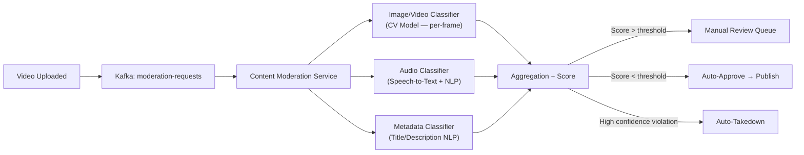
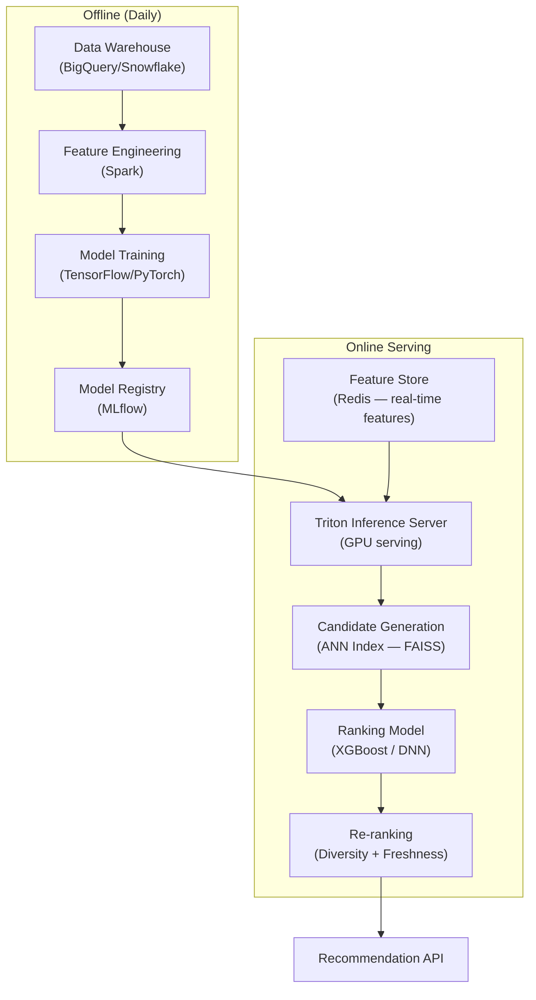

# 16 — Advanced Improvements: Video Streaming Platform

## Objective
Document the frontier engineering improvements that distinguish world-class streaming platforms (Netflix, YouTube) from commodity implementations. These represent V4+ capabilities — each carries significant complexity cost that must be justified by business impact.

---

## 1. AI-Based Content Moderation at Scale

### Problem
Manual moderation is impossible at 500 hours of video per minute. Policy violation content (violence, nudity, misinformation, CSAM) must be detected before it reaches viewers.

### Solution Architecture


### Key Design Decisions
- **Per-frame sampling**: Extract 1 frame/second → run through CV classifier (nudity, violence, graphic). Not every frame — cost prohibitive.
- **Ensemble models**: Multiple specialized classifiers vote → reduces false positives. Single model has high false positive rate.
- **Confidence thresholds**: Low confidence → human review. High confidence violation → auto-takedown with appeal path.
- **CSAM**: Separate PhotoDNA hash-matching — never passed through ML (legal requirement). Instant takedown + law enforcement reporting.
- **Appeals pipeline**: Creator disputes → secondary human review → reinstatement or final ban.

### Tradeoffs
| Factor | Consideration |
|--------|---------------|
| False positive rate | 1% false positive on 1M uploads/day = 10,000 wrongly removed videos/day |
| Latency | Moderation adds 2–5 minutes before video is public |
| Cost | GPU inference at scale is expensive — batch processing where possible |
| Adversarial creators | Bad actors iterate on content to evade classifiers (arms race) |

---

## 2. Real-Time Stream Analytics (Kafka Streams / Apache Flink)

### Problem
Creator analytics dashboards show data that's hours old. Advertisers need real-time CTR. Trending algorithm needs sub-minute signals.

### Architecture
- **Kafka Streams** topology on view events: windowed aggregations (1-min, 5-min, 1-hour) → output to Redis for dashboards.
- **Apache Flink** for complex event processing: watch session stitching, drop-off analysis, anomaly detection.
- **ClickHouse** for OLAP queries (creator analytics over 90 days, arbitrary dimensions).
- **Materialized views** in ClickHouse for common dashboard queries → sub-second response.

### Key Metrics Computed in Real Time
- View count (approximate, HyperLogLog per video per minute)
- Watch time (sum of session durations per video)
- Audience retention curve (% watching at each second)
- Traffic source breakdown (search, suggested, direct)
- Geographic distribution of viewers

### Scaling Concern
- 10M view events/minute = ~167K events/second through Kafka.
- Flink cluster sizing: 20 TaskManagers × 4 cores for this load.
- ClickHouse: columnar storage handles 10B rows with sub-second analytical queries.

---

## 3. ML Recommendation Pipeline (Production-Grade)

### Architecture



### Two-Tower Model
- **Query tower**: user embedding from watch history, demographic, session context.
- **Item tower**: video embedding from title, description, tags, visual features, engagement signals.
- **Retrieval**: ANN (Approximate Nearest Neighbor) search in video embedding space using FAISS — find top 1000 candidates.
- **Ranking**: Lightweight model (XGBoost) re-scores 1000 candidates using fine-grained features (predicted CTR, predicted watch time).
- **Re-ranking**: Diversity injection (avoid 10 videos from same channel), freshness boost, policy filters.

### Cold Start Problem
| Scenario | Solution |
|----------|----------|
| New user (no history) | Trending + regional popular content |
| New video (no engagement) | Metadata-based similarity, explore traffic allocation |
| New creator | Channel history carries over |

---

## 4. Edge Transcoding

### Problem
Upload of raw 4K footage from remote creators has high latency — uploading 10 GB of raw footage over slow upload connections before transcoding can begin.

### Solution
- **CloudFront Lambda@Edge** or **Cloudflare Workers** for lightweight processing at edge.
- Upload to nearest edge PoP → edge initiates chunk acknowledgment immediately → raw chunks stream to origin region.
- Edge cannot do full transcoding (compute limited) but can do: container format validation, basic chunk reassembly, corruption detection.
- Full transcoding always at origin (GPU workers). Edge reduces perceived upload latency.

### Alternative: Multi-Region Upload Targets
- Route creator to nearest S3 region for upload.
- S3 Cross-Region Replication moves raw video to primary processing region.
- Transcode begins in primary region — slight delay but creator experience is fast.

---

## 5. P2P Delivery for Live Streaming (BitTorrent-style)

### Problem
Live streaming to 10M concurrent viewers requires massive CDN egress. At $0.01/GB, 10M viewers × 5 Mbps × 3600s = $1.8M/hour in CDN costs.

### Solution (WebRTC-based P2P mesh)
- Viewer browser downloads HLS segment from CDN.
- Also announces segment availability to a WebTorrent-like tracker.
- New viewers prefer peer-sourced segments over CDN (zero egress cost).
- CDN is fallback when no peers are available.

### Tradeoffs
- Reduces CDN egress by 30–60% for live events.
- WebRTC NAT traversal is complex (STUN/TURN servers needed).
- Not viable for mobile apps (battery drain, background restrictions).
- Privacy concerns (viewer IPs exposed to other viewers).
- Viable for desktop web viewers of very large live events only.

---

## 6. Server-Side Ad Insertion (SSAI)

### Problem
Client-side ad injection (CSAI) is blocked by ad blockers (20–40% of desktop users). Video quality drops when switching between content and ad streams.

### Solution
- Ad decision happens at CDN/manifest level.
- CDN rewrites HLS manifest to stitch ad segments seamlessly with content segments.
- Viewer's player sees one continuous stream — no separate ad URL to block.
- Ad targeting decision via real-time bidding (RTB) at manifest request time.

### Architecture
```
Player → CDN (SSAI endpoint) → Ad Decision Server (RTB, < 200ms)
                             → Rewrites manifest with ad segments
                             → Player plays stitched stream
```

### Key Consideration
- SSAI requires ad segments to be pre-transcoded to same encoding profile as content.
- Ad inventory management: which ad to play, at which break point, for which viewer.
- Measurement: impression tracking, completion rate, click-through tracking.

---

## 7. Thumbnail A/B Testing

### Problem
YouTube discovered that thumbnail is the #1 factor in whether a viewer clicks a video. Creators often pick poor thumbnails, leaving engagement on the table.

### Solution
- Allow creators to upload 3–5 thumbnail variants.
- A/B test variants against each other: serve variant A to 33% of viewers, B to 33%, C to 33%.
- Measure CTR per variant over 48 hours.
- Auto-promote highest CTR thumbnail as default.
- Persist experiment results in feature store for future ML training.

### Infrastructure
- Thumbnail experiment config stored in Redis (low-latency read).
- Variant selection: consistent hashing on user_id (same user sees same variant for duration).
- Metrics: view impression + click event pair → Kafka → Flink → CTR calculation.
- Automatic winner selection via statistical significance test (p < 0.05).

---

## 8. Architecture Self-Critique

### Weaknesses in This Design

| Weakness | Impact | Mitigation |
|----------|--------|-----------|
| Eventual consistency in search index | New videos not searchable for seconds | Acceptable for MVP; use write-through for critical content |
| Transcode job monitoring gap | Long jobs have no intermediate progress | Checkpoint transcode progress to Redis |
| CDN cache invalidation on large-scale takedown | Viral video with 200 CDN PoPs takes ~60s to purge | Signed token validation at edge for instant invalidation |
| Hot partition in Kafka for viral video events | Single partition for popular video_id overwhelms one consumer | Partition by random shard, not video_id, for view events |
| ML cold start for new platform | No training data → poor recommendations at launch | Start with rule-based (trending, popular) → introduce ML after 10M events |

### Scaling Limits

| Component | Current Design Limit | How to Break Through |
|-----------|---------------------|---------------------|
| PostgreSQL metadata | ~100K RPS with read replicas | Shard by user_id or migrate to Vitess (MySQL sharding) |
| Kafka throughput | 1M messages/second per cluster | Add brokers, increase partitions |
| Redis cluster | ~1TB memory, ~1M ops/sec | Shard further, evict cold keys to S3 |
| Transcode GPU pool | Cost-limited | Spot GPUs + reserved instances for baseline |
| S3 storage | Effectively unlimited | Cost — implement tiered storage (S3 → Glacier for old content) |

### FAANG Interviewer Challenges

- "Your transcode pipeline has a single Kafka topic — what happens when 10 viral videos are uploaded simultaneously and all jobs are the same priority?" → Priority queues, separate topics per tier.
- "How do you guarantee a takedown propagates globally in < 1 minute?" → CDN signed token invalidation, not just cache purge.
- "Your view count is approximate — how does YouTube guarantee accurate creator payouts?" → Exact counts for financial settlement run through a separate batch pipeline with deduplication, verified against ad impression logs.
- "How do you handle a 12-hour live stream that crashes mid-stream?" → DVR buffer: live segments are persisted to S3. On reconnect, viewer is served from last buffered segment. Stream can be resumed by creator within 30 minutes.
