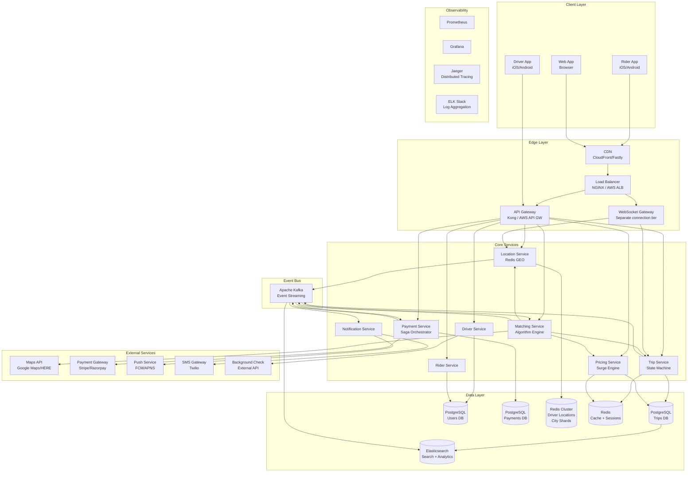
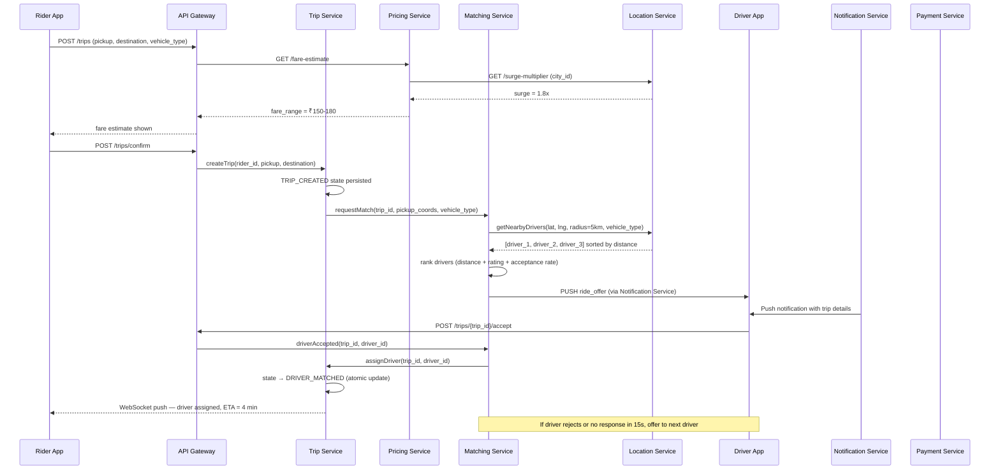
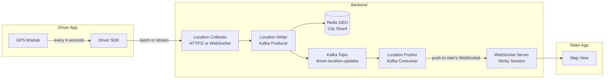
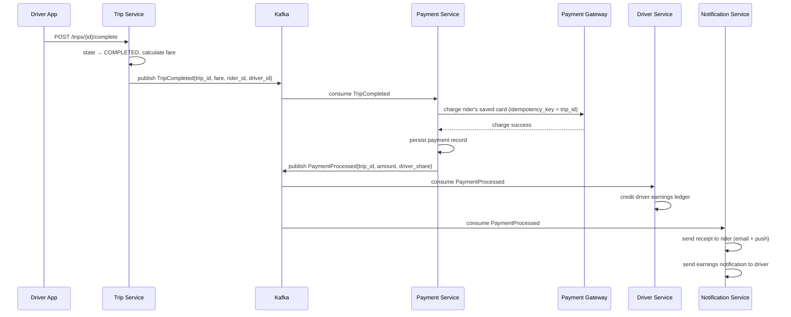
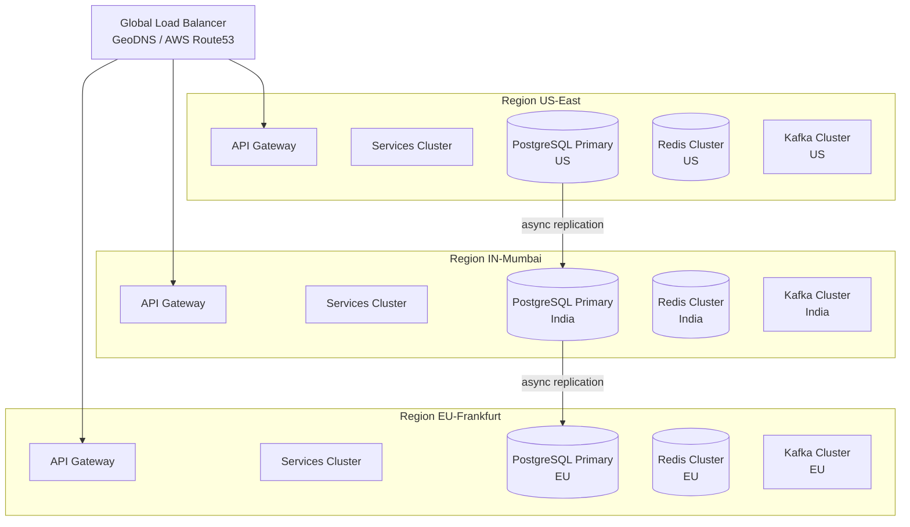
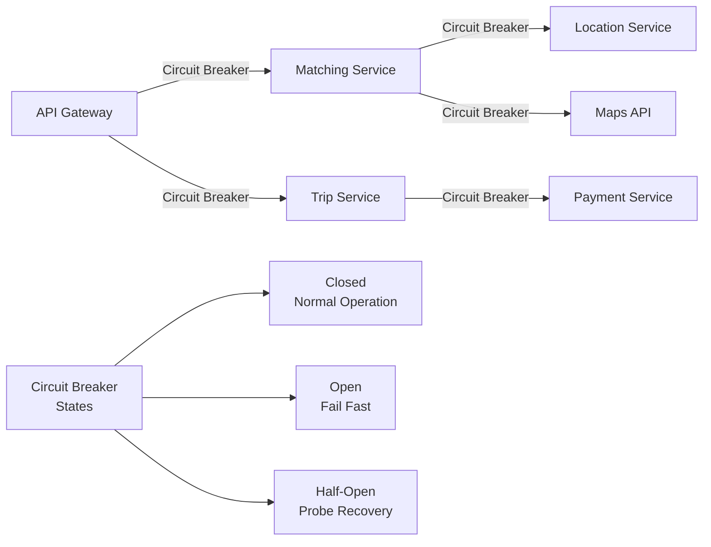

# 01 — High-Level Architecture: Ride-Sharing Platform

---

## Objective

Define the overall system architecture, justify the choice of microservices, describe service boundaries, communication patterns, and provide a complete visual representation of how data flows through the system from ride request to trip completion.

---

## 1. Architecture Choice: Microservices

### Why Microservices for Ride-Sharing?

This is one of the few cases where microservices are genuinely justified from day one — not because of organizational size, but because of fundamentally different operational characteristics across domains.

| Service Domain | Scale Characteristic | Why Independent? |
|---|---|---|
| Location Service | 250,000 writes/sec, sub-second latency | Must scale independently; overwhelms other services if colocated |
| Matching Service | CPU-intensive, bursty load during rush hour | Needs horizontal scaling divorced from data storage services |
| Trip Service | Moderate load, strong consistency required | Different DB transaction patterns than high-throughput services |
| Payment Service | Low throughput, extreme reliability | PCI scope isolation; different deployment and audit requirements |
| Pricing/Surge Service | Read-heavy, computation-intensive | Surge recalculation is CPU-heavy; can be stale by seconds |
| Notification Service | High fan-out, eventual consistency | Push/SMS delivery has different retry/failure semantics |
| Analytics Service | Read-heavy, batch-tolerant | Must not impact OLTP services; separate read path |

**The fundamental argument:** If you colocate Location Service with Trip Service, a surge in location writes (250K/sec) would starve trip management operations. Independent scaling is not premature optimization here — it is survival.

### Microservices Tradeoffs

**Costs accepted:**
- Distributed tracing complexity — every request spans multiple services
- Eventual consistency between services — trip state and payment state must be reconciled via events
- Operational burden — 7+ services to deploy, monitor, and operate
- Network overhead — inter-service calls add latency vs in-process calls
- Testing complexity — integration testing requires service virtualization

**Benefits realized:**
- Location Service can run on memory-optimized instances; Payment Service runs on smaller compute
- Each service can be deployed and rolled back independently
- Payment domain can be PCI-scoped separately from non-sensitive services
- Teams can own services autonomously (Matching team, Maps team, Payments team)
- Failure isolation: Payment Service outage does not crash Location updates

### When NOT to use microservices (honest assessment)

- For a startup with 5 engineers, start with a modular monolith. Extract Location Service first (unique scaling need), then Matching. Let microservices evolve from proven module boundaries.
- If your team cannot operate Kubernetes and distributed tracing, the operational cost exceeds the benefit.
- If your traffic is under 100K daily trips, a well-architected monolith with a Redis sidecar is far simpler.

---

## 2. Core Services Overview

| Service | Responsibility | Primary Data Store | Communication |
|---|---|---|---|
| API Gateway | Auth, routing, rate limiting, SSL termination | None | Sync (REST) |
| Location Service | Ingest driver GPS, serve nearby driver queries | Redis GEO | Async (Kafka) + Sync |
| Matching Service | Algorithmic driver-rider assignment | In-memory + Kafka | Event-driven |
| Trip Service | Trip lifecycle state machine | PostgreSQL | Sync + Async |
| Pricing Service | Fare estimation, surge multiplier calculation | Redis (cache) + PostgreSQL | Sync |
| Payment Service | Charge rider, credit driver, refunds | PostgreSQL + Payment Gateway | Async |
| Driver Service | Driver profile, availability, document management | PostgreSQL | Sync |
| Rider Service | Rider profile, preferences, history | PostgreSQL | Sync |
| Notification Service | Push, SMS, in-app notifications | Redis (queue) | Async |
| Analytics Service | Trip metrics, revenue, driver utilization | ClickHouse / BigQuery | Async (Kafka consumer) |

---

## 3. High-Level Architecture Diagram

---

## 4. Request Flow: Rider Requests a Ride

---

## 5. Real-Time Tracking Architecture

**Key design decision:** Driver location is written to Redis GEO immediately (for matching queries) AND published to Kafka (for fan-out to rider apps watching active trips). This dual-write ensures both real-time matching and real-time tracking work without coupling.

---

## 6. Service Communication Patterns

### Synchronous (REST/gRPC)

Used when the caller needs an immediate response to proceed:

- Rider App → API Gateway → Trip Service (create trip)
- API Gateway → Pricing Service (fare estimate — rider is waiting)
- Matching Service → Location Service (find nearby drivers)
- Matching Service → Maps API (ETA calculation)

### Asynchronous (Kafka Events)

Used when the action is fire-and-forget or fan-out:

- Location Service → Kafka (driver location updates — high volume, no blocking needed)
- Trip Service → Kafka (trip lifecycle events — multiple consumers)
- Payment Service → Kafka (payment events — notification, analytics, driver ledger)
- Matching Service → Kafka (match events — triggers notifications, trip updates)

### WebSocket (Server-Sent Push)

Used for real-time client updates:

- Backend → Rider App (driver location updates, trip status changes)
- Backend → Driver App (new ride offers, trip instructions)

### Service Mesh Consideration

At Uber/Ola scale, a service mesh (Envoy/Istio) is essential:
- mTLS between services — no network-level snooping possible
- Circuit breaking — Location Service slowdown does not cascade to Matching
- Automatic retries with backoff — configurable per route
- Observability — L7 metrics without app-level instrumentation
- Traffic shaping — canary deploys at 1% of a service's traffic

For a startup or mid-size team: Skip the service mesh initially. Use client-side libraries (Resilience4j) for circuit breaking. Add Istio when you have a dedicated platform team.

---

## 7. API Gateway Responsibilities

| Responsibility | Implementation |
|---|---|
| Authentication | JWT validation (RS256, public key verification) |
| Rate limiting | Per rider: 10 ride requests/min; per driver: 60 location updates/min |
| Request routing | Path-based routing to microservices |
| SSL termination | TLS 1.3 at gateway; internal traffic optionally HTTP |
| Request/response logging | Correlation ID injection on all requests |
| Load balancing | Round-robin to service replicas |
| API versioning | Path prefix /v1/, /v2/ |
| Circuit breaking | Fail fast if downstream service is unhealthy |

---

## 8. Data Flow for Trip Completion and Payment

---

## 9. Multi-Region Architecture Overview

**Key principle:** Each region is operationally independent. A rider in Mumbai is served entirely by the India region. User profile data is replicated globally for auth, but trip data stays in the originating region. This satisfies data residency laws and reduces latency.

---

## 10. Failure Isolation Design

- If Location Service is slow (>500ms P99), Matching Service opens circuit and uses last-known driver positions from a short-lived cache for up to 30 seconds before queueing requests
- If Maps API is slow, Matching Service falls back to Haversine distance-based ETA (less accurate but functional)
- If Payment Service is degraded, Trip can complete and payment is queued for retry (deferred charge pattern)

---

## Interview-Level Discussion Points

- **Why not a single service with Redis GEO bolted on?** At 250K location writes/second, the location ingestion path needs dedicated horizontal scaling. Mixing it with trip management would require the entire system to scale to location-write load.
- **Why API Gateway and not direct service calls from clients?** Security (single auth validation point), rate limiting, versioning, and the ability to refactor services without breaking clients.
- **How do you handle the WebSocket connection at 200K concurrent riders?** WebSocket servers are stateful. You need sticky sessions (consistent hashing to the same pod) or a pub/sub broker (Redis Pub/Sub or Kafka) that any WebSocket pod can subscribe to for pushing updates to connected riders.
- **Why Kafka and not just direct REST calls between services?** Location updates at 250K/sec cannot be fanned out synchronously. Kafka provides backpressure handling, replay capability, and decoupling of producer throughput from consumer processing speed.
- **Service mesh vs. no service mesh at what scale?** Service mesh adds ~5ms latency per hop and significant operational complexity. Justified when you have 15+ services and a dedicated platform team. For 7 services, use library-level resilience (Resilience4j).
