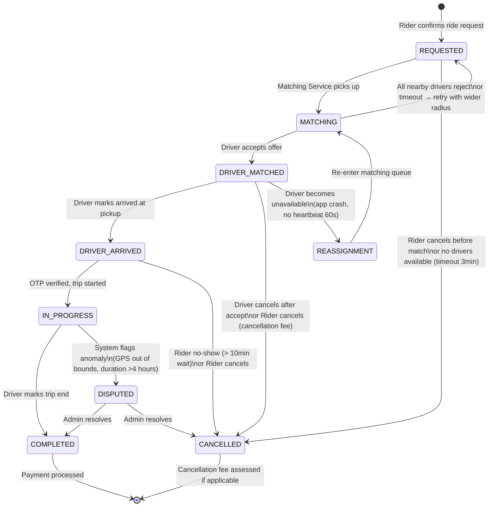
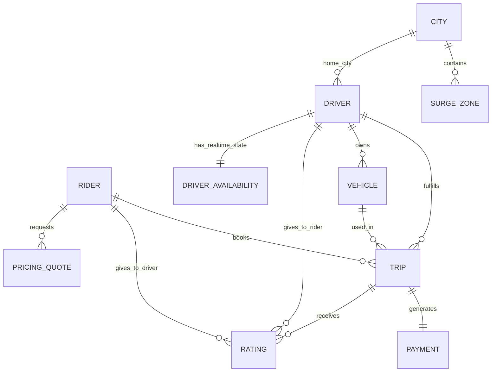
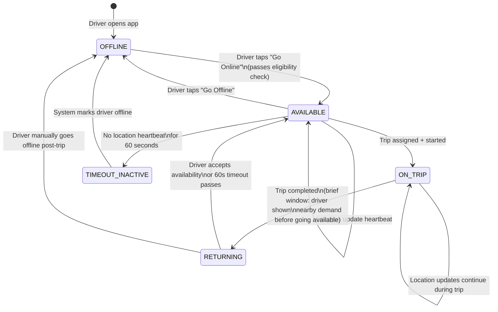

# 02 — Domain Modeling: Ride-Sharing Platform

---

## Objective

Establish a rich, production-grade domain model for the ride-sharing platform. Define all core entities, their attributes, relationships, invariants, and the critical state machines that govern trip and driver lifecycle. This model drives database schema, API contracts, and service boundaries.

---

## 1. Core Domain Entities

### 1.1 Rider

Represents a registered user who books rides.

| Attribute | Type | Notes |
|---|---|---|
| rider_id | UUID | Immutable primary key |
| phone_number | String | Unique, used for login + OTP |
| email | String | Optional, for receipts |
| full_name | String | Display name |
| profile_photo_url | String | CDN URL |
| rating | Decimal(3,2) | Average driver-given rating; updated post-trip |
| total_trips | Integer | Denormalized counter |
| preferred_payment_method_id | UUID | FK to PaymentMethod |
| home_address | Address (embedded) | Frequently used for smart suggestions |
| work_address | Address (embedded) | Frequently used for smart suggestions |
| status | Enum | ACTIVE, SUSPENDED, DELETED |
| created_at | Timestamp | Account creation |
| last_trip_at | Timestamp | For churn detection |

**Domain invariants:**
- A rider can have at most ONE active trip at any point in time
- Rating is always recalculated as a rolling average, not recomputed from scratch
- A SUSPENDED rider cannot request new trips but can view history

### 1.2 Driver

Represents a registered, background-checked driver.

| Attribute | Type | Notes |
|---|---|---|
| driver_id | UUID | Immutable primary key |
| phone_number | String | Unique |
| email | String | For tax documents, earnings reports |
| full_name | String | |
| profile_photo_url | String | Displayed to riders for safety |
| rating | Decimal(3,2) | Average rider-given rating |
| total_trips | Integer | |
| license_number | String | Encrypted at rest |
| license_expiry | Date | Alert when approaching expiry |
| background_check_status | Enum | PENDING, APPROVED, REJECTED, EXPIRED |
| background_check_expiry | Date | Annual renewal |
| onboarding_status | Enum | INCOMPLETE, PENDING_REVIEW, APPROVED, SUSPENDED |
| bank_account_id | UUID | FK to DriverBankAccount for payouts |
| earnings_balance | Decimal(12,2) | Current unsettled earnings |
| city_id | UUID | Primary operating city |
| preferred_vehicle_type | Enum | For display; actual vehicle assigned separately |
| created_at | Timestamp | |

**Domain invariants:**
- A driver can only go ONLINE if background_check_status = APPROVED and onboarding_status = APPROVED
- A driver can have only ONE vehicle active at a time (though may own multiple)
- A driver with rating < 4.0 (after minimum 50 trips) gets a low-rating flag for review

### 1.3 Vehicle

A vehicle registered and associated with a driver.

| Attribute | Type | Notes |
|---|---|---|
| vehicle_id | UUID | |
| driver_id | UUID | FK, owning driver |
| registration_number | String | Encrypted, unique per jurisdiction |
| vehicle_type | Enum | ECONOMY, PREMIUM, SUV, AUTO, BIKE |
| make | String | e.g., Toyota |
| model | String | e.g., Innova |
| year | Integer | |
| color | String | |
| seating_capacity | Integer | |
| insurance_expiry | Date | |
| fitness_certificate_expiry | Date | |
| is_active | Boolean | Primary vehicle for current trips |
| verified_at | Timestamp | When documents were verified |

### 1.4 Trip (Central Aggregate)

The most critical domain object. Manages the complete lifecycle of a single ride.

| Attribute | Type | Notes |
|---|---|---|
| trip_id | UUID | |
| rider_id | UUID | FK |
| driver_id | UUID | FK, null until matched |
| vehicle_id | UUID | FK, null until matched |
| status | Enum | See state machine below |
| vehicle_type_requested | Enum | Economy/Premium/SUV etc. |
| pickup_location | GeoPoint | lat/lng |
| pickup_address | String | Human-readable |
| destination_location | GeoPoint | lat/lng |
| destination_address | String | |
| estimated_distance_km | Decimal | From routing API at request time |
| actual_distance_km | Decimal | Computed from GPS trace at completion |
| estimated_duration_min | Integer | At request time |
| actual_duration_min | Integer | Actual elapsed time |
| estimated_fare | Decimal(10,2) | Shown to rider pre-trip |
| surge_multiplier | Decimal(3,2) | Locked at request time |
| final_fare | Decimal(10,2) | Computed at completion |
| payment_id | UUID | FK to Payment, populated post-trip |
| cancellation_reason | String | Nullable |
| cancelled_by | Enum | RIDER, DRIVER, SYSTEM |
| cancellation_fee | Decimal(10,2) | If applicable |
| city_id | UUID | For partitioning |
| requested_at | Timestamp | |
| matched_at | Timestamp | |
| driver_arrived_at | Timestamp | |
| trip_started_at | Timestamp | |
| trip_ended_at | Timestamp | |
| cancelled_at | Timestamp | |
| route_polyline | Text | Encoded GPS trace (compressed) |
| otp | String | 4-digit OTP rider shares with driver to start trip |

**Domain invariants:**
- fare_final = base_fare × surge_multiplier × distance_factor + time_factor
- A trip cannot move backward in state (COMPLETED → IN_PROGRESS is illegal)
- otp must be verified before status can transition from DRIVER_ARRIVED to IN_PROGRESS
- If driver_id is assigned, the same driver cannot be assigned to another active trip
- trip_ended_at - trip_started_at must be > 30 seconds (anti-fraud)

### 1.5 Trip State Machine (Critical)

**State transition rules enforced at the database level:**
- Implemented as a check constraint or application-level guard
- Only valid transitions accepted; invalid transitions return 409 Conflict
- Each transition is persisted with an event record (event sourcing for trips)

### 1.6 DriverAvailability

Represents the real-time availability state of a driver. This is intentionally separated from the Driver entity because it changes at extremely high frequency (every few seconds) vs. the Driver profile which changes rarely.

| Attribute | Type | Notes |
|---|---|---|
| driver_id | UUID | PK |
| status | Enum | OFFLINE, AVAILABLE, ON_TRIP, RETURNING (post-drop) |
| current_lat | Decimal(10,7) | Latest GPS |
| current_lng | Decimal(10,7) | Latest GPS |
| heading | Integer | Degrees 0-360 |
| speed_kmh | Decimal | For ETA accuracy |
| city_id | UUID | Current operating city |
| last_location_update | Timestamp | Stale if > 30s ago |
| current_trip_id | UUID | FK to active Trip |
| app_version | String | For feature flag targeting |

**Storage:** This entity lives in Redis, not PostgreSQL. It has a TTL of 60 seconds (auto-expires if driver stops sending heartbeats). The PostgreSQL driver table stores only the last known location for historical purposes.

### 1.7 PricingQuote

A locked fare estimate provided to the rider before confirming the trip. Not the same as final fare.

| Attribute | Type | Notes |
|---|---|---|
| quote_id | UUID | |
| rider_id | UUID | |
| pickup_location | GeoPoint | |
| destination_location | GeoPoint | |
| vehicle_type | Enum | |
| base_fare | Decimal | Calculated from zone base rate |
| distance_fare | Decimal | Estimated km × per-km rate |
| time_fare | Decimal | Estimated minutes × per-min rate |
| surge_multiplier | Decimal(3,2) | Snapshot at quote time |
| platform_fee | Decimal | Fixed platform charge |
| total_fare_min | Decimal | Low end of range |
| total_fare_max | Decimal | High end of range |
| expires_at | Timestamp | Quote valid for 5 minutes |
| city_id | UUID | |

**Domain invariant:** A trip confirmed against an expired quote gets a fresh quote at confirmed time. The rider is shown the new fare if surge changed.

### 1.8 Payment

| Attribute | Type | Notes |
|---|---|---|
| payment_id | UUID | |
| trip_id | UUID | FK, unique constraint |
| rider_id | UUID | |
| driver_id | UUID | |
| amount | Integer | In minor units (paise/cents) |
| currency | String | ISO 4217 |
| payment_method_id | UUID | FK to PaymentMethod |
| gateway_transaction_id | String | External gateway reference |
| gateway | Enum | STRIPE, RAZORPAY, BRAINTREE |
| status | Enum | PENDING, PROCESSING, CAPTURED, FAILED, REFUNDED |
| driver_share | Integer | Platform takes commission; rest is driver's |
| platform_commission | Integer | |
| idempotency_key | String | = trip_id, prevents double charge |
| captured_at | Timestamp | |
| settled_at | Timestamp | When driver actually gets paid |
| failure_reason | String | For retries and customer service |

### 1.9 Rating

| Attribute | Type | Notes |
|---|---|---|
| rating_id | UUID | |
| trip_id | UUID | FK, unique per direction |
| rated_by | Enum | RIDER or DRIVER |
| rated_entity_id | UUID | FK to driver or rider |
| score | Integer | 1-5 |
| comment | String | Optional, max 500 chars |
| tags | String[] | Predefined: "Great music", "Fast drive", etc. |
| is_visible | Boolean | Hidden if flagged as spam |
| created_at | Timestamp | |

### 1.10 SurgeZone

Represents a geographic polygon with an active surge multiplier.

| Attribute | Type | Notes |
|---|---|---|
| zone_id | UUID | |
| city_id | UUID | |
| zone_name | String | e.g., "Airport Zone", "CBD" |
| polygon | GeoJSON | H3 hexagon or custom polygon |
| surge_multiplier | Decimal(3,2) | Current active multiplier |
| demand_count | Integer | Active requests in zone in last 5 min |
| supply_count | Integer | Available drivers in zone |
| recalculated_at | Timestamp | Last surge recalculation time |

---

## 2. Entity Relationship Overview

---

## 3. Value Objects

Value objects are immutable and defined by their attributes, not identity. They should NOT have their own tables but be embedded in aggregates.

| Value Object | Used In | Attributes |
|---|---|---|
| GeoPoint | Trip, DriverAvailability, SurgeZone | lat (Decimal), lng (Decimal) |
| Address | Trip, Rider | street, city, state, postal_code, country |
| Money | Payment, Trip fare fields | amount (Integer, minor units), currency (String) |
| FareBreakdown | PricingQuote, Trip | base, distance_component, time_component, surge, platform_fee |
| DateRange | Driver documents | start_date, end_date |

---

## 4. Domain Events

Domain events capture things that have happened, expressed in past tense. They flow through Kafka and drive cross-service coordination.

| Event | Triggered By | Payload |
|---|---|---|
| RideRequested | Rider confirms booking | trip_id, rider_id, pickup, destination, vehicle_type, quote_id |
| DriverMatched | Matching Service assigns driver | trip_id, driver_id, vehicle_id, eta_seconds |
| DriverOfferSent | Matching Service contacts driver | trip_id, driver_id, timeout_at |
| DriverOfferRejected | Driver rejects or timeout | trip_id, driver_id, reason |
| DriverArrived | Driver marks arrived | trip_id, driver_id, arrived_at |
| TripStarted | OTP verified, trip begins | trip_id, driver_id, rider_id, started_at |
| TripCompleted | Driver ends trip | trip_id, final_fare, distance_km, duration_min |
| TripCancelled | Rider/Driver/System | trip_id, cancelled_by, reason, cancellation_fee |
| PaymentInitiated | Payment Service on TripCompleted | payment_id, trip_id, amount |
| PaymentCaptured | Gateway confirms charge | payment_id, gateway_txn_id |
| PaymentFailed | Gateway charge fails | payment_id, reason, retry_count |
| DriverLocationUpdated | Driver GPS ping | driver_id, lat, lng, timestamp, city_id |
| DriverWentOnline | Driver toggles availability | driver_id, city_id, vehicle_id |
| DriverWentOffline | Driver goes offline | driver_id, city_id |
| RatingSubmitted | Rider or Driver submits rating | rating_id, trip_id, score, direction |
| SurgeZoneActivated | Surge Engine calculation | zone_id, city_id, multiplier, expires_at |
| SurgeZoneDeactivated | Surge Engine recalculation | zone_id, city_id |

---

## 5. Aggregates and Consistency Boundaries

In Domain-Driven Design, an aggregate defines a transactional consistency boundary. Changes within an aggregate must be ACID-consistent. Changes across aggregates are eventually consistent via events.

| Aggregate Root | Members | Consistency Guarantee |
|---|---|---|
| Trip | Trip, TripWaypoints, TripEvents log | State machine transitions are atomic |
| Driver | Driver, Vehicle, DriverAvailability (soft boundary) | Profile changes are strongly consistent |
| Rider | Rider, PaymentMethod, RiderPreferences | Profile changes are strongly consistent |
| Payment | Payment, PaymentRetry log | Exactly-once charge semantics |
| Rating | Rating (standalone) | Append-only; no updates needed |

**Cross-aggregate coordination (eventual consistency):**
- Trip → Payment: via TripCompleted event (Kafka)
- Trip → Rating prompt: via TripCompleted event
- Payment → Driver earnings: via PaymentCaptured event
- Matching → Trip: via DriverMatched event

---

## 6. Driver Availability State Machine

---

## Interview-Level Discussion Points

- **Why separate DriverAvailability from the Driver entity?** Driver profile changes once per week; availability changes every 4 seconds. Storing availability in PostgreSQL would create contention on the driver row. Separation allows availability to live in Redis with TTL semantics, while profile stays in PostgreSQL.
- **Why use UUID for all IDs?** Global uniqueness across shards/regions without coordination. The tradeoff is larger index size vs. sequential integers. For a globally distributed system, UUID is the right default; use ULID (sortable UUID) for better index locality.
- **How do you enforce the single-driver-per-trip invariant?** At the database level: the `driver_id` column in active trips has a unique partial index on (driver_id) WHERE status IN ('DRIVER_MATCHED', 'IN_PROGRESS'). At the application level: optimistic locking with version columns. At the service level: Matching Service uses a distributed lock (Redis SETNX) keyed on trip_id before writing.
- **Should Rating be its own aggregate or part of Trip?** It's better as a standalone aggregate because it can be submitted after the trip is COMPLETED and the Trip entity should be immutable after completion. This also allows rating management (hiding spam) independently.
- **What is the OTP purpose?** The 4-digit OTP ensures the rider gets into the correct driver's car. Without OTP, a fraudster could start a trip by pretending to be the rider. The OTP is displayed to the rider and verbally shared with the driver; the driver enters it in their app to confirm identity.
