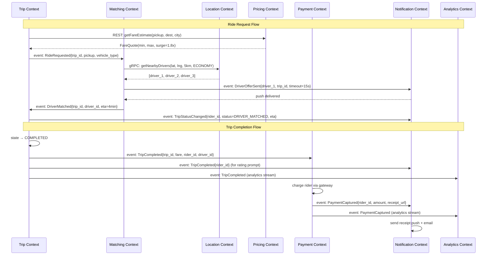

# 03 — DDD Bounded Contexts: Ride-Sharing Platform

---

## Objective

Define the Bounded Contexts of the ride-sharing platform using Domain-Driven Design principles. Establish the ubiquitous language within each context, define the context map showing relationships and integration patterns, and explain how domain events flow between contexts to maintain eventual consistency.

---

## 1. What Is a Bounded Context Here?

A bounded context is a semantic boundary within which a particular domain model applies consistently. The same word can mean different things in different contexts — and that's intentional.

**Example of language divergence in ride-sharing:**

| Term | Identity Context | Location Context | Trip Context | Pricing Context |
|---|---|---|---|---|
| "Driver" | An authenticated user with DRIVER role | A moving point emitting GPS coordinates | The assigned fulfillment party for a trip | A price multiplier input (supply side) |
| "Trip" | A resource protected by auth policy | A moving path on a map | A state machine with lifecycle events | A billable transaction |
| "Location" | Not meaningful | A GeoPoint with timestamp | The pickup/destination address | A zone for surge calculation |

This divergence is not a problem — it is the natural boundary signal that tells you where a context ends and another begins.

---

## 2. Bounded Contexts Defined

### 2.1 Identity and Access Context

**Responsibility:** Authentication, authorization, user registration, driver onboarding, session management, permission enforcement.

**Ubiquitous Language:**
- `Credential` — email+password or phone+OTP used to authenticate
- `Principal` — authenticated identity (can be Rider, Driver, or Admin)
- `Role` — RIDER, DRIVER, ADMIN, SUPPORT
- `Session` — JWT token pair (access + refresh)
- `Onboarding` — multi-step workflow for driver approval

**Core Concepts:**
- JWT issuance with embedded role claims
- OTP-based phone verification
- Refresh token rotation (sliding window)
- Background check integration trigger
- Driver document submission and review state

**Does NOT know about:** Trips, payments, locations, surge — it only enforces who can do what, not what they do.

---

### 2.2 Location Context

**Responsibility:** Ingestion, storage, and querying of real-time driver positions. Geofencing. Proximity search. City boundary management.

**Ubiquitous Language:**
- `Position` — a lat/lng coordinate with timestamp and driver metadata
- `Geofence` — a polygon boundary (city, airport zone, restricted area)
- `Proximity Query` — find all active drivers within radius of a point
- `Stale` — a position older than 30 seconds is considered stale
- `Heading` — direction of travel in degrees (used for map arrow display)
- `City Shard` — a Redis GEO key scoped to a single city for partitioning

**Core Concepts:**
- High-frequency write path: 250K writes/sec, sharded by city
- Redis GEO for spatial indexing (`GEOADD`, `GEORADIUS` commands)
- Driver position TTL: 60 seconds — driver auto-expires from available set
- Position event stream to Kafka for fan-out to rider tracking WebSockets
- City boundary polygon stored in PostGIS for geofencing checks

**Does NOT know about:** Trip lifecycle, pricing, payments — it only knows where drivers are.

---

### 2.3 Matching Context

**Responsibility:** Algorithmic assignment of the best available driver to an incoming ride request.

**Ubiquitous Language:**
- `RideRequest` — a pending request awaiting a driver (different from Trip in Trip Context)
- `MatchCandidate` — a driver being evaluated for assignment
- `Offer` — a ride proposal sent to a specific driver
- `Acceptance Window` — 15-second timeout for driver to accept/reject
- `Fallback Radius` — expanded search radius if no drivers in initial radius
- `Acceptance Rate` — driver-level metric used in ranking algorithm

**Core Concepts:**
- Pull nearby drivers from Location Context via synchronous gRPC call
- Rank candidates: distance (40%) + driver rating (20%) + acceptance rate (20%) + ETA accuracy (20%)
- Send offer to top-ranked driver; start 15-second countdown
- If rejected or timeout, move to next candidate
- If all nearby exhausted, expand radius and retry (up to 3 rounds)
- If no driver found in 3 minutes, cancel with "No drivers available"
- Distributed lock (Redis SETNX on trip_id) prevents race conditions

**Does NOT know about:** Payments, notifications (it fires events), trip persistence (it writes to Trip Context via event).

---

### 2.4 Trip Context

**Responsibility:** Managing the complete trip lifecycle as a state machine. Source of truth for trip status.

**Ubiquitous Language:**
- `Trip` — a complete point-to-point ride engagement
- `TripStatus` — REQUESTED, MATCHING, DRIVER_MATCHED, DRIVER_ARRIVED, IN_PROGRESS, COMPLETED, CANCELLED, DISPUTED
- `TripEvent` — an immutable record of a state transition with timestamp
- `OTP` — 4-digit code exchanged to verify rider identity at pickup
- `Waypoint` — a GPS point recorded during the trip (for route reconstruction and fare audit)
- `Route Polyline` — compressed GPS trace of the actual path taken

**Core Concepts:**
- Owns the trip state machine with strict transition validation
- Persists trip events as append-only ledger (event sourcing lite)
- Emits domain events on every transition to Kafka
- Does NOT own payment or rating — those are separate aggregates triggered by TripCompleted event
- OTP validation is synchronous and blocks IN_PROGRESS transition

**Does NOT know about:** Matching algorithm, how payment is charged, how driver is notified.

---

### 2.5 Pricing Context

**Responsibility:** Fare estimation, surge multiplier calculation, fare breakdown computation.

**Ubiquitous Language:**
- `FareQuote` — estimated fare range for a trip before booking
- `FareBreakdown` — itemized components of a fare (base + distance + time + surge + platform fee)
- `SurgeMultiplier` — demand-to-supply ratio converted to a price multiplier (1.0x to 5.0x)
- `SurgeZone` — geographic area (H3 hexagon or custom polygon) where surge applies
- `PricingPolicy` — rule set for a city (base fares, per-km rate, per-minute rate)
- `FareLock` — the surge multiplier is locked at quote time, not recalculated when trip starts

**Core Concepts:**
- Surge calculation runs every 60 seconds per city zone
- Surge formula: supply_demand_ratio < 0.5 → 2x; < 0.3 → 3x; < 0.2 → 5x (capped)
- FareQuote is stored for 5 minutes; expired quotes trigger re-calculation
- Final fare is computed by Trip Context at trip_end using locked surge + actual distance/time
- City-level pricing policies allow per-city customization

**Does NOT know about:** Driver identity, trip lifecycle, payment processing.

---

### 2.6 Payment Context

**Responsibility:** Authorizing and capturing rider payment, crediting driver share, managing refunds and disputes.

**Ubiquitous Language:**
- `Charge` — the act of billing a rider's payment method
- `Payout` — the driver's share transferred to their bank account
- `Commission` — platform's percentage retained (typically 20-25%)
- `Refund` — full or partial return of a charge (dispute resolution)
- `IdempotencyKey` — trip_id used to ensure charge is never duplicated
- `PaymentMethod` — saved card, wallet, or UPI linked to a rider account

**Core Concepts:**
- Triggered by TripCompleted event from Kafka
- Idempotent by design: if TripCompleted is consumed twice, second attempt is a no-op
- Uses Stripe/Razorpay for actual card processing; never stores raw card data
- Saga pattern for distributed transaction: Charge Rider → Credit Driver → Notify
- Failed payments: 3 retries with exponential backoff; then manual review queue
- Payouts to drivers batched daily (not per-trip) for operational efficiency

**Does NOT know about:** Trip routing, driver location, matching algorithm.

---

### 2.7 Notification Context

**Responsibility:** Delivery of all push notifications, SMS, and in-app messages to riders and drivers.

**Ubiquitous Language:**
- `NotificationEvent` — a trigger received from another context
- `Channel` — PUSH (FCM/APNS), SMS (Twilio), EMAIL, IN_APP
- `DeviceToken` — FCM/APNS token stored per driver/rider device
- `Template` — parameterized message template (e.g., "Driver {name} is {eta} minutes away")
- `DeliveryStatus` — SENT, DELIVERED, FAILED, BOUNCED

**Core Concepts:**
- Pure event consumer — never initiates actions, only reacts to events
- Multi-channel routing: driver offer → push; payment receipt → email + push
- Retry failed pushes up to 5 times with 1-minute intervals
- Device token refresh: stale tokens recycled when push returns InvalidToken
- Rate limiting: max 20 push notifications per rider per hour

**Does NOT know about:** Trip status, payment amounts (uses event data), matching logic.

---

### 2.8 Analytics Context

**Responsibility:** Aggregating and reporting operational and business metrics.

**Ubiquitous Language:**
- `TripAggregate` — a pre-computed summary of trip metrics by city/time window
- `DriverUtilization` — percentage of time a driver is on a trip vs. waiting
- `Match Rate` — percentage of ride requests that result in a completed trip
- `Revenue` — gross fare collected; net revenue is gross minus driver payouts
- `Funnel` — conversion from ride request → quote → confirm → match → complete

**Core Concepts:**
- Consumes all Kafka events; writes to ClickHouse or BigQuery (OLAP store)
- Never queries OLTP databases — avoids impacting live services
- Materialized views for common dashboard queries
- Delayed by seconds to minutes — no real-time SLA on analytics
- ML feature pipeline for demand prediction, fraud scoring feeds from here

---

## 3. Context Map

The context map shows how bounded contexts relate to and communicate with each other.

```mermaid
graph TB
    subgraph Identity Context
        IAC[Identity & Access\nJWT / OTP / Onboarding]
    end

    subgraph Location Context
        LC[Location Service\nRedis GEO / Geofencing]
    end

    subgraph Matching Context
        MC[Matching Service\nAlgorithm / Offer Flow]
    end

    subgraph Trip Context
        TC[Trip Service\nState Machine / Lifecycle]
    end

    subgraph Pricing Context
        PC[Pricing Service\nSurge / Fare Calculation]
    end

    subgraph Payment Context
        PAC[Payment Service\nCharge / Payout / Refund]
    end

    subgraph Notification Context
        NC[Notification Service\nPush / SMS / Email]
    end

    subgraph Analytics Context
        AC[Analytics Service\nClickHouse / Dashboards]
    end

    IAC -->|validates JWT\nfor all requests| MC
    IAC -->|validates JWT\nfor all requests| TC
    IAC -->|validates JWT\nfor all requests| LC

    LC -->|gRPC: getNearbyDrivers| MC
    MC -->|event: DriverMatched| TC
    MC -->|event: DriverOfferSent| NC

    TC -->|event: TripCompleted| PAC
    TC -->|event: TripStarted\nTripCompleted\nDriverArrived| NC
    TC -->|event: TripCancelled| PAC

    PC -->|REST: getFareEstimate| TC
    PC -->|REST: getSurgeMultiplier| MC

    PAC -->|event: PaymentCaptured| NC
    PAC -->|event: PaymentFailed| NC

    TC -->|Kafka all events| AC
    PAC -->|Kafka all events| AC
    LC -->|Kafka location stream| AC

    LC -->|Kafka: DriverLocationUpdated\n(for active trip WebSocket push)| TC
```

### Integration Patterns Used

| Relationship | Pattern | Rationale |
|---|---|---|
| Matching → Location | Customer/Supplier (gRPC sync) | Matching needs drivers NOW; cannot wait for eventual |
| Matching → Trip | Published Language (Kafka event) | Trip Context is downstream consumer of match result |
| Trip → Payment | Published Language (Kafka event) | Loose coupling; payment retries independently |
| Trip → Notification | Published Language (Kafka event) | Fire-and-forget; notification failure should not fail trip |
| Pricing → Trip | Open Host Service (REST) | Pricing exposes well-defined API for fare queries |
| All → Analytics | Published Language (Kafka event) | Analytics is pure consumer; never a dependency |
| Identity → All | Shared Kernel (JWT standard) | JWT format is the shared contract |

### Anti-Corruption Layer Examples

- When Matching Context calls Location Context, it receives `Position` objects. Matching translates these to `MatchCandidate` objects with its own internal model — it does not let Location's model bleed into Matching's domain logic.
- When Payment Context consumes `TripCompleted`, it extracts only the fare amount and IDs it needs. It does not model TripStatus or care about the trip state machine.

---

## 4. Event Flow Between Contexts



---

## 5. Eventual Consistency Risks Between Contexts

| Scenario | Risk | Mitigation |
|---|---|---|
| TripCompleted event lost before Payment consumes | Rider gets free trip; driver unpaid | Kafka at-least-once + payment idempotency key |
| Matching assigns driver; Trip write fails | Driver notified but no trip exists | Trip creation must succeed before match event; use Saga compensating event |
| Driver marked available in Location but their trip still active in Trip | Another match sent to busy driver | Trip Context publishes DriverAssigned event; Location Context subscribes to mark driver unavailable |
| Surge recalculated after rider sees quote | Rider charged more than quoted | Surge is locked at quote time; Trip uses locked value, not current |
| Payment captured but PaymentCaptured event not delivered to Notification | Rider doesn't get receipt | Outbox pattern: Payment writes event to DB table atomically with charge; separate relay publishes to Kafka |

---

## Interview-Level Discussion Points

- **Why not just have one big Trip Service that does everything?** A monolithic Trip Service would mix location ingestion (250K/sec), matching algorithms (CPU-intensive), payment processing (PCI scope), and notification delivery (eventually consistent). The operational requirements are fundamentally incompatible. Location needs Redis; Payment needs PostgreSQL with ACID; Notifications need retry queues. Colocation would force the lowest common denominator for all.
- **How do you handle the case where Matching writes a match but Trip write fails?** The Saga pattern: Matching publishes DriverMatched event. Trip Service consumes it and writes atomically. If the write fails, Trip Service publishes MatchCancelled compensating event. Matching then marks the driver available again and re-enters the match cycle. This is the distributed transaction problem in practice.
- **Is there really a "Location Context" or is this just infrastructure?** At small scale, location updates could be handled inline by Matching Service. But at 250K writes/sec, Location becomes a first-class domain with its own ubiquitous language (geofences, proximity queries, stale positions) and its own operational requirements. It deserves a dedicated context.
- **Why use Kafka for Trip→Payment instead of a direct REST call?** REST would create a synchronous dependency: if Payment Service is slow, Trip Service's "complete trip" API would timeout or be slow. This degrades the driver's experience. Kafka decouples them: Trip completes instantly, payment processes asynchronously. The driver gets their "trip ended" confirmation in <500ms even if payment takes 3 seconds.
- **How do you version the event schema when Payment Context changes what it needs from TripCompleted?** Use Avro/Protobuf with schema registry (Confluent Schema Registry). Consumers declare which fields they need. Producers can add new fields without breaking consumers (backward compatibility). If a field is removed, it's a breaking change requiring a new event version or a major version negotiation period.
