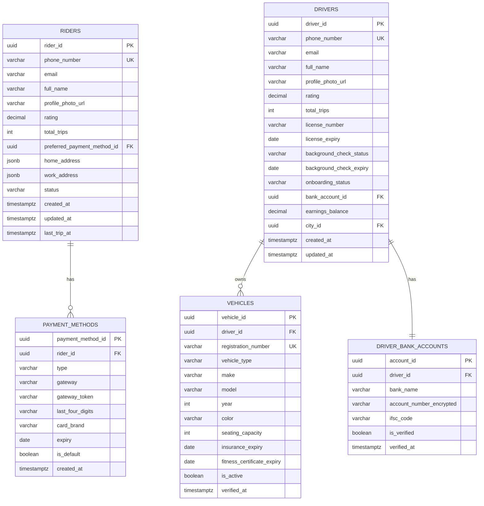
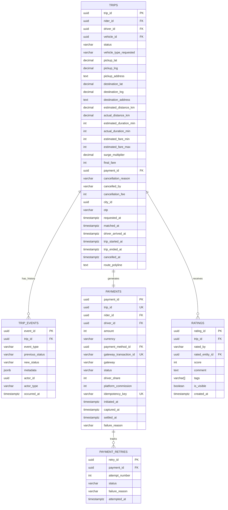
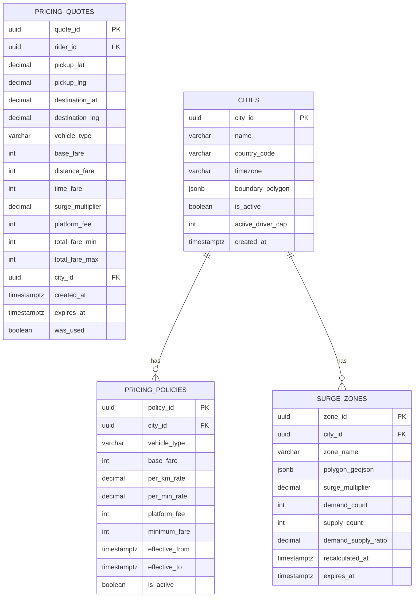

# 05 — Database Design: Ride-Sharing Platform

---

## Objective

Design the complete data layer for the ride-sharing platform, covering table schemas, indexes, partitioning strategy, sharding considerations, hot vs. cold data separation, and the rationale for each storage technology choice. This document bridges the domain model to physical storage.

---

## 1. Storage Technology Selection

| Data Category | Technology | Justification |
|---|---|---|
| Trip data, user profiles, payments | PostgreSQL 15+ | ACID transactions, rich query, partitioning, PostGIS extension |
| Live driver locations | Redis 7 (Cluster) | Sub-millisecond GEO queries, TTL support, 250K writes/sec capable |
| Driver location history (ML/analytics) | Apache Parquet on S3/GCS | Columnar format, cheap storage, Spark/BigQuery compatible |
| Session / tokens | Redis | TTL-native, fast lookup |
| Search (driver/city search) | Elasticsearch | Full-text, fuzzy search for address autocomplete |
| Analytics / reporting | ClickHouse | OLAP queries, 100x faster than PostgreSQL for aggregations |
| Document storage (driver docs) | AWS S3 / GCS | Blob storage; never in relational DB |

### Why PostgreSQL over MySQL?

- PostGIS extension for geospatial operations (city boundary storage, geofencing)
- Native JSONB for flexible metadata fields without schema migration
- Partial indexes — critical for: `WHERE status = 'ACTIVE'` queries on huge tables
- Table partitioning (declarative) since PostgreSQL 10
- `SELECT FOR UPDATE SKIP LOCKED` for job queue patterns
- Stronger serializable isolation for financial operations

---

## 2. PostgreSQL Database Schemas

### 2.1 Users Database (users_db)



### 2.2 Trips Database (trips_db) — Partitioned



### 2.3 Pricing Database (pricing_db)



---

## 3. Indexing Strategy

### 3.1 Trips Table Indexes

```sql
-- Primary lookup by ID (default B-tree)
CREATE UNIQUE INDEX idx_trips_id ON trips(trip_id);

-- Active trips for a rider (frequent: "do you have an active trip?")
CREATE INDEX idx_trips_rider_active ON trips(rider_id, status)
  WHERE status IN ('REQUESTED', 'MATCHING', 'DRIVER_MATCHED', 'DRIVER_ARRIVED', 'IN_PROGRESS');

-- Active trips for a driver (frequent: matching check)
CREATE UNIQUE INDEX idx_trips_driver_active ON trips(driver_id)
  WHERE status IN ('DRIVER_MATCHED', 'DRIVER_ARRIVED', 'IN_PROGRESS');

-- Trip history by rider (paginated list, cursor-based)
CREATE INDEX idx_trips_rider_history ON trips(rider_id, requested_at DESC);

-- City + date range (reporting, partitioned by city + month)
CREATE INDEX idx_trips_city_date ON trips(city_id, requested_at DESC);

-- Payment lookup
CREATE INDEX idx_trips_payment ON trips(payment_id) WHERE payment_id IS NOT NULL;
```

**Why a UNIQUE partial index on driver_id for active trips?**
This enforces at the database level that a driver can be on only one active trip. If the application tries to assign a driver who is already on a trip, the INSERT/UPDATE will fail with a unique constraint violation. This is the most reliable layer to enforce this invariant.

### 3.2 Payments Table Indexes

```sql
-- Primary lookup
CREATE UNIQUE INDEX idx_payments_id ON payments(payment_id);

-- Idempotency check (must be instant)
CREATE UNIQUE INDEX idx_payments_idempotency ON payments(idempotency_key);

-- Trip-to-payment lookup
CREATE UNIQUE INDEX idx_payments_trip ON payments(trip_id);

-- Gateway transaction reconciliation
CREATE UNIQUE INDEX idx_payments_gateway_txn ON payments(gateway_transaction_id)
  WHERE gateway_transaction_id IS NOT NULL;

-- Failed payments for retry queue
CREATE INDEX idx_payments_retry ON payments(status, initiated_at)
  WHERE status = 'FAILED';

-- Driver earnings settlement
CREATE INDEX idx_payments_driver_unsettled ON payments(driver_id, captured_at)
  WHERE settled_at IS NULL;
```

### 3.3 Ratings Table Indexes

```sql
-- Aggregate driver rating calculation
CREATE INDEX idx_ratings_driver ON ratings(rated_entity_id, score)
  WHERE rated_by = 'RIDER' AND is_visible = TRUE;

-- Aggregate rider rating calculation
CREATE INDEX idx_ratings_rider ON ratings(rated_entity_id, score)
  WHERE rated_by = 'DRIVER' AND is_visible = TRUE;

-- Trip-level lookup
CREATE UNIQUE INDEX idx_ratings_trip_direction ON ratings(trip_id, rated_by);
```

---

## 4. Partitioning Strategy

### 4.1 Trips Table Partitioning

The trips table will grow to ~5 million rows/day = ~1.8 billion rows/year. A single table at this size becomes unmanageable for queries and maintenance. Partitioning is mandatory.

**Two-level partitioning:**

```
trips (parent)
├── trips_city_bangalore (partition by city_id = 'BLR')
│   ├── trips_blr_2026_05 (sub-partition by month)
│   └── trips_blr_2026_06
├── trips_city_mumbai (partition by city_id = 'MUM')
│   ├── trips_mum_2026_05
│   └── trips_mum_2026_06
└── trips_city_delhi (...)
```

**Partition key:** `(city_id, requested_at)` — LIST partition by city, RANGE sub-partition by month

**Benefits:**
- City-scoped queries never touch other cities' partitions (partition pruning)
- Monthly partitions allow easy archival: `DETACH PARTITION trips_blr_2024_01` then archive to cold storage
- VACUUM and ANALYZE run on smaller partition tables → faster maintenance
- Index rebuilds on small partitions, not 100M+ row tables

**Tradeoff:** Cross-city queries (rare, admin-only) become cross-partition scans. Acceptable given that 99% of queries are city-scoped.

### 4.2 Trip Events Partitioning

```
trip_events (parent)
├── trip_events_2026_05 (RANGE by occurred_at, monthly)
└── trip_events_2026_06
```

Events are write-heavy and query patterns are always time-bounded. Monthly partitions allow automatic archival. Events older than 2 years can be moved to S3 for audit purposes.

---

## 5. Redis Data Model

### 5.1 Driver Live Location (Redis GEO)

Redis GEO uses a sorted set internally, with the score being the geohash encoding of lat/lng. This allows efficient proximity queries.

```
Key pattern: driver_locations:{city_id}

// Add/update driver position
GEOADD driver_locations:BLR 72.8777 19.0760 "driver_uuid_1"

// Find drivers within 5km of a point
GEORADIUS driver_locations:BLR 72.8777 19.0760 5 km ASC COUNT 20

// Remove driver (when offline)
ZREM driver_locations:BLR "driver_uuid_1"
```

**TTL Management:** Redis GEO sorted sets don't support per-member TTL. Solution: a separate sorted set `driver_heartbeat:{city_id}` stores `(driver_id, last_update_timestamp)`. A background sweeper runs every 30 seconds, finds drivers where `timestamp < now - 60s`, and removes them from both sets.

Alternatively: Use a separate hash `driver_last_seen:{driver_id}` with TTL = 60s. If a driver's heartbeat key expires, they are no longer considered available (absence from heartbeat set means stale).

### 5.2 Driver Availability State

```
Key: driver_availability:{driver_id}
Type: Hash
TTL: 120 seconds (refreshed on every location update)

Fields:
  status: "AVAILABLE" | "ON_TRIP" | "RETURNING"
  city_id: "BLR"
  vehicle_id: "uuid"
  vehicle_type: "ECONOMY"
  rating: "4.85"
  current_trip_id: "" (or UUID if ON_TRIP)
  last_update: "2026-05-17T10:00:00Z"
```

### 5.3 Surge Multiplier Cache

```
Key: surge:{city_id}:{zone_id}
Type: String
TTL: 90 seconds (recalculated every 60s, 30s grace)

Value: JSON
{
  "multiplier": 1.8,
  "zone_name": "Koramangala",
  "demand_count": 145,
  "supply_count": 32,
  "calculated_at": "2026-05-17T10:00:00Z"
}
```

### 5.4 Active Trip State Cache

```
Key: trip:{trip_id}
Type: Hash
TTL: 4 hours (longer than any possible trip + buffer)

Fields:
  status: "IN_PROGRESS"
  rider_id: "uuid"
  driver_id: "uuid"
  driver_lat: "19.0760"
  driver_lng: "72.8777"
  started_at: "2026-05-17T10:00:00Z"
  otp: "4821"
```

This cache allows WebSocket servers to answer `SYNC_REQUEST` without hitting PostgreSQL.

### 5.5 Fare Quote Cache

```
Key: quote:{quote_id}
Type: Hash
TTL: 300 seconds (5 minute quote validity)

Fields:
  rider_id: "uuid"
  fare_min: "145"
  fare_max: "175"
  surge_multiplier: "1.8"
  expires_at: "..."
  was_used: "false"
```

### 5.6 Idempotency Key Store

```
Key: idempotency:{key}
Type: String (serialized response)
TTL: 86400 seconds (24 hours)

Value: Serialized HTTP response (status code + body)
```

---

## 6. Hot Data vs. Cold Data Archival

| Data | Hot Storage | Cold Storage | Archival Trigger |
|---|---|---|---|
| Active trips | PostgreSQL (partitioned) | S3 Parquet | Trip older than 6 months |
| Completed trips (recent) | PostgreSQL | S3 Parquet | Older than 6 months |
| Trip events | PostgreSQL | S3 Parquet | Older than 2 years |
| Payment records | PostgreSQL | S3 Parquet | Older than 7 years (legal) |
| Driver location history | Kafka → S3 directly | Already on S3 | N/A |
| Ratings | PostgreSQL | S3 Parquet | Older than 3 years |

**Archival process:** Background job at midnight UTC detaches the oldest partition (`DETACH PARTITION trips_blr_2024_01`), exports to Parquet on S3 (via COPY TO S3 or pg_dump), then drops the partition. Data remains queryable via Athena/BigQuery on S3. PostgreSQL table size stays manageable.

---

## 7. Read Replicas Strategy

| Use Case | Reader Type | Rationale |
|---|---|---|
| Rider trip history query | Read replica | High read volume; can tolerate 1-2s replication lag |
| Driver earnings dashboard | Read replica | Aggregate queries; non-critical timing |
| Admin reporting | Read replica | Heavy OLAP queries; must not impact primary |
| Rating aggregation | Read replica | Non-time-critical |
| Real-time trip status (active) | Primary | Must have current state; replication lag unacceptable |
| Payment capture/verify | Primary | Financial accuracy requires primary |
| Trip state transitions | Primary | ACID required |

**Connection pooling:** PgBouncer in front of each PostgreSQL instance. Transaction-mode pooling for short-lived requests. Reduces connection overhead from hundreds of service instances to a manageable pool per DB shard.

---

## 8. Database Per Service (Physical Separation)

| Service | Database | Rationale |
|---|---|---|
| Rider Service | users_db (riders schema) | Own schema for independent deployment |
| Driver Service | users_db (drivers schema) | Shared DB, separate schema; can split later |
| Trip Service | trips_db | High volume; needs dedicated resources |
| Payment Service | payments_db | PCI scope isolation; separate DB required |
| Pricing Service | pricing_db | Low volume; can share or dedicate |

Each service connects ONLY to its own database. Cross-service data access goes through the service's API, not direct DB queries. This is non-negotiable for PCI compliance (Payment DB) and operational independence.

---

## 9. Sharding Considerations

At 5M trips/day, PostgreSQL with partitioning handles this well on a single primary (or primary + replicas). Sharding is NOT needed at this scale if partitioning is done correctly.

**When would you need horizontal sharding?**
- > 50M trips/day globally (Uber scale in 2019)
- > 10TB of hot trip data (online queries on data older than 6 months)
- Write throughput > 50K trips/second (far beyond current scale)

**If sharding becomes necessary:**
- Shard key: `city_id` — naturally partitions traffic by geography
- A "city shard" contains all trips, events, and related data for a set of cities
- Use Citus extension for PostgreSQL distributed sharding without application changes
- Alternative: migrate to CockroachDB for globally distributed SQL with automatic sharding

**Pitfall to avoid:** Never shard by `rider_id` or `driver_id` for trips. A single driver's trips would scatter across shards, making trip-history queries expensive (scatter-gather). `city_id` keeps all data for a city in one shard.

---

## 10. Multi-Tenancy (Multi-City) Considerations

The platform is logically multi-tenant by city. Design choices:

| Aspect | Approach |
|---|---|
| Data isolation | `city_id` column in all relevant tables; application enforces city scoping |
| Database isolation | Shared DB with partition per city; dedicated DB for major cities in future |
| Config per city | PricingPolicy table allows per-city fare rules |
| Regulatory compliance | GDPR (EU), PDPA (India) compliance per region via data residency |

For GDPR: European trip data must physically reside in EU region. The `city_id` determines which regional database to route to. EU cities → EU region database. India cities → India region database.

---

## Interview-Level Discussion Points

- **Why not use MongoDB for trip data?** MongoDB is attractive for its flexible schema, but trips require ACID transactions (state machine transitions, atomic payment-trip linkage). MongoDB's multi-document transactions add overhead similar to PostgreSQL while losing the richness of SQL joins and the strong ecosystem of PostgreSQL extensions. The schema for trips is well-known and doesn't benefit from document flexibility.
- **How do you handle the driver_id unique constraint if the same driver's trip appears in multiple partitions?** The partial unique index `(driver_id) WHERE status IN ('ACTIVE_STATUSES')` applies within each partition. PostgreSQL enforces unique constraints per-partition, not globally. The workaround: the application checks for active driver trips at query time before inserting, plus the index provides a safety net within each partition. A truly global constraint would require a dedicated lookup table or constraint in a separate active trips table.
- **What is the risk of storing location data in PostgreSQL vs. Redis?** Storing 250K location writes/sec in PostgreSQL would require > 50 primary shards just for location writes. PostgreSQL's write-ahead log (WAL) and MVCC overhead make it unfit for this write volume. Redis handles 100K+ simple writes/sec per node, and GEO operations are O(log N) on the sorted set. The tradeoff is that Redis is in-memory (more expensive per GB), but driver locations are tiny (64 bytes/driver × 1M drivers = 64MB).
- **How do you ensure the trip OTP is not predictable?** The OTP should be cryptographically random (not sequential). Generate using `SecureRandom` seeded from the OS entropy pool. 4 digits = 10,000 possibilities — a determined attacker could brute-force in 30 attempts on average. Mitigations: rate-limit OTP attempts (max 3 tries), invalidate OTP after successful use, rotate OTP if driver reports suspicious attempts.
- **Why store `fare_min` and `fare_max` instead of a single fare at quote time?** The final fare depends on actual distance and duration, which are not known until the trip ends. The range provides honest uncertainty: "You'll pay between ₹145 and ₹175 depending on traffic." The `surge_multiplier` is locked at quote time, but the base/distance/time components remain variable.
