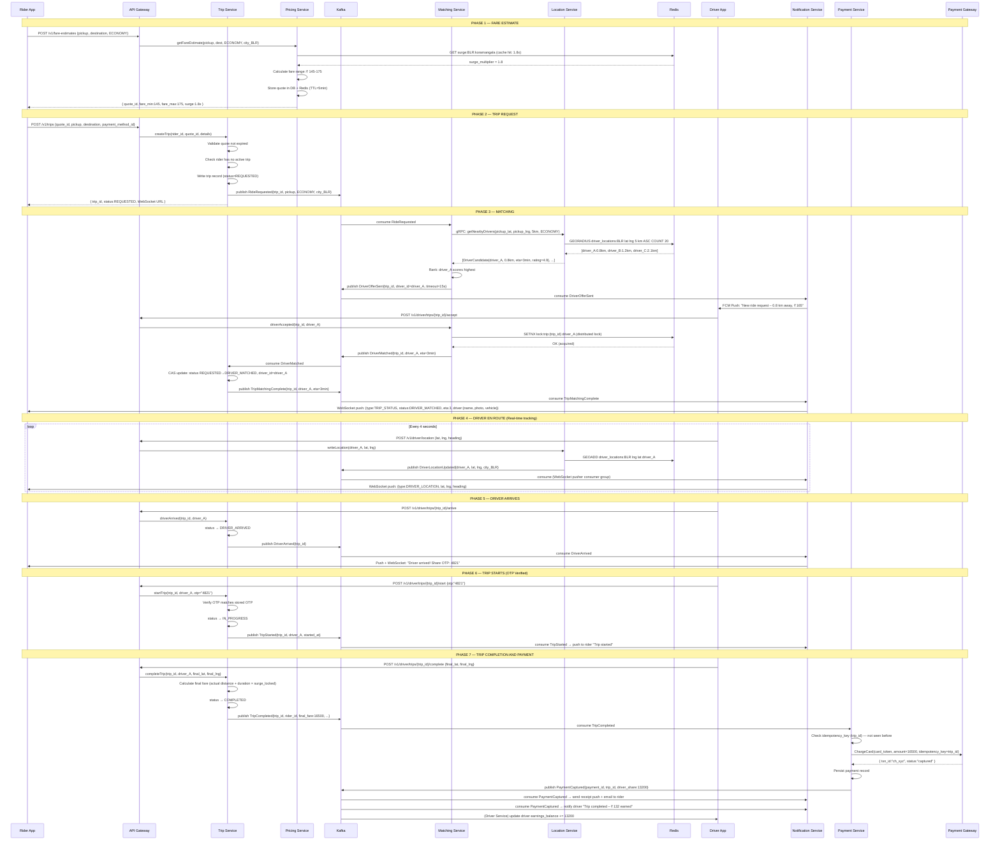
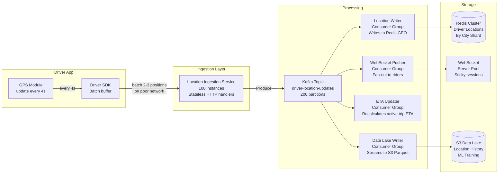
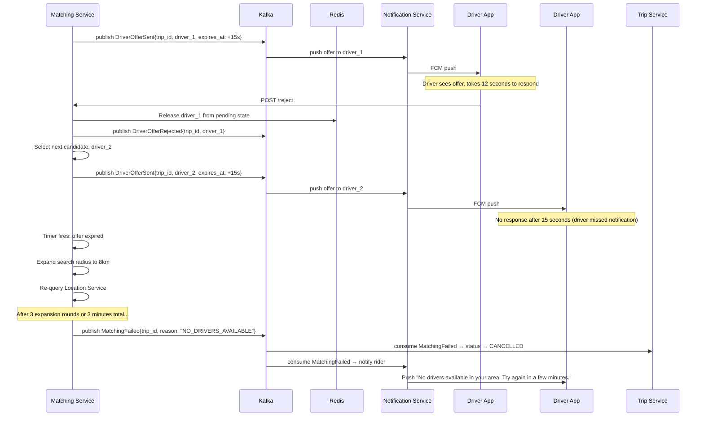
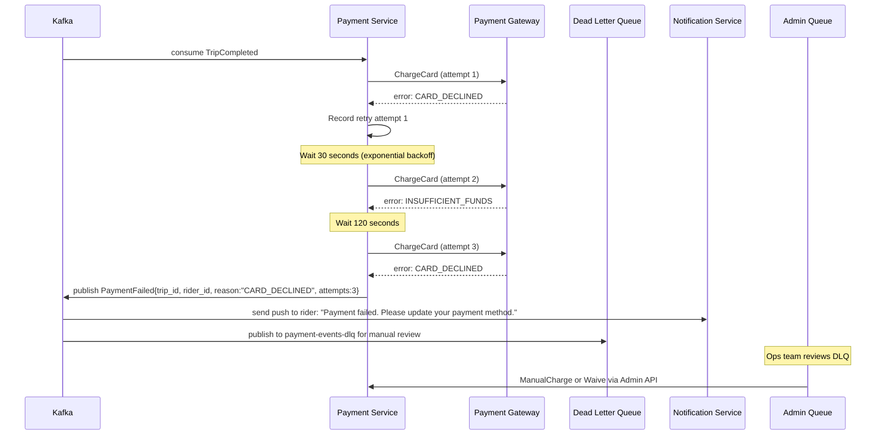
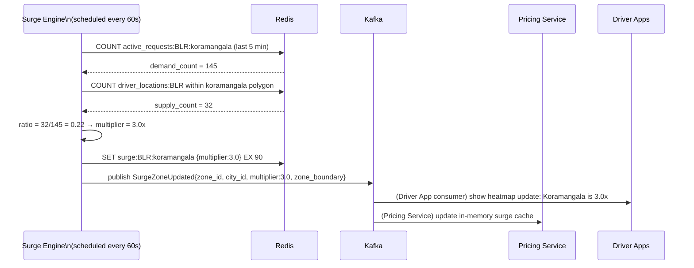

# 06 — Event Flow: Ride-Sharing Platform

---

## Objective

Define the complete event-driven architecture for the ride-sharing platform. Document all domain events, Kafka topic design, consumer group patterns, full sequence diagrams for critical flows, and the driver location update stream. This is the nervous system of the platform.

---

## 1. Event-Driven Architecture Rationale

The ride-sharing platform has three characteristics that make event-driven architecture mandatory, not optional:

1. **High-volume streaming:** 250K driver location updates/second cannot be handled by synchronous REST fan-out. Kafka absorbs this as a durable stream.

2. **Loose coupling between independent domains:** Trip Service must not synchronously depend on Payment Service. A payment gateway outage must not prevent a driver from marking a trip complete.

3. **Multi-consumer fan-out:** A single `TripCompleted` event needs to trigger payment, rating prompt notification, driver earnings update, and analytics ingestion — all independently and concurrently.

---

## 2. Event Catalog

### 2.1 Location Events

| Event Name | Producer | Consumers | Frequency |
|---|---|---|---|
| DriverLocationUpdated | Location Service | WebSocket Pusher, Matching Service (pre-compute), Analytics | 250K/sec |
| DriverWentOnline | Driver Service | Location Service (register), Matching, Analytics | Low |
| DriverWentOffline | Driver Service | Location Service (deregister), Matching, Analytics | Low |

**DriverLocationUpdated Payload:**
```json
{
  "event_type": "DriverLocationUpdated",
  "event_id": "uuid",
  "driver_id": "uuid",
  "city_id": "BLR",
  "lat": 12.9716,
  "lng": 77.5946,
  "heading": 270,
  "speed_kmh": 32.5,
  "accuracy_meters": 8,
  "timestamp": "2026-05-17T10:00:00.000Z",
  "vehicle_type": "ECONOMY"
}
```

### 2.2 Matching Events

| Event Name | Producer | Consumers | Notes |
|---|---|---|---|
| RideRequested | Trip Service | Matching Service | Triggers matching algorithm |
| DriverOfferSent | Matching Service | Notification Service | Push offer to driver |
| DriverOfferAccepted | Matching Service | Trip Service | Driver said yes |
| DriverOfferRejected | Matching Service | Matching Service (retry) | Move to next candidate |
| DriverOfferExpired | Matching Service (timer) | Matching Service (retry) | 15s timeout |
| DriverMatched | Matching Service | Trip Service, Notification (rider) | Final match confirmed |
| MatchingFailed | Matching Service | Trip Service, Notification (rider) | No drivers available |

### 2.3 Trip Events

| Event Name | Producer | Consumers | Notes |
|---|---|---|---|
| TripCreated | Trip Service | Analytics | New trip record |
| TripMatchingStarted | Trip Service | Analytics | Matching began |
| DriverArrived | Trip Service | Notification (rider), Analytics | Driver at pickup |
| TripStarted | Trip Service | Location Service (begin tracking), Analytics | OTP verified |
| TripCompleted | Trip Service | Payment, Notification, Analytics, Rating Service | Critical event |
| TripCancelled | Trip Service | Payment (refund if needed), Notification, Analytics | Cancellation flow |
| TripDisputed | Trip Service | Admin queue, Analytics | Anomaly flagged |

**TripCompleted Payload:**
```json
{
  "event_type": "TripCompleted",
  "event_id": "uuid",
  "trip_id": "uuid",
  "rider_id": "uuid",
  "driver_id": "uuid",
  "vehicle_id": "uuid",
  "city_id": "BLR",
  "final_fare": 16500,
  "currency": "INR",
  "surge_multiplier": 1.8,
  "actual_distance_km": 8.7,
  "actual_duration_min": 24,
  "payment_method_id": "uuid",
  "route_polyline_compressed": "...",
  "started_at": "2026-05-17T09:36:00Z",
  "ended_at": "2026-05-17T10:00:00Z",
  "schema_version": "1.2"
}
```

### 2.4 Payment Events

| Event Name | Producer | Consumers | Notes |
|---|---|---|---|
| PaymentInitiated | Payment Service | Analytics | Charge started |
| PaymentCaptured | Payment Service | Notification, Driver Service (earnings), Analytics | Success |
| PaymentFailed | Payment Service | Notification (rider), Analytics, DLQ | Charge failed |
| PaymentRefunded | Payment Service | Notification, Analytics | Dispute resolved |
| DriverPayoutScheduled | Payment Service | Driver Service | Batch payout queue |
| DriverPayoutCompleted | Payment Service | Notification (driver), Analytics | Transfer done |

### 2.5 Notification Events

| Event Name | Producer | Consumers | Notes |
|---|---|---|---|
| All above events | Various services | Notification Service | Notification reacts to all events |

---

## 3. Kafka Topic Design

### 3.1 Topic Architecture

```
Topics:
├── driver-location-updates         (High-throughput: 250K msg/sec)
├── trip-events                     (Medium: ~5K msg/sec at peak)
├── matching-events                 (Medium: ~500 msg/sec)
├── payment-events                  (Low: ~200 msg/sec)
├── notification-triggers           (Medium: ~2K msg/sec)
└── analytics-raw                   (Aggregated fan-out stream)
```

### 3.2 Topic Configuration Details

| Topic | Partitions | Replication Factor | Retention | Notes |
|---|---|---|---|---|
| driver-location-updates | 200 | 3 | 1 hour | High throughput; short retention (real-time only) |
| trip-events | 50 | 3 | 7 days | Medium volume; important for replay on failures |
| matching-events | 20 | 3 | 24 hours | Matching is fast; events not needed long |
| payment-events | 20 | 3 | 30 days | Financial; longer retention for reconciliation |
| notification-triggers | 20 | 3 | 24 hours | Delivery happens fast; old events are stale |
| analytics-raw | 100 | 3 | 14 days | All events consolidated; Spark/Flink reads this |

### 3.3 Partition Key Strategy

| Topic | Partition Key | Rationale |
|---|---|---|
| driver-location-updates | `city_id` | All drivers in a city go to same partition set; consumers are city-scoped |
| trip-events | `trip_id` | All events for a trip arrive in order at one partition |
| matching-events | `trip_id` | Match events for same trip must be ordered |
| payment-events | `trip_id` | Payment events for same trip must be ordered |
| notification-triggers | `user_id` | All notifications for a user in order |

**Why city_id for location updates:**
If partitioned by driver_id, the WebSocket pusher consumer would need to consume ALL partitions to find which drivers are on active trips. By partitioning by city_id, each consumer group member handles one city — cleaner scaling and isolation.

### 3.4 Consumer Groups

```
driver-location-updates topic:
  ├── consumer-group: location-writer          (Writes to Redis GEO)
  ├── consumer-group: websocket-pusher         (Pushes to rider WebSocket)
  ├── consumer-group: eta-updater             (Recalculates ETA for active trips)
  └── consumer-group: analytics-location      (Streams to data lake)

trip-events topic:
  ├── consumer-group: payment-processor       (Listens for TripCompleted)
  ├── consumer-group: notification-dispatcher (Listens for all trip events)
  ├── consumer-group: rating-prompt           (Listens for TripCompleted)
  ├── consumer-group: driver-status-updater   (Updates Redis availability)
  └── consumer-group: analytics-trips         (Streams to ClickHouse)

payment-events topic:
  ├── consumer-group: notification-dispatcher (Receipt to rider)
  ├── consumer-group: driver-earnings         (Credit driver ledger)
  └── consumer-group: analytics-payments      (Revenue metrics)
```

---

## 4. Complete Ride Lifecycle Sequence Diagram



---

## 5. Driver Location Update Stream Detail

The location update path is the highest-volume data flow in the system. It requires its own detailed breakdown.



### Location Update Backpressure

At 250K updates/second, the Kafka producer side (Ingestion Service) must be tuned:

| Setting | Value | Rationale |
|---|---|---|
| `linger.ms` | 5ms | Wait 5ms before sending batch to improve compression |
| `batch.size` | 65536 (64KB) | Large batches reduce per-message overhead |
| `compression.type` | lz4 | Fast compression, 3-5x size reduction |
| `acks` | 1 (leader only) | Location updates can tolerate rare loss |
| Partitions | 200 | 250K/sec ÷ 200 = 1,250 msg/sec per partition (well within limits) |

**Consumer throughput per partition:**
- Redis GEOADD throughput: ~100K ops/sec per Redis node
- With 200 partitions and 10 Redis nodes (20 partitions/node): 20 × 1,250 = 25,000 ops/sec per node
- Well within Redis capacity

---

## 6. Matching Event Flow (Rejection and Retry)



---

## 7. Payment Failure and Retry Flow



**Outbox Pattern for Payment Reliability:**

The Payment Service must not lose the `PaymentCaptured` event even if Kafka is temporarily unavailable.

```
Flow:
1. Payment Service completes charge
2. Within the SAME DB transaction:
   a. INSERT INTO payments VALUES (..., status='CAPTURED')
   b. INSERT INTO payment_outbox VALUES (event payload)
3. A separate Outbox Relay process:
   a. SELECT unpublished events from payment_outbox
   b. Publish to Kafka
   c. Mark as published
```

This guarantees that if Kafka is down, the event is not lost — it waits in the outbox table until Kafka recovers.

---

## 8. Surge Zone Recalculation Event Flow



---

## 9. Event Schema Evolution Strategy

All events use **Avro with Confluent Schema Registry**.

| Concern | Approach |
|---|---|
| Backward compatibility | New fields are optional with defaults; old consumers ignore them |
| Forward compatibility | Old producers do not include new fields; new consumers handle absence |
| Breaking changes | New schema version required; maintain both versions during transition |
| Schema registry | Confluent Schema Registry; producer validates schema before publish |
| Versioning | `schema_version` field in every event payload |
| Dead letter handling | Events that fail deserialization go to per-topic DLQ |

---

## Interview-Level Discussion Points

- **What happens if the TripCompleted event is published but Payment Service is down?** Kafka retains the event with 7-day retention. Payment Service restores, reconnects to Kafka, resumes from last committed offset. The idempotency key (trip_id) ensures even if processed twice after recovery, the charge happens exactly once.
- **How do you avoid a driver receiving a ride offer they already rejected?** Matching Service maintains a `rejected_offers` set in Redis keyed by trip_id: `SADD rejected:trip_id driver_id`. Before sending an offer, it checks `SISMEMBER`. This set has a TTL equal to the match window (3 minutes).
- **Why use Kafka instead of RabbitMQ for location updates?** RabbitMQ is designed for message queuing with AMQP semantics — once consumed and acknowledged, the message is gone. Kafka retains messages on disk, allows multiple consumer groups to independently consume the same stream (analytics, WebSocket pusher, ETA updater all read the same location event), and handles 250K messages/sec without sweat. RabbitMQ would bottleneck at these throughputs.
- **How do you handle out-of-order location updates?** GPS timestamps can arrive out of order due to network reordering. The Location Writer in Kafka should check: if the incoming event has `timestamp < last_seen_timestamp` for that driver (stored in Redis hash), discard it. This prevents a stale position from overwriting a newer one.
- **What is the Kafka consumer lag risk on the WebSocket pusher?** If the WebSocket pusher consumer falls behind, riders see stale driver locations. Monitoring consumer lag is critical. If lag exceeds 5 seconds, the rider map is misleading. Mitigations: scale consumer instances, reduce processing time per message (push directly to WebSocket without DB calls), use dedicated partitions for active-trip drivers vs. general location updates.
