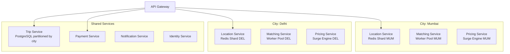

# 07 — Scaling Strategy: Ride-Sharing Platform

---

## Objective

Define the horizontal and vertical scaling strategies for each component of the ride-sharing platform. Address the specific scaling challenges of location ingestion, geospatial index partitioning, matching algorithm under high load, WebSocket connection management, surge pricing, and multi-region deployment. Distinguish startup vs. FAANG-scale evolution.

---

## 1. Scaling Challenges Unique to Ride-Sharing

| Challenge | Why It's Hard | Scale Metric |
|---|---|---|
| Location update ingestion | 250K writes/sec, must be real-time, sharded | 250K msg/sec |
| Geospatial proximity query | Must scan millions of driver positions in <100ms | 500 queries/sec |
| Driver-rider matching | Requires consistency (no double-assign) under concurrency | <3s end-to-end |
| WebSocket connections | Stateful servers; can't just add replicas | 200K concurrent |
| Surge pricing calculation | City-wide computation every 60s | 500+ city zones |
| Trip state transitions | ACID with distributed lock under high write load | 5K transitions/sec |
| Payment under peak | Synchronous external API; limited by gateway throughput | 139 TPS (modest) |

---

## 2. Location Service Scaling

### 2.1 Redis GEO Sharding by City

Redis is single-threaded per instance. A single Redis node handles ~100K simple ops/sec and ~50K GEO ops/sec. At 250K updates/sec:

```
Sharding strategy: One Redis cluster per city (or per city group)

Major city example (Mumbai):
  - Active drivers: 50,000
  - Updates at 1/4s: 12,500 updates/sec
  - Fits comfortably on 1 Redis primary + 2 replicas

Total global:
  - 1M drivers ÷ distributed across 50 city clusters
  - Average: 20K drivers/city cluster = 5,000 updates/sec/cluster
  - Peak cities (Mumbai, Delhi): 50K drivers = 12,500 updates/sec
  - All within single Redis primary capacity
```

**Do NOT put all cities in one Redis cluster.** City-level sharding provides:
- Isolation: Mumbai Redis issue doesn't affect Delhi
- Independent scaling: large cities get bigger Redis instances
- Data locality: matching queries touch only one city's GEO set

### 2.2 Location Ingestion Service Scaling

The HTTP ingestion layer is completely stateless. Each instance accepts location POSTs, validates JWT, and forwards to Kafka.

```
Peak load: 250K updates/sec ÷ 1,000 requests/sec per instance = 250 instances
With HPA: scale from 50 instances during off-peak to 300 during rush hour
Instance type: CPU-optimized, 2 vCPU, 4GB RAM (no memory pressure, pure I/O)
```

Auto-scaling trigger: CPU > 70% OR request queue depth > 1,000.

### 2.3 Kafka Location Topic Scaling

```
Topic: driver-location-updates
Partitions: 200 (can add more without losing data; requires consumer rebalance)
Replication: 3
Throughput: 250K msg/sec × 200 bytes = 50 MB/sec inbound

Kafka broker sizing:
  - 10 Kafka brokers for location topic
  - Each broker handles: 200 partitions ÷ 10 brokers = 20 partitions/broker
  - 50 MB/sec ÷ 10 brokers = 5 MB/sec per broker (very comfortable)
```

### 2.4 Location Consumer Scaling

Each consumer group (Redis writer, WebSocket pusher, analytics writer) scales independently:

| Consumer Group | Instances | Scaling Trigger |
|---|---|---|
| location-writer (→ Redis) | 200 (1 per partition) | Fixed; Kafka partition-bound |
| websocket-pusher | 50-200 | Consumer lag > 1 second |
| eta-updater | 20-50 | Consumer lag > 2 seconds |
| data-lake-writer (→ S3) | 20 | Batch; low priority |

---

## 3. Matching Service Scaling

### 3.1 Matching Algorithm Computational Profile

The matching algorithm per request:
1. gRPC call to Location Service: ~5ms
2. Score candidates (in-memory): ~1ms for 20 candidates
3. Acquire distributed lock (Redis SETNX): ~1ms
4. Publish DriverOfferSent event to Kafka: ~2ms
5. Wait for driver response: up to 15 seconds (async; does not block thread)

**Critical insight:** The 15-second wait is not a blocking thread wait. The Matching Service registers a callback (stored in Redis) keyed by `trip_id`. When the driver accepts/rejects (a separate HTTP request), it resolves the callback. This is an event-driven, non-blocking architecture.

```
Concurrent matching jobs at peak: 139 RPS × 15s window = ~2,085 concurrent "in-flight" matches
Per instance (non-blocking): 2,085 ÷ 10 instances = ~208 concurrent jobs per instance (trivial)
```

### 3.2 Matching Service Concurrency Control

The double-assignment problem: two match jobs for different trips both select the same driver as best candidate simultaneously.

**Solution: Redis distributed lock with SETNX + TTL**

```
Before sending offer to driver_X for trip_Y:
  SETNX offer_lock:driver_X {trip_id: trip_Y, expires: +15s}
  
If SETNX returns 0 (driver already locked):
  Skip this driver, try next candidate
  
After driver accepts or offer expires:
  DEL offer_lock:driver_X
```

This ensures at most one trip is offered to a driver at any time, without database transactions.

### 3.3 Matching Service Horizontal Scaling

```
Peak: 139 new match requests/sec
Each request is lightweight (< 10ms actual processing)
HPA: scale from 3 to 30 instances based on CPU and queue depth
Coordination: Matching instances do NOT coordinate with each other
  (each instance handles one match request; Redis lock handles contention)
```

---

## 4. WebSocket Connection Management at Scale

### 4.1 The Stateful Connection Problem

WebSocket servers are stateful: each rider's connection is held by one specific server process. You cannot freely round-robin WebSocket connections like REST requests.

**Scale calculation:**
```
200K concurrent active trips → 200K rider WebSocket connections
+ 200K driver WebSocket connections (for offers/navigation)
Total: ~400K concurrent WebSocket connections

Each WebSocket connection memory: ~10KB (buffer + headers)
Memory per server: 400K ÷ 100 servers × 10KB = ~40KB × 4,000 connections = 40MB per server
CPU: minimal (push-only, rare messages)
→ 100 WebSocket server instances with 8GB RAM each, with room to spare
```

### 4.2 WebSocket Session Routing

**Problem:** When a driver location update comes in, the WebSocket pusher consumer must find which server holds the rider's connection.

**Solution: Redis Pub/Sub for connection routing**

```
On WebSocket connection established:
  Client (rider_123) connects to ws-server-5
  ws-server-5 registers: HSET ws_sessions rider_123 "ws-server-5"

When location update for trip_456 arrives (Kafka consumer):
  consumer looks up: rider_id for trip_456
  consumer looks up: which ws-server holds rider's connection
  → publishes to: Redis channel "ws-server-5:rider_123"

ws-server-5 subscribes to Redis channel for its connections:
  On message received → push to that specific WebSocket connection
```

**Alternative (simpler at smaller scale):** Consistent hashing. Hash rider_id to determine which WebSocket server instance owns that connection. Matching Service's Kafka consumer knows exactly which Redis Pub/Sub channel to publish to. This avoids the Redis session lookup.

### 4.3 WebSocket Server Scaling

```
HPA trigger: connections per pod > 4,000
Scale-up: Kubernetes provisions new WebSocket pods
Existing connections: remain on current pods (sticky)
New connections: routed to new pods
Graceful scale-down: drain connections (redirect to new servers via 
  "server-going-away" WebSocket close frame)
```

---

## 5. Surge Pricing Calculation Scaling

### 5.1 Surge Calculation as a Distributed Computation

Surge is calculated per zone per city every 60 seconds.

```
Cities: 500
Average zones per city: 20
Total zone recalculations per minute: 500 × 20 = 10,000

Each recalculation:
  1. Query Redis GEO: count drivers in zone polygon (~2ms)
  2. Query Redis: count pending requests in zone (~1ms)
  3. Calculate multiplier: in-memory math (~<1ms)
  4. Write to Redis: SET surge:city:zone {...} (~1ms)
  5. Publish to Kafka: SurgeZoneUpdated (~2ms)

Total time per recalculation: ~6ms
10,000 recalculations per minute = 167/sec
With 10 Surge Engine workers: 17 recalculations/sec per worker
Easily handled by 10-20 goroutines/threads per instance
```

### 5.2 Surge Zone Boundary Computation

Counting drivers within a polygon is expensive for Redis GEO (which only supports radius queries, not arbitrary polygons). Two approaches:

**Option A: H3 Hexagonal Indexing (Uber's approach)**
- Divide map into H3 hexagons at resolution 7 (~5km² each)
- Store drivers in per-hexagon Redis sorted sets: `drivers:{h3_index}`
- Surge calculation queries by H3 index, not radius
- Exact polygon query becomes union of H3 hexagons
- O(1) lookup per hexagon

**Option B: Redis GEO + bounding box pre-filter**
- GEORADIUS to get all drivers within a bounding circle around the zone
- Filter by polygon in application code
- Works for convex zones; less precise for irregular shapes

**Production choice (Uber-grade):** H3 hexagonal indexing. Uber built and open-sourced H3 for exactly this purpose. Each hexagon has a known ID; counting drivers is O(1) per hexagon.

---

## 6. City-Level Partitioning Strategy

### 6.1 Why City Is the Natural Shard Key

All ride-sharing operations are city-scoped:
- A driver in Mumbai never appears in Delhi matching
- Surge zones are city-specific
- Pricing policies differ by city
- Regulatory requirements differ by city

This natural isolation makes city the ideal partition key.

### 6.2 City Isolation Architecture



**Shared vs. city-scoped services:**

| Service | Deployment | Reason |
|---|---|---|
| Location Service (Redis) | Per-city shard | Data and traffic are city-scoped |
| Matching Service workers | Per-city worker pools | Matching is city-scoped |
| Surge Engine | Per-city scheduler | Surge zones are city-specific |
| Trip Service | Shared (partitioned DB) | Trips can be queried globally (admin, user history) |
| Payment Service | Shared (global) | Payment gateway integration is global |
| Identity Service | Shared (global) | Users travel between cities |
| Notification Service | Shared with city routing | One notification infrastructure; route by city |

---

## 7. Database Scaling Strategy

### 7.1 PostgreSQL Scaling Phases

**Phase 1 (0–5M daily trips):**
- Single PostgreSQL primary + 2 read replicas
- PgBouncer connection pooling
- Partitioned trips table by city + month
- All queries on primary (writes) or replicas (reads)

**Phase 2 (5M–50M daily trips):**
- Separate DB cluster per region (India, US, EU)
- Read replicas per service (Trip Service has its own replica pool)
- Read replicas for analytics queries
- PgBouncer with aggressive pooling (transaction mode)

**Phase 3 (50M+ daily trips, FAANG scale):**
- Horizontal sharding via Citus extension
- Shard key: city_id
- Each shard group (set of Citus workers) owns a set of cities
- Globally: ~20 shard groups covering 500 cities
- Query routing: Citus coordinator handles cross-shard aggregation

### 7.2 Connection Pooling Math

```
Trip Service: 50 instances × 10 connections each = 500 connections to DB
Payment Service: 20 instances × 10 connections = 200 connections
Without PgBouncer: 700 raw PostgreSQL connections → PostgreSQL limit is ~500
With PgBouncer (transaction mode): 700 application connections → 50 actual DB connections
PgBouncer multiplexes at transaction boundary → 90% connection reduction
```

---

## 8. Load Balancing Strategy

| Layer | Load Balancer | Algorithm | Sticky Session? |
|---|---|---|---|
| DNS / CDN | AWS Route53 + CloudFront | GeoDNS → nearest region | No |
| L4 (TCP) | AWS NLB | Round-robin | No |
| L7 (HTTP) | AWS ALB / NGINX | Round-robin with health checks | No (stateless) |
| WebSocket | AWS ALB + sticky sessions | IP hash | Yes (needed) |
| gRPC (internal) | Envoy / Istio | Round-robin with circuit breaking | No |
| Kafka partitions | Kafka native | Partition-key hash | N/A |

**WebSocket sticky sessions:** AWS ALB with `stickiness.enabled=true` uses a cookie to pin a client to the same target. Duration: 1 day (longer than any possible trip). Alternative: Client-side reconnect with Redis session lookup (more resilient to pod restarts).

---

## 9. Horizontal Pod Autoscaling (HPA) Configuration

| Service | Min Pods | Max Pods | Scale Trigger | Scale Up | Scale Down |
|---|---|---|---|---|---|
| Location Ingestion | 20 | 300 | CPU > 70% | +20 pods | -5 pods/5min |
| Matching Service | 5 | 50 | Queue depth > 50 | +5 pods | -2 pods/10min |
| Trip Service | 5 | 30 | CPU > 60% | +3 pods | -1 pod/10min |
| WebSocket Server | 10 | 200 | Connections > 3K/pod | +10 pods | -2 pods/15min |
| Payment Service | 3 | 20 | Queue depth > 20 | +3 pods | -1 pod/5min |
| Surge Engine | 2 | 10 | CPU > 80% | +2 pods | -1 pod/10min |
| Notification Service | 5 | 50 | Queue depth > 200 | +5 pods | -2 pods/5min |

**Scale-down conservatism:** Scale down slowly to avoid thrashing during oscillating load (e.g., end of rush hour). Scale up aggressively because under-provisioning = degraded user experience.

---

## 10. Multi-Region Deployment Scaling

```mermaid
graph TB
    subgraph Region: India (Primary)
        IN_AG[API Gateway]
        IN_SVC[Full Service Stack]
        IN_DB[(PostgreSQL\nIndia Trips)]
        IN_RD[(Redis Cluster\nIndia Drivers)]
    end

    subgraph Region: US East
        US_AG[API Gateway]
        US_SVC[Full Service Stack]
        US_DB[(PostgreSQL\nUS Trips)]
        US_RD[(Redis Cluster\nUS Drivers)]
    end

    subgraph Region: EU Frankfurt
        EU_AG[API Gateway]
        EU_SVC[Full Service Stack]
        EU_DB[(PostgreSQL\nEU Trips)]
        EU_RD[(Redis Cluster\nEU Drivers)]
    end

    GLB[Global Load Balancer\nGeoDNS]

    IN_DB -->|Async Replication\nUser profiles only| US_DB
    IN_DB -->|Async Replication\nUser profiles only| EU_DB

    GLB -->|Mumbai users| IN_AG
    GLB -->|New York users| US_AG
    GLB -->|London users| EU_AG
```

**Cross-region concerns:**
- Trip data stays in the originating region (data residency)
- User profiles replicated globally (auth is global; a Mumbai user going to London needs auth to work)
- Eventual consistency for profile replicas is acceptable (profile changes are rare)
- Drivers operate in one region; no cross-region matching

---

## 11. Rate Limiting and Backpressure

### Rate Limiting Layers

| Layer | Mechanism | Purpose |
|---|---|---|
| API Gateway | Token bucket in Redis | Per-client rate limiting (ride requests, location updates) |
| Kafka producers | `max.in.flight.requests` | Prevent overwhelming Kafka on network burst |
| Redis clients | Connection pool limits | Prevent Redis connection storm during scale-up |
| Matching queue | Max queue depth | Discard oldest ride requests if queue overflows (with error response) |
| Payment retries | Exponential backoff | Prevent hammering payment gateway on failure |

### Backpressure on Location Updates

If Kafka consumer lag on `driver-location-updates` grows beyond threshold:
1. Monitoring alert fires
2. HPA adds more consumer instances
3. If lag continues growing: Location Writer consumers are given priority thread allocation
4. Last resort: Driver SDK update interval increased from 4s to 8s via feature flag (reduces volume 50%)

---

## 12. Capacity Planning Summary

| Resource | Current Capacity | Peak Utilization | Scaling Head Room |
|---|---|---|---|
| Location Ingestion pods | 50 | 65% | 3x before HPA ceiling |
| Kafka (location topic) | 200 partitions | 60% | Add partitions; online expansion |
| Redis (per city) | 1 primary + 2 replicas | 40% memory | Add memory or new shard |
| Matching pods | 10 | 50% CPU | 5x before HPA ceiling |
| WebSocket pods | 20 | 60% connections | 10x before ceiling |
| PostgreSQL (trips_db) | 1 primary + 3 replicas | 40% primary IOPS | Vertical scale, then shard |
| Payment pods | 5 | 30% | Limited by gateway TPS |

---

## Interview-Level Discussion Points

- **"What breaks first at 10x traffic?"** The WebSocket layer. 400K connections → 4M connections. Current sticky session design would require 10x more WebSocket pods. Redis Pub/Sub for routing would also hit limits at 4M channels. Resolution: Move to a dedicated pub/sub system (Pusher, Ably, or custom QUIC-based transport) for real-time driver tracking. The location ingestion Kafka cluster would need to scale to 2.5M msg/sec — achievable but requires more partitions and brokers.
- **"How does Uber handle 10M+ location updates/second globally?"** They route by city at the DNS/load balancer level. Each city's location cluster is independent. At 50K drivers per city, that's 12.5K updates/sec — trivial for a single Redis instance. They don't have a global Redis for location; it's city-sharded globally. This is the key architectural insight.
- **"Why not use a geographic database like PostGIS for live driver queries?"** PostGIS is excellent for complex geospatial analysis (route calculations, city boundary checks). But for high-frequency write (250K/sec) and sub-millisecond read (GEORADIUS), it cannot compete with Redis's in-memory sorted set. PostGIS for city boundaries, analytics, and geofencing; Redis GEO for live driver positions. Use the right tool.
- **"How do you scale the matching algorithm to 10x?"** Matching is non-blocking (15s async wait per request). The compute cost is the Location Service gRPC call + candidate ranking. At 10x = 1,390 RPS: 1,390 × 15s = ~21K concurrent in-flight matches. With 100 Matching Service instances, each handles ~210 concurrent jobs — still trivial with async I/O. The bottleneck would be the Location Service gRPC, not the matching compute.
- **"What's your cold start strategy for a new city launch?"** Zero drivers = zero matches. Bootstrap: (1) Pre-register drivers with a sign-up bonus before launch day. (2) Surge pricing pre-configured at 2x to attract drivers to the platform. (3) Synthetic load test to warm JVM/Redis caches before go-live. (4) Staff a customer support team for the first week as matching rates will be lower than steady state.
