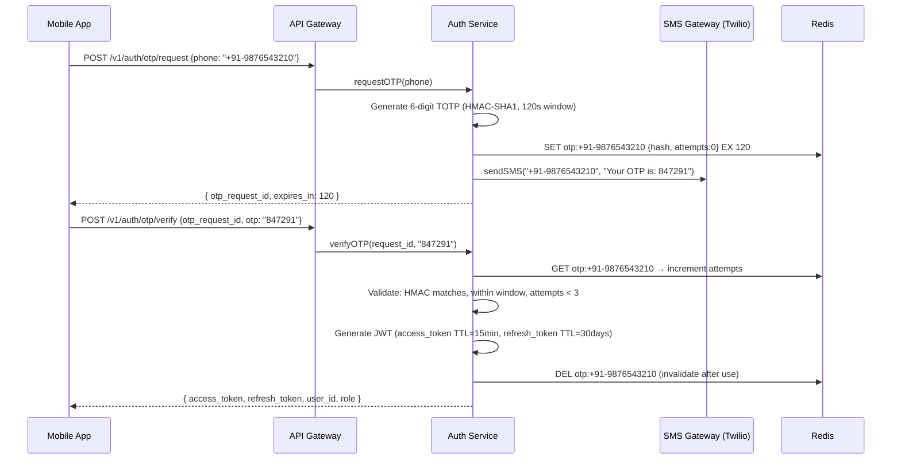

# 08 — Security Design: Ride-Sharing Platform

---

## Objective

Define the comprehensive security architecture for the ride-sharing platform, covering authentication, authorization, data protection, PCI compliance, location privacy, fraud prevention, driver identity verification, and regulatory compliance. Security here is not an afterthought — it protects financial data, personal safety, and physical location data of millions of users.

---

## 1. Threat Model

Before designing security controls, identify the adversaries and their goals:

| Threat Actor | Goal | Attack Vectors |
|---|---|---|
| Fraudulent riders | Free rides, chargebacks | Stolen payment cards, fake accounts, GPS spoofing pickup |
| Fraudulent drivers | Fake trip completion, earning manipulation | GPS spoofing to simulate completed trips, fake OTP |
| Account takeover attackers | Access rider's payment method or driver earnings | OTP interception, credential stuffing, SIM swap |
| Competitor intelligence | Scrape surge pricing data, driver density | High-frequency API calls, reverse engineering |
| Data thieves | Sell location history, personal data | API exploitation, database access, insider threat |
| Payment fraudsters | Unauthorized charges, money laundering | Stolen card testing at scale |
| Physical safety threat | Harm rider/driver | Fake driver accounts, impersonation |

---

## 2. Authentication Architecture

### 2.1 Phone-Based OTP Authentication

Ride-sharing platforms universally use phone number as the primary identifier because:
- Drivers and riders may not have email addresses
- Phone verification provides a higher-trust signal than email (SIM card registration)
- Phone number is used for emergency contact

**OTP Flow:**



**OTP Security Controls:**
- Max 3 attempts per OTP (brute-force prevention)
- 5-minute cooldown after 3 failures (with increasing backoff)
- Rate limit: 5 OTP requests per phone per 10 minutes
- OTP uses TOTP (time-based) not sequential; cannot predict the next OTP
- SMS content does NOT contain clickable links (prevents phishing)
- OTP invalidated immediately after successful verification (cannot be reused)

### 2.2 JWT Design

**Token Structure:**

```json
// Access Token Header
{
  "alg": "RS256",
  "kid": "key-2026-05",
  "typ": "JWT"
}

// Access Token Payload
{
  "sub": "rider_uuid",
  "role": "RIDER",
  "phone": "+91-9876543210",
  "city_id": "BLR",
  "jti": "unique-token-id",
  "iat": 1716120000,
  "exp": 1716120900,   // 15 minutes
  "iss": "auth.rideshare.com",
  "aud": "api.rideshare.com"
}
```

**Security choices:**
- RS256 (asymmetric): Private key signs tokens (on Auth Service only); public key verifies tokens (distributed to all services). Compromise of a single service does not expose the signing key.
- `kid` (Key ID): Enables key rotation without downtime. API Gateway caches public keys by `kid`; rotates when new `kid` appears.
- `jti` (JWT ID): Unique token identifier. Used for revocation (store revoked JTIs in Redis with TTL = remaining token lifetime).
- `exp = 15 minutes`: Short window minimizes damage from token theft. Driver/rider must refresh frequently.

### 2.3 Refresh Token Security

```
Refresh token properties:
  - Opaque random token (256-bit), NOT a JWT
  - Stored server-side in: refresh_tokens table (hashed) or Redis
  - One-time use: refresh rotates the token on every use (sliding window)
  - TTL: 30 days of absolute lifetime; 7 days of inactivity expiry
  - Bound to device fingerprint (IP + User-Agent hash) — alert on mismatch
  - Invalidated on: logout, password change, account suspension
```

**Refresh Token Rotation Attack Prevention:**
If a refresh token is stolen and used by an attacker before the legitimate user, the rotation creates a divergence. Detection: If the same refresh token is presented TWICE (once legitimate, once attacker), the system detects the old (already-rotated) token being reused → immediately invalidate ALL refresh tokens for this user and force re-authentication.

---

## 3. Authorization (RBAC)

### 3.1 Roles and Permissions

| Role | Permissions |
|---|---|
| RIDER | Request rides, view own trips, submit ratings, manage own payment methods |
| DRIVER | Accept/reject rides, update location, view own earnings, manage own profile |
| SUPPORT | View any trip/user, resolve disputes, cannot modify financial data |
| ADMIN | Full access, can suspend accounts, configure pricing, access analytics |
| SYSTEM | Internal service-to-service calls, limited to specific operations |

### 3.2 Resource-Level Authorization

Beyond role-based checks, resources are owner-scoped:

- `GET /v1/trips/{trip_id}` — only the rider or driver of THAT trip can access it
- `POST /v1/driver/trips/{trip_id}/accept` — only a DRIVER role; and the offer must have been sent to THIS driver
- `GET /v1/riders/me/trips` — `me` resolves to `sub` claim in JWT; cannot access another rider's history

**Enforcement:** At the service layer, not the API Gateway. Gateway validates JWT signature and role; the service validates resource ownership.

### 3.3 Driver-Specific Eligibility Gate

Before a driver can go online (DRIVER role + specific eligibility):
- background_check_status = APPROVED
- background_check_expiry > now + 30 days
- vehicle.insurance_expiry > now + 30 days
- vehicle.fitness_certificate_expiry > now + 30 days
- onboarding_status = APPROVED

This is checked at `POST /v1/driver/availability/online`. If any condition fails, the driver receives a specific error with the blocking reason.

---

## 4. Payment Security (PCI-DSS Compliance)

### 4.1 Card Data Handling

**Rule:** Raw card data (PAN, CVV, expiry) NEVER touches our servers. This is the most important PCI-DSS control.

**Implementation:**
- Rider's card is tokenized by the payment gateway JavaScript SDK (Stripe.js / Razorpay checkout) directly in the browser/app
- Our server receives only a `payment_method_token` (opaque string), not card data
- This puts us in PCI-DSS SAQ A scope (the lightest compliance tier) rather than Level 1

### 4.2 Payment Flow Security

```
Secure payment flow:
1. Rider's app calls Stripe.js with card details
2. Stripe returns payment_method_token → stored in our DB
3. At trip completion, Payment Service calls:
   stripe.paymentIntents.create({
     amount: 16500,
     currency: "inr",
     payment_method: "pm_xyz",  // token, not card data
     confirm: true,
     idempotency_key: trip_id   // deduplication
   })
4. Stripe processes the charge
5. We store only: gateway_transaction_id, status, last_four_digits
```

### 4.3 Idempotency for Payment Safety

The `idempotency_key = trip_id` ensures:
- If the charge request is sent twice due to network retry, Stripe returns the SAME response
- We never double-charge a rider for one trip
- Our database also has a UNIQUE constraint on `payments.idempotency_key`

### 4.4 Fraud Detection on Payments

| Signal | Action |
|---|---|
| Card declined 3+ times in 24h from same IP | Block IP + alert fraud team |
| Card used from 5+ different countries in 24h | Soft block + manual review |
| First-time user, high-value trip, new card | 3D Secure additional verification |
| Chargeback rate > 1% for a rider account | Suspend account, manual review |
| Unusual payout pattern for driver | Flag for earnings manipulation review |

---

## 5. Location Data Privacy

### 5.1 What Location Data Is Stored?

| Data | Storage | Retention | Justification |
|---|---|---|---|
| Driver real-time position | Redis (in-memory) | 60-second TTL | Matching only; no persistence |
| Trip pickup/destination | PostgreSQL | 2 years, then anonymize | Needed for receipts, disputes |
| GPS trace during trip | PostgreSQL (polyline) | 6 months | Dispute resolution (was driver on right route?) |
| Driver location history | NOT stored in OLTP | Kafka → S3, 1 year | ML training only; anonymized after 90 days |
| Rider home/work address | PostgreSQL | Until account deletion | User preference; encrypted at rest |

### 5.2 GDPR and Data Residency Compliance

**Data residency:** EU user data (rides, location, profiles) must reside in EU region. Implemented via:
- City-based routing: all EU cities → EU region PostgreSQL + Redis
- Cross-region replication blocked for trip location data
- Only auth tokens and user credentials replicated globally

**Right to erasure (GDPR Article 17):**
- Rider requests account deletion via app
- Process: anonymize PII in trips (replace name/phone with "DELETED_USER_{id}")
- Delete: profile, payment methods, saved addresses
- Retain: aggregated/anonymized trip data for financial audit (legal hold)
- TTL: complete deletion within 30 days of request

**Data minimization:**
- Driver location broadcasted to rider ONLY during active trip, not during matching
- Rider exact destination not shown to driver until trip starts (privacy concern)
- Location history purged from Redis on driver going offline

### 5.3 Location Data During Matching vs. Trip

| Phase | Rider sees | Driver sees |
|---|---|---|
| During matching | Driver's general zone (not exact location) | Pickup area only |
| After match confirmed | Driver's real-time location | Full pickup address + destination area |
| During trip | Driver's real-time location | Full destination |
| After trip | Nothing | Nothing (trip data archived) |

This graduated disclosure protects both parties from stalkers or bad actors.

---

## 6. Driver Identity and Safety

### 6.1 Background Check Integration

Background checks are performed by a third-party service (First Advantage, Checkr):

```
Driver onboarding flow:
1. Driver submits: government ID, driver's license, vehicle documents
2. Our system calls background check API asynchronously
3. Background check service runs criminal history, license verification
4. Webhook callback when complete: APPROVED / REJECTED
5. Only APPROVED drivers can go online
6. Annual re-verification required
```

**Driver impersonation prevention:**
- Driver profile photo is required and manually reviewed
- License plate is verified against government database (in markets where API available)
- Photo ID verification using ML-based face liveness check

### 6.2 OTP Verification for Trip Start

The OTP (4-digit code displayed to rider) must be entered by the driver to start the trip. This:
- Prevents driver from starting a trip with the wrong rider (GPS confusion)
- Proves driver and rider are physically co-located at pickup
- Deters account-sharing fraud (driver lending account to family member)

### 6.3 GPS Anti-Spoofing

GPS spoofing (using a fake GPS app to simulate a completed route) is used by fraudulent drivers to earn money for trips never taken.

**Detection signals:**
- Speed > 200 km/h for land vehicle (impossible normally)
- GPS accuracy consistently showing < 1 meter (real GPS varies from 3–20m)
- Straight-line GPS trace with no turns (real routes have turns)
- Timestamp irregularities (future timestamps or non-monotonic sequence)
- Trip completed in < 30 seconds for any distance > 1km
- Driver app not generating cellular tower data changes (mock GPS doesn't change towers)

**Response:** Flag trip for manual review; withhold payout pending investigation.

---

## 7. API Security

### 7.1 HTTPS and TLS

- All external traffic: TLS 1.3 minimum; TLS 1.2 deprecated
- HSTS (HTTP Strict Transport Security): `max-age=31536000; includeSubDomains; preload`
- Certificate pinning in mobile apps (prevents MITM with rogue certificates)
- Internal service traffic: mTLS via Istio service mesh (each service has a certificate)

### 7.2 Input Validation and Injection Prevention

| Attack | Prevention |
|---|---|
| SQL injection | Parameterized queries via JPA/Hibernate; no string concatenation in SQL |
| XSS (web app) | Content-Security-Policy header; output encoding; no innerHTML with user data |
| CSRF | JWT in Authorization header (not cookie) is immune to CSRF by default |
| Path traversal | Validate all file path inputs; use UUID for resource identifiers |
| JSON injection | Validate content type; schema validation on all incoming bodies |
| Coordinate validation | Validate lat ∈ [-90, 90], lng ∈ [-180, 180]; within service area |

### 7.3 Rate Limiting as Security Control

Beyond performance, rate limiting prevents:
- OTP brute force: 5 OTP requests per phone per 10 minutes
- Fare estimate scraping: 30/minute per user
- Credential stuffing on token refresh: 10 refresh attempts per IP per minute
- Enumeration attacks: returning 404 (not 403) for resources that exist but are unauthorized

### 7.4 Security Headers

```
HTTP Security Headers:
  Content-Security-Policy: default-src 'self'; script-src 'self' cdn.example.com
  X-Content-Type-Options: nosniff
  X-Frame-Options: DENY
  Referrer-Policy: no-referrer
  Permissions-Policy: geolocation=(self), camera=(), microphone=()
  Strict-Transport-Security: max-age=31536000; includeSubDomains; preload
```

---

## 8. Secrets Management

| Secret Type | Storage | Rotation |
|---|---|---|
| JWT signing key (RSA private) | AWS Secrets Manager / HashiCorp Vault | Quarterly; zero-downtime via kid rotation |
| Payment gateway API keys | AWS Secrets Manager | Annual; rotated on staff changes |
| Database passwords | Vault dynamic secrets | Automatic; 24-hour TTL |
| Internal service mTLS certs | Cert-Manager (Kubernetes) | Every 90 days (auto) |
| SMS gateway API keys | Secrets Manager | Quarterly |
| Encryption keys (data at rest) | AWS KMS (customer-managed) | Annual |

**Rule:** Secrets are NEVER in environment variables, configuration files, or code repositories. Services fetch secrets from Vault on startup.

---

## 9. Encryption Strategy

### Data at Rest

| Data | Encryption | Key Management |
|---|---|---|
| Payment method tokens | Column-level AES-256 | AWS KMS |
| Driver license numbers | Column-level AES-256 | AWS KMS |
| Bank account numbers | Column-level AES-256 | AWS KMS |
| Rider home/work address | Column-level AES-256 | AWS KMS |
| Database volumes | PostgreSQL TDE (or AWS RDS encryption) | AWS KMS |
| S3 data lake | S3 SSE-KMS | AWS KMS |

**Column-level encryption vs. disk encryption:** Disk encryption protects against physical disk theft. Column-level encryption protects against a compromised database user or SQL injection extracting sensitive fields. Both layers are needed for sensitive PII.

### Data in Transit

- All external: TLS 1.3
- All internal: mTLS (Istio)
- Kafka: TLS + SASL authentication
- Redis: TLS + AUTH command
- Database connections: SSL mandatory

---

## 10. Audit Logging

All security-relevant events are written to an immutable audit log:

| Event | Logged Fields |
|---|---|
| Login success/failure | user_id, ip, user_agent, timestamp |
| Token refresh | user_id, old_token_jti, new_token_jti, timestamp |
| Trip status change | trip_id, actor_id, old_status, new_status, timestamp |
| Payment capture | payment_id, amount, actor_id, timestamp |
| Account suspension | user_id, reason, admin_id, timestamp |
| Driver going online | driver_id, vehicle_id, city_id, timestamp |
| Fare quote accessed | rider_id, quote_id, surge_multiplier, timestamp |

Audit logs are:
- Written to an append-only log store (e.g., AWS CloudTrail or a dedicated audit table)
- Never deletable by application code
- Retained for 7 years (financial audit requirements)
- Encrypted and tamper-evident (WORM storage)

---

## Interview-Level Discussion Points

- **"How do you prevent a driver from creating fake trips to earn platform bonuses?"** The OTP requirement means the driver cannot claim a trip completion without a rider confirming. GPS trace analysis detects impossibly straight or fast routes. We cross-check: did the driver's device cellular towers change during the trip duration? Fake GPS apps only spoof GPS coordinates, not cellular network transitions. Machine learning models trained on fraudulent trip patterns flag suspicious trips for review before payout.
- **"How do you protect against SIM swap attacks on driver accounts?"** After a SIM swap, an attacker gets the victim's phone number and can receive the OTP. Mitigations: (1) Device fingerprinting: new device login triggers additional verification (email, or support call). (2) 24-hour payout hold for accounts with recent phone number change. (3) Partner with telecom operators to receive SIM change notifications. (4) Require ID re-verification for high-earning drivers if number changes.
- **"What is your PCI-DSS scope?"** By using a hosted tokenization solution (Stripe.js, Braintree Drop-In), we never receive raw card data. This puts us in SAQ A scope — the lowest PCI compliance tier. The tradeoff is dependency on the payment gateway for card collection UI; advantage is drastically reduced compliance burden (annual self-assessment vs. full QSA audit).
- **"Why is RS256 better than HS256 for JWTs?"** HS256 uses a shared secret for both signing and verification. Every service that validates JWTs must have the secret key. If any service is compromised, the entire signing key is exposed and an attacker can forge tokens for any user. RS256 uses asymmetric keys: only the Auth Service has the private signing key; all other services get only the public verification key. Compromise of a downstream service exposes only the public key (which is already public).
- **"How do you handle the location privacy concern of a driver knowing a rider's home address before the trip?"** During matching, the driver sees only the pickup area (not exact coordinates). The exact pickup address is shown only after the driver accepts. The destination is revealed only after the trip starts. This graduated disclosure prevents a driver from stalking a rider's home after a trip.
