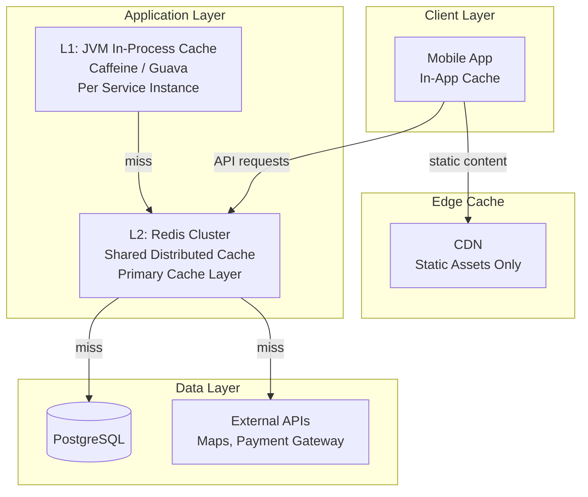

# 09 — Caching Strategy: Ride-Sharing Platform

---

## Objective

Define the multi-layer caching architecture for the ride-sharing platform. Identify what to cache, where, for how long, and critically what NOT to cache. Poor caching decisions in ride-sharing can lead to serving stale driver locations, charging incorrect fares, or showing outdated trip status — all of which directly impact revenue, safety, and user trust.

---

## 1. Caching Principles for Ride-Sharing

The fundamental tension in ride-sharing caching:

**Cache too aggressively:** A rider is shown a driver that already accepted another ride. A driver receives a surge multiplier that's outdated. A payment is attempted against an invalidated card token.

**Cache too conservatively:** 250K location reads/writes hit PostgreSQL. Every fare estimate recalculates from scratch. Every matching query hits the database for driver profiles. System dies under load.

**The right approach:** Cache per data freshness requirement, not per ease of implementation.

| Data Type | Freshness Requirement | Cache TTL |
|---|---|---|
| Driver live position | < 5 seconds (stale = wrong route shown to rider) | 30 seconds in Redis |
| Driver availability status | < 2 seconds | 60 seconds (TTL as liveness signal) |
| Surge multiplier | < 90 seconds | 90 seconds |
| Fare estimate (quote) | 5 minutes (hard expiry) | 300 seconds |
| ETA | < 30 seconds (traffic changes fast) | 20 seconds |
| Driver profile (name/photo) | Hours (profile rarely changes) | 4 hours |
| Rider profile | Hours | 4 hours |
| Pricing policy (base rates) | Days (changes only via config) | 24 hours |
| City boundaries | Weeks | 7 days |
| Trip status (active trip) | Real-time | Not cached in read cache — use event push |

---

## 2. Cache Architecture Overview



---

## 3. Redis GEO Cache: Driver Live Locations

This is not a traditional "cache" — it IS the primary store for driver locations. Redis GEO is the system of record for real-time driver positions because PostgreSQL cannot serve this use case.

### 3.1 Data Structure

```
Key: driver_locations:{city_id}
Type: Redis Sorted Set (GEO internally)
Operations:
  GEOADD driver_locations:BLR 77.5946 12.9716 "driver_uuid"  (write)
  GEORADIUS driver_locations:BLR 77.5946 12.9716 5 km ASC COUNT 20  (proximity query)
  ZREM driver_locations:BLR "driver_uuid"  (remove on offline)
TTL: No per-key TTL (managed by background sweeper)
```

### 3.2 Stale Driver Detection

Since Redis GEO doesn't support per-member TTL, stale drivers are detected via a separate heartbeat sorted set:

```
Key: driver_heartbeat:{city_id}
Type: Sorted Set (score = last update timestamp as Unix epoch)

ZADD driver_heartbeat:BLR 1716120000 "driver_uuid"  (update on each ping)

// Stale detection (runs every 30 seconds):
ZRANGEBYSCORE driver_heartbeat:BLR 0 (now - 60)  → stale drivers
For each stale driver:
  ZREM driver_locations:BLR driver_uuid
  ZREM driver_heartbeat:BLR driver_uuid
  DEL driver_availability:driver_uuid
  Publish DriverWentOffline event to Kafka
```

**TTL of 60 seconds for staleness** means: if a driver's app crashes or loses network for 60 seconds, they are automatically removed from the matchable pool. This prevents the "ghost driver" problem where a driver appears available but their app is dead.

---

## 4. Driver Availability State Cache

```
Key: driver_availability:{driver_id}
Type: Hash
TTL: 120 seconds (refreshed on every location update)

Fields:
  status: "AVAILABLE"
  city_id: "BLR"
  vehicle_type: "ECONOMY"
  vehicle_id: "uuid"
  rating: "4.85"
  acceptance_rate: "0.87"
  current_trip_id: ""
  last_update: "2026-05-17T10:00:00Z"
```

**Why cache rating and acceptance_rate here?**
The Matching Service's ranking algorithm needs these for every matching query. Without caching, each matching attempt would trigger a PostgreSQL lookup for every driver candidate. With caching, ranking 20 candidates takes ~1ms (in-memory hash lookups).

**Cache invalidation:**
- Rating updated → invalidate and rewrite `driver_availability:{driver_id}` hash
- Driver assigned to trip → `HSET driver_availability:{id} status ON_TRIP current_trip_id {trip_id}`
- Invalidation is event-driven: DriverRatingUpdated, DriverAssigned events trigger cache writes

---

## 5. Surge Multiplier Cache

Surge data is read by every fare estimate request and every matching operation. It changes every 60 seconds but tolerates 90 seconds of staleness.

```
Key: surge:{city_id}:{zone_id}
Type: String (JSON value)
TTL: 90 seconds

Value:
{
  "multiplier": 1.8,
  "zone_name": "Koramangala",
  "demand_count": 145,
  "supply_count": 32,
  "effective_from": "2026-05-17T10:00:00Z",
  "expires_at": "2026-05-17T10:01:30Z"
}
```

**Multi-level caching for surge:**

```
1. JVM In-Process Cache (Caffeine):
   - TTL: 30 seconds
   - Size: all zones for the city handled by this pod (typically 20-50 entries)
   - Prevents Redis calls on every fare estimate (which can be 30/min per user)
   
2. Redis (L2):
   - TTL: 90 seconds
   - Shared across all service instances
   - Source of truth for current surge
   
3. PostgreSQL:
   - Stores historical surge data for analytics
   - NOT read during real-time operations
```

**Cache warming:** When a Pricing Service instance starts, it pre-loads all active city zone surge multipliers into its JVM cache on startup. This prevents a cold-start spike of Redis calls.

---

## 6. Fare Quote Cache

A fare quote is valid for 5 minutes. It should be cached to:
1. Serve identical requests quickly (user taps "Get estimate" multiple times)
2. Validate that the quote hasn't expired when the trip is confirmed

```
Key: quote:{quote_id}
Type: Hash
TTL: 300 seconds (5 minutes, hard expiry)

Fields:
  rider_id: "uuid"
  pickup_lat: "12.9716"
  pickup_lng: "77.5946"
  destination_lat: "12.9534"
  destination_lng: "77.5660"
  vehicle_type: "ECONOMY"
  fare_min: "145"
  fare_max: "175"
  surge_multiplier: "1.8"
  city_id: "BLR"
  expires_at: "2026-05-17T10:05:00Z"
  was_used: "false"
```

**When a trip is confirmed against this quote:**
1. Check if key exists (TTL may have expired)
2. If `was_used = true`, reject (cannot use quote twice)
3. If exists and unused, set `was_used = true` atomically (`HSETNX`)
4. Use the locked `surge_multiplier` from the quote for final fare calculation

---

## 7. ETA Cache

ETA calculation requires a Maps API call (Google Maps Directions API / HERE API). These external calls:
- Add 100-300ms latency
- Cost money (per API call)
- Have rate limits

```
Key: eta:{driver_id}:{pickup_h3_index}
Type: String (integer seconds)
TTL: 20 seconds

Value: "180"  (180 seconds = 3 minutes)
```

**Why H3 hex index as part of key instead of exact coordinates?**
Exact lat/lng creates infinitely many unique keys — cache hit rate would be near 0%. Using H3 resolution 9 (~100m hexagon) buckets nearby points together. Two drivers 50 meters apart get the same ETA cache key — accurate enough.

**ETA cache invalidation:** TTL-based only. Traffic changes quickly; 20 seconds is the maximum tolerable staleness for ETA display. After TTL, the next request recomputes via Maps API.

---

## 8. Driver and Rider Profile Cache

Profile data is stable. Caching saves database reads on every trip status fetch, every matching operation (for displaying driver name/photo to rider).

```
// Driver Profile Cache
Key: driver_profile:{driver_id}
Type: Hash
TTL: 4 hours (14400 seconds)

Fields:
  full_name: "Ramesh Kumar"
  phone_number: "+91-9876543210"
  profile_photo_url: "https://cdn.rideshare.com/drivers/uuid.jpg"
  rating: "4.85"
  total_trips: "1247"
  vehicle_make: "Honda"
  vehicle_model: "Amaze"
  vehicle_color: "White"
  vehicle_plate: "KA01AB1234"
  vehicle_type: "ECONOMY"
```

**Cache invalidation events:**
- `DriverProfileUpdated` event → `DEL driver_profile:{driver_id}` on next read (lazy eviction)
- Rating update → `HSET driver_profile:{id} rating {new_value}` (targeted update, no full eviction)

**L1 in-process cache:**
Trip Service frequently displays driver info to riders. With JVM Caffeine cache (TTL=30 seconds, max 10,000 entries):
- 30-second window: all active trip driver info is in-process
- No Redis call for the duration of the driver's current trip
- After 30 seconds, refreshed from Redis

---

## 9. Session and Token Cache

```
// JWT Revocation List (for logout or security revocation)
Key: revoked_token:{jti}
Type: String
TTL: Remaining token lifetime (usually < 15 minutes for access tokens)
Value: "1" (presence is enough; value doesn't matter)

// Refresh Token Store
Key: refresh_token:{token_hash}
Type: Hash
TTL: 30 days
Fields:
  user_id: "uuid"
  role: "RIDER"
  device_fingerprint: "hash"
  issued_at: "..."
  last_used_at: "..."
  is_revoked: "false"
```

---

## 10. Active Trip State Cache

Active trips are read constantly (200K concurrent trips × 2 reads/sec = 400K reads/sec). PostgreSQL cannot serve 400K reads/sec without heavy connection pooling. Cache active trip state in Redis.

```
Key: trip:{trip_id}
Type: Hash
TTL: 4 hours (covers any possible trip duration + buffer)

Fields:
  status: "IN_PROGRESS"
  rider_id: "uuid"
  driver_id: "uuid"
  driver_lat: "12.9716"
  driver_lng: "77.5946"
  pickup_lat: "12.9850"
  pickup_lng: "77.5900"
  destination_lat: "12.9534"
  destination_lng: "77.5660"
  otp: "4821"
  started_at: "2026-05-17T10:00:00Z"
  surge_multiplier: "1.8"
```

**Read path for `GET /v1/trips/{trip_id}`:**
1. Check Redis `trip:{trip_id}` hash → 99% cache hit during active trip
2. On miss: read from PostgreSQL, write to Redis, return result
3. On trip completion: update status in Redis immediately, then DB
4. On trip archival (>24h completed): DEL from Redis

**Cache consistency concern:** The trip hash in Redis must stay consistent with PostgreSQL. Solution: always write to PostgreSQL first (source of truth), then update Redis. If Redis write fails, the next read will miss and re-populate from PostgreSQL.

---

## 11. Pricing Policy Cache

Pricing policies (base fares, per-km rates, per-minute rates) are configured per city and change rarely.

```
Key: pricing_policy:{city_id}:{vehicle_type}
Type: Hash
TTL: 86400 seconds (24 hours)

Fields:
  base_fare: "40"
  per_km_rate: "12.5"
  per_min_rate: "1.5"
  platform_fee: "10"
  minimum_fare: "50"
  currency: "INR"
```

**Cache invalidation:** When pricing policy is updated (admin action), publish `PricingPolicyUpdated` event. All Pricing Service instances subscribe and `DEL` + reload their local cache.

---

## 12. What NOT to Cache

| Data | Why NOT to Cache |
|---|---|
| Trip state machine transitions | Strong consistency required. Caching state would allow stale reads that permit invalid transitions (e.g., completing an already-cancelled trip). Always read trip status from PostgreSQL for write operations. |
| Payment status during processing | If payment is being retried, you cannot serve a cached "pending" state to a "completed" request. Read payment status from PostgreSQL for any payment-related decisions. |
| Driver active trip assignment | The constraint "driver can only be on one trip" is enforced by the DB partial unique index. Caching this would bypass the DB safety check. The Redis `driver_availability` hash is updated, but the trip assignment lock is always validated at DB level. |
| OTP codes after use | Once an OTP is verified, it must be invalidated. Caching used OTPs risks replays. Delete from Redis immediately on verification. |
| User financial balance | Earnings balance or wallet balance can change while a request is in flight. Always read from PostgreSQL for financial operations. |

---

## 13. Cache Invalidation Strategy Summary

| Cache | Invalidation Strategy | Mechanism |
|---|---|---|
| Driver position (GEO) | TTL + background sweeper | 60s TTL on heartbeat; sweeper removes stale |
| Driver availability | TTL (auto-liveness) + event-driven updates | Event: DriverAssigned, DriverWentOffline |
| Surge multiplier | TTL (90s) | Surge Engine rewrites on recalculation |
| Fare quote | TTL (300s) + one-time use flag | HSETNX was_used on trip confirmation |
| Driver/Rider profile | Event-driven (write-through) | ProfileUpdated event → cache invalidation |
| Active trip state | Write-through + TTL | Trip Service writes DB + Redis on every transition |
| JWT revocation | TTL (token expiry) | Added on logout/suspension |
| Pricing policy | Event-driven | PricingPolicyUpdated event → invalidate all shards |

---

## 14. Cache Failure Modes and Fallbacks

| Failure | Degraded Behavior | Recovery |
|---|---|---|
| Redis cluster down | Fare estimates slower (DB fallback), matching slower | Redis auto-failover to replica; service degrades gracefully |
| JVM cache miss spike (pod restart) | Burst of Redis reads on pod startup | Cache warming on startup; pre-load frequently accessed keys |
| Stale surge multiplier (Redis partitioned) | Riders get old surge data (up to 90s) | Acceptable; surge changes gradually |
| Location cache miss (no drivers in Redis) | Empty results returned; riders see "no drivers" | Driver re-connects; next heartbeat repopulates |

**Circuit breaker on cache:** If Redis latency exceeds 50ms P99, fall back to PostgreSQL for profile data. Location data cannot fall back to PostgreSQL (too slow) — instead, the service returns empty/last-known results.

---

## Interview-Level Discussion Points

- **"Why don't you cache trip status for the `GET /v1/trips/{id}` endpoint?"** There are two different reads: the display read (rider checking status) and the write-precondition read (service checking current status before a transition). The display read CAN use the Redis hash cache. But ANY state transition MUST read from the PostgreSQL primary to avoid race conditions. If you cache state for writes, two drivers could both check the same trip status cache, see "REQUESTED", and both try to accept — resulting in a race.
- **"How do you handle the thundering herd problem when Redis restarts?"** On Redis restart, all caches are cold. Every request misses and hits PostgreSQL. Solutions: (1) Pre-warm cache before serving traffic (run a cache-warmer job that populates popular keys from DB). (2) Probabilistic early expiration (PER): instead of all keys expiring simultaneously, add random jitter to TTLs so caches warm up gradually. (3) Singleflight pattern: if 1,000 requests arrive for the same uncached key, only ONE reads from DB; others wait for that one result. This is implemented in the application layer.
- **"Should you use Redis Cluster or Redis Sentinel for this system?"** Redis Cluster for location data (horizontal sharding by city — data too large for one node). Redis Sentinel for profile cache and trip state (high availability failover without sharding — data fits in one node but needs automatic failover). The two use cases have different requirements.
- **"What is the cache hit rate target for fare estimates?"** The same rider rarely requests the exact same route within the 5-minute TTL. Cache hit rate for fare estimates might be only 20-30%. But that's fine — the purpose of the quote cache is to ensure idempotent quote delivery (same quote_id → same result), not primarily for performance. The surge multiplier cache (hit rate > 99%) is the performance win.
- **"How do you prevent cache poisoning where an attacker writes bad data to Redis?"** Redis should never be directly accessible from the internet or from untrusted services. In Kubernetes: Redis is in an internal namespace with NetworkPolicy allowing only authorized services. Authentication: Redis AUTH password for all connections. TLS: All connections to Redis use TLS. Cache writes only happen through application code (no direct Redis writes from client apps). Monitor for unusual write patterns.
