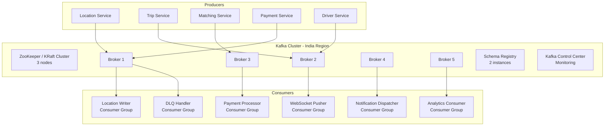
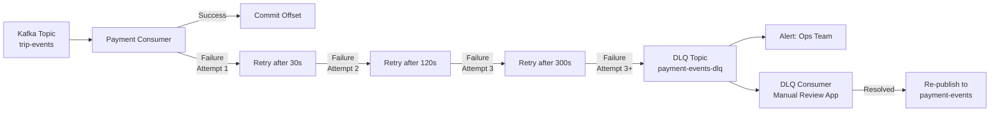

# 10 — Message Queue Design: Ride-Sharing Platform

---

## Objective

Design the complete Apache Kafka-based messaging infrastructure for the ride-sharing platform. Define topic architecture, partition strategy, consumer group design, message schema, backpressure handling, dead letter queue strategy, and exactly-once semantics for payment-critical flows. Kafka is the central nervous system connecting all microservices.

---

## 1. Why Kafka (Not RabbitMQ, Not SQS)

| Requirement | Kafka | RabbitMQ | AWS SQS |
|---|---|---|---|
| 250K msg/sec location stream | Native (log-append, zero-copy) | Struggles > 50K/sec | High cost at this volume |
| Multiple independent consumers (analytics + pusher + matching) | Consumer Groups (each reads independently) | Message consumed and gone | One consumer per message (need multiple queues) |
| Message replay on consumer failure | Retained on disk (configurable) | Message deleted after ack | 14-day retention max |
| Ordered processing per trip | Partition key = trip_id | Manual exchange routing | FIFO queues (limited) |
| Stream processing (Flink/Spark) | First-class integration | Not designed for streams | Polling-based (high latency) |
| Schema evolution at scale | Confluent Schema Registry | No built-in registry | No registry |
| Sub-millisecond producer latency | Yes | Yes | ~50ms SQS publish latency |

**Verdict:** Kafka is the right choice because of the high-throughput location stream, multi-consumer fan-out requirement, and the need for message replay on consumer failure. RabbitMQ would fail at location stream volumes.

---

## 2. Kafka Cluster Architecture



---

## 3. Topic Design Reference

### 3.1 driver-location-updates

| Property | Value |
|---|---|
| Partitions | 200 |
| Replication Factor | 3 |
| Retention | 1 hour (location data is real-time only) |
| Cleanup Policy | delete (time-based) |
| Compression | LZ4 |
| Max Message Size | 2 KB |
| Partition Key | city_id (then driver_id as secondary hash) |
| Throughput | 250,000 msg/sec (50 MB/sec) |

**Consumer Groups:**

| Consumer Group | Instances | Processing | SLA |
|---|---|---|---|
| location-redis-writer | 200 (one per partition) | GEOADD to city Redis shard | < 100ms lag |
| websocket-pusher | 50-200 (HPA) | Push to rider WebSocket for active trips only | < 1s lag |
| eta-recalculator | 20-50 | Recalculate ETA for in-progress trips | < 5s lag |
| analytics-location-sink | 20 | Batch write to S3 Parquet (data lake) | < 60s lag |

**Key design decision — Why partition by `city_id` and not `driver_id`?**

The WebSocket pusher consumer needs to push location updates only for drivers who are on active trips. If partitioned by driver_id, the consumer would need to consume ALL partitions to check if each driver has an active trip. Partitioned by city_id, each consumer handles one city's drivers and maintains a local set of "active trip driver IDs" for that city — reducing processing overhead dramatically.

### 3.2 trip-events

| Property | Value |
|---|---|
| Partitions | 50 |
| Replication Factor | 3 |
| Retention | 7 days |
| Cleanup Policy | delete |
| Compression | Snappy |
| Partition Key | trip_id |

**Event types on this topic (ordered by occurrence):**
```
TripCreated → TripMatchingStarted → DriverOfferSent → DriverMatched →
DriverArrived → TripStarted → TripCompleted | TripCancelled | TripDisputed
```

**Why `trip_id` as partition key?**
All events for a single trip must arrive in order at the same partition. This guarantees that the Payment Service sees `TripCompleted` only after `TripStarted`, and the Analytics Service can reconstruct the complete trip funnel for each trip.

**Consumer Groups:**

| Consumer Group | Action on Event |
|---|---|
| payment-processor | On `TripCompleted`: initiate charge |
| payment-processor | On `TripCancelled`: issue refund if cancellation fee applies |
| notification-dispatcher | On every event: send appropriate push/SMS |
| driver-status-updater | On `DriverMatched`: mark driver ON_TRIP in Redis; on `TripCompleted/Cancelled`: mark AVAILABLE |
| rating-prompt-service | On `TripCompleted`: schedule rating prompt after 5 minutes |
| analytics-trip-sink | On every event: write to ClickHouse trip_events table |

### 3.3 matching-events

| Property | Value |
|---|---|
| Partitions | 20 |
| Replication Factor | 3 |
| Retention | 24 hours |
| Partition Key | trip_id |

**Event types:**
```
RideRequested → DriverOfferSent → DriverOfferAccepted | DriverOfferRejected |
DriverOfferExpired → DriverMatched | MatchingFailed
```

The Matching Service itself consumes from this topic for the retry loop:
- `DriverOfferRejected` → re-enter matching with next candidate
- `DriverOfferExpired` → re-enter matching with next candidate or expanded radius
- `MatchingFailed` → publish to trip-events as `TripCancelled`

### 3.4 payment-events

| Property | Value |
|---|---|
| Partitions | 20 |
| Replication Factor | 3 |
| Retention | 30 days (financial records) |
| Cleanup Policy | delete |
| Min In-Sync Replicas | 2 (stronger durability for financial events) |
| `acks` on Producer | all (wait for all ISR replicas to confirm) |
| Partition Key | rider_id (for ordered payment history per rider) |

**Why `acks=all` for payment events?**
A payment event that is lost means a driver doesn't get paid and a rider doesn't get a receipt. The 2-3ms extra latency for `acks=all` is worth the guarantee. Location updates tolerate `acks=1` (losing one position update is imperceptible); payments do not.

**Consumer Groups:**

| Consumer Group | Action |
|---|---|
| driver-earnings-updater | On `PaymentCaptured`: credit driver earnings ledger |
| notification-dispatcher | On `PaymentCaptured`: send receipt to rider; earnings notification to driver |
| analytics-payment-sink | On all events: revenue metrics, chargeback tracking |
| payout-scheduler | On `PaymentCaptured`: add driver to daily payout batch |

### 3.5 notification-triggers

| Property | Value |
|---|---|
| Partitions | 20 |
| Replication Factor | 3 |
| Retention | 24 hours |
| Partition Key | user_id |

**This topic is a fan-in aggregation** — the Notification Service subscribes to multiple other topics (trip-events, payment-events, matching-events) AND this dedicated topic. Direct-to-notification events (e.g., admin broadcast, promotional messages) go here.

### 3.6 analytics-raw

| Property | Value |
|---|---|
| Partitions | 100 |
| Replication Factor | 3 |
| Retention | 14 days |
| Purpose | All events from all topics mirrored here for Spark/Flink batch processing |

A **Kafka Streams application** or **MirrorMaker** replicates all topics to `analytics-raw`. Data scientists and analysts consume from this single topic rather than subscribing to 5+ topics individually.

---

## 4. Dead Letter Queue (DLQ) Design



**DLQ Topics:**

| Source Topic | DLQ Topic | Consumer | Trigger |
|---|---|---|---|
| trip-events | trip-events-dlq | Ops dashboard | Payment failure after 3 retries |
| payment-events | payment-events-dlq | Ops dashboard | Earnings credit failure |
| notification-triggers | notification-triggers-dlq | Low priority | Push delivery failure after 5 retries |

**DLQ Message Envelope:**
```json
{
  "original_topic": "trip-events",
  "original_partition": 12,
  "original_offset": 48372,
  "failed_at": "2026-05-17T10:00:00Z",
  "failure_reason": "PAYMENT_GATEWAY_TIMEOUT",
  "retry_count": 3,
  "original_payload": {
    "event_type": "TripCompleted",
    "trip_id": "uuid",
    "rider_id": "uuid",
    "final_fare": 16500
  }
}
```

---

## 5. Exactly-Once Semantics for Payment

Standard Kafka delivers messages **at-least-once** (a message can be re-delivered on consumer restart). For payment processing, this would mean double-charging a rider.

**Solution: Application-level idempotency + Kafka transactions (not just at-least-once)**

### Layer 1: Kafka Idempotent Producer

```
Producer config:
  enable.idempotence = true
  acks = all
  max.in.flight.requests.per.connection = 5
```

This ensures the producer never sends a duplicate message to Kafka due to retries (broker deduplicates via sequence numbers).

### Layer 2: Kafka Transactional Producer (for Outbox pattern)

Payment Service uses the Outbox Pattern:

```
Within a single PostgreSQL transaction:
  1. INSERT INTO payments (trip_id, amount, status='PENDING', idempotency_key=trip_id)
  2. INSERT INTO payment_outbox (event payload, published=false)
  COMMIT;

Outbox Relay:
  1. SELECT * FROM payment_outbox WHERE published = false FOR UPDATE SKIP LOCKED
  2. Publish to Kafka (within a Kafka transaction: BEGIN → SEND → COMMIT)
  3. UPDATE payment_outbox SET published = true
  4. COMMIT Kafka transaction
```

This guarantees: the payment record and the event are either both persisted or both not — no partial states.

### Layer 3: Consumer Idempotency

Even with transactional production, consumer restarts can re-process messages. The Payment Consumer checks:

```
1. Receive TripCompleted event
2. Check: SELECT count FROM payments WHERE idempotency_key = trip_id
3. If count > 0: already processed → skip (commit offset)
4. If count = 0: process charge
5. INSERT payment record (idempotency_key UNIQUE constraint)
6. Commit Kafka offset
```

If two consumers race (e.g., after rebalance): the UNIQUE constraint on `idempotency_key` means only one succeeds. The other gets a unique constraint violation, treats it as "already processed", and moves on.

---

## 6. Backpressure and Consumer Lag Management

### 6.1 Location Stream Backpressure

The location stream is the hardest backpressure challenge: 250K msg/sec × consumer processing time.

**Location Writer Consumer (→ Redis):**
```
Per partition throughput: 250K ÷ 200 partitions = 1,250 msg/sec
Redis GEOADD: ~5ms for batch of 10
Batch of 10 updates per poll: 1,250 ÷ 10 = 125 Redis calls/sec per partition
Consumer count: 1 per partition = 200 consumers
If lag grows: consumer is too slow → GEOADD taking too long → Redis is under pressure
Resolution: Pipeline Redis commands (batch GEOADD), add Redis replica reads
```

**WebSocket Pusher Consumer:**
```
Only pushes updates for ACTIVE TRIP drivers (not all drivers)
200K active trips ÷ 200 partitions = 1,000 active trips per partition
Not all partitions have active trips; distributes naturally
If lag grows: add more consumer instances (HPA)
Lag threshold alert: > 2 seconds → PagerDuty alert
```

### 6.2 Kafka Consumer Lag Monitoring

```
Alert thresholds by topic:
  driver-location-updates / location-redis-writer: lag > 5,000 msgs → P1 alert
  driver-location-updates / websocket-pusher: lag > 30,000 msgs (> 2s) → P1 alert
  trip-events / payment-processor: lag > 100 msgs → P2 alert
  payment-events / notification-dispatcher: lag > 500 msgs → P3 alert

Monitoring:
  Prometheus + kafka_exporter for consumer_lag metrics
  Grafana dashboards: lag heatmap per consumer group and partition
  Auto-remediation: HPA triggers on lag metric via KEDA (Kubernetes Event-driven Autoscaling)
```

### 6.3 KEDA for Kafka-driven Autoscaling

KEDA (Kubernetes Event-Driven Autoscaling) scales consumer pods based on Kafka lag:

```
ScaledObject for websocket-pusher:
  trigger: kafka consumer lag for group "websocket-pusher"
  lag threshold per replica: 10,000 messages
  min replicas: 20
  max replicas: 200
  
Effect: if total lag = 500,000 messages, scale to 50 replicas (500K ÷ 10K)
```

This is superior to CPU-based HPA for Kafka consumers, whose CPU may not correlate with lag (a slow downstream can cause high lag with low CPU).

---

## 7. Message Schema Design

### 7.1 Using Avro + Confluent Schema Registry

All Kafka messages use **Apache Avro** serialization with **Confluent Schema Registry**:

- Avro schemas are registered before a new event type is produced
- Consumers reference the schema ID embedded in the message header
- Schema evolution follows compatibility rules (BACKWARD, FORWARD, FULL)

**Example: TripCompleted Avro Schema**

```avro
{
  "namespace": "com.rideshare.events",
  "type": "record",
  "name": "TripCompleted",
  "doc": "Published when a driver marks a trip as ended",
  "fields": [
    {"name": "event_id", "type": "string", "doc": "UUID"},
    {"name": "schema_version", "type": "string", "default": "1.2"},
    {"name": "trip_id", "type": "string"},
    {"name": "rider_id", "type": "string"},
    {"name": "driver_id", "type": "string"},
    {"name": "vehicle_id", "type": "string"},
    {"name": "city_id", "type": "string"},
    {"name": "final_fare", "type": "long", "doc": "Amount in minor currency units"},
    {"name": "currency", "type": "string", "default": "INR"},
    {"name": "surge_multiplier", "type": {"type": "bytes", "logicalType": "decimal", "precision": 3, "scale": 2}},
    {"name": "actual_distance_km", "type": "float"},
    {"name": "actual_duration_min", "type": "int"},
    {"name": "payment_method_id", "type": "string"},
    {"name": "started_at", "type": {"type": "long", "logicalType": "timestamp-millis"}},
    {"name": "ended_at", "type": {"type": "long", "logicalType": "timestamp-millis"}},
    {"name": "route_polyline", "type": ["null", "string"], "default": null, "doc": "Optional; large field"}
  ]
}
```

### 7.2 Schema Evolution Rules

| Change Type | Compatibility | Example |
|---|---|---|
| Add optional field with default | BACKWARD safe | Adding `pickup_h3_index` with null default |
| Remove optional field | FORWARD safe | Removing deprecated `route_polyline_v1` |
| Change field type | FULL BREAKING | int → long — requires new schema version |
| Rename field | BREAKING | Must add new field + deprecation period |

---

## 8. Kafka Security Configuration

| Security Layer | Configuration |
|---|---|
| Encryption in transit | TLS 1.3 for all client-broker and broker-broker communication |
| Authentication | SASL/SCRAM-SHA-512 per service identity |
| Authorization | Kafka ACLs: each service allowed only on its own topics |
| Producer permission | `WRITE` on producer's topics only |
| Consumer permission | `READ` on consumed topics + `READ` on consumer group |
| Admin operations | Restricted to platform team only |

**Example ACL:**
- Payment Service: WRITE on `payment-events`, READ on `trip-events` topic
- Notification Service: READ on `trip-events`, `payment-events`, `notification-triggers`
- Analytics: READ on `analytics-raw` only

---

## 9. Kafka vs. Redis Pub/Sub Decision Matrix

| Use Case | Kafka | Redis Pub/Sub |
|---|---|---|
| Location update stream (250K/sec, multi-consumer) | Kafka (retention, multiple consumer groups) | Redis can't guarantee delivery at this scale |
| WebSocket push routing (high-frequency, ephemeral) | Redis Pub/Sub (ultra-low latency, ephemeral) | Kafka adds 5-50ms latency per message |
| Trip lifecycle events | Kafka (durable, replay needed) | Redis pub/sub: message lost if no subscriber |
| Payment events | Kafka (durability, exactly-once) | Never Redis for financial events |
| Driver offer notification (<15s window) | Both: Kafka produces → Redis pub/sub delivers | Direct Redis to WebSocket server for speed |

**The hybrid:** Trip events and payment events use Kafka for durability. Real-time WebSocket push for driver location uses Redis Pub/Sub as the final delivery mechanism (Kafka consumer → Redis Pub/Sub → WebSocket server → client). This gives the best of both worlds: Kafka durability for the stream, Redis latency for the last mile.

---

## Interview-Level Discussion Points

- **"Why 200 partitions for location updates? Isn't that over-engineered?"** 250K msg/sec ÷ 200 partitions = 1,250 msg/sec per partition. A single Kafka partition can handle ~50K msg/sec in practice. So 200 partitions gives 40x headroom. But the driver is partition count = consumer count (one thread per partition). With 10 cities having 20K+ drivers, you need enough partitions for each city to have multiple partitions. 200 is the right order of magnitude for city-based routing with horizontal scale headroom.
- **"What happens if the Kafka cluster goes down?"** Services degrade gracefully: (1) Location Service continues writing to Redis GEO (direct write, Kafka is async). (2) Trip Service stops emitting events; payment is deferred via the Outbox pattern (events queue in DB). (3) Notification Service stops receiving events; notifications are delayed. (4) Matching still works (uses Redis for driver location; Kafka is for event routing). (5) On Kafka recovery, services catch up from their last committed offset. The design ensures Kafka outage is a degraded experience, not a complete outage.
- **"How do you handle message ordering guarantees for trip events?"** Kafka guarantees order within a partition. By using `trip_id` as the partition key, all events for a trip land on the same partition and are processed in order. Cross-trip ordering (event from trip A vs. trip B) is not guaranteed and not needed. Within-partition ordering ensures: you'll never see `TripCompleted` before `TripStarted` for the same trip.
- **"What's the risk of at-least-once delivery in matching events?"** If a `DriverOfferSent` event is re-delivered, the Matching Service might send a duplicate offer to the driver. The driver would receive two FCM pushes for the same ride. Mitigation: the Matching Service checks Redis before sending an offer — `EXISTS offer_lock:driver_id:trip_id`. The offer lock is set when the first offer is processed. Duplicate events find the lock already set and no-op. This pattern (idempotent consumer via Redis lock check) handles at-least-once safely.
- **"When would you move away from Kafka?"** At Uber's scale (millions of events/sec globally), they moved to a combination of Kafka for durability and Flink for stream processing, with custom high-throughput dispatch systems for real-time notifications. If notification latency becomes critical (< 100ms for driver offers), a dedicated message bus (Apache Pulsar, or custom gRPC streaming) may replace Kafka for the notification path while keeping Kafka for durability/analytics.
