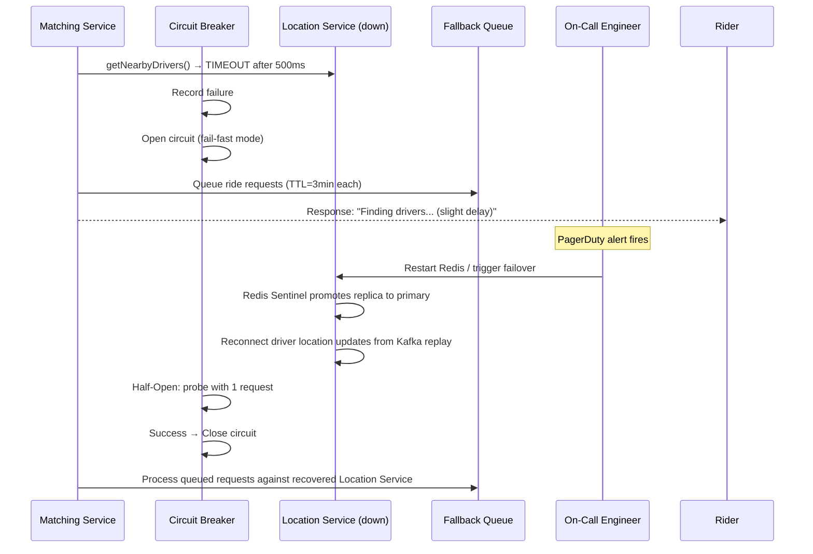
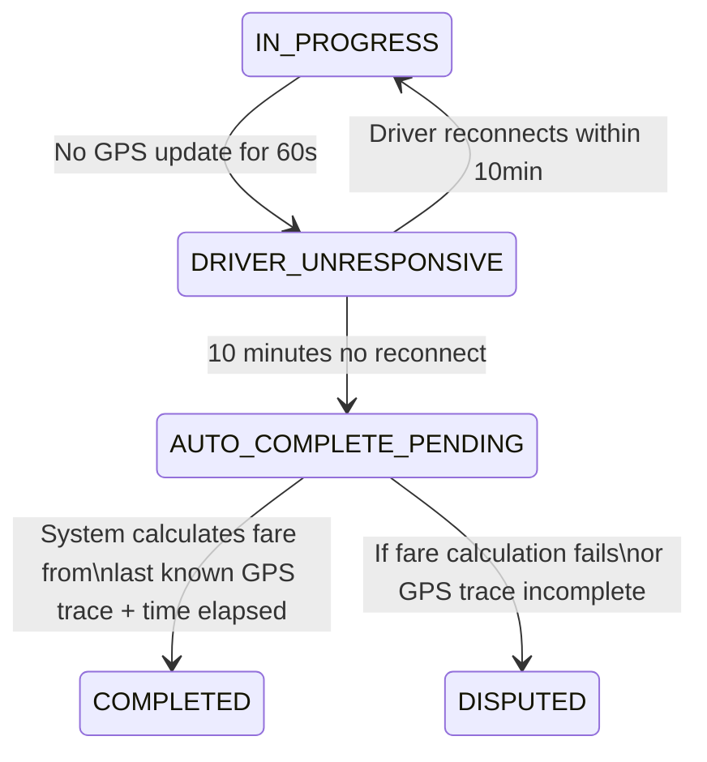
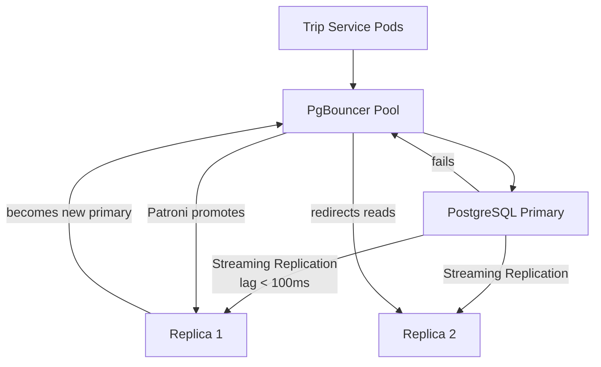

# 11 — Failure Scenarios: Ride-Sharing Platform

---

## Objective

Systematically analyze failure modes, their blast radius, detection strategies, and recovery procedures for the ride-sharing platform. In ride-sharing, failures are not just technical annoyances — they strand riders, strand drivers mid-route, cause financial losses, and can impact physical safety. Production-grade failure analysis is non-negotiable.

---

## 1. Failure Classification Framework

```mermaid
graph TD
    F[Failures] --> INF[Infrastructure Failures]
    F --> SVC[Service Failures]
    F --> DATA[Data Failures]
    F --> NET[Network Failures]
    F --> EXT[External Dependency Failures]
    F --> BIZ[Business Logic Failures]

    INF --> DB_FAIL[Database Primary Failure]
    INF --> REDIS_FAIL[Redis Cluster Failure]
    INF --> KAFKA_FAIL[Kafka Broker Failure]
    INF --> K8S_FAIL[Kubernetes Node Failure]

    SVC --> LS_FAIL[Location Service Down]
    SVC --> MS_FAIL[Matching Service Down]
    SVC --> PAY_FAIL[Payment Service Down]
    SVC --> TS_FAIL[Trip Service Down]

    DATA --> CORRUPT[Data Corruption]
    DATA --> PARTITION[DB Partition Split]

    NET --> TIMEOUT[Inter-Service Timeout]
    NET --> PARTITION_NET[Network Partition]

    EXT --> MAPS_FAIL[Maps API Failure]
    EXT --> PGW_FAIL[Payment Gateway Failure]
    EXT --> SMS_FAIL[SMS Gateway Failure]

    BIZ --> GHOST_DRIVER[Ghost Driver Problem]
    BIZ --> DOUBLE_MATCH[Double Assignment]
    BIZ --> TRIP_ORPHAN[Orphaned In-Progress Trip]
```



---

## 2. Scenario: Location Service Outage

### Context
The Location Service (Redis GEO) becomes unavailable due to Redis cluster failure or Location Service pod crash.

### Blast Radius
- **Matching is broken:** New ride requests cannot find nearby drivers → no new matches
- **Real-time tracking breaks:** Rider cannot see driver moving on map
- **ETA becomes stale:** Last known position used; updates stop

### What Is NOT Affected
- Active trips in progress (Trip Service continues; OTP already verified)
- Payment processing (uses trip data, not location)
- Rider trip history
- Driver going offline (cached state in PostgreSQL as fallback)

### Detection
- Prometheus alert: `location_service_error_rate > 5%` for 30 seconds
- Kafka consumer lag alert: `location-redis-writer consumer lag > 10,000 msgs`
- Matching Service circuit breaker opens → alert fires

### Recovery Procedure



**Fallback strategy:**
1. Short-term (< 30s): Use last known driver positions (stale by up to 30s) — acceptable for initial radius query
2. Medium-term (30s–2min): Queue incoming ride requests with TTL; serve them when Location Service recovers
3. Long-term (> 2min): Return "No drivers available — please try again" and cancel pending requests with refund

---

## 3. Scenario: Matching Service Timeout

### Context
Matching Service pods are overloaded or slow; matching queries exceed the 3-second SLO.

### Blast Radius
- **Riders wait longer for driver assignment** — degraded but functional
- **Driver notification delayed** — drivers miss offers
- **Queue builds up** — if sustained, leads to complete matching backlog

### Failure Pattern: Cascade Risk
Matching Service slowness → drivers miss offer timeout → offers expire → Matching retries with wider radius → more Location Service queries → Location Service load increases → Location Service slows → Matching even slower → **cascade collapse**

### Circuit Breaker Configuration

```
Matching Service circuit breaker on Maps API call (ETA calculation):
  Failure threshold: 5 failures in 10 seconds
  Open circuit: Fall back to Haversine distance-based ETA estimate
  Half-open probe: Every 30 seconds
  
Effect: Maps API slowness does not propagate to matching latency
```

### Graceful Degradation Levels

| Degradation Level | Trigger | Behavior |
|---|---|---|
| Normal | All systems healthy | Full matching with ETA |
| Level 1 | Maps API > 500ms P99 | Use cached ETA; skip real-time traffic |
| Level 2 | Location Service > 200ms P99 | Use last-known positions (30s stale acceptable) |
| Level 3 | Matching queue depth > 1000 | Shed new requests; return "high demand, try again" |
| Level 4 | Matching Service completely unavailable | All ride requests queued; no new matches |

---

## 4. Scenario: Payment Failure Mid-Trip

### Context
Trip is COMPLETED, fare is calculated, but the payment gateway returns an error (card decline, gateway timeout, network error).

### Why This Is a Distributed Transaction Problem

```
Trip Service: trip.status = COMPLETED ✓ (committed to DB)
Payment Service: charge_rider() → FAILED ✗

Now the system is in an inconsistent state:
  - Driver expects to be paid
  - Rider expects to be charged
  - Trip is marked complete
  - Payment didn't happen
```

### Recovery Flow: Deferred Charge Pattern

```mermaid
sequenceDiagram
    participant TS as Trip Service
    participant KF as Kafka
    participant PAY as Payment Service
    participant PGW as Payment Gateway
    participant NS as Notification Service

    TS->>TS: Trip COMPLETED (fare = ₹165)
    TS->>KF: publish TripCompleted
    KF->>PAY: consume TripCompleted
    PAY->>PGW: charge(card_token, ₹165, idempotency_key=trip_id)
    PGW-->>PAY: ERROR: CARD_DECLINED

    PAY->>PAY: record failed attempt; schedule retry in 30s
    PAY->>NS: send push: "Payment failed - please update payment method"

    loop Retry up to 3x
        PAY->>PGW: charge(card_token, ₹165, idempotency_key=trip_id)
        PGW-->>PAY: SUCCESS on attempt 2
    end

    PAY->>KF: publish PaymentCaptured
    NS->>Rider: push receipt
```

**What if all retries fail?**
1. Deferred charge: Payment enters `PENDING_MANUAL_REVIEW` state
2. Rider receives email: "Your trip payment failed. Your account is suspended until resolved."
3. Operations team reviews; may waive (driver error) or escalate to collections
4. Driver still gets paid from a float/insurance pool, then recouped from rider later

**What if driver's app crashes right when we're charging?**
The payment flow is decoupled from driver connectivity via Kafka. Even if the driver's app is offline, payment proceeds asynchronously. Driver opens app later and sees "Trip Completed + Earnings: ₹132".

---

## 5. Scenario: Driver App Crashes During Active Trip

### Context
Driver is transporting a rider. Driver's phone crashes, battery dies, or app is force-closed. The trip is now IN_PROGRESS but the driver stops sending location updates and cannot end the trip.

### Impact
- Rider is in the car but their map shows no driver movement
- Driver cannot mark trip complete (app is dead)
- Trip is "stuck" in IN_PROGRESS state
- Payment never processes

### Detection
```
Signal 1: driver_availability:{driver_id} hash TTL expires (60s no heartbeat)
Signal 2: driver_location for this driver not updated for > 60 seconds during IN_PROGRESS trip
Signal 3: No GPS updates in Kafka for driver for > 60 seconds
```

### Recovery State Machine



**Auto-complete logic:**
- Use the GPS trace captured during the trip (stored in Redis as waypoints during IN_PROGRESS)
- If trip was clearly heading to destination (last GPS point within 500m of destination), auto-complete
- Calculate fare from actual GPS trace distance + elapsed time
- Send push to driver: "Trip auto-completed. Fare: ₹165. Please check earnings."
- Send push to rider: "Your trip has been completed. Fare: ₹165."

**Anti-abuse safeguard:** If the GPS trace shows the driver never actually moved toward the destination (driver stopped after 500m and crashed), the auto-complete calculates fare for actual distance only. This prevents auto-complete from paying a driver for a trip they didn't complete.

---

## 6. Scenario: Database Failover During Active Trips

### Context
PostgreSQL primary crashes during peak hour with 200K active trips.

### PostgreSQL HA Architecture



**Failover time with Patroni:**
- Primary failure detected: 5 seconds (heartbeat TTL)
- Replica promotion: 5–10 seconds
- PgBouncer reconnects: 5 seconds
- Total downtime: ~15–20 seconds

**Impact during failover window (15–20 seconds):**
- Trip state transitions fail (status changes cannot be written)
- New trip requests queue at application layer
- Active trips in IN_PROGRESS continue normally (no DB write needed mid-trip)
- Location updates continue to Redis (unaffected by DB failover)
- Payment processing: in-flight charges fail → retry queue handles them

**Application behavior during failover:**
- Trip Service should use a connection retry loop with exponential backoff
- Status writes are queued in-memory (or Kafka retry topic) for 30 seconds
- After 30 seconds without DB recovery: return 503 Service Unavailable
- Kubernetes readiness probe: Trip Service marks itself unready → API Gateway stops routing new requests to it

---

## 7. Scenario: Network Partition Between Services

### Context
A network partition isolates the Matching Service from the Trip Service. Matching Service assigns a driver, but the write to Trip Service fails.

### The Split-Brain Risk

```
Matching Service (partition side A):
  - Assigns driver_X to trip_Y
  - Notifies driver_X via Notification Service
  - Publishes DriverMatched event to Kafka

Trip Service (partition side B):
  - Cannot consume Kafka (partition cuts Kafka too)
  - driver_X shows up at pickup
  - trip_Y status is still REQUESTED (Trip Service never received the match)
  - Rider's app shows "Looking for driver"
  - Driver's app shows "Head to pickup"
  - INCONSISTENT STATE
```

### Recovery

**If Kafka is also partitioned** (worst case): Events are buffered in Matching Service's local producer buffer. When partition heals, events replay in order to Kafka → Trip Service consumes → state catches up.

**If Kafka is NOT partitioned**: Trip Service was simply slow. Events queue in Kafka. When Trip Service comes back, it processes DriverMatched → state becomes consistent. The driver has already headed to pickup; ETA shows the rider the driver is coming.

**Mitigation design:**
- Trip Service is the source of truth for trip status
- Matching Service does NOT directly tell the rider "driver matched" — it only publishes an event
- The rider's WebSocket update comes from Trip Service (via Kafka consumer) — this ensures the rider only sees "driver matched" after Trip Service has committed the state
- This single writer principle prevents the split-brain from reaching the user

---

## 8. Scenario: Kafka Cluster Failure

### Impact by Service

| Service | Impact | Fallback |
|---|---|---|
| Location Service | Location updates not fanned out to WebSocket pusher | Redis still updated directly; tracking breaks but matching works |
| Matching Service | Match events not delivered to Trip Service | Match results queued locally (in-memory); replay on Kafka recovery |
| Trip Service | Trip events not delivered to Payment Service | Outbox pattern: events stored in DB; replay when Kafka recovers |
| Payment Service | Payment events not delivered to Notification | Polling fallback: check payment_outbox table directly |
| Notification Service | No event-driven triggers | Degraded: no notifications until Kafka recovers |

**Kafka Recovery Strategy:**
- Kafka replication factor = 3; loss of 1 broker is transparent
- Loss of 2 brokers: partition becomes under-replicated → alerts fire → scale-up new brokers
- Zookeeper/KRaft cluster failure: Kafka enters read-only mode → producers cannot write → queue at application layer

**RPO for Kafka:** With ISR (in-sync replicas) = 2, even if 1 broker dies, no message loss. With ISR = 1 (degraded mode), there's a risk of message loss if the last in-sync broker dies. For payment events, min.insync.replicas = 2 is enforced.

---

## 9. Scenario: GPS Spoofing Attack

### Context
A fraudulent driver uses a GPS spoof app to simulate a completed trip route without actually driving.

### Detection Signals

| Signal | Normal Range | Fraudulent Indicator |
|---|---|---|
| Speed between consecutive GPS points | 0–100 km/h | > 180 km/h = impossible |
| GPS accuracy reported by device | 3–30 meters | Always 0.1m = mock GPS |
| Number of turns in route | Depends on route | 0 turns in 10km = straight line fraud |
| Cellular tower changes during trip | Multiple towers | 0 tower changes = static device |
| GPS timestamp monotonicity | Strictly increasing | Timestamps going backward = replayed GPS |
| Trip duration vs. estimated duration | ±30% variance | < 10% of expected = impossibly fast |

### Response Flow

```
1. ML model scores trip GPS trace: fraud_score = 0.92 (high)
2. Trip enters FRAUD_REVIEW state (not immediately flagged to driver)
3. Payment held: driver payout deferred for 24 hours
4. Human reviewer examines GPS trace vs. road network
5. Reviewer decision:
   → FRAUD CONFIRMED: driver account suspended, payment withheld
   → FALSE POSITIVE: payment released with explanation
```

---

## 10. Scenario: Rider No-Show (DRIVER_ARRIVED but rider doesn't come)

### State Transition

```
DRIVER_ARRIVED → (wait up to 10 minutes) → 
  If no TripStarted: 
    system sends push: "Driver waiting — you have 2 minutes before free cancellation window ends"
  At 5 minutes: no-show cancellation fee unlocked (₹50)
  At 10 minutes: Auto-cancel trip, charge no-show fee, release driver
```

### Fair Treatment

- Driver gets the no-show fee as compensation for waiting time
- Rider is notified: "Trip cancelled due to no-show. ₹50 charged."
- If it's the rider's first no-show, a warning is issued (not charged)
- Repeated no-shows → account review → potential suspension

---

## 11. Failure Prevention: Chaos Engineering

At Uber/FAANG scale, failures are expected. Chaos engineering proactively tests resilience.

| Experiment | What It Tests | Frequency |
|---|---|---|
| Kill Location Service pod randomly | Matching fallback to stale positions | Weekly (staging) |
| Inject Redis latency (100ms) | Circuit breaker activation in caching layer | Monthly (staging) |
| Kafka consumer group stop | DLQ and retry mechanism | Monthly (staging) |
| Database failover test | Patroni promotion speed, app reconnection | Quarterly (production, off-peak) |
| Payment gateway 500 errors | Retry and deferred charge flow | Monthly (staging) |
| Network partition between services | Saga compensation flows | Quarterly (staging) |

**Tools:** Chaos Monkey (Netflix OSS), Gremlin, or Litmus for Kubernetes.

---

## 12. Runbook Summary

| Failure | Detection | Recovery Time | Owner |
|---|---|---|---|
| Location Service down | Matching error rate spike | < 5 minutes (Kubernetes restart) | Platform SRE |
| Redis primary failure | Redis sentinel alert | < 2 minutes (auto-failover) | Platform SRE |
| PostgreSQL primary failure | PgBouncer connection errors | < 20 seconds (Patroni) | DB Team |
| Payment gateway down | Payment failure rate > 5% | Retry + deferred; manual resolution | Payments Team |
| Matching service OOM | Pod OOMKilled alert | < 1 minute (K8s restart) | Matching Team |
| Kafka broker down | Under-replicated partition alert | Automatic (new broker provision) | Platform SRE |
| Ghost driver (stale) | Background sweeper | 60 seconds (auto-expire) | Automatic |
| Active trip stuck | Trip heartbeat timeout | 10 minutes (auto-complete) | Automatic + Ops |

---

## Interview-Level Discussion Points

- **"What would break first at 10x traffic?"** The WebSocket layer (400K → 4M connections) and the Redis location cluster (250K → 2.5M writes/sec) would both hit limits. The PostgreSQL Trip Service would see ~50K transitions/sec — manageable with connection pooling and partitioning but would require more read replicas. Matching Service scales easily (stateless, event-driven). Payment Service actually sees less stress than expected because its TPS is transaction-rate-bound, not user-count-bound.
- **"How do you ensure a driver gets paid even if your payment system is down?"** The driver gets paid from a float/reserve fund first (SLA: within 24 hours). The actual charge to the rider is retried asynchronously. The float ensures driver trust — they always see their earnings even if card processing is delayed. This is the "driver-first" reliability guarantee.
- **"How would you handle a data center failure?"** Active-active multi-region for the Location Service and Trip Service (city-scoped, so each region serves its cities independently). For global services like Payment, an active-passive failover with 30-second RPO is acceptable (small number of transactions in the flight window). The 30-second RPO risk is mitigated by the Outbox pattern — events not yet published to Kafka are in the PostgreSQL outbox table, replicated to standby before failover.
- **"What is the ghost driver problem and how do you solve it?"** A ghost driver is a driver who appears available in the Redis GEO set but whose app is actually dead (crashed, network loss). If matched to a ghost driver, the rider's trip offer goes unanswered, waiting for the 15-second timeout. This repeats for other drivers. Prevention: 60-second heartbeat TTL on the availability hash. If no heartbeat arrives within 60 seconds, the driver is automatically removed from the available pool. The background sweeper enforces this every 30 seconds.
- **"How do you handle the case where two Matching Service instances both try to assign the same driver to different trips simultaneously?"** Redis SETNX (Set If Not Exists) is the atomic lock. `SETNX offer_lock:{driver_id} {trip_id}` succeeds for exactly ONE of the two concurrent attempts. The other gets a failure response (key already exists) and picks the next candidate. This prevents double-assignment at the cost of slightly less optimal matching (the second trip may get its second-choice driver). SETNX is an O(1) atomic operation — there is no race condition at the Redis level.
