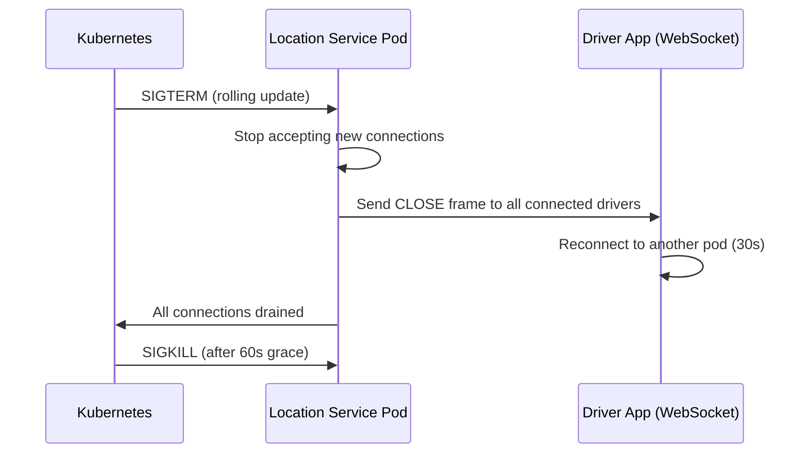
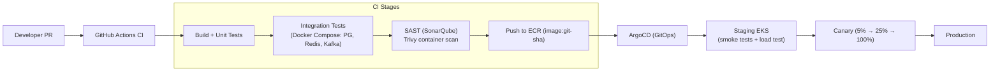

# 13 — Deployment Architecture: Ride-Sharing Platform

## Objective
Define the deployment topology, Kubernetes strategy, CI/CD pipeline, multi-region approach, and operational concerns for a production ride-sharing platform. Ride-sharing has unique deployment challenges: city-level data partitioning, ultra-low latency WebSocket services, and stateful geospatial data that cannot be cold-started quickly.

---

## Infrastructure Overview

```mermaid
graph TB
    subgraph "Global Edge"
        GA["AWS Global Accelerator<br/>(WebSocket connections — driver/rider apps)"]
        CDN["CloudFront CDN<br/>(Static assets, maps)"]
    end

    subgraph "Region: ap-south-1 (India Primary)"
        ALB1["ALB — API Traffic"]
        WALB1["NLB — WebSocket Traffic"]
        subgraph "EKS: API Cluster"
            TS["Trip Service"]
            MS["Matching Service"]
            LS["Location Service"]
            PS["Pricing Service"]
            PAY["Payment Service"]
            NS["Notification Service"]
            DS["Driver Service"]
        end
        subgraph "Data Layer"
            PG["Aurora PostgreSQL (Multi-AZ)"]
            RD["ElastiCache Redis (Cluster — 6 shards)"]
            KF["MSK Kafka (3 brokers)"]
        end
    end

    subgraph "Region: us-east-1 (Americas)"
        ALB2["ALB"]
        EKS2["EKS Cluster"]
        PG2["Aurora Global DB Read Replica"]
        RD2["ElastiCache Redis"]
        KF2["MSK Kafka"]
    end

    subgraph "Region: eu-west-1 (Europe)"
        ALB3["ALB"]
        EKS3["EKS Cluster"]
        PG3["Aurora Global DB Read Replica"]
    end

    GA --> WALB1
    GA --> ALB1
    ALB1 --> EKS API Cluster
    WALB1 --> LS
```

---

## Kubernetes Strategy

### Cluster Design

| Cluster | Services | Node Type |
|---------|----------|-----------|
| **API Cluster** | Trip, Matching, Pricing, Payment, Driver, Notification | c5.2xlarge (CPU-optimized) |
| **Location Cluster** | Location Service + WebSocket servers | r5.2xlarge (memory — Redis client pool) |

Location Service is separated because:
- WebSocket connections are long-lived and stateful (connection pinning)
- Memory-heavy (maintain 1M+ active driver connections)
- Different scaling trigger: active driver count, not CPU

### Node Pools

```
api-pool:          c5.2xlarge, spot + on-demand mix, min=5 max=100
location-ws:       r5.2xlarge, on-demand only,       min=3 max=50
matching-compute:  c5.4xlarge, spot,                 min=2 max=30
payment:           c5.xlarge,  on-demand only,        min=3 max=15
```

Payment nodes are on-demand only — spot interruption during payment processing is unacceptable.

---

## Autoscaling Policies

### HPA (Horizontal Pod Autoscaler)

| Service | Scale Trigger | Min | Max |
|---------|--------------|-----|-----|
| Trip Service | CPU > 60% OR RPS > 2000/pod | 3 | 50 |
| Matching Service | Kafka `ride-requests` lag > 50 | 3 | 30 |
| Location Service | WebSocket connections > 10K/pod | 5 | 100 |
| Pricing Service | CPU > 70% | 2 | 20 |
| Payment Service | CPU > 50% (conservative) | 3 | 15 |

### KEDA for Matching Service
- Matching Service scales on Kafka consumer group lag.
- Why: RPS/CPU don't capture the backlog correctly — Kafka lag is the right signal.
- Scale-up fast (lag > 50 → add 5 pods immediately).
- Scale-down slow (lag = 0 for 10 min → remove pods, preventing flapping during burst).

### Cluster Autoscaler
- Watches for unschedulable pods.
- New node provisioning: ~3 minutes.
- Scale-down: 15-minute grace period (WebSocket draining takes time).

---

## WebSocket Connection Management

WebSocket connections for driver location streaming require special handling:

### Sticky Sessions
- AWS NLB with target group stickiness (source IP hash).
- Same driver always connects to same pod — reduces Redis cross-pod reads.
- On pod failure: client reconnects to any available pod (30s reconnect logic in driver app).

### Graceful Shutdown


`terminationGracePeriodSeconds: 60` in Kubernetes deployment spec.

---

## CI/CD Pipeline



### Deployment Strategies per Service

| Service | Strategy | Reason |
|---------|----------|--------|
| Trip Service | Canary (5% → 100%) | State machine changes are risky |
| Location Service | Rolling update with max-unavailable=0 | WebSocket continuity |
| Matching Service | Blue-Green | Algorithm changes need instant rollback |
| Payment Service | Canary (1% → 5% → 100%) | Financial risk — slowest rollout |
| Pricing/Surge Service | Feature flag + canary | Pricing changes affect business metrics |

---

## Multi-Region Deployment

### City-Level Data Residency

| Region | Cities Served | Data Policy |
|--------|--------------|-------------|
| ap-south-1 | India (Mumbai, Bangalore, Delhi) | Trip + location data stays in India (legal requirement) |
| us-east-1 | US East, Latin America | — |
| eu-west-1 | Europe | GDPR — trip data must stay in EU |

### Cross-Region Components

| Component | Cross-Region Strategy |
|-----------|-----------------------|
| Aurora PostgreSQL | Global Database — primary in city's region, read replica in other regions for analytics |
| Redis (driver locations) | **No cross-region replication** — location data is ephemeral, city-specific, no value in other regions |
| Kafka | Per-region MSK clusters — no cross-region replication |
| User data (profiles, payments) | Aurora Global DB — replicated for login from any region |

### Traffic Routing
- Route 53 Geolocation routing → nearest region.
- Failover: Route 53 health checks → secondary region in < 30s.
- Global Accelerator for WebSocket (persistent connection to nearest AWS PoP, anycast routing).

---

## Environment Strategy

| Environment | Infrastructure | Scale | Data |
|-------------|---------------|-------|------|
| **local** | Docker Compose (PG, Redis, Kafka) | Single pod | Seed data |
| **dev** | Shared EKS namespace | 1 replica | Anonymized prod snapshot |
| **staging** | Dedicated EKS cluster | 10% prod capacity | Anonymized prod data |
| **production** | Full EKS cluster per region | Full scale | Real data |

### Local Development
- Docker Compose services: PostgreSQL, Redis (standalone), Kafka (single broker), Zookeeper.
- Mock Driver App simulator: generates 100 fake drivers sending location every 5s.
- MinIO for S3-compatible storage (driver photos, etc.)
- Wiremock for payment gateway mocking.

---

## Secrets Management

| Secret | Storage | Rotation |
|--------|---------|----------|
| DB credentials | AWS Secrets Manager → K8s ExternalSecrets | 30 days |
| JWT signing keys | AWS KMS → Secrets Manager | 90 days |
| Payment gateway API keys | Secrets Manager | On change (manual) |
| Google Maps API key | Secrets Manager | On change |
| Push notification keys (FCM/APNs) | Secrets Manager | On certificate expiry |

---

## Disaster Recovery

| Scenario | RTO | RPO | Strategy |
|----------|-----|-----|----------|
| Single pod failure | < 30s | 0 | K8s self-healing |
| AZ failure | < 2 min | 0 | Multi-AZ EKS + Aurora Multi-AZ |
| Location Service regional outage | < 5 min | Location data lost (ephemeral) | Fail all active trips in affected region, re-request |
| Database regional failure | < 5 min | < 1s | Aurora Global DB promote |
| Kafka cluster failure | < 10 min | < 1 min | MSK Multi-AZ, consumer replay |
| Full region failure | < 15 min | < 5 min | Route 53 failover + Aurora promotion |

### Active Trip During Region Failure
- All active trips in the failed region are in an indeterminate state.
- On recovery: Trip Service replays Kafka events to reconcile state.
- For trips that cannot be reconciled (driver/rider both disconnected): automatically mark as completed at last known GPS point. Trigger manual review and pro-rated refund.

---

## Infrastructure as Code

- **Terraform** for all AWS infrastructure (VPC, EKS, RDS, ElastiCache, MSK, ALB, Route 53).
- **Helm charts** for all Kubernetes services.
- **ArgoCD** for GitOps deployment — Git is the single source of truth for cluster state.
- **Kustomize** for environment-specific overlay (staging vs production resource limits).

---

## Interview-Level Discussion Points

- **Why Global Accelerator for WebSocket?** — TCP connections benefit from AWS's private backbone instead of public internet. WebSocket latency for location updates drops from 200ms to 50ms for users far from the region.
- **Why no cross-region Redis replication for locations?** — Driver locations are hyperlocal and highly ephemeral (expire in 30s). Replicating them cross-region adds latency and cost with zero benefit — a driver in Mumbai will never be matched to a rider in London.
- **How do you deploy a matching algorithm change without breaking active trips?** — Blue-green deployment. New algorithm deploys to Green cluster. 5% of new ride requests route to Green. Monitor match rate and latency for 30 min before full switch. Active trips on Blue continue until completion.
- **How do you handle WebSocket at scale?** — NLB with connection stickiness. Pods have max connection limits. HPA scales on active connection count. Graceful drain with SIGTERM → CLOSE frame → 60s grace period.
