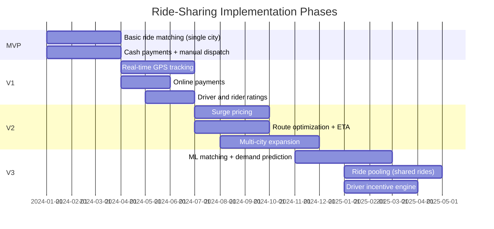

# 15 — Implementation Roadmap: Ride-Sharing Platform

## Objective
Define a realistic, phase-based path from MVP (single-city basic ride matching) to a global, ML-optimized ride-sharing platform. Each phase prioritizes business value over technical elegance and calls out where premature complexity kills startups.

---

## Phase Overview

---

## MVP — Single City, Basic Matching (Months 1–3)

### Goal
One city. Riders request a ride, drivers accept manually via app, cash payment. Prove the matching loop works.

### Features
- Rider app: request ride, view driver on map, cancel ride
- Driver app: go online/offline, see ride requests, accept/reject, mark trip complete
- Basic matching: nearest available driver (no scoring, no optimization)
- Cash payment only (no gateway integration)
- Manual admin dashboard: monitor active trips, resolve disputes
- Basic rider and driver registration (OTP verification)
- SMS notifications only (no push in MVP)

### Architecture
- **Modular Monolith** — Spring Boot with packages: trip, matching, location, user.
- PostgreSQL for all data (trips, users, locations — updated on polling).
- Redis not required: polling every 5 seconds for driver location updates.
- No Kafka — synchronous flow.
- Single server + database (scale-up, not scale-out in MVP).
- Android app only (lower cost device for driver partners).

### Infrastructure
- 1 EC2 instance (app + NGINX), 1 RDS PostgreSQL (Multi-AZ for safety).
- Firebase for driver/rider location (free tier, avoid building WebSocket infra).
- Manual deployment.

### Team
- 2–3 engineers: 1 backend, 1 Android (driver + rider apps), 1 ops.

### Risks
- Firebase vendor lock-in for location — acceptable in MVP, plan extraction.
- PostgreSQL polling for location is not scalable beyond ~500 concurrent drivers.
- No fault tolerance — single server failure = downtime.
- No payment infrastructure = fraud risk (driver claims cash not received).

### MVP Success Criteria
- 100 trips/day in one city.
- Match time < 5 minutes (manual acceptance expected).
- Zero data loss on trip records.

---

## V1 — Production Core (Months 4–6)

### Goal
Real-time GPS tracking via WebSocket, online payment, ratings, first production-grade deployment.

### New Features
- Real-time driver tracking on rider map (WebSocket — replace Firebase)
- Online payment integration (Stripe/Razorpay)
- Driver and rider ratings (post-trip, mutual)
- Trip history for rider and driver
- Push notifications (FCM for Android, APNs for iOS)
- Rider iOS app
- Driver acceptance/rejection with 15s timeout
- Basic fare calculation (time + distance based)
- In-app support chat (basic)

### Architecture Evolution
- Extract **Location Service** from monolith (WebSocket server, Redis GEO).
- Redis introduced: driver locations (GEO), session cache.
- **Payment Service** extracted (PCI compliance isolation).
- Kafka introduced for payment and notification events (decouple notification delivery).
- Matching Service upgraded: scored candidates (proximity + rating + acceptance rate).
- Monolith handles: trip management, user management, ratings.
- PostgreSQL Multi-AZ with read replica for analytics queries.

### Infrastructure
- EKS cluster (2 node pools: API + Location).
- ElastiCache Redis (single primary + 1 replica).
- MSK Kafka (3 brokers, 2 partitions per topic).
- Aurora PostgreSQL (Multi-AZ).
- GitHub Actions CI + ArgoCD for deployment.
- Route 53 + ALB for load balancing.
- NLB for WebSocket traffic.

### Team
- 6–8 engineers: location service, payment service, matching, iOS app, Android (continue), backend core, DevOps.

### Risks
- WebSocket at scale is stateful — pod replacement requires connection draining.
- Payment gateway integration complexity (PCI scope, testing).
- Redis GEO key per city — need city partitioning strategy from day one.

### V1 Success Criteria
- 10,000 trips/day, 1,000 concurrent drivers.
- Match time P99 < 5 seconds.
- Payment success rate > 99%.
- Driver app GPS update latency to rider screen < 3 seconds.

---

## V2 — Scale & Intelligence (Months 7–10)

### Goal
Surge pricing, route optimization, multi-city expansion, advanced analytics.

### New Features
- **Surge pricing**: demand/supply ratio per H3 hex zone, multiplier calculation, rider confirmation flow
- **ETA calculation**: integration with routing engine (OSRM or Google Maps) for accurate pickup ETA
- **Route optimization**: optimal path for driver (traffic-aware)
- **Multi-city expansion**: city-level data partitioning, city-specific regulatory config
- **Ride scheduling**: book a ride up to 7 days in advance
- **Driver earnings dashboard**: daily/weekly earnings, trips summary
- **Referral and promotions**: promo codes, first-ride discount
- **Driver incentives**: bonus for completing N trips in peak hours
- **Real-time analytics**: trip volume per city, match rate dashboard

### Architecture Evolution
- **Matching Service** fully extracted, Kafka-driven (KEDA scaling on queue depth).
- **Pricing Service** extracted: surge multiplier calculation, fare estimation, promotional pricing.
- Analytics pipeline: Kafka → Flink → ClickHouse for real-time dashboards.
- Surge zone service: H3 hex grid, supply/demand aggregation every 60s.
- City Config Service: per-city regulatory rules, pricing floors/ceilings, vehicle type config.
- Multi-city Redis namespace: `drivers:{city}` for location, `surge:{city}:{h3cell}` for pricing.

### Infrastructure
- Per-region EKS clusters for new geographies.
- Flink cluster for stream analytics.
- ClickHouse for OLAP analytics.
- H3 geospatial library (Uber open source) integrated into Pricing and Matching.
- Chaos engineering runs (Chaos Monkey) to validate failure handling.

### Team
- 15–20 engineers: matching (2), pricing (2), analytics (2), multi-city platform (2), driver apps (2), rider apps (2), growth/promotions (2), infra/SRE (2–3).

### Risks
- Surge pricing regulatory risk: some cities cap surge. Legal review per city before launch.
- Multi-city operational complexity: per-city monitoring, support teams, vehicle type config.
- Driver incentive game theory: drivers learn to game incentives (go offline before incentive window, come back during).

### V2 Success Criteria
- 500,000 trips/day across 10 cities.
- Match time P99 < 3 seconds.
- Surge pricing active in all cities during peak.
- ETA accuracy: > 80% within ±2 minutes.

---

## V3 — Global Scale & ML (Months 11–18)

### Goal
ML-based matching, demand prediction, shared rides (pooling), global deployment, driver lifecycle management.

### New Features
- **ML-based matching**: predicted ETA + acceptance probability score (replaces heuristic scoring)
- **Demand forecasting**: predict trip demand 30–60 min ahead → pre-position drivers
- **Ride pooling**: UberPool/OlaShare — match multiple riders with compatible routes
- **Driver lifecycle management**: background check integration, document verification pipeline
- **Advanced driver incentives**: ML-optimized incentive amounts per driver segment
- **Safety features**: real-time trip sharing with contacts, SOS button
- **Corporate accounts**: business profiles, monthly invoicing, expense management
- **Multi-modal integration**: bike + auto + car in single platform

### Architecture Evolution
- ML pipeline: feature store (Redis online + S3 offline) → offline training (SageMaker) → model serving (Triton).
- Demand forecasting service: consumes historical trip events from data warehouse → LSTM model → pre-position recommendations pushed to drivers.
- Pooling Matching Service: Vehicle Routing Problem (VRP) solver with ML heuristics.
- Driver Lifecycle Service: document management, background check API integrations, compliance tracking.
- Global API gateway: rate limiting per market, geo-routing, A/B traffic splitting.

### Infrastructure
- 5+ regional EKS clusters (India, SE Asia, US, EU, LATAM).
- Aurora Global Database for user data across regions.
- Dedicated ML inference cluster (GPU-backed Triton).
- Snowflake or BigQuery as central data warehouse.
- Service mesh (Istio) for inter-service security and observability.

### Team
- 50–80 engineers: ML teams (matching, demand, safety), pooling, corporate/enterprise, safety/trust, regional teams, platform SRE.

### V3 Success Criteria
- 5M trips/day globally.
- Match time P99 < 2 seconds.
- ML matching reduces average driver ETA by 15% vs heuristic.
- Pooling penetration: 20% of eligible trips.

---

## Architecture Evolution Summary

| Phase | Architecture | Key Additions |
|-------|-------------|---------------|
| MVP | Modular Monolith | PostgreSQL, Firebase (temp) |
| V1 | Partial Microservices | Redis GEO, WebSocket, Kafka, EKS |
| V2 | Full Microservices | Flink, ClickHouse, H3, multi-city |
| V3 | Global Microservices + ML | ML pipeline, pooling, service mesh |

---

## Overengineering Warnings

| Temptation | Why to Resist Until Later |
|------------|--------------------------|
| ML matching from day one | No training data, no business impact, high cost |
| H3 surge zones in MVP | Simple city-level surge (on/off) is fine for < 1000 drivers |
| Kafka in MVP | Single-server synchronous flow is simpler and faster to debug |
| Multi-region in MVP | One city, one region. Add regions when business demands |
| Ride pooling in V1 | Pooling is a VRP — 10× harder than basic matching |

---

## Interview-Level Discussion Points

- **Why a monolith for MVP?** — Zero ops overhead, fast iteration, no distributed systems complexity while you're still validating product-market fit. You don't know your service boundaries until you've seen real traffic patterns.
- **When to extract Location Service?** — When Firebase polling creates unacceptable lag (usually at ~500 concurrent drivers) or when you need the sub-3s UX. The clear performance bottleneck drives extraction.
- **When is ML matching justified?** — When you have 1M+ historical trips and A/B testing infrastructure to measure model impact. Without A/B testing, you can't tell if ML is helping.
- **Why not build pooling in V1?** — Pooling requires multi-passenger route optimization (VRP), fare splitting logic, multiple pickup/dropoff points, rider-rider matching, and longer trip negotiation. It's a fundamentally different product. Build after core ride experience is excellent.
