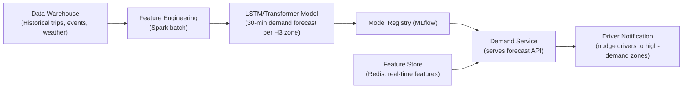
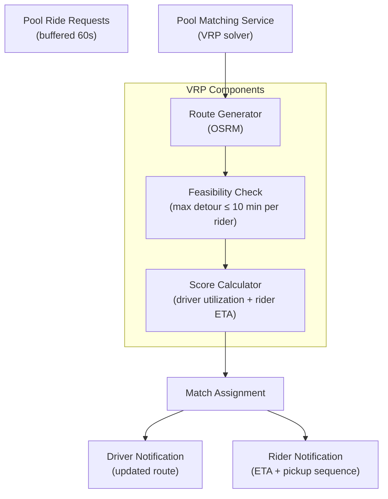

# 16 — Advanced Improvements: Ride-Sharing Platform

## Objective
Document frontier engineering capabilities that separate Uber/Lyft from commodity ride-sharing clones — each grounded in real engineering problems, justified by business impact, and honest about complexity cost.

---

## 1. ML-Based Demand Prediction & Driver Pre-Positioning

### Problem
Reactive matching (wait for ride request, then find nearest driver) causes high ETAs during demand spikes. Airports at 5 PM, concert venues at 11 PM are predictable — but the system only reacts when the spike starts.

### Solution Architecture

### Features Used
| Feature | Type |
|---------|------|
| Historical demand per H3 cell × hour × day-of-week | Batch (offline) |
| Active drivers per cell (right now) | Real-time |
| Upcoming events (concerts, sports) | Batch + manual |
| Weather data | Real-time |
| Holiday calendar | Batch |

### Driver Communication
- Push notification: "High demand expected near [Area] in 20 minutes. Head there now to earn more."
- Incentive: surge bonus for drivers who are in predicted zone when surge activates.
- Not mandatory — drivers can ignore. Model learns which drivers respond to nudges.

### Impact
- Uber reports 15–20% reduction in average ETA in cities with pre-positioning active.
- Supply-demand mismatch events (surges) reduced by 30%.

---

## 2. Global Optimal Matching (Beyond Greedy)

### Problem
Greedy matching (nearest available driver to each rider) is locally optimal but globally suboptimal. Example: Driver A is 2 min from Rider 1, Driver B is 5 min from Rider 2. Greedy assigns A→1, B→2. But if Driver C is 1 min from Rider 2 and 6 min from Rider 1, the optimal assignment is A→1, C→2 (B stays available for the next request).

### Solution
- **Batched matching**: instead of matching each ride request instantly, batch requests arriving within a 500ms window.
- Run **Hungarian algorithm** (optimal bipartite matching) on the batch — O(N³) but N is small within a 500ms window.
- Use predicted ETA (ML model) not straight-line distance for matching cost.
- Only viable in dense markets (NYC, Bangalore CBD) — sparse markets revert to greedy.

### Tradeoffs
| Factor | Consideration |
|--------|---------------|
| 500ms delay | Rider waits 500ms longer before matching starts — acceptable |
| Batch size | Too large → algorithm too slow; too small → no global improvement |
| ML ETA accuracy | Wrong ETA prediction → worse matching than greedy |

---

## 3. Ride Pooling (Vehicle Routing Problem)

### Problem
Pool matching requires: find multiple riders with compatible routes, add waypoints to driver's route, estimate each rider's ETA including detour, handle dynamic insertions as more pool requests arrive.

### Architecture

### Key Constraints
- Maximum 2 riders per vehicle (UberPool) or 4 (shared cab).
- Maximum detour per rider: 10 minutes additional vs direct ride.
- No pickup order change after second rider confirmed.
- Fare split: each rider pays less than direct ride but driver earns more per trip.

### Why It's Hard
- Adding each new rider changes the entire route — dynamic VRP.
- Routing calls are expensive (OSRM) — must be cached or approximated.
- Real-time feasibility during the 60s buffer window.
- Rider cancellation mid-pool requires route recalculation for remaining riders.

---

## 4. Safety Features: Real-Time Trip Monitoring

### Trusted Contacts & Trip Sharing
- Rider can share live trip link with up to 3 trusted contacts.
- Link shows driver name, license plate, real-time GPS, and estimated arrival.
- Link expires when trip completes.

### Anomaly Detection
- ML model monitors trip trajectory in real time.
- If driver deviates > 2km from expected route for > 2 minutes → automated safety check.
- Rider receives in-app alert: "Is everything OK? [I'm fine] [Need help]".
- If no response in 30 seconds after "Need help" → alert dispatched to safety team + optional emergency services contact.

### Speed Monitoring
- GPS-derived speed > 120 km/h for > 30 seconds → flag for review.
- Speed data anonymized and used for driver safety score.

### Architecture Consideration
- Safety anomaly detection runs as a Flink job consuming location event stream.
- Sub-second detection latency required — Flink stateful processing with keyed streams per tripId.
- Safety alerts published to high-priority Kafka topic, consumed by Notification Service with < 1s SLA.

---

## 5. Driver Incentive Optimization Engine

### Problem
Static incentives ("complete 10 rides → earn bonus") are inefficient. Some drivers would complete 10 rides anyway — they don't need the incentive. Others won't respond to any incentive. Treating all drivers the same wastes budget.

### Solution: Personalized Incentive ML Model
- For each driver: predict probability of completing N more rides without incentive (counterfactual).
- If probability is high → don't offer incentive (they'll do it anyway).
- If probability is medium → offer smallest incentive that changes behavior.
- If probability is low → don't offer (no amount will change behavior today).
- Measure: A/B test incentive vs no-incentive groups. Track incremental rides generated.

### Constraints
- Budget cap per city per day.
- Regulatory: no discrimination based on protected characteristics.
- Transparency: drivers see incentive terms clearly (no hidden conditions).

---

## 6. Autonomous Vehicle (AV) Integration Readiness

### How It Changes Architecture
| Current | AV-Adapted |
|---------|-----------|
| Driver app sends GPS updates | AV software stack publishes telemetry via API |
| Driver accepts/rejects ride | AV routing system accepts automatically (no human decision) |
| Driver marks trip started/ended | AV uses trip lifecycle API programmatically |
| Driver support (chat/call) | Fleet operations center monitors remotely |
| Driver rating | AV ride quality score (smoothness, cleanliness sensor) |

### New Components Required
- Fleet Management Service: battery level, maintenance schedule, remote dispatch.
- Telemetry Ingestion Service: high-frequency sensor data (GPS + LiDAR + camera metadata).
- Remote Intervention Service: human operator takes manual control if AV stuck.
- AV routing API: accepts `origin → destination` → returns optimal AV assignment.

---

## 7. Architecture Self-Critique

### Weaknesses in This Design

| Weakness | Impact | Mitigation |
|----------|--------|-----------|
| Redis GEO single key per city | Bangalore key holds 100K driver entries — becomes large | Sub-divide city into zones: `drivers:{city}:{zone}` |
| Matching fails if Kafka is down | Ride requests cannot be processed | Circuit breaker: fallback to synchronous matching for short outages |
| No distributed transaction across matching + trip creation | Driver marked matched in Redis but trip creation fails in PostgreSQL | Saga: on trip creation failure → release driver lock in Redis |
| ETA accuracy depends on external routing API | Google Maps outage → ETA shown as "calculating" | Fallback: straight-line distance ÷ average speed per route type |
| Notification delivery not guaranteed | Push notification lost → driver never sees ride request | Fallback: SMS for critical notifications (ride assigned, trip ended) |

### Scaling Limits

| Component | Current Design Limit | Breakthrough Strategy |
|-----------|---------------------|----------------------|
| Redis GEO per city | ~500K drivers per city key | Zone subdivision |
| WebSocket pods | ~10K connections per pod | Increase ulimit, use more efficient WebSocket library |
| PostgreSQL trips | ~50K writes/s with connection pooler | Vitess sharding or TimescaleDB |
| Matching throughput | ~10K concurrent matching sessions | More pods (KEDA), optimize Redis GEO query |
| Kafka throughput | ~1M msg/s per cluster | Increase partitions, add brokers |

### FAANG Interviewer Challenges
- "Your driver lock uses Redis NX — what happens if the lock is set but the matching service crashes before creating the trip?" → Implement a TTL (30s) on the lock. Background job detects trips that were MATCHED but never transitioned to DRIVER_ACCEPTED within TTL → release lock, retry matching.
- "How do you handle a driver who accepts a ride but doesn't move toward the rider?" → ETA watchdog: if driver GPS shows no movement toward rider for 2 min after acceptance → automated nudge. 3 min → alert rider + offer cancellation with no fee. 5 min → auto-cancel, flag driver.
- "Your surge pricing re-calculates every 60 seconds. What if demand spikes in under 60 seconds?" → Sub-zone real-time triggers: if request rate in a zone exceeds 3× baseline within 10 seconds → immediate surge activation regardless of 60s cycle. Coarse surge on fast path, fine-grained on 60s cycle.
