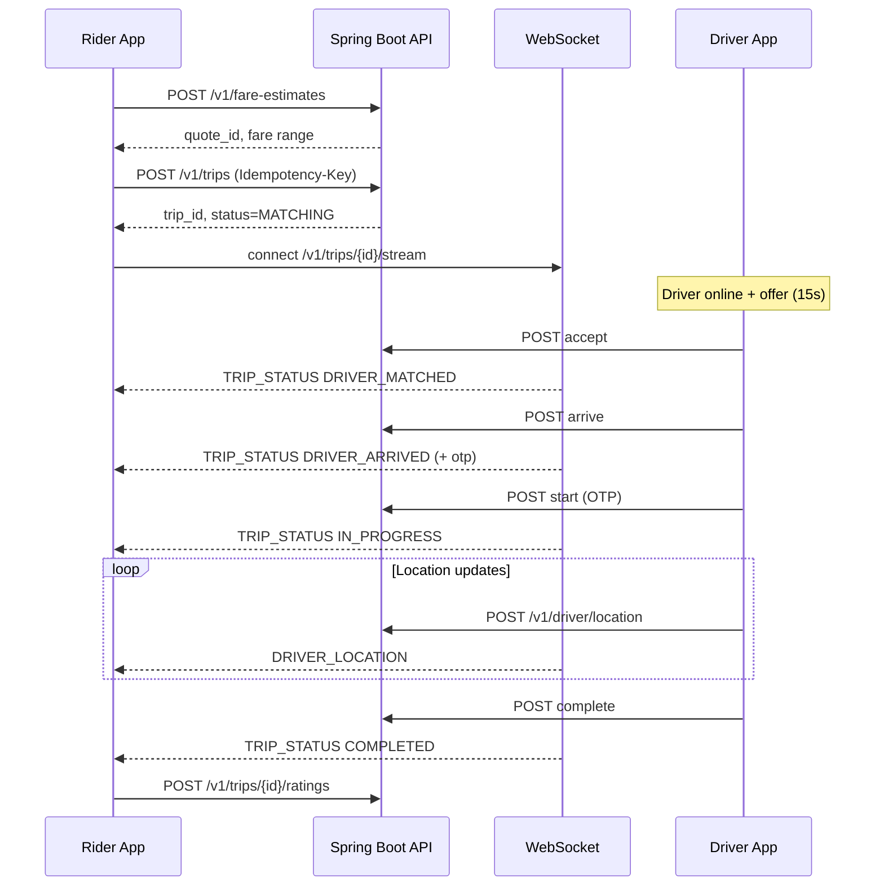
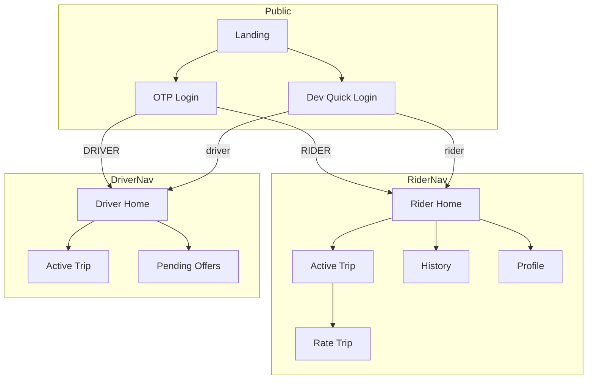

# FRONTEND_ANALYSIS.md — Ride Sharing Platform

> **Status:** Phase 1 complete — analysis only, no frontend code yet.  
> **Backend:** `ride-sharing-service` (Spring Boot modular monolith, V1)  
> **Docs:** `docs/` (design spec) vs **implemented API** (source of truth for integration)

---

## 1. Application Purpose

A **Bangalore-demo ride-sharing platform** (Uber/Ola-style) that:

1. Lets **riders** estimate fares, request trips, track drivers live, cancel, pay (mock), rate drivers, and view history.
2. Lets **drivers** go online/offline, receive auto-matched offers (15s window), accept/reject, update GPS, and advance trips through the state machine (arrive → OTP start → complete).
3. Uses **mocked externals** (Redis GEO, Kafka, FCM, Razorpay) suitable for local dev and capstone demos.

The **implemented backend** is narrower than the full design docs (no admin APIs, no scheduled rides, no JWT yet). The frontend must integrate with **what exists in code**, not aspirational doc endpoints.

---

## 2. Functional Analysis

### 2.1 User Roles

| Role | Enum | Auth (V1) | Primary surfaces |
|------|------|-----------|------------------|
| Rider | `RIDER` | `X-Uid` + optional `X-Role` | Book, track, cancel, rate, history |
| Driver | `DRIVER` | Same headers | Online toggle, offers, trip actions, location ping |
| Admin | `ADMIN` | Supported in OTP verify only | **No admin APIs in V1** — out of scope |

**Dev shortcuts:** `X-Uid: rider` or `X-Uid: driver` map to seeded demo users (no `X-Role` needed).

### 2.2 Major Use Cases (Implemented)

| # | Actor | Use case | Backend support |
|---|-------|----------|-----------------|
| UC-1 | Rider | OTP login / dev login | `POST /v1/auth/otp/*` + header auth |
| UC-2 | Rider | Get/update profile | `GET/PATCH /v1/riders/me` |
| UC-3 | Rider | Fare estimate before booking | `POST /v1/fare-estimates` |
| UC-4 | Rider | Request trip (uses quote) | `POST /v1/trips` |
| UC-5 | Rider | Live trip tracking | `GET /v1/trips/{id}` + WebSocket stream |
| UC-6 | Rider | Cancel trip | `POST /v1/trips/{id}/cancel` |
| UC-7 | Rider | Rate completed trip | `POST /v1/trips/{id}/ratings` |
| UC-8 | Rider | Trip history | `GET /v1/riders/me/trips` |
| UC-9 | Driver | Go online/offline | `POST /v1/driver/availability/*` |
| UC-10 | Driver | Stream location while online | `POST /v1/driver/location` |
| UC-11 | Driver | View/accept/reject offer | `GET /v1/driver/trips/offer`, accept/reject |
| UC-12 | Driver | Trip lifecycle | arrive → start (OTP) → complete |
| UC-13 | Driver | List matching trips (fallback) | `GET /v1/driver/trips/pending` |

### 2.3 Business Workflows

#### Rider happy path



#### Driver happy path

1. `POST /v1/driver/availability/online` (vehicle + city + lat/lng)
2. Poll or push: `GET /v1/driver/trips/offer` when FCM mock fires
3. `POST /v1/driver/trips/{id}/accept` within 15s
4. Navigate via `navigation_url` in accept response
5. `POST arrive` → share OTP with rider (shown in accept response)
6. `POST start` with OTP → `POST complete` with final lat/lng
7. `POST /v1/driver/availability/offline` when done

#### Trip state machine (frontend must reflect)

```
REQUESTED → MATCHING → DRIVER_MATCHED → DRIVER_ARRIVED → IN_PROGRESS → COMPLETED
                ↓              ↓               ↓
            CANCELLED      CANCELLED       CANCELLED
```

Cancellation fees (rider): **₹0** before match; **₹30** when `DRIVER_MATCHED`; **₹50** when `DRIVER_ARRIVED`.

### 2.4 Screen Inventory

| Screen | Route (proposed) | Role | APIs / realtime |
|--------|------------------|------|-----------------|
| Landing / role picker | `/` | Public | — |
| OTP login | `/login` | Public | OTP request/verify |
| Dev quick login | `/login/dev` | Public | Sets `rider`/`driver` headers |
| Rider home / book | `/rider` | Rider | fare-estimates, trips |
| Active trip | `/rider/trip/:tripId` | Rider | GET trip, WebSocket |
| Trip rating | `/rider/trip/:tripId/rate` | Rider | POST ratings |
| Trip history | `/rider/history` | Rider | GET riders/me/trips |
| Rider profile | `/rider/profile` | Rider | GET/PATCH riders/me |
| Driver dashboard | `/driver` | Driver | availability, offer poll |
| Driver active trip | `/driver/trip/:tripId` | Driver | trip actions, location interval |
| Driver pending list | `/driver/pending` | Driver | GET pending (optional) |
| 404 / error | `*` | All | — |

**Note:** No screenshots exist in `/docs`. UI derives from requirements (`00-requirements-analysis.md`) and API response shapes.

### 2.5 Navigation Structure



**Layout pattern:** Role-specific shell with bottom nav (mobile) / sidebar (desktop). Single active trip redirects to trip detail when status ∉ `{COMPLETED, CANCELLED}`.

---

## 3. API Analysis (Implemented Controllers)

### 3.1 AuthController — `/v1/auth`

| Property | Value |
|----------|-------|
| Purpose | Mock OTP authentication; creates rider/driver on verify |
| Auth | **Public** (no headers) |

| Method | Path | Request | Response | Validation |
|--------|------|---------|----------|------------|
| POST | `/otp/request` | `OtpRequest` | `{ otp_request_id, expires_in_seconds, dev_hint }` | `phoneNumber` @NotBlank |
| POST | `/otp/verify` | `OtpVerifyRequest` | `{ access_token, refresh_token, user_type, user_id }` | `otpRequestId`, `otpCode` @NotBlank; `userType` optional enum |

**Important:** Tokens are **dev placeholders** (`dev-token-{uuid}`). Protected endpoints use **`X-Uid` / `X-Role` headers**, not Bearer tokens. OTP mock code: **`123456`**.

**Not implemented (doc only):** `/token/refresh`, `/logout`.

---

### 3.2 RiderController — `/v1/riders`

| Property | Value |
|----------|-------|
| Purpose | Rider registration and profile |
| Auth | Interceptor requires `X-Uid` on all `/v1/**` except OTP; `register` does not check role |

| Method | Path | Request | Response | Auth |
|--------|------|---------|----------|------|
| POST | `/` | `RegisterRiderRequest` | `{ rider_id, status }` | Header required by interceptor* |
| GET | `/me` | — | `{ rider_id, full_name, phone_number, email, rating, total_trips, status }` | RIDER |
| PATCH | `/me` | `UpdateRiderRequest` | `{ rider_id, full_name, email }` | RIDER |

\*Registration is largely superseded by OTP verify auto-register; frontend may skip standalone register.

**Request DTOs:**

```typescript
// RegisterRiderRequest
{ phoneNumber: string; fullName: string; email?: string }

// UpdateRiderRequest — all optional
{ fullName?: string; email?: string }
```

---

### 3.3 FareEstimateController — `/v1/fare-estimates`

| Method | Path | Request | Response | Auth |
|--------|------|---------|----------|------|
| POST | `/` | `FareEstimateRequest` | Fare quote object | RIDER |

**FareEstimateRequest:**

| Field | Type | Validation |
|-------|------|------------|
| pickupLat | BigDecimal | @NotNull |
| pickupLng | BigDecimal | @NotNull |
| destinationLat | BigDecimal | @NotNull |
| destinationLng | BigDecimal | @NotNull |
| vehicleType | `ECONOMY \| PREMIUM \| SUV \| AUTO \| BIKE` | @NotNull |
| cityId | UUID | @NotNull |

**Response fields:** `quote_id`, `vehicle_type`, `fare_min`, `fare_max`, `currency`, `surge_multiplier`, `surge_active`, `estimated_duration_min`, `estimated_distance_km`, `expires_at`, `breakdown` (base_fare, distance_fare, time_fare, surge_premium, platform_fee).

**Demo constants:** cityId `11111111-1111-1111-1111-111111111111`; sample coords MG Road → Koramangala.

---

### 3.4 TripController — `/v1/trips`

| Method | Path | Request | Response | Auth | Headers |
|--------|------|---------|----------|------|---------|
| POST | `/` | `CreateTripRequest` | Trip create response (201) | RIDER | Idempotency-Key optional |
| GET | `/{tripId}` | — | Detailed trip | RIDER or DRIVER | — |
| POST | `/{tripId}/cancel` | `CancelTripRequest?` | Cancel result | RIDER | Idempotency-Key optional |
| POST | `/{tripId}/ratings` | `RateTripRequest` | `{ rating_id, score, trip_id }` | RIDER | — |

**CreateTripRequest:** `{ quoteId: UUID, pickupAddress: string, destinationAddress: string }`

**CancelTripRequest:** `{ reason?: string }`

**RateTripRequest:** `{ score: integer, comment?: string }`

**Create/get response highlights:** `trip_id`, `status`, `estimated_fare`, `surge_multiplier`, addresses, `_links`, optional `driver`, `driver_location`, `otp` (when DRIVER_ARRIVED), `eta_minutes`.

---

### 3.5 RiderTripHistoryController — `/v1/riders/me`

| Method | Path | Response | Auth |
|--------|------|----------|------|
| GET | `/trips` | `{ trips[], pagination: { limit, has_more, next_cursor } }` | RIDER |

**Trip summary:** `trip_id`, `status`, `pickup_address`, `destination_address`, `requested_at`, `final_fare`.

**Gap:** `next_cursor` always `null`; fixed limit 20 server-side.

---

### 3.6 DriverTripController — `/v1/driver/trips`

| Method | Path | Request | Response | Auth | Idempotency |
|--------|------|---------|----------|------|-------------|
| GET | `/offer` | — | Offer or `{ offer: null }` | DRIVER | — |
| GET | `/pending` | — | `TripSummary[]` | DRIVER | — |
| POST | `/{tripId}/accept` | — | Driver accept payload | DRIVER | Optional |
| POST | `/{tripId}/reject` | `RejectTripRequest?` | 204 | DRIVER | — |
| POST | `/{tripId}/arrive` | — | `{ trip_id, status, wait_time_started_at }` | DRIVER | Optional |
| POST | `/{tripId}/start` | `{ otp: string }` | Start payload + navigation | DRIVER | Optional |
| POST | `/{tripId}/complete` | `{ finalLat, finalLng }` | Fare + completion | DRIVER | Optional |

**Offer response:** `offer_id`, `trip_id`, `expires_at`, addresses, `estimated_fare_min`.

**Accept response:** `rider` (name, rating, **otp**), `pickup`, `destination_address`, `estimated_fare_share`, `navigation_url`.

---

### 3.7 DriverLocationController — `/v1/driver`

| Method | Path | Request | Response | Auth |
|--------|------|---------|----------|------|
| POST | `/availability/online` | `GoOnlineRequest` | `{ status: AVAILABLE, city_id, timestamp }` | DRIVER |
| POST | `/availability/offline` | — | `{ status: OFFLINE, timestamp }` | DRIVER |
| POST | `/location` | `LocationUpdateRequest` | 204 No Content | DRIVER |

**GoOnlineRequest:** `{ vehicleId, cityId, lat, lng }` — demo vehicle `44444444-4444-4444-4444-444444444444`.

**LocationUpdateRequest:** `{ lat, lng, heading?, speedKmh? }`

---

### 3.8 WebSocket — `/v1/trips/{tripId}/stream`

| Property | Value |
|----------|-------|
| Auth | Same `X-Uid` / `X-Role` on handshake |
| Protocol | JSON text messages |

**Server → client events:**

| type | data fields |
|------|-------------|
| CONNECTED | trip_id |
| TRIP_STATUS | trip_id, status, otp? |
| DRIVER_LOCATION | driver_id, lat, lng, heading, timestamp |
| SYNC_ACK | trip_id (reply to client SYNC_REQUEST) |

**Client → server:** `PONG`, `SYNC_REQUEST` (plain JSON strings).

---

## 4. Error Responses

All errors use envelope:

```json
{
  "error": {
    "code": "VALIDATION_FAILED",
    "message": "...",
    "details": {},
    "request_id": "req_xxxxxxxx",
    "timestamp": "2026-06-18T..."
  }
}
```

| HTTP | Codes |
|------|-------|
| 400 | VALIDATION_FAILED, EXPIRED_QUOTE, INVALID_OTP, INVALID_LOCATION |
| 401 | UNAUTHORIZED |
| 403 | FORBIDDEN |
| 404 | NOT_FOUND |
| 409 | TRIP_ALREADY_ACTIVE, DRIVER_ALREADY_MATCHED, IDEMPOTENCY_CONFLICT, INVALID_STATE_TRANSITION |
| 422 | NO_DRIVERS_AVAILABLE |

---

## 5. Authentication Requirements Summary

| Mechanism | V1 reality | Design doc |
|-----------|------------|------------|
| Protected REST | `X-Uid` (+ `X-Role` if UUID) | JWT Bearer |
| Public | OTP endpoints only | OTP + refresh |
| WebSocket | Headers on handshake | Same |
| CORS | `http://localhost:5173`, `3000` | — |

**Frontend auth strategy:** Store `userId`, `role`, and auth mode (`otp` | `dev-shortcut`). Axios interceptor attaches headers on every request. Do **not** send Bearer token unless backend adds JWT validation later.

---

## 6. Frontend Integration Matrix

| Feature | API Endpoint | Method | Request DTO | Response DTO |
|---------|-------------|--------|-------------|--------------|
| Request OTP | `/v1/auth/otp/request` | POST | `{ phoneNumber }` | `{ otp_request_id, expires_in_seconds, dev_hint }` |
| Verify OTP | `/v1/auth/otp/verify` | POST | `{ otpRequestId, otpCode, userType? }` | `{ access_token, refresh_token, user_type, user_id }` |
| Register rider | `/v1/riders` | POST | `{ phoneNumber, fullName, email? }` | `{ rider_id, status }` |
| Rider profile | `/v1/riders/me` | GET | — | Rider profile map |
| Update profile | `/v1/riders/me` | PATCH | `{ fullName?, email? }` | `{ rider_id, full_name, email }` |
| Fare estimate | `/v1/fare-estimates` | POST | `{ pickupLat, pickupLng, destinationLat, destinationLng, vehicleType, cityId }` | Fare quote map |
| Create trip | `/v1/trips` | POST | `{ quoteId, pickupAddress, destinationAddress }` | Trip response + `_links` |
| Get trip | `/v1/trips/{tripId}` | GET | — | Detailed trip map |
| Cancel trip | `/v1/trips/{tripId}/cancel` | POST | `{ reason? }` | Cancel result map |
| Rate trip | `/v1/trips/{tripId}/ratings` | POST | `{ score, comment? }` | `{ rating_id, score, trip_id }` |
| Trip history | `/v1/riders/me/trips` | GET | — | `{ trips, pagination }` |
| Driver go online | `/v1/driver/availability/online` | POST | `{ vehicleId, cityId, lat, lng }` | `{ status, city_id, timestamp }` |
| Driver go offline | `/v1/driver/availability/offline` | POST | — | `{ status, timestamp }` |
| Update location | `/v1/driver/location` | POST | `{ lat, lng, heading?, speedKmh? }` | 204 |
| Current offer | `/v1/driver/trips/offer` | GET | — | Offer map or `{ offer: null }` |
| Pending trips | `/v1/driver/trips/pending` | GET | — | `TripSummary[]` |
| Accept trip | `/v1/driver/trips/{tripId}/accept` | POST | — | Accept response map |
| Reject trip | `/v1/driver/trips/{tripId}/reject` | POST | `{ reason? }` | 204 |
| Arrive pickup | `/v1/driver/trips/{tripId}/arrive` | POST | — | Arrive map |
| Start trip | `/v1/driver/trips/{tripId}/start` | POST | `{ otp }` | Start map |
| Complete trip | `/v1/driver/trips/{tripId}/complete` | POST | `{ finalLat, finalLng }` | Complete + fare map |
| Live tracking | `ws://host/v1/trips/{tripId}/stream` | WS | Handshake headers | Event stream |

---

## 7. Doc vs Implementation Gaps

| Item | Design doc | Implemented V1 | Frontend action |
|------|------------|----------------|-----------------|
| Auth | JWT Bearer | Header-based dev auth | Use X-Uid/X-Role |
| Token refresh/logout | Yes | No | Omit UI |
| Trip create body | Includes lat/lng, payment | quoteId + addresses only | Match backend |
| Trip history pagination | Cursor | Fixed 20, null cursor | Show list; no cursor UI |
| Profile photo | PATCH field | Not in DTO | Omit |
| Admin | Full suite | None | Out of scope |
| Maps | In-app map SDK | Coords + navigation_url links | Map library or static map |
| Payment UI | Card selection | Auto mock on complete | Show receipt from complete response |

---

## 8. Assumptions

1. Backend runs at `http://localhost:8080`; Vite dev at `5173` (CORS pre-configured).
2. Demo flow uses seeded Bangalore data and `rider`/`driver` shortcuts for QA.
3. OTP flow creates **new** users each verify unless phone matches existing logic — primary demo path is shortcuts or re-verify.
4. Idempotency-Key: UUID v4 generated client-side for create/cancel/accept mutations.
5. Driver location polling: **every 4–5s** while online on active trip (matches NFR doc; backend accepts POST).

---

## 9. Open Questions

1. Should production-bound frontend also send `Authorization: Bearer` from OTP response for forward compatibility, or strictly headers only?
2. Map provider: Leaflet (free), Mapbox, or Google Maps (API key)?
3. Driver offer UX: poll `GET /offer` every 2s vs WebSocket push (FCM is mock-only)?
4. Geolocation: browser GPS vs preset demo coordinates for Bangalore?

---

## 10. Risks

| Risk | Impact | Mitigation |
|------|--------|------------|
| Header auth unlike production JWT | Rewrite auth layer later | Abstract `AuthProvider` interface |
| WebSocket URL hardcoded `localhost` in `_links` | Broken WS in deployed env | Derive WS base from `VITE_API_URL` |
| Single active trip per rider | 409 TRIP_ALREADY_ACTIVE | Redirect to active trip on error |
| 15s offer timeout | Missed offers | Countdown UI + sound/haptic |
| No real maps/routing in UI | Weaker UX | Embed map with pickup/destination markers |

---

## 11. Milestone Summary (Phase 1)

**Implemented:** Full backend/API analysis, screen map, integration matrix, gap list.

**Assumptions:** Documented in §8.

**Open questions:** §9 — recommend dev shortcuts + Leaflet + 2s offer polling for MVP.

**Risks:** §10.

**Next:** Phase 2 architecture (`FRONTEND_ARCHITECTURE.md`) → then scaffold Vite app.
