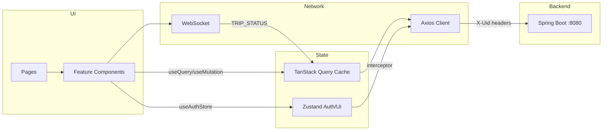
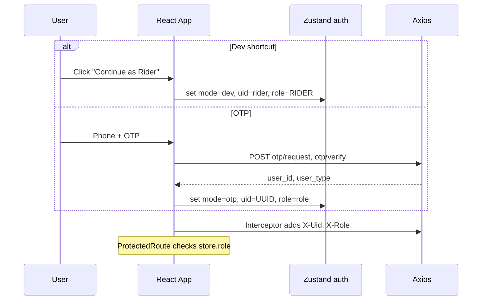

# FRONTEND_ARCHITECTURE.md — Ride Sharing Platform

> **Status:** Phase 2 complete — design only.  
> **Stack:** React 19, Vite 6, TypeScript (strict), Tailwind CSS 4, React Router 7, TanStack Query v5, Axios, React Hook Form, Zod, Zustand, Vitest + RTL.

---

## 1. Architecture Decisions

### 1.1 Feature-based folder structure

**Decision:** Organize by **feature** (`rider`, `driver`, `auth`) with shared `components/` and `api/`.

**Why:** Ride-sharing has two distinct UX surfaces (rider vs driver) with shared types and HTTP client. Feature folders keep trip/booking logic separate from driver offer/location logic while avoiding a flat `pages/` dump.

**Tradeoff:** Slightly more nesting than a small app needs; pays off as forms and hooks multiply.

**When not to use:** Single-role demo — a flatter structure would suffice.

---

### 1.2 Server state vs client state

| Concern | Tool | Rationale |
|---------|------|-----------|
| API data (trips, profile, offers) | **TanStack Query** | Caching, refetch, mutation invalidation, loading/error states |
| Auth session (userId, role, header mode) | **Zustand** + persist | Survives refresh; tiny surface |
| Active trip WebSocket | **Custom hook** + Zustand slice | Ephemeral connection; merge WS events into query cache |
| UI (toasts, modals, sidebar) | **Zustand** (ui slice) or local state | Avoid prop drilling |

**Avoid:** Putting server trip list in Zustand — duplicates Query cache.

---

### 1.3 Auth: match backend exactly (header-based V1)

**Decision:** No fake JWT flow. Axios request interceptor sets:

- Dev shortcut: `X-Uid: rider` | `driver`
- OTP login: `X-Uid: {user_id UUID}`, `X-Role: RIDER` | `DRIVER`

Store OTP tokens in session for display/future use but **do not** rely on `Authorization` header until backend validates it.

**Protected routes:** React Router loader/check reads Zustand auth; redirect to `/login`.

**Role routes:** `/rider/*` requires `RIDER`; `/driver/*` requires `DRIVER`.

---

### 1.4 API client layer

**Decision:** Three layers:

1. **`api/client.ts`** — Axios instance, interceptors, error normalizer
2. **`api/services/*.ts`** — One module per controller (auth, trips, driver, pricing)
3. **`types/api/*.ts`** — TypeScript interfaces mirroring backend DTOs (snake_case in JSON via transformers OR camelCase with explicit mappers)

**Decision on casing:** Backend JSON uses **snake_case** (`trip_id`, `fare_min`). Use **`types/api` in snake_case** to match exactly — no invented fields. Optional thin mappers in hooks for UI ergonomics.

**Idempotency:** `utils/idempotency.ts` generates UUID; mutation wrapper adds `Idempotency-Key` header when required.

---

### 1.5 Realtime strategy

**Decision:** Native `WebSocket` in `hooks/useTripStream.ts`, not Socket.io.

- Connect when rider/driver views active trip
- Parse `{ type, data }` messages
- On `TRIP_STATUS` / `DRIVER_LOCATION`: patch TanStack Query cache for `['trip', tripId]`
- Send `SYNC_REQUEST` on connect/reconnect
- Exponential backoff reconnect (max 5 attempts)

**Driver location outbound:** `setInterval` 4s POST `/v1/driver/location` while driver online + on trip (navigator.geolocation with Bangalore fallback).

---

### 1.6 Forms & validation

**Decision:** React Hook Form + Zod schemas duplicated from backend constraints.

| Form | Zod rules |
|------|-----------|
| OTP phone | non-empty string |
| OTP code | 6 digits (mock) |
| Fare estimate | lat/lng numbers, vehicleType enum, cityId uuid |
| Create trip | quoteId uuid, addresses min 1 char |
| Rate trip | score 1–5 int |
| Start trip (driver) | otp non-empty |
| Complete trip | finalLat/finalLng numbers |
| Go online | vehicleId, cityId uuid, lat/lng |

Map `VALIDATION_FAILED` and field errors from API to RHF `setError`.

---

### 1.7 UI / design direction

**Aesthetic:** **Urban night transit** — dark charcoal base, electric amber accent (Bangalore evening commute), sharp typography.

| Element | Choice |
|---------|--------|
| Display font | **Syne** (headlines) |
| Body font | **DM Sans** |
| Accent | `#F5A623` amber on `#0F1117` |
| Motion | Staggered page enter; pulse on driver offer countdown |
| Layout | Mobile-first; bottom nav; map hero on booking screen |

**No component library** — custom `Button`, `Input`, `Card`, `Badge`, `Toast`, `Spinner`, `EmptyState`, `ErrorState` in `components/ui/`.

**Maps:** **Leaflet** + OpenStreetMap tiles (no API key for dev).

---

### 1.8 Routing

```text
/                     → Landing (choose role / login)
/login                → OTP flow
/login/dev            → Quick rider/driver (dev)
/rider                → Book ride (protected)
/rider/trip/:tripId   → Active trip
/rider/trip/:tripId/rate
/rider/history
/rider/profile
/driver               → Dashboard (online toggle, offer)
/driver/trip/:tripId  → Active trip actions
/driver/pending
*                     → NotFound
```

**Layouts:**

- `PublicLayout` — minimal header
- `RiderLayout` — bottom nav: Home, History, Profile
- `DriverLayout` — bottom nav: Home, Pending, (Profile stub)

---

### 1.9 Error handling & production readiness

| Concern | Approach |
|---------|----------|
| Error boundary | `components/ErrorBoundary.tsx` wraps app |
| Toasts | Zustand toast queue; API errors show `error.message` |
| Retry | Query default `retry: 1` for GET; mutations manual retry button |
| Env | `VITE_API_URL`, `VITE_WS_URL`, `VITE_DEFAULT_CITY_ID`, demo coords |
| Logging | `utils/logger.ts` — debug in dev only |

---

### 1.10 Testing strategy

| Layer | Tool | Focus |
|-------|------|-------|
| Unit | Vitest | Zod schemas, idempotency, error parser |
| Components | RTL | Login form, trip status badge, offer countdown |
| API services | Vitest + msw | Mock axios responses match backend shapes |
| Integration | RTL | Rider book flow (mock API), driver accept flow |

---

## 2. Folder Structure

```text
ride-sharing-frontend/
├── public/
├── src/
│   ├── api/
│   │   ├── client.ts              # Axios instance + interceptors
│   │   ├── errors.ts              # ApiError type + parser
│   │   └── services/
│   │       ├── auth.service.ts
│   │       ├── rider.service.ts
│   │       ├── pricing.service.ts
│   │       ├── trip.service.ts
│   │       ├── driver.service.ts
│   │       └── index.ts
│   ├── assets/
│   │   └── fonts/                 # if self-hosted
│   ├── components/
│   │   ├── ui/                    # Button, Input, Card, Badge, Toast, ...
│   │   ├── layout/                # PublicLayout, RiderLayout, DriverLayout
│   │   ├── map/                   # TripMap, LocationPicker
│   │   └── ErrorBoundary.tsx
│   ├── constants/
│   │   ├── demo.ts                # BANGALORE_CITY_ID, seed coords, vehicle
│   │   └── trip-status.ts         # Labels, colors, terminal states
│   ├── features/
│   │   ├── auth/
│   │   │   ├── components/        # OtpForm, DevLoginButtons
│   │   │   ├── hooks/             # useAuth
│   │   │   └── schemas/           # otp.schema.ts
│   │   ├── rider/
│   │   │   ├── components/        # FareEstimateForm, TripTracker, RatingForm
│   │   │   ├── hooks/             # useFareEstimate, useCreateTrip
│   │   │   └── schemas/
│   │   └── driver/
│   │       ├── components/        # OfferCard, TripActions, OnlineToggle
│   │       ├── hooks/             # useDriverOffer, useLocationPing
│   │       └── schemas/
│   ├── hooks/
│   │   ├── useTripStream.ts       # WebSocket
│   │   └── useGeolocation.ts
│   ├── pages/
│   │   ├── LandingPage.tsx
│   │   ├── LoginPage.tsx
│   │   ├── DevLoginPage.tsx
│   │   ├── rider/
│   │   │   ├── RiderHomePage.tsx
│   │   │   ├── ActiveTripPage.tsx
│   │   │   ├── RateTripPage.tsx
│   │   │   ├── HistoryPage.tsx
│   │   │   └── ProfilePage.tsx
│   │   ├── driver/
│   │   │   ├── DriverHomePage.tsx
│   │   │   ├── DriverTripPage.tsx
│   │   │   └── PendingPage.tsx
│   │   └── NotFoundPage.tsx
│   ├── routes/
│   │   ├── index.tsx              # createBrowserRouter
│   │   ├── ProtectedRoute.tsx
│   │   └── RoleRoute.tsx
│   ├── store/
│   │   ├── auth.store.ts
│   │   ├── ui.store.ts
│   │   └── index.ts
│   ├── types/
│   │   ├── api/                   # snake_case DTOs
│   │   │   ├── auth.types.ts
│   │   │   ├── rider.types.ts
│   │   │   ├── trip.types.ts
│   │   │   ├── pricing.types.ts
│   │   │   ├── driver.types.ts
│   │   │   └── common.types.ts    # ApiError, VehicleType, TripStatus
│   │   └── websocket.types.ts
│   ├── utils/
│   │   ├── idempotency.ts
│   │   ├── logger.ts
│   │   └── format.ts              # currency INR, dates
│   ├── App.tsx
│   ├── main.tsx
│   └── index.css                  # Tailwind + CSS variables
├── .env.example
├── vite.config.ts
├── vitest.config.ts
├── tailwind.config.ts
├── tsconfig.json
├── FRONTEND_ANALYSIS.md           # (symlink or copy from parent)
├── FRONTEND_ARCHITECTURE.md
└── IMPLEMENTATION_PROGRESS.md
```

---

## 3. Data Flow



### 3.1 Query keys

| Key | Invalidated when |
|-----|------------------|
| `['rider', 'me']` | profile PATCH |
| `['trips', 'history']` | trip complete, cancel |
| `['trip', tripId]` | WS event, mutation success |
| `['driver', 'offer']` | accept, reject, poll interval |
| `['driver', 'pending']` | new matching trips |

### 3.2 Mutation flow (create trip)

1. User submits fare form → `POST /v1/fare-estimates` → store `quote_id`
2. User confirms addresses → `POST /v1/trips` with `Idempotency-Key`
3. On success → navigate to `/rider/trip/:id`, connect WebSocket
4. On `409 TRIP_ALREADY_ACTIVE` → fetch active trip and redirect

---

## 4. Authentication Flow



**Logout:** Clear store + Query cache; redirect `/`.

---

## 5. Environment Configuration

`.env.example`:

```env
VITE_API_URL=http://localhost:8080
VITE_WS_URL=ws://localhost:8080
VITE_DEFAULT_CITY_ID=11111111-1111-1111-1111-111111111111
VITE_DEMO_VEHICLE_ID=44444444-4444-4444-4444-444444444444
VITE_DEMO_PICKUP_LAT=12.9716
VITE_DEMO_PICKUP_LNG=77.5946
VITE_DEMO_DEST_LAT=12.9352
VITE_DEMO_DEST_LNG=77.6245
```

Vite proxy (optional): proxy `/v1` → backend to avoid CORS in edge cases.

---

## 6. Key Component Responsibilities

| Component | Responsibility |
|-----------|----------------|
| `FareEstimateForm` | Pickup/dest (map or inputs), vehicle type, submit estimate |
| `TripStatusTimeline` | Visual state machine from `TripStatus` |
| `TripMap` | Markers for pickup, dest, driver_location |
| `OfferCard` | Countdown to `expires_at`, accept/reject |
| `DriverTripActions` | State-gated buttons (arrive/start/complete) |
| `OtpDisplay` | Show rider OTP when DRIVER_ARRIVED |
| `RatingForm` | 1–5 stars + comment |
| `OnlineToggle` | Go online form (vehicle/city/location) |

---

## 7. Accessibility & Responsive

- Minimum touch target 44px
- Focus rings on all interactive elements
- `aria-live` region for trip status changes
- Bottom nav → side rail at `lg:` breakpoint
- Map height: `40vh` mobile, `60vh` desktop

---

## 8. Implementation Phases (after scaffold)

| Phase | Deliverable |
|-------|-------------|
| P0 | Vite scaffold, auth, axios, layouts, dev login |
| P1 | Rider: estimate → book → track (WS) → cancel |
| P2 | Driver: online → offer → full trip lifecycle |
| P3 | History, profile, rating |
| P4 | Tests, polish, error/empty states |
| P5 | OTP login path, geolocation |

---

## 9. Architecture Critique

**Strengths:** Clear separation of rider/driver; Query cache + WS is standard pattern; header auth matches V1 backend truth.

**Weaknesses:** snake_case types verbose in JSX; dual auth modes add complexity; polling offer is battery-heavy on mobile.

**Scaling limits:** Single WebSocket per tab; no offline queue for driver location.

**Tech debt risk:** Header auth abstraction must stay thin for future JWT swap.

**Interviewer challenge:** "Why not Next.js?" — SPA sufficient; no SSR need; Vite faster for capstone. "Why Zustand over Context?" — persist middleware, less boilerplate for auth slice.

---

## 10. Phase 2 Milestone Summary

**Designed:** Folder structure, data flow, auth, realtime, forms, routing, env, testing approach, UI direction.

**Assumptions:** Leaflet maps; 2s offer polling; snake_case API types.

**Open questions:** See `FRONTEND_ANALYSIS.md` §9.

**Ready for:** Phase 3–4 implementation (`ride-sharing-frontend/` scaffold).
