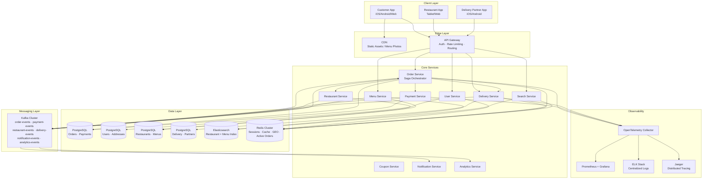
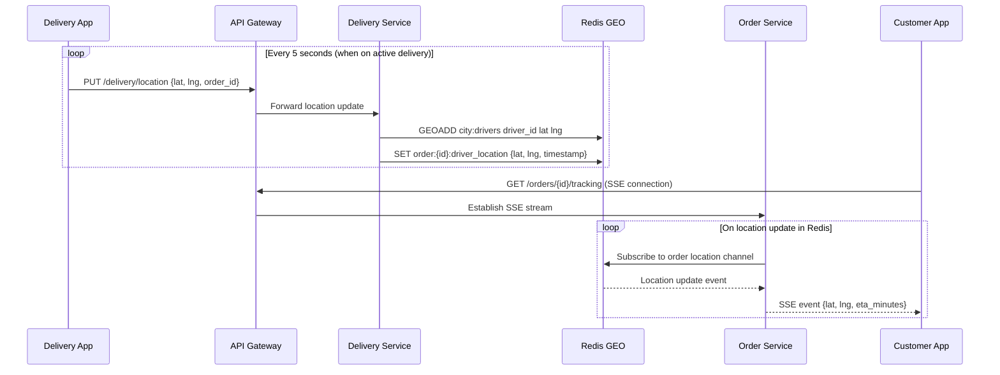
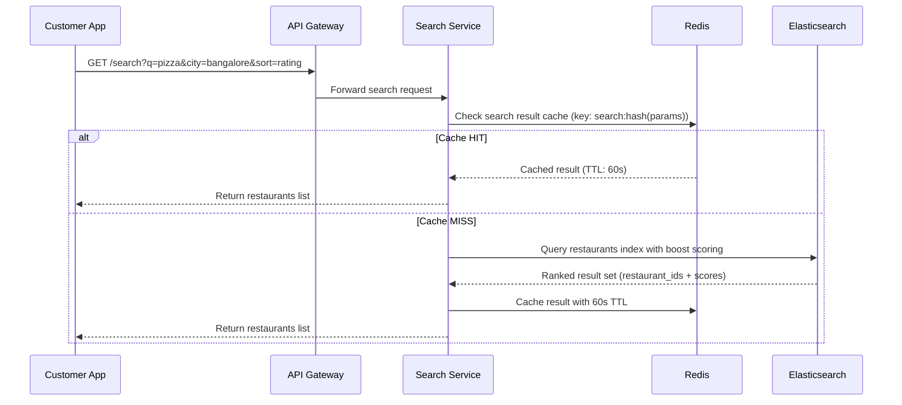

# 01 — High-Level Architecture: Food Delivery Platform

---

## Objective

Define the top-level architectural style, core services, communication patterns, and the end-to-end request flow for the food delivery platform. Justify why Event-Driven Microservices with Saga Orchestration was chosen over alternatives. Provide Mermaid diagrams for the overall system topology and key flows.

---

## 1. Architectural Style Decision

### Chosen: Event-Driven Microservices with Saga Orchestration

| Criterion | Justification |
|-----------|--------------|
| Multi-party coordination | An order spans User, Payment, Restaurant, and Delivery — each owned by a different team and domain |
| Fault isolation | A Restaurant Service outage must not prevent users from browsing or paying |
| Independent scalability | Delivery matching scales differently from payment processing |
| Async resilience | Restaurant acceptance is not instant — the system must hold state across minutes |
| Team ownership | Each bounded context can be owned, deployed, and scaled by a separate team |
| Operational independence | Kafka allows each consumer to process at its own pace without blocking producers |

### Why NOT a Modular Monolith

A modular monolith is a valid choice for early-stage startups with < 100K orders/day. At 5M orders/day with 200K concurrent drivers and 500K restaurants, the operational requirements diverge:

- Delivery location writes (50K RPS) would saturate a single deployment
- Restaurant catalog reads vs order writes compete for the same DB connection pool
- Different services need different scaling policies (delivery = location-heavy; search = CPU-heavy)
- Different failure tolerance requirements per domain

### When to Avoid Microservices

- Team size < 10 engineers — operational overhead exceeds productivity gain
- Domain boundaries are unclear — premature decomposition creates integration hell
- No DevOps maturity — microservices without Kubernetes/observability is chaos
- Early product phase — requirements change fast; service contracts slow iteration

---

## 2. Core Services

| Service | Responsibility | Primary Store |
|---------|---------------|--------------|
| API Gateway | Auth, rate limiting, routing, SSL termination | — |
| Order Service | Saga orchestrator, order lifecycle state machine | PostgreSQL |
| Payment Service | Payment initiation, confirmation, refunds | PostgreSQL + Stripe/Razorpay |
| Restaurant Service | Onboarding, availability, order notification | PostgreSQL |
| Menu Service | Menu CRUD, catalog management | PostgreSQL + Elasticsearch |
| Delivery Service | Partner matching, tracking, ETA calculation | PostgreSQL + Redis GEO |
| Search Service | Restaurant + menu discovery, ranking | Elasticsearch |
| Notification Service | Push, SMS, Email, in-app notifications | — (message consumer) |
| Analytics Service | Business metrics, dashboards, reporting | ClickHouse / BigQuery |
| User Service | Profile, addresses, preferences, sessions | PostgreSQL + Redis |
| Coupon Service | Coupon validation, fraud detection, redemption | PostgreSQL + Redis |

---

## 3. High-Level Architecture Diagram

---

## 4. Request Flow: Customer Places an Order

```mermaid
sequenceDiagram
    autonumber
    participant CA as Customer App
    participant GW as API Gateway
    participant OS as Order Service
    participant CS as Coupon Service
    participant KF as Kafka
    participant PS as Payment Service
    participant RS as Restaurant Service
    participant DS as Delivery Service
    participant NS as Notification Service

    CA->>GW: POST /orders (idempotency-key: UUID)
    GW->>GW: Authenticate JWT, rate limit check
    GW->>OS: Forward request

    OS->>OS: Validate cart items (menu price snapshot)
    OS->>CS: Validate coupon (if any)
    CS-->>OS: Coupon valid, discount amount
    OS->>OS: Create order record (state: PAYMENT_PENDING)
    OS->>OS: Publish OrderCreated event to Kafka
    OS-->>CA: 202 Accepted (order_id, status: PAYMENT_PENDING)

    Note over OS,PS: Saga Step 1 — Payment

    OS->>KF: Publish SagaPaymentRequest (order_id, amount, payment_method)
    KF->>PS: Consume SagaPaymentRequest
    PS->>PS: Initiate payment with gateway
    PS->>KF: Publish PaymentConfirmed / PaymentFailed

    alt Payment Confirmed
        KF->>OS: Consume PaymentConfirmed
        OS->>OS: Update order state → PAYMENT_CONFIRMED
        OS->>KF: Publish SagaRestaurantNotify

        Note over OS,RS: Saga Step 2 — Restaurant Notification

        KF->>RS: Consume SagaRestaurantNotify
        RS->>NS: Notify restaurant (push to tablet)
        RS->>KF: Publish OrderAccepted / OrderRejected (within 3 min SLA)

        alt Restaurant Accepts
            KF->>OS: Consume OrderAccepted
            OS->>OS: Update order state → RESTAURANT_ACCEPTED
            OS->>KF: Publish SagaDeliveryAssign

            Note over OS,DS: Saga Step 3 — Delivery Assignment

            KF->>DS: Consume SagaDeliveryAssign
            DS->>DS: Find nearest available partner
            DS->>KF: Publish DeliveryAssigned / DeliveryAssignmentFailed

            KF->>OS: Consume DeliveryAssigned
            OS->>OS: Update order state → DELIVERY_ASSIGNED
            KF->>NS: Notify customer with driver details + ETA

        else Restaurant Rejects
            KF->>OS: Consume OrderRejected
            OS->>OS: Initiate compensation — SagaPaymentRefund
            OS->>KF: Publish SagaPaymentRefund
            KF->>PS: Process refund
            KF->>NS: Notify customer of cancellation + refund
        end

    else Payment Failed
        KF->>OS: Consume PaymentFailed
        OS->>OS: Update order state → CANCELLED (payment failure)
        KF->>NS: Notify customer of failure
    end
```

---

## 5. Real-Time Delivery Tracking Flow

---

## 6. Restaurant Search Flow

---

## 7. Saga Orchestration vs Choreography

### Why Orchestration was Chosen

| Concern | Orchestration (Chosen) | Choreography |
|---------|----------------------|-------------|
| Visibility of saga state | Central orchestrator owns state machine — easy to query | State distributed across services — hard to reconstruct |
| Compensating transaction control | Orchestrator decides what to compensate and in what order | Each service reacts to events — compensation logic is scattered |
| Debugging failures | One place to look: Order Service saga log | Must correlate events across multiple Kafka topics and services |
| Partial failure handling | Orchestrator detects timeout and triggers compensation | Requires every service to handle timeout scenarios correctly |
| Operational simplicity | One service to monitor for saga health | Saga health is implicit in event flow |
| Coupling | Order Service knows about all participants | Services are loosely coupled via events |
| Single point of failure | Order Service becomes critical path | Resilient — no single orchestrator |

**Decision**: The central visibility requirement (support engineers must be able to say "where is order 12345 in the saga?") and the complexity of compensating transactions across 4 services makes orchestration the pragmatic choice.

Choreography would be preferred for simpler, 2-step flows or where tight decoupling between teams is more important than visibility.

---

## 8. Synchronous vs Asynchronous Communication

| Interaction | Pattern | Justification |
|-------------|---------|--------------|
| Customer places order | Sync (HTTP) to Order Service, then async saga | User needs an immediate response (202 Accepted) |
| Payment processing | Async via Kafka | Payment gateway webhooks are async by nature |
| Restaurant notification | Async via Kafka | Restaurant may not respond immediately |
| Delivery assignment | Async via Kafka | Assignment algorithm may take seconds |
| Driver location update | Sync HTTP → Redis write | Needs to be low-latency, no intermediate queuing needed |
| Search queries | Sync HTTP → Elasticsearch | User expects immediate results |
| Notification delivery | Async via Kafka | Fire-and-forget; notification service is a consumer |
| Analytics | Async via Kafka | No latency requirement; eventual is fine |

---

## 9. API Gateway Responsibilities

| Responsibility | Implementation |
|---------------|---------------|
| Authentication | JWT validation — no upstream service re-validates |
| Rate limiting | Per-user: 100 req/min for customers; per-restaurant: 500 req/min |
| Request routing | Path-based routing to services |
| SSL termination | TLS handled at gateway; internal traffic can be HTTP (mTLS for production) |
| Request correlation ID injection | X-Correlation-ID header added to every request |
| Request logging | Every request/response logged with correlation ID |
| Circuit breaker | If Order Service returns 5xx > threshold, short-circuit with 503 |

Tools: Kong, AWS API Gateway, or Nginx + custom middleware.

---

## 10. Technology Stack Summary

| Layer | Technology | Justification |
|-------|-----------|--------------|
| Backend services | Java + Spring Boot | Strong ecosystem, type safety, Spring Security, battle-tested at scale |
| API Gateway | Kong / AWS API GW | Plugin ecosystem; auth + rate limiting out of the box |
| Message broker | Apache Kafka | Durable, replayable, high-throughput; not RabbitMQ (no replay) |
| Search | Elasticsearch 8.x | Best-in-class for full-text + geo + ranking |
| Cache + GEO + sessions | Redis 7.x Cluster | GEO commands for driver proximity; fast enough for 50K RPS location writes |
| Relational DB | PostgreSQL 15 | ACID compliance for orders/payments; advanced indexing; partitioning support |
| Container orchestration | Kubernetes (EKS/GKE) | HPA for peak load; rolling deployments |
| Service mesh | Istio (optional) | mTLS, observability, circuit breaking at mesh level |
| Tracing | OpenTelemetry + Jaeger | Vendor-neutral; traces across saga steps |
| Metrics | Prometheus + Grafana | Standard stack; alerting via Alertmanager |
| Logging | ELK Stack | Correlation ID based log aggregation |

---

## 11. Tradeoffs

| Decision | Benefit | Cost |
|----------|---------|------|
| Microservices over monolith | Independent scaling, team autonomy | Network overhead, distributed system complexity |
| Kafka over direct service calls | Resilience, replayability, decoupling | Operational complexity, eventual consistency |
| Saga orchestration | Central visibility, controlled compensation | Order Service is a critical single point |
| Redis for driver location | 50K RPS write capable, GEO native commands | Not durable — restart = location loss (tolerable) |
| Elasticsearch for search | Fuzzy matching, geo-ranking, scoring | Index lag, sync complexity, additional infra |

---

## 12. Risks

1. **Order Service as SPOF**: Being the saga orchestrator makes it critical. Mitigate with N+3 replicas, HPA, and stateless design (state in PostgreSQL).
2. **Kafka consumer lag during peak**: If Kafka consumers fall behind, notifications and state updates are delayed. Mitigate with consumer group scaling and consumer lag alerting.
3. **Network partition between services**: Services must handle the case where they publish an event but never receive a response. Saga timeout + compensation handles this.
4. **Elasticsearch index lag**: Menu changes may not appear in search for up to 30 seconds. Document this SLA explicitly to the business.

---

## Interview-Level Discussion Points

1. **Why 202 Accepted instead of 200 OK for order placement?** The saga is async — we cannot guarantee completion synchronously. 202 says "we received your request and it is being processed." 200 would imply completion.

2. **How does the Order Service remain stateless if it is the saga orchestrator?** The saga state is persisted in PostgreSQL (saga_state table), not in service memory. Any instance can pick up and continue a saga.

3. **What happens if the Order Service crashes mid-saga?** On restart, it queries for all sagas in non-terminal states and resumes them. Kafka messages are idempotent — reprocessing is safe.

4. **How do you prevent duplicate orders from retried POST /orders calls?** Idempotency key in the request header. Order Service checks if an order with that key already exists before creating a new one.

5. **What is the blast radius of Elasticsearch going down?** Search and restaurant browsing degrade. Order placement, tracking, and payment are unaffected. This isolation is intentional.
