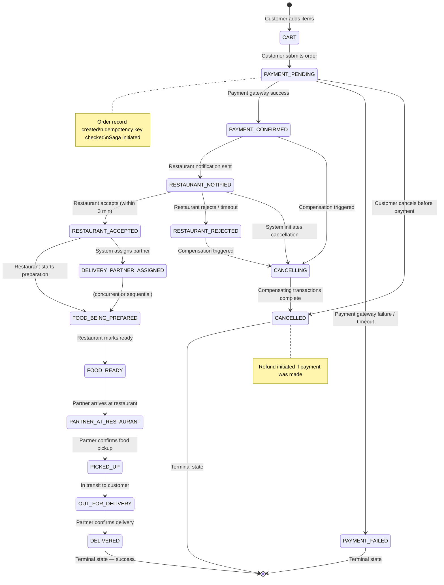
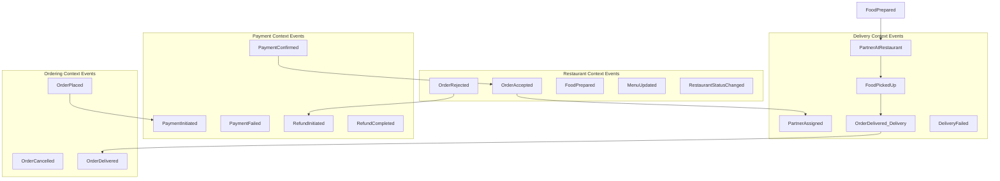

# 02 — Domain Modeling: Food Delivery Platform

---

## Objective

Define the core domain entities, their attributes, relationships, invariants, and lifecycle behavior. Model the Order state machine explicitly — it is the heart of the system. Identify domain events that drive the saga and downstream reactions. Think in terms of Domain-Driven Design (DDD) aggregates and value objects.

---

## 1. Core Domain Entities

### 1.1 User (Customer)

```
User
├── id: UUID
├── name: String
├── email: String (unique)
├── phone: String (unique, verified via OTP)
├── passwordHash: String
├── status: ACTIVE | SUSPENDED | DELETED
├── createdAt: Timestamp
├── loyaltyPoints: Integer
├── defaultAddressId: UUID (FK → Address)
└── preferences: UserPreferences (value object)

UserPreferences (Value Object)
├── dietaryRestrictions: [VEGETARIAN, VEGAN, HALAL, JAIN, NONE]
├── preferredCuisines: [String]
└── notificationSettings: NotificationSettings
```

**Invariants:**
- Email and phone must be unique and verified before first order.
- A deleted user cannot place orders but their historical orders must be retained.
- Loyalty points cannot go negative.

---

### 1.2 Address

```
Address
├── id: UUID
├── userId: UUID (FK → User)
├── label: HOME | WORK | OTHER
├── fullAddress: String
├── street: String
├── city: String
├── pinCode: String
├── country: String
├── latitude: Decimal (precision: 9, scale: 6)
├── longitude: Decimal (precision: 9, scale: 6)
├── landmark: String (optional)
└── isDefault: Boolean
```

**Design Decision:** Latitude and longitude are stored with precision 9,6 (meter-level accuracy). Address strings are stored as-is from the customer — geocoding is done at submission time and the lat/lng is the canonical location.

---

### 1.3 Restaurant

```
Restaurant
├── id: UUID
├── ownerId: UUID (FK → RestaurantOwner)
├── name: String
├── description: String
├── cuisineTypes: [String]
├── status: PENDING_APPROVAL | APPROVED | SUSPENDED | CLOSED
├── isOpen: Boolean (operational status)
├── openingHours: [DaySchedule] (value object)
├── address: RestaurantAddress (embedded)
├── deliveryRadius: Integer (meters)
├── minimumOrderValue: Money (value object)
├── averagePreparationTime: Integer (minutes)
├── rating: Decimal (computed, denormalized)
├── totalRatings: Integer (computed)
├── commissionRate: Decimal
├── onboardedAt: Timestamp
└── logoUrl: String
```

**Invariants:**
- A restaurant can only serve orders if `status = APPROVED AND isOpen = true`.
- `deliveryRadius` must be within city-configured bounds.
- `commissionRate` changes require admin approval.

---

### 1.4 MenuCategory

```
MenuCategory
├── id: UUID
├── restaurantId: UUID (FK → Restaurant)
├── name: String (e.g., "Starters", "Main Course")
├── displayOrder: Integer
├── isActive: Boolean
└── imageUrl: String (optional)
```

---

### 1.5 MenuItem

```
MenuItem
├── id: UUID
├── categoryId: UUID (FK → MenuCategory)
├── restaurantId: UUID (FK → Restaurant, denormalized for queries)
├── name: String
├── description: String
├── price: Money (value object — amount + currency)
├── discountedPrice: Money (nullable, time-bound)
├── isVegetarian: Boolean
├── isVegan: Boolean
├── isAvailable: Boolean
├── preparationTime: Integer (minutes)
├── tags: [String] (e.g., "spicy", "bestseller", "new")
├── imageUrl: String
├── calories: Integer (optional)
├── allergens: [String]
└── displayOrder: Integer
```

**Value Object: Money**
```
Money
├── amount: Long (in minor units — paise, cents)
├── currency: String (ISO 4217)
```

**Critical Design Decision:** Prices are stored in minor units (paise, cents) to avoid floating-point arithmetic errors. All monetary calculations happen in integer arithmetic.

---

### 1.6 Order (Primary Aggregate)

The Order is the most important aggregate in the system. It owns the entire order lifecycle.

```
Order (Aggregate Root)
├── id: UUID
├── customerId: UUID
├── restaurantId: UUID
├── deliveryAddressId: UUID
├── status: OrderStatus (see state machine)
├── items: [OrderItem] (owned by Order aggregate)
├── subtotal: Money
├── deliveryFee: Money
├── discount: Money
├── platformFee: Money
├── totalAmount: Money
├── paymentMethod: CARD | UPI | WALLET | COD
├── paymentId: UUID (FK → Payment, nullable until payment created)
├── deliveryPartnerId: UUID (nullable until assigned)
├── estimatedDeliveryTime: Timestamp
├── actualDeliveryTime: Timestamp (nullable)
├── specialInstructions: String (max 200 chars)
├── idempotencyKey: String (unique, from client)
├── sagaState: SagaState (see saga design)
├── cancelledBy: CUSTOMER | RESTAURANT | SYSTEM | ADMIN
├── cancellationReason: String
├── createdAt: Timestamp
├── updatedAt: Timestamp
└── version: Integer (optimistic lock)
```

**OrderItem (Entity, owned by Order)**
```
OrderItem
├── id: UUID
├── orderId: UUID
├── menuItemId: UUID
├── menuItemName: String (snapshot — price at order time)
├── unitPrice: Money (snapshot — price at order time)
├── quantity: Integer
├── totalPrice: Money
└── customizations: String (free text, e.g., "no onions")
```

**Design Decision — Price Snapshot:** `menuItemName` and `unitPrice` are copied from MenuItem at order creation time. This is critical: if a restaurant updates their menu price after an order is placed, the order must reflect the price at the time of placement. Never store only menuItemId and look up price dynamically.

---

### 1.7 Order State Machine

This is the most critical behavioral model in the system.



**Valid State Transitions (Enforced by Domain Logic):**

| From State | To State | Trigger | Actor |
|-----------|---------|---------|-------|
| PAYMENT_PENDING | PAYMENT_CONFIRMED | PaymentConfirmed event | Payment Service |
| PAYMENT_PENDING | PAYMENT_FAILED | PaymentFailed event | Payment Service |
| PAYMENT_CONFIRMED | RESTAURANT_NOTIFIED | Notification sent | Order Service |
| RESTAURANT_NOTIFIED | RESTAURANT_ACCEPTED | Restaurant accepts | Restaurant Service |
| RESTAURANT_NOTIFIED | RESTAURANT_REJECTED | Restaurant rejects / 3-min timeout | System |
| RESTAURANT_ACCEPTED | DELIVERY_PARTNER_ASSIGNED | Partner assigned | Delivery Service |
| DELIVERY_PARTNER_ASSIGNED | PICKED_UP | Partner confirms pickup | Delivery Partner App |
| PICKED_UP | DELIVERED | Partner confirms delivery | Delivery Partner App |
| Any non-terminal | CANCELLING | Customer/System cancel | User / Saga |
| CANCELLING | CANCELLED | Compensations complete | Order Service |

**Invariants:**
- State transitions must be atomic — enforced by `version` field (optimistic locking).
- Once in `DELIVERED` or `CANCELLED`, no further transitions are allowed.
- A `CANCELLING` state indicates that compensating transactions are in progress — no new forward transitions allowed.
- Customer can cancel only up to `RESTAURANT_ACCEPTED` state; after that, cancellation requires restaurant confirmation.

---

### 1.8 Payment

```
Payment
├── id: UUID
├── orderId: UUID (FK → Order)
├── customerId: UUID
├── amount: Money
├── method: CARD | UPI | WALLET | COD | POINTS
├── status: INITIATED | PENDING | CONFIRMED | FAILED | REFUND_INITIATED | REFUNDED
├── gatewayProvider: STRIPE | RAZORPAY | PAYTM
├── gatewayTransactionId: String (external reference)
├── gatewayResponse: JSONB (raw response, for audit)
├── refundId: UUID (nullable)
├── refundAmount: Money (nullable)
├── refundInitiatedAt: Timestamp
├── refundCompletedAt: Timestamp
├── createdAt: Timestamp
└── updatedAt: Timestamp
```

**Invariants:**
- One order has at most one Payment record.
- A CONFIRMED payment can only transition to REFUND_INITIATED, not directly to any other state.
- `gatewayTransactionId` must be stored to prevent duplicate charge on retry.

---

### 1.9 DeliveryPartner

```
DeliveryPartner
├── id: UUID
├── name: String
├── phone: String (verified)
├── email: String
├── vehicleType: BICYCLE | MOTORBIKE | CAR | WALKER
├── vehicleNumber: String
├── status: PENDING_VERIFICATION | ACTIVE | SUSPENDED | OFFLINE
├── isOnline: Boolean (current shift status)
├── currentLocation: GeoPoint (live, from Redis — NOT this DB record)
├── rating: Decimal
├── totalDeliveries: Integer
├── cityId: UUID (home city)
├── bankAccountId: UUID (FK → PayoutAccount)
└── joinedAt: Timestamp
```

**Note:** `currentLocation` in the database is the last known location persisted (every 5 minutes for history). The real-time location lives in Redis GEO sets and is not stored per-location-update in PostgreSQL (that would be 144M writes/hour — infeasible).

---

### 1.10 Delivery

```
Delivery
├── id: UUID
├── orderId: UUID (FK → Order)
├── partnerId: UUID (FK → DeliveryPartner)
├── restaurantLocation: GeoPoint
├── customerLocation: GeoPoint
├── status: ASSIGNED | ACCEPTED | AT_RESTAURANT | PICKED_UP | DELIVERED | FAILED
├── estimatedPickupTime: Timestamp
├── actualPickupTime: Timestamp
├── estimatedDeliveryTime: Timestamp
├── actualDeliveryTime: Timestamp
├── distanceKm: Decimal
├── deliveryFee: Money
├── partnerEarning: Money
├── routePolyline: Text (encoded route, optional)
└── failureReason: String (if status = FAILED)
```

---

### 1.11 Review

```
Review
├── id: UUID
├── orderId: UUID (FK → Order, unique — one review per order)
├── customerId: UUID
├── restaurantId: UUID
├── deliveryPartnerId: UUID (nullable)
├── restaurantRating: Integer (1–5)
├── deliveryRating: Integer (1–5, nullable)
├── reviewText: String (max 500 chars)
├── tags: [String] (e.g., "great packaging", "fast delivery")
├── isVisible: Boolean (moderated)
├── createdAt: Timestamp
└── flaggedAt: Timestamp (if flagged for moderation)
```

**Invariants:**
- A review can only be submitted for an order in `DELIVERED` state.
- One review per order per customer.
- Review visibility is controlled by moderation — not publicly visible until `isVisible = true`.

---

### 1.12 Coupon

```
Coupon
├── id: UUID
├── code: String (unique)
├── type: PERCENTAGE | FIXED_AMOUNT | FREE_DELIVERY | BOGO
├── discountValue: Decimal (percentage or amount)
├── minimumOrderValue: Money
├── maximumDiscountAmount: Money (cap for percentage coupons)
├── applicableTo: ALL | SPECIFIC_RESTAURANTS | SPECIFIC_CATEGORIES | NEW_USERS
├── restaurantIds: [UUID] (nullable, for targeted coupons)
├── usageLimitTotal: Integer (global limit)
├── usageLimitPerUser: Integer
├── currentUsageCount: Integer (atomic counter in Redis)
├── validFrom: Timestamp
├── validUntil: Timestamp
├── isActive: Boolean
└── createdAt: Timestamp
```

---

## 2. Domain Events

Domain events are the integration mechanism between bounded contexts. They are facts — things that happened in the domain.



### Event Schema Design

Each event follows a standard envelope:

```
EventEnvelope
├── eventId: UUID (for idempotency)
├── eventType: String (e.g., "order.placed")
├── aggregateId: UUID (e.g., order_id)
├── aggregateType: String (e.g., "Order")
├── occurredAt: Timestamp
├── version: Integer (event schema version)
├── correlationId: UUID (same as order_id for all saga events)
├── causationId: UUID (event_id of the triggering event)
└── payload: {event-specific data}
```

**Why correlationId and causationId?**
- `correlationId`: Links all events belonging to the same saga/order. Enables distributed tracing.
- `causationId`: Links each event to its trigger. Enables causal chain reconstruction for debugging.

---

## 3. Aggregate Boundaries

| Aggregate | Contains | Does NOT contain |
|-----------|---------|------------------|
| Order | OrderItems, sagaState | Payment details, DeliveryPartner |
| Restaurant | MenuCategories, MenuItems | Orders, Reviews |
| DeliveryPartner | Payout settings | Order details, real-time location |
| Payment | Refund details | Order business logic |
| User | Addresses, preferences | Order history |

**Why these boundaries?**
Each aggregate is a transactional consistency boundary. Everything inside an aggregate is updated atomically. Cross-aggregate operations happen via domain events or explicit API calls — never via a join or shared transaction.

---

## 4. Value Objects

| Value Object | Used In | Immutability |
|-------------|---------|-------------|
| Money (amount, currency) | Order, Payment, MenuItem | Immutable |
| GeoPoint (lat, lng) | Address, Restaurant, Delivery | Immutable |
| DaySchedule (dayOfWeek, openTime, closeTime) | Restaurant | Immutable |
| OrderStatus | Order | Immutable enum |
| IdempotencyKey | Order | Immutable once set |

---

## 5. Tradeoffs

| Decision | Benefit | Cost |
|----------|---------|------|
| Price snapshot in OrderItem | Order integrity across menu price changes | Duplicated data between orders and menu |
| Optimistic locking on Order | No DB-level row locks during high concurrency | Requires retry on version conflict |
| Money in minor units | No floating-point errors | Slight complexity in display layer |
| Real-time location in Redis only | 50K RPS capable, sub-millisecond | Location history not directly in DB |

---

## 6. Alternatives Considered

- **Storing location history in PostgreSQL with TimescaleDB**: Could support driver trajectory analytics. Rejected for V1 due to write volume (144M rows/day). Can be added via Kafka → TimescaleDB sink in V3.
- **Using a Cart Service**: Cart could be a separate service. Decided that cart state (ephemeral, session-scoped) lives in Redis and does not need its own microservice. Cart-to-order conversion is handled entirely by Order Service.
- **Review as part of Order aggregate**: Rejected because reviews have their own moderation lifecycle, visibility controls, and analytics requirements that are independent of the order lifecycle.

---

## Interview-Level Discussion Points

1. **Why is the Order an aggregate root rather than a simple entity?** The Order enforces all consistency rules for the order lifecycle — items, state, pricing, saga state. Making it an aggregate root prevents external services from modifying order items directly, ensuring all invariants are enforced through the Order.

2. **How do you handle the scenario where a customer changes their delivery address after placing an order?** The `deliveryAddressId` on the Order is snapshotted as a GeoPoint at order creation time. After `PAYMENT_CONFIRMED`, address changes are not allowed — the customer must cancel and reorder. This is a business rule, not a technical limitation.

3. **What does the `version` field on Order do?** It implements optimistic locking. When the Order Service updates order state, it does `UPDATE orders SET status=?, version=version+1 WHERE id=? AND version=?`. If two saga events arrive concurrently and both try to transition the same order, only one will succeed. The other sees 0 rows updated and knows it lost the race.

4. **Why store `cancelledBy` and `cancellationReason`?** This is critical for the refund policy — a restaurant-initiated cancellation entitles the customer to a full refund, while a customer-initiated cancellation post-restaurant-acceptance may incur a fee. The business logic depends on this field.

5. **Why is COD special in the saga?** For COD orders, the Payment step in the saga is skipped — the order moves from `PAYMENT_PENDING` directly to `RESTAURANT_NOTIFIED` after a COD confirmation. A separate cash reconciliation flow handles settlement after delivery.
