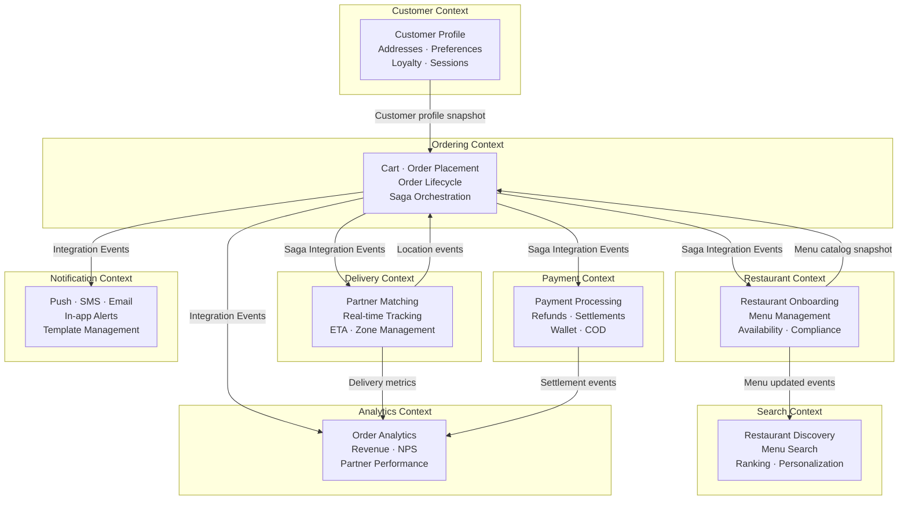
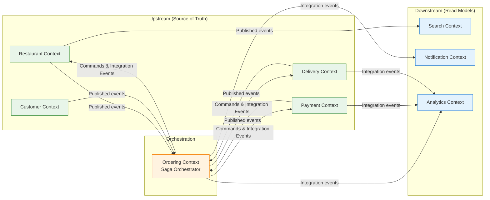
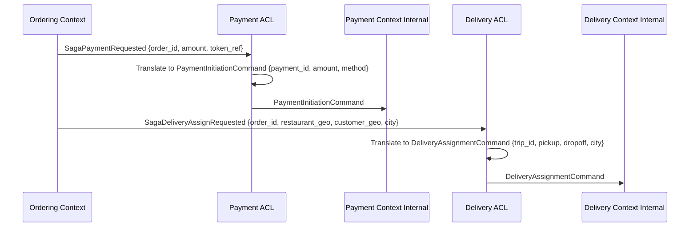

# 03 — DDD Bounded Contexts: Food Delivery Platform

---

## Objective

Define the bounded contexts of the food delivery platform, their internal models, the relationships between them, and how they integrate. Explain how the Saga pattern spans multiple bounded contexts and how anti-corruption layers (ACLs) protect each context from foreign domain models. This document translates domain knowledge into service ownership and integration contracts.

---

## 1. Overview of Bounded Contexts

---

## 2. Bounded Context Definitions

### 2.1 Customer Context

**Purpose:** Manages everything about a customer's identity and profile, independent of what they order.

**Owns:**
- User entity (identity, contact info, status)
- Addresses (saved delivery locations)
- Preferences (dietary, cuisine, notifications)
- Loyalty points balance
- Authentication sessions

**Does NOT own:**
- Order history (owned by Ordering Context — Customer Context may read it via a read model)
- Payment methods (owned by Payment Context — stored tokenized)
- Delivery addresses once embedded in an order (Order Context snapshots these)

**Internal Ubiquitous Language:**
- Customer, not "user" (a delivery partner is also a user, but in a different context)
- Address (not "location" — that's Delivery Context terminology)
- Loyalty credit/debit (not "points add/subtract")

**Integration Events Published:**
- `CustomerRegistered` → consumed by Notification Context
- `CustomerSuspended` → consumed by Ordering Context (to block new orders)
- `AddressVerified` → consumed by Search Context (to show nearby restaurants)

**Integration Events Consumed:**
- `OrderDelivered` → increment loyalty points
- `RefundCompleted` → credit wallet if applicable

---

### 2.2 Restaurant Context

**Purpose:** Manages restaurant lifecycle from onboarding through daily operations — menu, availability, compliance.

**Owns:**
- Restaurant entity (profile, status, commission rate)
- MenuCategory, MenuItem (owned by Restaurant aggregate)
- RestaurantOwner (login, portal access)
- Operating hours and availability
- Compliance documents

**Does NOT own:**
- Order assignment (Ordering Context assigns orders)
- Restaurant ratings (Reviews are in Ordering Context — Restaurant Context maintains a denormalized `rating` field updated by integration events)
- Payment settlement (Payment Context owns this)

**Internal Ubiquitous Language:**
- Restaurant (not "vendor" or "merchant" — keep it domain-specific)
- Menu item availability (not "stock" — restaurants don't use inventory management in MVP)
- Prep time (not "processing time")

**Integration Events Published:**
- `MenuItemUpdated` → consumed by Search Context (to re-index)
- `RestaurantStatusChanged` (open/closed) → consumed by Search Context (to exclude closed restaurants)
- `OrderAccepted` → consumed by Ordering Context
- `OrderRejected` → consumed by Ordering Context
- `FoodPrepared` → consumed by Delivery Context

**Integration Events Consumed:**
- `OrderPlaced` → push notification to restaurant tablet
- `DeliveryPartnerAssigned` → show partner details to restaurant
- `ReviewSubmitted` → update denormalized rating

---

### 2.3 Ordering Context

**Purpose:** The core orchestration context. Manages the full lifecycle of an order from cart to delivery, and orchestrates the saga across all other contexts.

**Owns:**
- Cart (ephemeral, in Redis — not a DB entity)
- Order aggregate (including OrderItems)
- Saga state machine
- Idempotency key management
- Cancellation and refund initiation

**Does NOT own:**
- Payment mechanics (delegates to Payment Context)
- Restaurant acceptance logic (delegates to Restaurant Context)
- Driver matching algorithm (delegates to Delivery Context)

**Internal Ubiquitous Language:**
- Order (not "transaction")
- Order state (not "order status" — state implies a state machine)
- Placed, Accepted, Prepared, Picked Up, Delivered (domain verbs, not technical terms)
- Compensating transaction (not "rollback")
- Saga (not "workflow" or "process")

**Integration Events Published (Saga Orchestration Commands):**
- `SagaPaymentRequested` → Payment Context
- `SagaRestaurantNotifyRequested` → Restaurant Context
- `SagaDeliveryAssignRequested` → Delivery Context
- `SagaPaymentRefundRequested` → Payment Context (compensation)
- `SagaCancelDeliveryRequested` → Delivery Context (compensation)

**Integration Events Consumed:**
- `PaymentConfirmed` / `PaymentFailed` → advance/compensate saga
- `OrderAccepted` / `OrderRejected` → advance/compensate saga
- `DeliveryAssigned` / `DeliveryAssignmentFailed` → advance/compensate saga
- `FoodPickedUp` → update order state
- `OrderDelivered_Delivery` → finalize order

---

### 2.4 Payment Context

**Purpose:** Handles all monetary flows — charges, refunds, settlements, and wallet management. PCI DSS scope is contained entirely within this context.

**Owns:**
- Payment entity
- Refund entity
- Wallet (customer wallet balance)
- Payment method tokens (never raw card data)
- Payment gateway integration (Stripe, Razorpay, etc.)

**Does NOT own:**
- Order business logic
- Commission calculation (shared kernel with Analytics Context)
- Coupon mechanics (Coupon Service, which integrates with Ordering Context)

**Internal Ubiquitous Language:**
- Charge (not "payment process")
- Settlement (restaurant payout, not "payment")
- Refund (not "reverse transaction")
- Authorization, Capture (matches payment gateway terminology)

**Anti-Corruption Layer (ACL):**
When Ordering Context sends `SagaPaymentRequested`, it sends an order amount and payment token reference — NOT the full Order entity. The Payment Context has its own translation layer that maps incoming integration events to its internal Payment model. This prevents the Payment Context from coupling to Order domain model changes.

**Integration Events Published:**
- `PaymentConfirmed` → consumed by Ordering Context
- `PaymentFailed` → consumed by Ordering Context
- `RefundInitiated` → consumed by Notification Context
- `RefundCompleted` → consumed by Ordering Context, Notification Context
- `SettlementProcessed` → consumed by Analytics Context

**Integration Events Consumed:**
- `SagaPaymentRequested` → initiate charge
- `SagaPaymentRefundRequested` → initiate refund
- `OrderDelivered` → trigger restaurant settlement

---

### 2.5 Delivery Context

**Purpose:** Manages the entire delivery operation — partner onboarding, availability management, order assignment algorithm, real-time tracking, and ETA computation.

**Owns:**
- DeliveryPartner entity
- Delivery entity (trip record)
- Zone management (city zones, delivery radius)
- Partner availability (online/offline, active delivery count)
- Real-time location (Redis GEO — not stored per-update in DB)

**Does NOT own:**
- Order financial details (delivery fee is calculated here but applied in Order)
- Customer notification (delegates to Notification Context)
- Partner earnings reconciliation (Analytics Context)

**Internal Ubiquitous Language:**
- Partner (not "driver" or "delivery boy")
- Zone (not "area")
- Assignment (not "dispatch")
- Trip (the delivery entity)
- ETA (always computed from current location + traffic model)

**Anti-Corruption Layer:**
When receiving `SagaDeliveryAssignRequested`, the Delivery Context translates it into its own `DeliveryRequest` model. The restaurant location and customer location come from the event payload — Delivery Context never calls back to Restaurant or Customer Context to fetch these.

**Integration Events Published:**
- `DeliveryAssigned` → consumed by Ordering Context
- `DeliveryAssignmentFailed` → consumed by Ordering Context (compensation)
- `PartnerAtRestaurant` → consumed by Ordering Context, Restaurant Context
- `FoodPickedUp` → consumed by Ordering Context
- `OrderDelivered_Delivery` → consumed by Ordering Context
- `DeliveryFailed` → consumed by Ordering Context (compensation)

**Integration Events Consumed:**
- `SagaDeliveryAssignRequested` → trigger partner matching
- `FoodPrepared` → signal partner to proceed to restaurant
- `SagaCancelDeliveryRequested` → cancel trip, free up partner

---

### 2.6 Search Context

**Purpose:** Handles all discovery and search features — restaurant listing, menu item search, sorting and ranking.

**Owns:**
- Elasticsearch index for restaurants
- Elasticsearch index for menu items
- Search ranking model (rule-based in V1, ML-based in V3)
- Search result cache

**Does NOT own:**
- Restaurant data (consumes from Restaurant Context via events)
- Order data (but can use order history for personalization in V3)

**Internal Ubiquitous Language:**
- Discovery (not "search" in all contexts — browsing the home page is "discovery")
- Ranking score (weighted sum of rating, delivery time, distance, sponsored)
- Relevance (text match quality)

**Integration Events Consumed:**
- `MenuItemUpdated` → re-index menu item in Elasticsearch
- `RestaurantStatusChanged` → update `isOpen` field in index
- `ReviewAggregated` → update rating in index
- `RestaurantOnboarded` → add to index

**Note:** Search Context is a pure read model — it has no commands that modify domain state. It is the canonical example of a CQRS read side.

---

### 2.7 Notification Context

**Purpose:** Manages all outbound communications. It is a pure consumer — it reacts to domain events and sends notifications. It has no business logic about what constitutes an important event.

**Owns:**
- Notification templates
- Delivery channel configuration (push, SMS, email)
- Notification log (for deduplication and audit)
- Customer notification preferences (read from Customer Context, cached locally)

**Does NOT own:**
- Business decision of when to notify (that decision is embedded in the event producer)
- Push token management (shared with Customer Context)

**Internal Ubiquitous Language:**
- Notification (not "message")
- Channel (push, SMS, email — not "provider")
- Template (parameterized notification content)

**Integration Events Consumed:**
- Every terminal event in every saga step (OrderPlaced, PaymentConfirmed, OrderAccepted, DeliveryAssigned, PickedUp, Delivered, Cancelled, RefundInitiated)

---

### 2.8 Analytics Context

**Purpose:** Provides business intelligence, performance metrics, and operational dashboards. It is an event-driven read model — all data comes via Kafka.

**Owns:**
- Aggregated order metrics (revenue, conversion rate, order counts)
- Restaurant performance metrics
- Partner performance metrics
- City-level operational dashboards

**Does NOT own:**
- Any transactional data — it is a derived, read-only view

**Integration Events Consumed:**
- All domain events from all contexts (via a dedicated analytics Kafka consumer group)

---

## 3. Context Map

### Context Relationships

| Relationship | Type | Notes |
|-------------|------|-------|
| Ordering ↔ Payment | Partnership with ACL | Both are core — integration events with explicit contracts |
| Ordering ↔ Restaurant | Partnership with ACL | — |
| Ordering ↔ Delivery | Partnership with ACL | — |
| Customer → Ordering | Upstream/Downstream | Customer provides data; Ordering consumes it |
| Restaurant → Search | Open Host Service | Restaurant publishes events; Search subscribes |
| All Contexts → Analytics | Published Language | Analytics subscribes to all events as read model |
| All Contexts → Notification | Open Host Service | Notification is a dumb consumer of published events |

---

## 4. Anti-Corruption Layers (ACL) in the Saga

The saga orchestrator in Ordering Context sends **integration events** (not domain events) to other contexts. Each receiving context has an ACL that translates the integration event into its own domain model.

**What the ACL Prevents:**
- Payment Context never imports Order domain classes
- If the Order model changes, only the ACL adapter needs updating — not the Payment Context internal model
- Each context can evolve its internal model independently

---

## 5. Shared Kernel

Some concepts are shared across contexts and must be kept in sync:

| Shared Concept | Used By | Management |
|---------------|---------|-----------|
| Money (amount + currency) | Ordering, Payment, Analytics | Shared library (money-commons) |
| GeoPoint (lat + lng) | Ordering, Delivery, Search | Shared library |
| CityId | All contexts | Shared enum/config |
| Idempotency key format | Ordering, Payment | Shared convention |

**Risk:** Shared kernel changes can break multiple contexts simultaneously. Changes must be versioned and backward-compatible.

---

## 6. Tradeoffs

| Decision | Benefit | Cost |
|----------|---------|------|
| Separate Search Context | Can evolve ranking without touching core domain | Eventual consistency — menu changes take seconds to appear in search |
| ACLs between Ordering and Payment | Independent evolution of each domain | Additional translation code; another abstraction layer |
| Analytics as pure read model | Never affects transactional performance | Delayed insights; analytics is T+seconds, not real-time |
| Notification as dumb consumer | Zero coupling to business logic | Business rules for notification routing must be in the event producers |

---

## 7. Risks

1. **Integration event schema evolution**: If Payment Context changes its `PaymentConfirmed` event schema, the ACL in Ordering Context must be updated simultaneously. **Mitigation**: Kafka schema registry with backward-compatible evolution rules.

2. **Saga state explosion**: If new saga steps are added (e.g., pre-order scheduling), the Ordering Context state machine grows. **Mitigation**: Model saga state as a separate table from order state; use a saga framework.

3. **Context drift**: Over time, teams add direct DB access across contexts instead of using integration events. **Mitigation**: Enforce through code review policy and deployment isolation (separate databases per context).

---

## Interview-Level Discussion Points

1. **Why is the Ordering Context the saga orchestrator rather than using choreography?** With choreography, the saga state is implicit in the events flowing through Kafka. When something goes wrong at 3 AM, finding out which orders are stuck requires correlating events across 5 topics. With orchestration, the Order Service has explicit saga state in its DB — a single query shows all stuck orders.

2. **What is an Anti-Corruption Layer and when is it necessary?** An ACL is a translation layer that prevents one bounded context's domain model from leaking into another. It is necessary when two contexts have different ubiquitous languages or evolve at different rates. Between Ordering and Payment, the concepts of "order total" and "charge amount" are similar but not identical — the ACL handles this translation.

3. **Why does the Search Context not call the Restaurant Service API to get menu data?** Because that creates synchronous coupling between Search and Restaurant. Instead, Search subscribes to `MenuItemUpdated` events from Kafka. If Restaurant Service is down, Search still works (with slightly stale data). This is the publish-subscribe pattern — loose coupling, high availability.

4. **What is the Shared Kernel and what are its risks?** The shared kernel contains code shared between multiple bounded contexts (like the Money value object). The risk is that a change to the shared kernel can break multiple contexts simultaneously. It must be versioned carefully and changes must be backward-compatible.

5. **How does the Analytics Context avoid impacting transactional performance?** Analytics only consumes from Kafka — it never reads from the transactional databases. This is the CQRS principle applied at the context level: writes happen in transactional contexts, reads for analytics happen from event-sourced read models.
