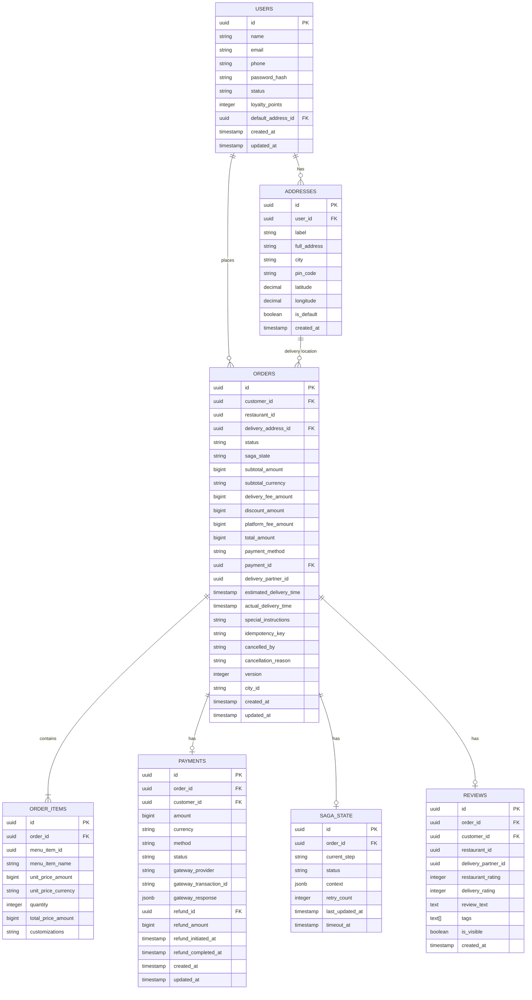
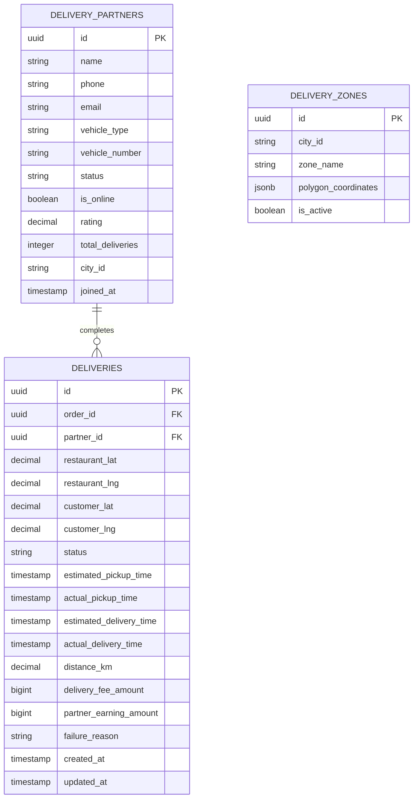
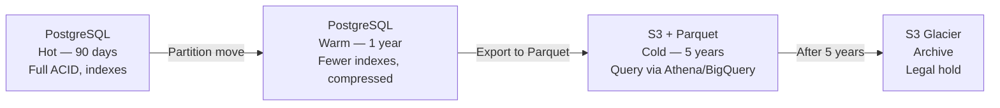

# 05 — Database Design: Food Delivery Platform

---

## Objective

Design the data persistence layer for the food delivery platform. Define the relational schema, ER diagrams, partitioning strategy, indexing approach, sharding considerations, and archival strategy. Justify which data lives where — PostgreSQL vs Redis vs Elasticsearch — and how they work together.

---

## 1. Database Per Service Strategy

Each service owns its own database schema. No cross-service JOINs. Cross-service data needs are served via:
- Domain events (Kafka) for eventual consistency
- Read models maintained by each service
- API calls when strong consistency is required

| Service | Primary Store | Secondary Store |
|---------|--------------|----------------|
| Order Service | PostgreSQL (orders DB) | Redis (active order cache) |
| User Service | PostgreSQL (users DB) | Redis (sessions) |
| Restaurant Service | PostgreSQL (restaurant DB) | Redis (catalog cache) |
| Menu Service | PostgreSQL (menu DB) | Elasticsearch + Redis |
| Delivery Service | PostgreSQL (delivery DB) | Redis GEO |
| Payment Service | PostgreSQL (payment DB) | — |
| Search Service | Elasticsearch | Redis (search cache) |
| Analytics Service | ClickHouse / BigQuery | — |

---

## 2. Entity-Relationship Diagram (Orders Domain)



---

## 3. Entity-Relationship Diagram (Restaurant Domain)

```mermaid
erDiagram
    RESTAURANTS {
        uuid id PK
        uuid owner_id FK
        string name
        text description
        text[] cuisine_types
        string status
        boolean is_open
        string city_id
        decimal latitude
        decimal longitude
        integer delivery_radius_meters
        bigint minimum_order_amount
        integer avg_prep_time_minutes
        decimal rating
        integer total_ratings
        decimal commission_rate
        timestamp onboarded_at
        timestamp updated_at
    }

    RESTAURANT_OWNERS {
        uuid id PK
        string name
        string email
        string phone
        string password_hash
        string status
        timestamp created_at
    }

    MENU_CATEGORIES {
        uuid id PK
        uuid restaurant_id FK
        string name
        integer display_order
        boolean is_active
        string image_url
    }

    MENU_ITEMS {
        uuid id PK
        uuid category_id FK
        uuid restaurant_id FK
        string name
        text description
        bigint price_amount
        string price_currency
        bigint discounted_price_amount
        boolean is_vegetarian
        boolean is_vegan
        boolean is_available
        integer prep_time_minutes
        text[] tags
        text[] allergens
        string image_url
        integer display_order
        timestamp created_at
        timestamp updated_at
    }

    RESTAURANTS ||--|{ MENU_CATEGORIES : "has"
    MENU_CATEGORIES ||--|{ MENU_ITEMS : "contains"
    RESTAURANT_OWNERS ||--|{ RESTAURANTS : "owns"
```



---

## 4. Entity-Relationship Diagram (Delivery Domain)



---

## 5. Orders Table — Partitioning Strategy

The orders table will have 50M+ rows after the first year. Without partitioning, queries degrade.

### Partitioning Approach: Range by Month + List by City

```sql
-- Conceptual PostgreSQL partitioning
-- Parent table is partitioned by month and city

orders → orders_bangalore_2025_01
       → orders_bangalore_2025_02
       → orders_mumbai_2025_01
       → orders_mumbai_2025_02
       ...
```

**Partition Keys:**
1. `city_id` (LIST partitioning) — city-level operational queries are the most common
2. `created_at` (RANGE partitioning by month) — time-range queries for analytics

**Why composite partitioning?**
- Operations teams query "show me all orders in Bangalore today" — this hits a single partition
- Analytics queries scan entire months — partition pruning eliminates irrelevant months
- Archive strategy: drop old partitions after moving to cold storage

**Partition Size Estimate:**
- 5M orders/day × 30 days = 150M orders/month
- With 50 cities, average partition = 3M rows/month — manageable for PostgreSQL

---

## 6. Indexing Strategy

### Orders Table Indexes

```
Primary: id (UUID, PK)
Index 1: (customer_id, created_at DESC) — customer order history
Index 2: (restaurant_id, status, created_at) — restaurant's active orders
Index 3: (status, city_id, created_at) — operations dashboard
Index 4: (idempotency_key) UNIQUE — duplicate order prevention
Index 5: (delivery_partner_id, status) — partner's active delivery
Index 6: (payment_id) — payment-order join
```

### Menu Items Indexes

```
Primary: id (UUID, PK)
Index 1: (restaurant_id, is_available) — restaurant menu fetch
Index 2: (category_id, display_order) — category display order
Index 3: (restaurant_id, updated_at DESC) — detect menu changes for search sync
```

### Delivery Partners Indexes

```
Primary: id (UUID, PK)
Index 1: (city_id, is_online, status) — find available partners in city
Index 2: (phone) UNIQUE — partner login
```

### Composite Index Considerations

For the `orders` table, avoid indexing `status` alone — it has low cardinality (8 values) and won't help the planner. Always pair with a high-cardinality column like `customer_id` or `restaurant_id`.

---

## 7. Redis Data Structures

### 7.1 Active Order State Cache

```
Key:    order:{order_id}:state
Type:   Hash
Fields: status, restaurant_id, partner_id, eta_epoch, updated_at
TTL:    24 hours (auto-expire if order is terminal)

Purpose: Fast reads for tracking API without hitting PostgreSQL.
         Updated on every order state transition.
```

### 7.2 Driver Real-Time Location (GEO)

```
Key:    geo:drivers:{city_id}
Type:   Sorted Set (Redis GEO)
Members: {partner_id} → geospatial position

Commands:
  GEOADD geo:drivers:bangalore partner_123 77.5946 12.9716
  GEORADIUS geo:drivers:bangalore 77.6000 12.9800 5 km WITHCOORD COUNT 10 ASC

TTL:    None (members are removed when partner goes offline)
Eviction: Partner goes offline → ZREM removes their entry
```

### 7.3 Driver Active Delivery State

```
Key:    driver:{partner_id}:active_delivery
Type:   Hash
Fields: order_id, status, pickup_lat, pickup_lng, dropoff_lat, dropoff_lng
TTL:    2 hours (trip max duration)
```

### 7.4 Last Known Driver Location (for Tracking)

```
Key:    order:{order_id}:driver_location
Type:   Hash
Fields: lat, lng, bearing, speed, timestamp
TTL:    30 seconds (stale location detection)

Purpose: Customer tracking SSE reads this key; updated every 5s by driver app.
         If TTL expires, show "location unavailable" to customer.
```

### 7.5 Restaurant Catalog Cache

```
Key:    restaurant:{restaurant_id}:menu
Type:   String (serialized JSON)
TTL:    5 minutes (300 seconds)

Invalidation: Pub/sub channel restaurant:cache:invalidate
              Published when restaurant updates menu
```

### 7.6 Session Tokens

```
Key:    session:{user_id}:{device_id}
Type:   String (serialized session data)
TTL:    7 days (rolling)

Note:   JWT is stateless; session store is for revocation tracking
```

### 7.7 Coupon Usage Counter

```
Key:    coupon:{coupon_code}:usage
Type:   String (integer counter)
TTL:    Until coupon expiry

Commands:
  INCR coupon:FIRST50:usage → atomic increment
  Used to check against Coupon.usageLimitTotal without DB query
```

---

## 8. Elasticsearch Schema

### 8.1 Restaurant Index

```json
{
  "mappings": {
    "properties": {
      "id": { "type": "keyword" },
      "name": { "type": "text", "analyzer": "standard",
                "fields": { "keyword": { "type": "keyword" } } },
      "description": { "type": "text" },
      "cuisine_types": { "type": "keyword" },
      "city_id": { "type": "keyword" },
      "location": { "type": "geo_point" },
      "delivery_radius_meters": { "type": "integer" },
      "is_open": { "type": "boolean" },
      "rating": { "type": "float" },
      "total_ratings": { "type": "integer" },
      "avg_delivery_time_minutes": { "type": "integer" },
      "minimum_order_amount": { "type": "long" },
      "tags": { "type": "keyword" },
      "is_promoted": { "type": "boolean" },
      "promoted_score_boost": { "type": "float" }
    }
  }
}
```

### 8.2 Menu Item Index

```json
{
  "mappings": {
    "properties": {
      "id": { "type": "keyword" },
      "restaurant_id": { "type": "keyword" },
      "restaurant_name": { "type": "text" },
      "name": { "type": "text", "analyzer": "standard",
                "fields": { "keyword": { "type": "keyword" } } },
      "description": { "type": "text" },
      "price_amount": { "type": "long" },
      "tags": { "type": "keyword" },
      "is_vegetarian": { "type": "boolean" },
      "is_available": { "type": "boolean" },
      "city_id": { "type": "keyword" },
      "restaurant_location": { "type": "geo_point" }
    }
  }
}
```

### 8.3 Index Lifecycle and Sync

- **Full re-index**: Triggered on new Elasticsearch deployment or mapping change. Done in the background with zero-downtime alias swap.
- **Incremental sync**: Kafka consumer listens to `menu.item.updated`, `restaurant.status.changed` events and updates individual documents.
- **Alias strategy**: Index alias `restaurants_active` points to the current live index. During re-indexing, build `restaurants_v2`, then atomically swap the alias.

---

## 9. Data Archival Strategy

### Hot → Warm → Cold



**Hot tier (0–90 days):** Full PostgreSQL with all indexes. Live operational queries.

**Warm tier (90 days – 1 year):** PostgreSQL table with reduced indexes (only PK + customer_id). Compressed storage. Used for "order history" queries from the customer app.

**Cold tier (1–5 years):** Exported to S3 in Parquet format using Apache Spark job. Queryable via Amazon Athena or Google BigQuery for analytics. Not in PostgreSQL.

**Archive (5+ years):** S3 Glacier for compliance/legal hold. Not queryable without restore.

---

## 10. Multi-Tenancy Considerations

The platform is not strictly multi-tenant (all restaurants share the same tables), but there is logical isolation:

- `city_id` partitioning ensures city-level data isolation for operations
- `restaurant_id` indexes ensure a restaurant can only access their own data (enforced at application layer)
- Row-level security (PostgreSQL RLS) enforces that restaurant API requests can only read their own rows

---

## 11. Consistency Model Per Data Store

| Data | Store | Consistency Model | Rationale |
|------|-------|------------------|-----------|
| Order state | PostgreSQL | Strong (serializable for state transitions) | No two saga steps can transition order simultaneously |
| Payment record | PostgreSQL | Strong | Exactly-once payment — no eventual consistency |
| Menu catalog | PostgreSQL → Elasticsearch | Eventual (seconds) | Menu changes are not time-critical |
| Driver location | Redis | Eventual (5s update interval) | Approximate location is fine for tracking |
| Search results | Elasticsearch | Eventual (30s lag) | Restaurant visibility lag is acceptable |
| Active order cache | Redis | Eventual (write-through from PostgreSQL) | Cache exists for read performance |
| Session tokens | Redis | Eventual | Session invalidation is eventually consistent |

---

## 12. Database Connection Pool Management

At peak, Order Service runs 20 pods, each with a 10-connection pool = 200 connections to PostgreSQL. PostgreSQL max_connections is typically 200–400.

**Problem:** At 10x peak (200 pods), 2000 connections would exhaust PostgreSQL.

**Solution:** PgBouncer connection pooler in front of PostgreSQL.

```
20 pods × 10 connections = 200 → PgBouncer (transaction mode) → PostgreSQL (50 actual connections)
```

PgBouncer in transaction pooling mode reuses connections across requests — a single PostgreSQL connection serves many application threads.

**Risk:** Transaction pooling does not work with advisory locks, prepared statements with parameters, or `SET LOCAL`. Ensure application code avoids these when using PgBouncer.

---

## 13. Tradeoffs

| Decision | Benefit | Cost |
|----------|---------|------|
| Database per service | Isolation, independent scaling, tech choice freedom | No cross-service JOINs, data duplication needed |
| PostgreSQL partitioning | Query performance on large tables | Complexity in partition management, requires pg_partman |
| Redis for driver location | Sub-ms writes, GEO commands | Not durable — location history lost on Redis restart |
| Elasticsearch for search | Fuzzy search, ranking, geo-filtering | Index lag, operational complexity, sync needed |
| Minor units for money | No floating point errors | Display layer must format (paise → rupees) |

---

## 14. Alternatives Considered

- **MongoDB for orders**: Flexible schema, good for nested documents (order items). Rejected because strong consistency for order state transitions is easier to enforce with PostgreSQL's ACID guarantees and optimistic locking via `version` column.
- **Cassandra for orders**: Excellent write throughput, time-series friendly. Rejected because Cassandra's eventual consistency model requires careful conflict resolution — for order state machines, PostgreSQL's serializable isolation is cleaner.
- **TimescaleDB for driver locations**: Would support trajectory analytics. Deferred to V3 — driver location history is not a V1 requirement.

---

## Interview-Level Discussion Points

1. **Why is the `version` column critical for Order state transitions?** It implements optimistic concurrency control. When a saga step updates order state, it does `UPDATE orders SET status=? version=version+1 WHERE id=? AND version=N`. If two saga steps race, only one wins (the other gets 0 rows updated and retries). This prevents two simultaneous state transitions without using SELECT FOR UPDATE (which holds a row lock).

2. **What breaks if you remove the Redis active order cache?** Every order status poll (estimated 12,000 RPS peak) would hit PostgreSQL. This would saturate the DB. Redis acts as a read-through cache for order state, absorbing the polling traffic.

3. **Why Elasticsearch and not PostgreSQL full-text search for restaurants?** PostgreSQL full-text search (tsvector) is adequate for simple text search. But restaurant search needs: geo-distance filtering, multi-field boosting (rating × relevance × distance × promotion), fuzzy matching, and faceted filtering by cuisine. Elasticsearch handles all of this natively with its scoring model.

4. **How do you ensure the Elasticsearch index never falls out of sync?** Three mechanisms: (1) Event-driven updates via Kafka consumer, (2) a periodic reconciliation job that compares PostgreSQL and ES data, (3) a full re-index capability via alias swap for disaster recovery.

5. **What happens to active orders during a PostgreSQL failover?** With PostgreSQL Streaming Replication and a promotion SLA of < 30 seconds, the Order Service will fail to write for up to 30 seconds. Orders in-flight will experience delays. The Saga timeout mechanisms are set to 5+ minutes — far longer than a failover. No orders are lost because the state is durable in the primary before failover.
