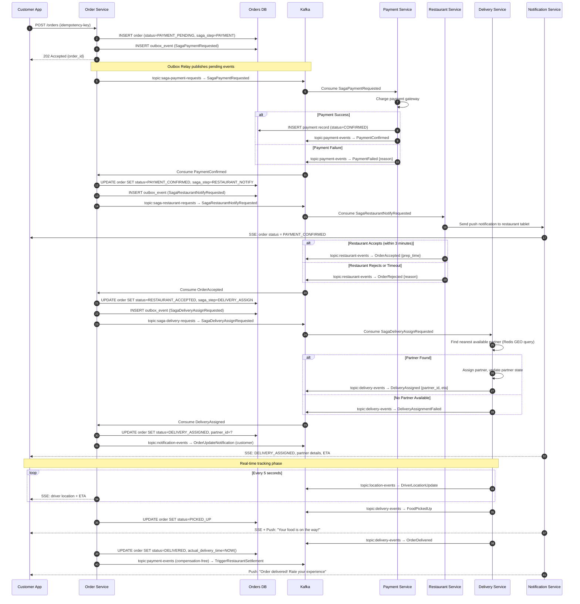
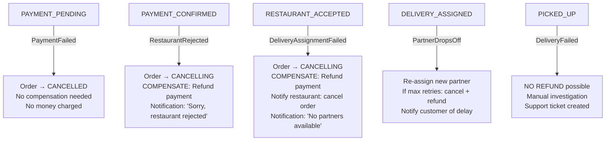
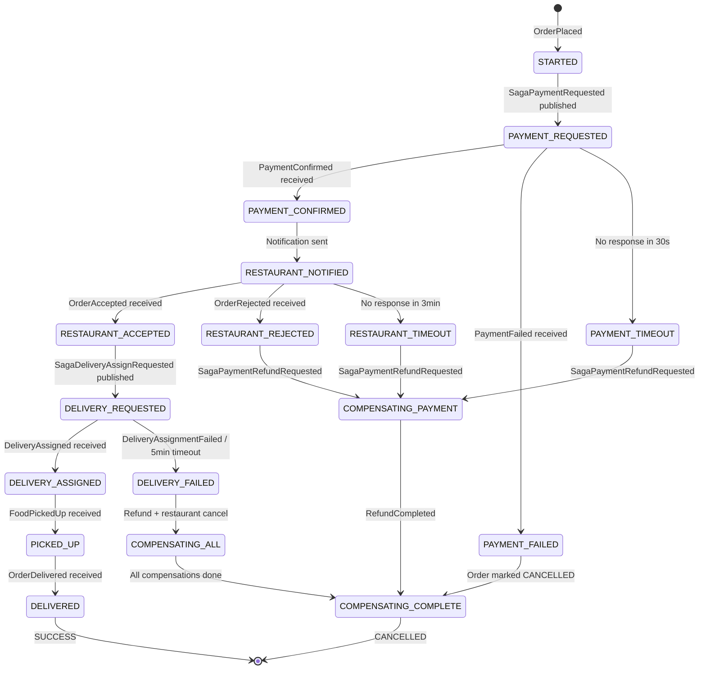

# 06 — Event Flow and Saga Orchestration: Food Delivery Platform

---

## Objective

Document the complete event flow for the Order Saga — from order placement to delivery. Define the Kafka topic architecture, message schemas, compensating transactions for every failure point, and the outbox pattern for reliable event publishing. This is the most operationally complex part of the system.

---

## 1. The Order Saga: Full Sequence



---

## 2. Compensating Transactions

This is the most critical section — what happens when each saga step fails.

### 2.1 Compensation Map



### 2.2 Compensation Step-by-Step

#### Scenario A: Payment Fails

```
Trigger: PaymentFailed event consumed by Order Service
Steps:
  1. Order Service: UPDATE order SET status=CANCELLED, cancelled_by=SYSTEM
  2. Order Service: Publish OrderCancelled event to notification-events
  3. Notification Service: Send "Payment failed" notification to customer
  4. No financial compensation needed — no money was charged
  
Kafka: payment-events → Order Service consumer
State transition: PAYMENT_PENDING → CANCELLED
No compensating saga needed (nothing to undo)
```

#### Scenario B: Restaurant Rejects After Payment Confirmed

```
Trigger: OrderRejected event consumed by Order Service (or 3-minute timeout)
Steps:
  1. Order Service: UPDATE order SET status=CANCELLING
  2. Order Service: Publish SagaPaymentRefundRequested {order_id, amount, full_refund}
  3. Payment Service: Initiate refund with payment gateway
  4. Payment Service: Publish RefundInitiated, then RefundCompleted
  5. Order Service: UPDATE order SET status=CANCELLED
  6. Notification Service: "Order cancelled — full refund in 5-7 days"

Kafka topics:
  → saga-payment-requests (RefundRequested)
  ← payment-events (RefundCompleted)
  → notification-events (RefundNotification)

Idempotency: RefundRequested contains payment_id — Payment Service is idempotent
             (second identical refund request returns existing refund status)
```

#### Scenario C: No Delivery Partner Available

```
Trigger: DeliveryAssignmentFailed event (after exhausting retry attempts)
Steps:
  1. Order Service: UPDATE order SET status=CANCELLING
  2. Order Service: Publish SagaRestaurantCancelRequested (restaurant must not start prep)
  3. Order Service: Publish SagaPaymentRefundRequested
  4. Restaurant Service: Notify restaurant that order is cancelled
  5. Payment Service: Process refund
  6. Notification Service: "Sorry, no delivery partners available. Full refund issued."

Note: This scenario is rare at scale but must be handled.
      In practice, retry partner assignment 3x over 5 minutes before giving up.
```

#### Scenario D: Delivery Partner Disconnects Mid-Delivery (After Pickup)

```
Trigger: Partner app goes offline for > 5 minutes during active delivery
Detection: Order Service monitors last_location_update_at from Redis
Steps:
  1. Delivery Service: Detect stale location (last update > 5 min ago)
  2. Delivery Service: Mark partner as UNRESPONSIVE
  3. Delivery Service: Attempt to re-assign delivery to another partner
     (nearest partner to current stale location, not restaurant)
  4. If re-assignment fails: Create manual intervention ticket
  5. Notification Service: "Your order may be delayed — we're looking into it"
  
Note: Cannot refund after PICKED_UP — food is in transit.
      If partner never completes delivery and order is lost:
        → Manual review
        → Full refund as a goodwill gesture
        → Partner account suspension investigation
```

#### Scenario E: Restaurant Goes Offline During Active Orders

```
Trigger: Restaurant marks itself closed or app connection lost
         Multiple orders in RESTAURANT_NOTIFIED state
Steps:
  1. Restaurant Service: Detect restaurant went offline
  2. Restaurant Service: Publish RestaurantOffline event
  3. Order Service: For each order in RESTAURANT_NOTIFIED state for this restaurant:
       → Auto-reject those orders (treat as OrderRejected)
       → Apply Scenario B compensations
  4. Search Service: Remove restaurant from search index
  5. Operations team: Alert for investigation

Risk: Orders between RESTAURANT_ACCEPTED and FOOD_PREPARED when restaurant goes offline.
      These orders need manual intervention.
```

---

## 3. Kafka Topic Architecture

### 3.1 Topic Inventory

| Topic | Purpose | Partitions | Retention | Producer | Consumers |
|-------|---------|-----------|-----------|---------|----------|
| `saga.payment.requests` | Saga step: trigger payment | 30 | 7 days | Order Service | Payment Service |
| `saga.restaurant.requests` | Saga step: notify restaurant | 30 | 7 days | Order Service | Restaurant Service |
| `saga.delivery.requests` | Saga step: assign delivery | 30 | 7 days | Order Service | Delivery Service |
| `payment.events` | Payment lifecycle events | 30 | 14 days | Payment Service | Order Service, Analytics |
| `restaurant.events` | Restaurant actions/events | 20 | 7 days | Restaurant Service | Order Service, NS, Analytics |
| `delivery.events` | Delivery lifecycle events | 30 | 7 days | Delivery Service | Order Service, NS, Analytics |
| `location.events` | Driver location updates | 100 | 1 hour | Delivery Service | Order Service |
| `notification.events` | Outbound notification triggers | 10 | 3 days | All services | Notification Service |
| `analytics.events` | All events for analytics | 50 | 30 days | All services | Analytics Service |
| `menu.events` | Menu catalog changes | 10 | 7 days | Menu Service | Search Service |
| `order.dlq` | Failed saga messages | 5 | 14 days | Kafka (automatic) | Ops monitoring |

### 3.2 Partitioning Strategy

**Key: order_id (hashed to partition)**

All saga topics are partitioned by `order_id`. This ensures:
- All events for the same order land on the same partition
- Events for the same order are consumed in order (Kafka guarantees order within a partition)
- The saga for one order never interleaves with another order's saga

**Location events exception:** `location.events` is partitioned by `partner_id`. Driver location updates are ordered per partner, not per order.

### 3.3 Partition Count Reasoning

```
Peak order placement: 210 RPS
Events per order (saga): ~8 events
Total event RPS: ~1,700
Kafka throughput per partition: ~1,000 msg/sec (conservative)
Required partitions for saga topics: 2-3

BUT: We set 30 partitions for saga topics to allow future growth
     and parallel consumer scaling.

Location events: 50,000 writes/sec (200K partners × 12/min ÷ 60s)
Per partition: 50,000 / 100 = 500 writes/sec — within limits
```

---

## 4. Outbox Pattern for Reliable Event Publishing

### Problem

If Order Service writes to PostgreSQL and then publishes to Kafka in two separate operations, what happens if the Kafka publish fails after the DB write?

```
❌ WRONG approach:
1. BEGIN TRANSACTION
2. INSERT order (status=PAYMENT_PENDING)
3. COMMIT
4. Publish to Kafka ← FAILS here — order exists but event never published
   → Saga is stuck forever
```

### Outbox Pattern Solution

```
✅ CORRECT approach:
1. BEGIN TRANSACTION
2. INSERT order (status=PAYMENT_PENDING)
3. INSERT outbox_events (SagaPaymentRequested)
4. COMMIT  ← Both writes are atomic
5. Separate relay process reads outbox table and publishes to Kafka
6. Mark outbox event as PUBLISHED after Kafka confirm
```

### Outbox Table Schema

```
outbox_events
├── id: UUID (PK)
├── aggregate_id: UUID (e.g., order_id)
├── aggregate_type: String (e.g., "Order")
├── event_type: String (e.g., "SagaPaymentRequested")
├── payload: JSONB
├── status: PENDING | PUBLISHED | FAILED
├── retry_count: Integer
├── created_at: Timestamp
└── published_at: Timestamp (nullable)
```

### Relay Mechanism Options

| Option | How it works | Pros | Cons |
|--------|-------------|------|------|
| Polling relay | Service polls outbox every 100ms | Simple | Adds DB load, latency |
| Debezium CDC | PostgreSQL WAL → Kafka via Change Data Capture | Zero polling, low latency | Operational complexity of CDC pipeline |
| Transaction log tailing | Similar to Debezium | — | — |

**Recommendation:** Use Debezium for production. It reads PostgreSQL WAL (transaction log) and publishes changes to Kafka. Zero polling, sub-100ms latency from DB write to Kafka publish.

---

## 5. Saga State Machine (Stored in Database)

The saga state is persisted in the `saga_state` table. This allows any Order Service instance to resume a saga after a crash.



---

## 6. Idempotency in Event Consumption

Every event consumer must be idempotent. Kafka guarantees at-least-once delivery — messages can be redelivered.

### Pattern: Processed Event Log

```
processed_events
├── event_id: UUID (PK — the event envelope's eventId)
├── consumer_group: String
├── processed_at: Timestamp

Before processing an event:
  SELECT 1 FROM processed_events WHERE event_id=? AND consumer_group=?
  If exists → skip (already processed)
  If not → process + INSERT into processed_events
  (Both operations in the same DB transaction)
```

**Performance:** The `processed_events` table grows continuously. Partition by month and archive/delete after 30 days.

---

## 7. Dead Letter Queue (DLQ) Handling

When a Kafka consumer fails to process a message after N retries (e.g., 3 retries), it sends the message to the Dead Letter Queue.

### DLQ Topics

| DLQ Topic | Source | Consumer |
|-----------|--------|---------|
| `order.dlq` | All saga consumers | Ops dashboard + manual retry |
| `payment.dlq` | Payment event consumer | Finance team alert |
| `delivery.dlq` | Delivery event consumer | Ops team alert |

### DLQ Processing

1. DLQ consumer sends alert to PagerDuty/Slack
2. Ops engineer investigates root cause
3. Fix the bug in the consuming service
4. Replay messages from DLQ manually using admin tool
5. Monitor for successful processing

### Retry Strategy in Consumers

```
Attempt 1: Process immediately
Attempt 2: Retry after 1 second (exponential backoff)
Attempt 3: Retry after 2 seconds
Attempt 4: Retry after 4 seconds
After 3 retries: Publish to DLQ, commit offset (do not block pipeline)
```

**Critical:** Do NOT block the Kafka partition on a failed message. Commit the offset and send to DLQ. Otherwise, one bad message blocks all subsequent messages in that partition.

---

## 8. Choreography vs Orchestration — Detailed Comparison

| Concern | Orchestration (Chosen) | Choreography (Alternative) |
|---------|----------------------|--------------------------|
| Saga visibility | Central saga_state table — query "where is order X" instantly | Must correlate events across 5 Kafka topics |
| Compensation logic | Orchestrator knows exactly what to compensate | Each service independently decides when to compensate — risk of incomplete compensation |
| Testing | Test the Order Service saga in isolation | Must set up Kafka and all 4 services for integration testing |
| Adding a new saga step | Add step to Order Service state machine | Add new events and subscriptions across multiple services |
| Single point of failure | Order Service becomes critical | Resilient — no single orchestrator |
| Team autonomy | Order Service team owns saga logic — bottleneck | Each service team independently implements their event handlers |
| Debugging | One service, one log file to check | Must correlate across 5 services |

**Conclusion:** For a system where support engineers need to answer "what happened to this order?", orchestration is operationally superior. Choreography is philosophically purer but practically harder to operate.

---

## 9. Kafka Consumer Group Design

| Consumer Group | Subscribed Topics | Instances | Scaling |
|---------------|------------------|-----------|---------|
| `order-service-saga` | payment-events, restaurant-events, delivery-events | 6–20 | Scale with order volume |
| `payment-service-saga` | saga.payment.requests | 4–10 | Scale with peak RPS |
| `restaurant-service-saga` | saga.restaurant.requests | 4–10 | — |
| `delivery-service-saga` | saga.delivery.requests | 4–10 | — |
| `notification-service` | notification.events | 3–6 | — |
| `analytics-service` | analytics.events | 5–10 | Scale independently |
| `search-service-menu` | menu.events | 2–4 | — |
| `location-processor` | location.events | 20–50 | Scale with driver count |

**Key:** Consumer group instance count should not exceed partition count (otherwise some instances idle).

---

## 10. Tradeoffs

| Decision | Benefit | Cost |
|----------|---------|------|
| Outbox pattern | Atomic DB + event publish | Requires CDC pipeline (Debezium) or polling relay |
| At-least-once delivery | Simple, Kafka default | Consumers must be idempotent |
| Order partitioning by order_id | Ordered delivery per order | Hot partition risk if order_ids are not evenly distributed |
| DLQ instead of blocking | Pipeline never blocks on bad message | Bad messages require manual investigation |

---

## Interview-Level Discussion Points

1. **How does the outbox pattern prevent dual-write consistency problems?** By writing the event to the DB in the same transaction as the domain state change. The event is only "published" to Kafka after the DB transaction commits. If the transaction fails, neither the state change nor the event is persisted. This eliminates the window where state is changed but the event is not published.

2. **What happens if the outbox relay crashes?** Events accumulate in the outbox table. When the relay restarts, it picks up where it left off. Kafka consumers receive events with some delay. Saga timeouts must be set long enough to accommodate relay downtime (minutes, not seconds).

3. **How do you handle the "exactly-once" requirement for payments?** Kafka does not natively guarantee exactly-once across the DB write (in Payment Service). We use idempotency: the `SagaPaymentRequested` event contains the `order_id`, and Payment Service checks `SELECT 1 FROM payments WHERE order_id=?` before charging. If a payment already exists, it publishes `PaymentConfirmed` again (idempotent publish). The payment gateway transaction ID is stored for deduplication at the gateway level.

4. **Why do location events only have a 1-hour retention?** Location events have no value after the delivery is complete. Storing 50,000 RPS of location data for 7 days would be enormous. Real-time location is served from Redis (sub-30s TTL). Historical location (for compliance or route replay) is written to a separate data store at a lower resolution (every 30s, not every 5s).

5. **What breaks first in the saga if Kafka has sustained high consumer lag?** Notification Service is the least critical consumer — delays in push notifications are tolerable. The saga consumers (Order Service consuming payment/restaurant/delivery events) are critical — high lag means orders get stuck in intermediate states, restaurants and customers are not notified, and SLAs are breached. Alert on consumer lag > 10 seconds for saga topics.
