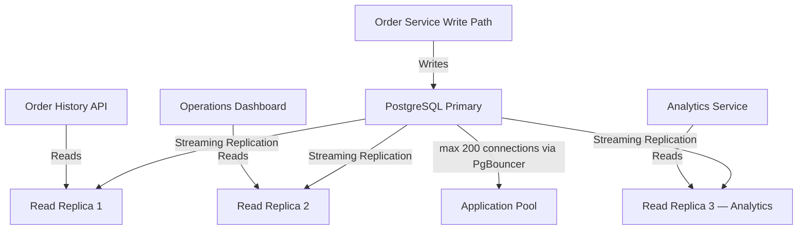
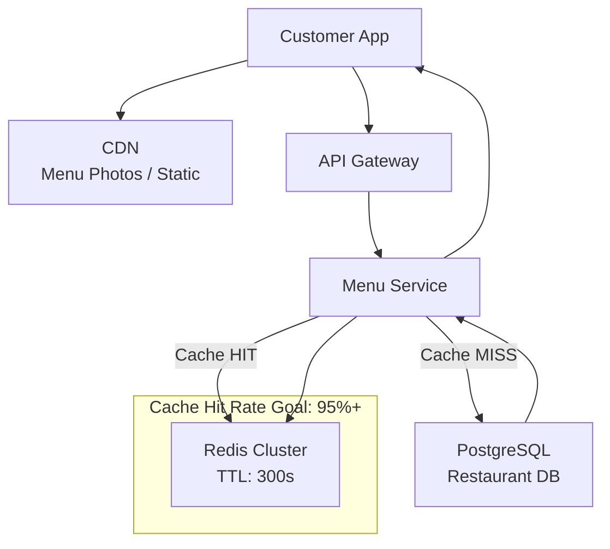
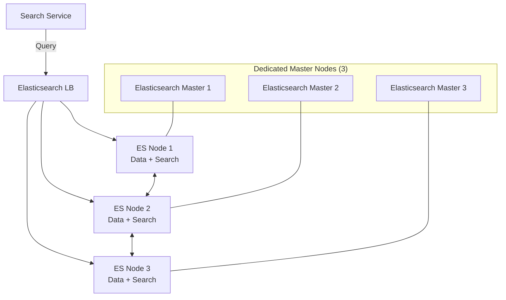
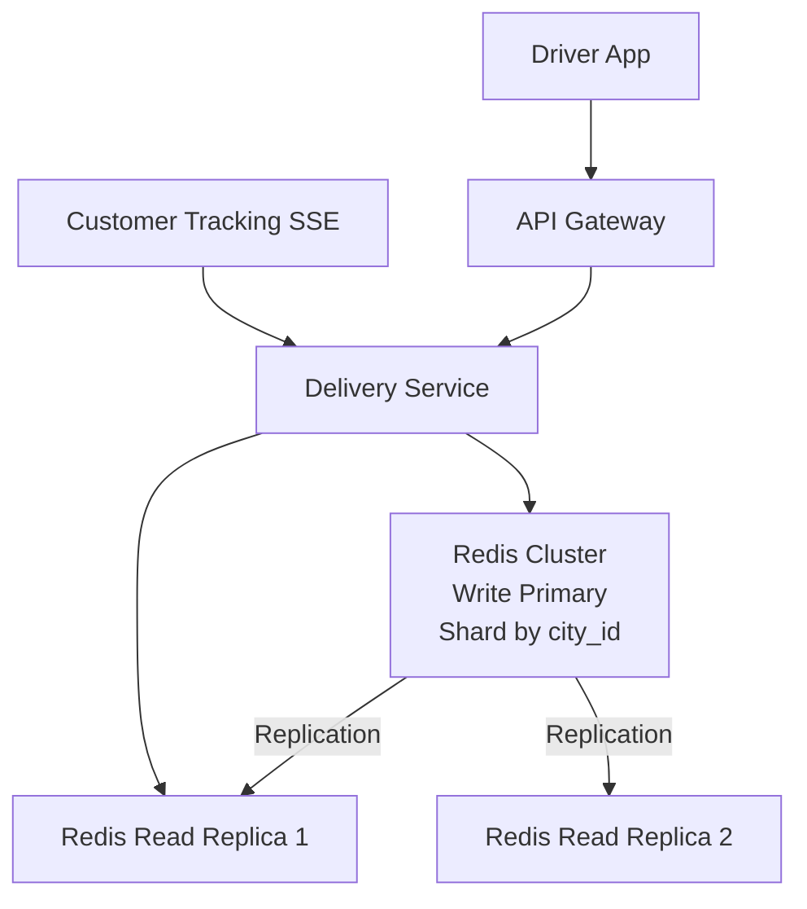

# 07 — Scaling Strategy: Food Delivery Platform

---

## Objective

Define how the food delivery platform handles peak load (10x normal during lunch and dinner), scales individual services independently, manages database contention, and avoids the most common scalability bottlenecks. Think in terms of operational reality — theoretical scalability that requires 3 days to activate is not scaling.

---

## 1. Peak Load Characteristics

### Traffic Profile

```
Time Window          | Load Multiplier | Orders/hr  | Notes
---------------------|-----------------|------------|--------------------------------
Midnight – 6 AM      | 0.1x           | 21,000     | Minimal traffic
6 AM – 9 AM          | 0.3x           | 62,500     | Breakfast moderate
9 AM – 11:30 AM      | 0.5x           | 104,000    | Pre-lunch ramp
11:30 AM – 2 PM      | 10x            | 2,083,000  | LUNCH PEAK — max load
2 PM – 5 PM          | 0.4x           | 83,000     | Post-lunch drop
5 PM – 6:30 PM       | 0.5x           | 104,000    | Pre-dinner ramp
6:30 PM – 10 PM      | 9x             | 1,875,000  | DINNER PEAK
10 PM – Midnight     | 0.3x           | 62,500     | Late night drop
```

### Peak RPS Summary (Lunch Peak)

| Operation | Normal RPS | Peak RPS (10x) | Bottleneck? |
|-----------|-----------|-----------------|-------------|
| Restaurant search | 500 | 5,000 | Elasticsearch |
| Menu page views | 800 | 8,000 | Redis cache |
| Order placement | 58 | 580 | Order Service, PostgreSQL |
| Order status reads | 1,200 | 12,000 | Redis cache (not DB) |
| Driver location writes | 5,000 | 50,000 | Redis GEO |
| Driver location reads (tracking) | 10,000 | 100,000 | Redis read replicas |
| Payment processing | 58 | 580 | Payment gateway SLA |

---

## 2. Horizontal Scaling Per Service

### 2.1 Kubernetes Horizontal Pod Autoscaler (HPA) Configuration

```
Service               | Normal Pods | Peak Pods | Scale Trigger      | Scale Speed
----------------------|-------------|-----------|--------------------|-----------
Order Service         | 5           | 50        | CPU > 60%          | Fast (30s)
Payment Service       | 3           | 20        | CPU > 70%          | Medium (60s)
Restaurant Service    | 3           | 20        | CPU > 70%          | Medium
Delivery Service      | 5           | 40        | CPU > 60%          | Fast
Search Service        | 4           | 30        | CPU > 65%          | Medium
Notification Service  | 3           | 15        | Queue depth > 1000 | Slow (120s)
Menu Service          | 2           | 10        | CPU > 70%          | Slow
User Service          | 2           | 10        | CPU > 70%          | Slow
```

**Predictive Scaling:**
Don't wait for CPU to spike before scaling. Use Kubernetes KEDA with time-based scaling:
- Pre-scale Order Service to 20 pods at 11:00 AM (30 min before lunch peak)
- Pre-scale back to 5 pods at 2:30 PM
- This avoids the cold start delay during the peak ramp-up

### 2.2 Stateless Service Design for Horizontal Scaling

Every microservice must be stateless — all state in external stores:
- **Order Service**: No in-memory saga state. All saga state in PostgreSQL `saga_state` table.
- **Payment Service**: No in-memory payment state. All state in PostgreSQL.
- **Delivery Service**: No in-memory location state. All location in Redis.
- **Session**: JWT tokens are self-contained. No in-memory session store.

Any instance can handle any request. Load balancer uses round-robin.

---

## 3. Database Scaling

### 3.1 PostgreSQL Read Replica Strategy



**Write Path:** All writes go to primary. Order state transitions, payment records, delivery records.

**Read Path:** Order history queries, restaurant listing queries, and analytics queries go to read replicas. Replication lag is typically < 100ms — acceptable for order history and analytics.

**Critical:** Active order state reads go to Redis cache, NOT read replicas. The replica lag (even 100ms) is too risky for real-time tracking.

### 3.2 Connection Pooling with PgBouncer

```
Problem at peak:
  50 pods × 20 connections = 1000 connections to PostgreSQL
  PostgreSQL max_connections = 300 (typical for 8GB instance)

Solution: PgBouncer in front of PostgreSQL
  50 pods → PgBouncer (transaction mode) → 50 actual PG connections
  Connection reuse is transparent to the application

PgBouncer config:
  pool_mode = transaction
  max_client_conn = 1000
  default_pool_size = 50
  reserve_pool_size = 10
```

**Caveat:** Transaction pooling mode does not work with `SET LOCAL`, advisory locks, or temp tables. Ensure ORM/JDBC is not using these in connection lifecycle code.

### 3.3 Optimistic Locking for Order State Transitions

At peak, multiple saga events could arrive near-simultaneously for the same order. The `version` column prevents split-brain:

```
Thread 1: UPDATE orders SET status='RESTAURANT_ACCEPTED', version=2 WHERE id=X AND version=1
Thread 2: UPDATE orders SET status='RESTAURANT_ACCEPTED', version=2 WHERE id=X AND version=1

Thread 1 succeeds (1 row updated). Thread 2 sees 0 rows updated → retry.
Thread 2 re-reads order, sees version=2, processes or discards accordingly.
```

This is preferable to `SELECT FOR UPDATE` (row-level lock), which would serialize all updates and cause lock contention under peak load.

---

## 4. Restaurant Catalog Read Scaling

The restaurant catalog (menu pages) is the highest read volume operation at 8,000 RPS peak.



**Cache Strategy:**
- `restaurant:{id}:menu` cached in Redis for 300 seconds (5 minutes)
- Cache warming: On application startup, pre-warm top 10,000 restaurants by order volume
- Cache invalidation: When restaurant updates menu, publish `MenuUpdated` event; the Menu Service consumer deletes the cached key
- Cache miss rate at 5% × 8,000 RPS = 400 RPS hitting PostgreSQL — acceptable

**CDN for Menu Photos:**
- All menu item photos served from CDN (CloudFront / Fastly)
- Origin is S3/object store
- CDN cache TTL: 24 hours (photos are immutable once uploaded)

---

## 5. Elasticsearch Scaling for Search

Peak search load: 5,000 RPS



**Elasticsearch Sizing:**
- 3 dedicated master nodes (no data, coordination only — avoids master instability under load)
- 5 data nodes, each 32 GB RAM, 500 GB SSD
- 1 primary shard per index + 1 replica = 2 copies of each shard
- Total data: 210 GB (with replicas) across 5 nodes = 42 GB/node — comfortable

**Search Result Caching:**
- Search results cached in Redis (key: hash of all query params)
- TTL: 60 seconds (short — restaurant availability changes frequently)
- At peak, popular searches (e.g., "pizza in Bangalore, sorted by rating") are a cache HIT for the majority of requests
- Cache hit rate target: 40–60% (searches have high diversity)

**Why Not Cache Longer?**
Restaurant `isOpen` status changes at lunch rush. If cache is 10 minutes, customers see closed restaurants. 60 seconds is the tradeoff between cache efficiency and freshness.

---

## 6. Delivery Partner Location Scaling

**Scale:** 200K active partners × 12 updates/min = 2,400,000 updates/min = 40,000 updates/sec

This is the highest write volume in the system.

### Redis GEO Architecture



**Sharding by city:** Each city has its own Redis GEO key (`geo:drivers:{city_id}`). This distributes load across Redis cluster nodes.

**Write Performance:** Redis GEOADD is O(log N) per operation. At 40,000 writes/sec, a single Redis cluster handles this comfortably (Redis can handle 100K+ ops/sec). Scale Redis horizontally by sharding by city.

**Read Performance:** GEORADIUS queries for nearby drivers. These happen when assigning a delivery partner (~580/sec at peak). Each query reads from the city's GEO sorted set — fast, O(N+log M) where N is result count.

---

## 7. Kafka Consumer Scaling

At peak, Kafka consumer lag can spike. Strategy to prevent lag accumulation:

```
Topic: saga.payment.requests
  Partitions: 30
  Normal consumers: 4 (Order Service pods consuming this topic)
  Peak consumers: 20 (pod count scales with HPA)
  Max consumers: 30 (cannot exceed partition count)

Topic: location.events
  Partitions: 100
  Normal consumers: 20
  Peak consumers: 50
  Max consumers: 100
```

**Monitoring:** Alert when consumer lag for saga topics exceeds 1,000 messages. At 580 events/sec (peak), 1,000 message lag = ~1.7 seconds delay. Acceptable. Alert at 10,000 messages (17 second delay — saga SLA breach risk).

---

## 8. Order Assignment Algorithm Scaling

When a customer places an order, the Delivery Service must find the nearest available partner within seconds.

### Algorithm Overview

```
Input: restaurant location (lat, lng), city_id
Output: partner_id

Steps:
1. GEORADIUS geo:drivers:{city_id} {lat} {lng} 5km WITHCOORD COUNT 20 ASC
   → Get 20 nearest available drivers within 5km of restaurant

2. Filter: Remove drivers with active_delivery (is on another order)
   → Parallel Redis GET driver:{id}:active_delivery for each candidate

3. Sort by ETA (not just distance — a driver 3km away on a motorbike may be
   faster than a driver 1km away stuck in traffic)
   → Use simple ETM: ETA = distance / average_speed_for_vehicle_type (approximation)
   → V2: Use routing API (Google Maps / OSRM) for real ETA

4. Send assignment offer to top 3 candidates (not just 1)
   → First to accept gets the order
   → If none accept within 30s, expand radius to 10km and retry

5. Mark assigned partner as UNAVAILABLE in Redis
```

**Scaling concern:** At 580 assignments/sec (peak), this algorithm runs 580 times/second. The Redis GEORADIUS calls are fast (sub-millisecond). The bottleneck is the routing API (if used) — Google Maps has rate limits and latency. In V1, use simple Euclidean distance. In V2, use pre-computed ETAs from OSRM (open-source routing).

---

## 9. Rate Limiting and Backpressure

### API Gateway Rate Limiting

```
Customer order placement: 5 req/min per user
  → Prevents order spam during failed payment retries

Restaurant order responses: 100 req/min per restaurant
  → Prevents bot automation

Driver location updates: 60 req/min per driver
  → Ensures at most 1 update/second (12 normally)
```

### Kafka Backpressure

If Kafka consumers fall behind during peak, the consumer's in-memory queue fills. Configure consumer max fetch bytes and max poll records to bound memory usage:

```
max.poll.records = 100 (don't fetch too many at once)
max.partition.fetch.bytes = 1MB
```

If the consumer processes 100 messages at once and one fails, all 100 must be retried (they haven't been committed). Keep `max.poll.records` small for saga topics to limit retry scope.

### Shedding Load Gracefully

If Order Service is overwhelmed (CPU > 90%), the API Gateway can:
1. Return 503 with `Retry-After: 5` for new order placements
2. Continue serving order status reads (from Redis cache — fast)
3. Never degrade the tracking experience — it's cached

---

## 10. Database Write Contention

### Hot Spot: Popular Restaurant

If a restaurant is running a promotion and gets 100 orders/minute, all those orders have the same `restaurant_id`. If queries/indexes scan by `restaurant_id` without city partitioning, this becomes a hot spot.

**Mitigation:**
- Partition orders by `(city_id, created_at)` — not by restaurant_id
- Index `(restaurant_id, status, created_at)` — restaurant queries still efficient without hot partition issues
- Restaurant's "active orders" are served from Redis cache, not a DB query

### Hot Spot: Coupon Abuse

A viral coupon code causes 10,000 concurrent redemption attempts. If we check `usageLimitTotal` in PostgreSQL with a `SELECT + UPDATE` pattern, this creates massive lock contention.

**Mitigation:** Use Redis atomic INCR for usage counting:
```
INCR coupon:FIRST50:usage
If result > limit: decrement and reject
If result <= limit: allow, write redemption to DB asynchronously
```
Redis INCR is atomic and handles thousands of concurrent operations per second.

---

## 11. Scaling Evolution

### Phase 1 (MVP — 0 to 100K orders/day)
- Monolith or 3–4 microservices
- Single PostgreSQL instance
- Redis single node
- No Elasticsearch (PostgreSQL ILIKE for search)
- Manual deployment

### Phase 2 (Growth — 100K to 1M orders/day)
- Full microservices decomposition
- PostgreSQL with read replicas
- Redis Cluster
- Elasticsearch for search
- Kubernetes HPA
- PgBouncer

### Phase 3 (Scale — 1M to 10M orders/day)
- Database partitioning by city + time
- Elasticsearch cluster with dedicated masters
- Redis cluster sharded by city
- Predictive autoscaling
- Multi-region deployment
- CQRS read models for heavy read paths

### Phase 4 (Hyperscale — 10M+ orders/day)
- Database sharding by geography
- Event sourcing for order history
- Edge computing for location processing
- ML-based ETA and demand prediction
- Global CDN with edge caching

---

## 12. Taking vs Startup Scaling Differences

| Concern | Startup (< 1M orders/day) | Taking-Scale (> 10M orders/day) |
|---------|--------------------------|-------------------------------|
| Caching | Redis, simple TTL | Multi-layer: L1 in-process, L2 Redis, L3 CDN |
| DB scaling | Read replicas | Sharding + CQRS + separate read models |
| Search | Elasticsearch basic setup | Custom relevance scoring, ML ranking |
| Location | Redis GEO | Custom geospatial indexing, edge processing |
| Kafka | 30-partition topics | 1000s of partitions, dedicated clusters per region |
| Deployment | Single region | Multi-region with active-active |
| Automation | HPA by CPU | Predictive scaling, capacity planning tools |

---

## 13. Bottleneck Analysis: What Breaks First

| Component | Normal RPS | Breaking Point | Symptom |
|-----------|-----------|----------------|---------|
| PostgreSQL (orders) | 580 writes/sec | ~2,000 writes/sec (with PgBouncer) | Slow order placement |
| Redis (location writes) | 40,000 ops/sec | ~100,000 ops/sec per node | Location lag |
| Elasticsearch (search) | 5,000 queries/sec | ~10,000 queries/sec (5 nodes) | Slow search |
| API Gateway | 20,000 RPS | ~100,000 RPS (horizontal) | 503 errors |
| Kafka (lag) | Low lag | Consumer behind > producer | Notification delays |
| Payment gateway | 580 TPS | Gateway SLA (varies) | Payment timeouts |

---

## Interview-Level Discussion Points

1. **What would you scale first if you saw degradation during lunch peak?** Check Order Service CPU → if high, scale pods. Check Redis latency → if high, check connection count and shard utilization. Check Kafka consumer lag → if high, scale consumers. Check PostgreSQL connections → if exhausted, tune PgBouncer. Always diagnose before scaling.

2. **Why not just scale everything vertically?** Vertical scaling has limits (largest EC2 instance is still limited). Vertical scaling also means single points of failure — one node down = full outage. Horizontal scaling + partitioning is the only path to the 5M orders/day scale.

3. **How do you pre-scale for a major event (New Year's Eve)?** Pre-provision additional nodes the day before. Use KEDA time-based scaling rules. Run load tests on staging 1 week before. Freeze deployments 48 hours before the event. Have an on-call runbook for capacity adjustments.

4. **What is the N+1 query risk in this system?** In the restaurant menu endpoint, if we query the restaurant, then loop through categories and query items for each: 1 restaurant query + N category queries = N+1 problem. Mitigation: single JOIN query or single key Redis cache for the entire menu document.

5. **How does the delivery partner assignment scale to 200K concurrent partners?** Redis GEO sets are per-city. A GEORADIUS query on a set with 10,000 drivers (large city) is still sub-millisecond. The total 200K partners are spread across 50+ cities, so each city set has at most a few thousand members.
