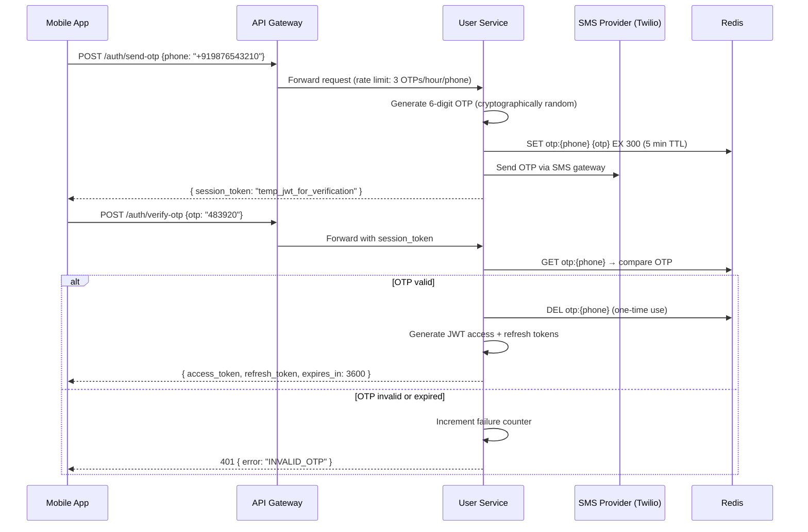

# 08 — Security Design: Food Delivery Platform

---

## Objective

Define the security architecture for the food delivery platform, covering authentication, authorization, payment security, data privacy, fraud prevention, and API protection. Think in terms of defense-in-depth — every layer has independent controls. A compromise of one layer should not give access to everything.

---

## 1. Authentication Architecture

### 1.1 Customer and Restaurant Authentication

**Flow:** OTP-based authentication (primary for mobile, fallback email/password for web)



**Security Controls on OTP:**
- OTP is 6 digits, cryptographically random (SecureRandom, not Math.random)
- TTL: 5 minutes
- Maximum 3 OTP requests per phone per hour (rate limit in Redis)
- Maximum 5 incorrect OTP attempts before phone is locked for 30 minutes
- OTP is deleted after first successful use (one-time)

### 1.2 JWT Token Structure

```
Header: { "alg": "RS256", "typ": "JWT" }

Payload:
{
  "sub": "user_uuid",
  "iat": 1705317000,
  "exp": 1705320600,   // 1 hour
  "jti": "token_uuid", // for revocation
  "roles": ["CUSTOMER"],
  "city_id": "bangalore",
  "device_id": "dev_uuid"
}

Signed with: RSA-256 private key (2048-bit minimum)
Verified with: RSA-256 public key
```

**Why RSA over HMAC?**
- RSA allows API Gateway to verify tokens using the public key only
- The private key (signing key) is kept only in User Service
- Microservices do not need the signing secret — they only need the public key
- Compromising a downstream service's key material does not allow token forgery

### 1.3 Token Refresh and Revocation

```
Refresh Token:
  - Opaque token (random UUID stored in Redis)
  - TTL: 30 days
  - Key: refresh_token:{uuid} → user_id
  - One refresh token per device

Revocation:
  - JWT is stateless — cannot be revoked directly
  - Maintain a "revoked JTI" set in Redis (Redis SET, TTL = token expiry)
  - API Gateway checks: is jti in revoked set? → reject
  - On logout: ADD jti to revoked set
  - On account suspension: ADD all user's active JTIs to revoked set
  
Performance impact: One Redis GET per request (revocation check)
  → Mitigated: revoked set is small (most tokens are valid)
  → Redis GET is sub-millisecond
```

---

## 2. Authorization — RBAC Model

### 2.1 Roles

| Role | Assigned To | Permissions |
|------|------------|-------------|
| CUSTOMER | Registered users | Place orders, view own orders, manage own profile |
| RESTAURANT_OWNER | Restaurant owners | Manage own restaurant, view own orders |
| RESTAURANT_STAFF | Staff accounts | Accept/reject orders, mark ready (no billing access) |
| DELIVERY_PARTNER | Delivery partners | Accept deliveries, update location, view own trips |
| CITY_OPS | Operations staff | View city dashboard, manage drivers/restaurants in their city |
| ADMIN | Super admin | All access |
| SUPPORT | Support staff | Read-only access to any order, can initiate refunds |

### 2.2 Permission Matrix

| Action | CUSTOMER | RESTAURANT_OWNER | RESTAURANT_STAFF | DELIVERY_PARTNER | CITY_OPS | ADMIN |
|--------|---------|-----------------|-----------------|-----------------|----------|-------|
| GET /orders/{id} | Own only | Own restaurant | Own restaurant | Own delivery | Any in city | Any |
| POST /orders | Yes | No | No | No | No | No |
| PUT /restaurant/orders/*/accept | No | Yes | Yes | No | No | Yes |
| PUT /delivery/location | No | No | No | Yes | No | Yes |
| GET /admin/cities/*/analytics | No | No | No | No | Yes | Yes |
| PUT /restaurant/{id}/status | No | Own only | No | No | In city | Any |

### 2.3 Resource Ownership Enforcement

Authorization is enforced at the application layer, not just at the JWT role level:

```
GET /v1/orders/{order_id}

Enforcement logic (in Order Service):
  1. Extract user_id and role from JWT
  2. Fetch order from DB
  3. If role == CUSTOMER: assert order.customer_id == user_id
  4. If role == RESTAURANT_OWNER: assert order.restaurant_id == user.restaurant_id
  5. If role == DELIVERY_PARTNER: assert order.delivery_partner_id == user.partner_id
  6. If role == ADMIN/SUPPORT: allow
  7. Otherwise: return 403 Forbidden
```

This is Row-Level Access Control — not just role-based, but resource-ownership-based.

---

## 3. Payment Security — PCI DSS Compliance

### 3.1 PCI DSS Scope Reduction (Primary Goal)

Raw card data must never touch platform servers. This reduces PCI DSS scope from SAQ D (full) to SAQ A (simplest):

```mermaid
graph LR
    CA[Customer App] -->|Card details entered in Stripe.js SDK| PG[Payment Gateway<br/>Stripe / Razorpay]
    PG -->|Returns payment_token| CA
    CA -->|POST /orders {payment_token: "tok_xyz"}| OS[Order Service]
    OS -->|{payment_token} via Saga| PS[Payment Service]
    PS -->|Charge request: {token, amount}| PG
    PG -->|Charge result| PS
    
    subgraph "PCI DSS Scope (Minimal)"
        PS
    end
    
    subgraph "Outside PCI Scope"
        CA
        OS
    end
```

**What happens:**
1. Customer enters card in the payment SDK (Stripe Elements / Razorpay SDK) — rendered by the gateway, not by us
2. SDK tokenizes the card and returns a single-use token
3. Our platform only ever sees the token — never the raw card number
4. Payment Service calls the gateway with the token — only Payment Service is in PCI scope

### 3.2 Additional Payment Controls

| Control | Implementation |
|---------|---------------|
| Double charge prevention | Idempotency key per charge; gateway deduplication via `payment_intent_id` |
| Refund authorization | Only Order Service saga can initiate refunds; Payment Service verifies order ownership |
| Settlement integrity | Payout amounts are computed from order records, not from payment amounts directly |
| Webhook signature verification | Payment gateway webhooks are signed; Payment Service verifies signature before processing |
| Amount validation | Payment Service re-validates amount against Order record before charging |

---

## 4. Delivery Partner Security

### 4.1 OTP-Based Login for Partners

Delivery partners authenticate via phone OTP only (no passwords). This simplifies onboarding and reduces credential theft risk.

### 4.2 Location Data Privacy

```
Customer Tracking View:
  - Shows partner location only when order is in PICKED_UP state (food is with partner)
  - Location is coarsened to ~50m accuracy (protect partner home neighborhood)
  - Location is NOT shown before pickup (prevents stalking partner to restaurant)
  - Location stream stops when order is DELIVERED

Data Retention:
  - Real-time location: Redis, 30s TTL (not persisted per update)
  - Trip summary location (start/end): Stored in Deliveries table
  - Detailed trip trajectory: Optional, lower resolution (every 30s), 90-day retention
```

### 4.3 Proof of Delivery

For high-value orders or disputes, partners can upload a photo of the delivered order (proof of delivery):
- Photo uploaded to S3 with pre-signed URL
- URL associated with delivery record
- Accessible only to customer and support (not public)

---

## 5. Fraud Prevention

### 5.1 Coupon Abuse Detection

Coupons are the most abused feature. Common attack patterns:

| Attack | Detection | Mitigation |
|--------|-----------|-----------|
| Multiple accounts, same phone | Phone as unique identifier for coupon limits | Hard limit: 1 phone per coupon type |
| Multiple accounts, same device | Device fingerprint in JWT | Device-level coupon limit |
| Fake accounts for referral bonuses | New user = OTP verified phone; phone can only be "new" once | Referral bonus tied to first order per phone |
| Bulk coupon testing | Rate limiting on coupon validation endpoint | Max 5 coupon checks per minute per user |
| Coordinated abuse (multiple phones, same person) | ML-based anomaly detection on IP, device, location clusters | V2 feature |

### 5.2 Order Fraud Detection

| Pattern | Detection | Response |
|---------|-----------|---------|
| Order placed, then cancel after restaurant prepares | Track cancellation rate per customer | Warn after 3 late cancellations; block after 5 |
| High-value orders from new accounts | New account + high value = risk flag | Hold for additional verification |
| Multiple orders to same address, different accounts | Delivery address clustering | Flag for manual review |
| Stolen card usage | Velocity: 3+ failed payments in 10 min | Temporary block on account/card |

### 5.3 Delivery Fraud

| Pattern | Detection | Response |
|---------|-----------|---------|
| Partner marks delivered but didn't deliver | GPS location at "delivered" time vs customer address | Alert if partner location was > 500m from customer |
| Partner claims not received after delivery | POD photo + GPS evidence | Dispute resolution workflow |
| Fake OTP/POD | OTP verified by platform (not trusting partner's input) | — |

---

## 6. API Security

### 6.1 Input Validation and Injection Prevention

| Attack | Prevention |
|--------|-----------|
| SQL Injection | Parameterized queries / JPA repositories (never string concatenation) |
| NoSQL Injection | Input validation before passing to Redis/Elasticsearch |
| XSS in review text | HTML encoding on output; strip HTML tags on input |
| SSRF in image URLs | Validate that image URLs are from allowed CDN domains only |
| Path traversal in file uploads | Use UUID file names; never use client-supplied names |

### 6.2 CSRF Protection

- REST APIs with JWT authentication in Authorization header are not vulnerable to CSRF (CSRF attacks rely on cookie-based auth)
- Web application (restaurant portal) uses SameSite=Strict cookie attribute + CSRF token for form submissions

### 6.3 Sensitive Data Exposure

| Data | Exposure Control |
|------|-----------------|
| User phone number | Masked in API responses (`+91 98765 ****10`) |
| Partner location | Coarsened for customers; exact in admin APIs |
| Payment info | Token reference only; never full card number |
| Order financial details | Only visible to the customer who placed the order |
| Restaurant commission rates | Not exposed in any API; admin portal only |

---

## 7. API Rate Limiting (Security Context)

Beyond performance rate limiting, rate limiting prevents:
- Brute force attacks on OTP (`3 OTP requests/hour/phone`)
- Account enumeration (`POST /auth/send-otp` returns same response for registered and unregistered phones)
- Data scraping (`GET /search` limited to 50 req/min for unauthenticated IPs)
- Denial of service amplification

### Rate Limit Implementation

```
Layer 1: API Gateway (first line of defense)
  - IP-based rate limiting: 100 req/min/IP
  - User-based rate limiting: From JWT sub claim

Layer 2: Application-level rate limiting (in each service)
  - Business-specific limits (e.g., 5 orders/minute/user)
  - Implemented with Redis counters (INCR + EXPIRE)

Layer 3: Circuit breakers at service mesh level (Istio)
  - Prevent cascading failure if downstream service is overwhelmed
```

---

## 8. Secrets Management

```
Development: Environment variables in .env files (never committed to git)
Production: AWS Secrets Manager / HashiCorp Vault

What is stored:
  - Database passwords
  - Redis auth token
  - Kafka SASL credentials
  - Payment gateway API keys
  - JWT RSA private key
  - Third-party API keys (SMS, Maps)

Rotation policy:
  - DB passwords: Rotate every 90 days (automated with Secrets Manager)
  - API keys: Rotate on any suspected compromise
  - JWT private key: Annual rotation with overlap period

Access:
  - Services access secrets via Vault agent sidecar injection
  - No secrets in Docker images or Kubernetes manifests
  - Secrets accessed at runtime, not build time
```

---

## 9. Security of Partner and Customer Data

### 9.1 Data Classification

| Data Class | Examples | Controls |
|-----------|---------|---------|
| PII (High) | Name, Phone, Email, Addresses | Encrypted at rest, access logged |
| Financial (Critical) | Payment tokens, bank account details | PCI DSS controls, restricted service access |
| Location (Sensitive) | Delivery addresses, live location | Encrypted at rest, coarsened for display |
| Order data (Internal) | Order items, amounts | Standard DB encryption |
| Analytics (Low) | Aggregated metrics | Can be accessed by analytics team |

### 9.2 Encryption at Rest

- PostgreSQL: Storage-level encryption (AWS RDS encrypted volumes using AES-256)
- Redis: Encryption at rest via AWS ElastiCache encryption
- S3 (images, exports): Server-side encryption (SSE-S3 or SSE-KMS)
- Kafka: Encrypted at rest (MSK with KMS)

### 9.3 Encryption in Transit

- All external traffic: TLS 1.2+ (enforced at API Gateway)
- Internal service-to-service: mTLS via Istio service mesh (optional for V1, required for V2)
- Database connections: SSL/TLS enforced (PostgreSQL `sslmode=require`)
- Redis connections: TLS (Redis 6+ supports TLS natively)
- Kafka: SSL listener for producers/consumers

---

## 10. Audit Logging

Every security-sensitive action is logged:

| Action | Log Fields |
|--------|----------|
| User login | user_id, phone, ip, device_id, timestamp, success/failure |
| OTP failure | phone, ip, attempt_count |
| Order placement | user_id, order_id, amount, ip |
| Payment charge | payment_id, amount, gateway, status |
| Refund initiated | order_id, payment_id, initiator_user_id, amount |
| Account suspension | admin_id, target_user_id, reason |
| Restaurant approval | admin_id, restaurant_id |
| Permission change | admin_id, target_user_id, old_role, new_role |

Audit logs are:
- Written to an append-only audit log table (no UPDATE/DELETE)
- Also streamed to Kafka → ELK Stack for centralized SIEM
- Retained for 7 years for regulatory compliance

---

## 11. Tradeoffs

| Decision | Benefit | Cost |
|----------|---------|------|
| OTP-only auth for customers | No password database to breach | Customer frustration with OTP delays |
| RSA JWT over HMAC | Services don't need signing key | More complex key management |
| Payment tokenization (no raw cards) | PCI scope reduction | Dependency on payment gateway |
| Redis for JWT revocation | Fast revocation check | Adds one Redis call per request |
| Location coarsening | Partner privacy | Slightly less accurate ETA |

---

## Interview-Level Discussion Points

1. **Why use RSA for JWT signing instead of HS256 (HMAC)?** With HMAC, every service that needs to verify tokens must share the secret key. If one service is compromised, all tokens can be forged. With RSA, only the User Service holds the private key. Other services verify with the public key only — a compromise of downstream services cannot be used to forge tokens.

2. **How do you prevent a delivery partner from marking orders as delivered without actually delivering?** Two controls: (1) GPS verification — the partner's location at the time of "delivered" event is compared to the customer's address. If > 500m away, it is flagged. (2) Customer OTP confirmation — for high-value or disputed orders, the customer receives a 4-digit OTP that the partner must enter in their app to confirm delivery.

3. **What is the biggest payment security risk in this system?** Double charging. A customer's payment goes through, but the saga fails and replays the payment step. Mitigated by: idempotency key on payment initiation (gateway deduplication), checking for existing Payment record before calling gateway, and storing `gateway_transaction_id` uniquely per payment record.

4. **How would you detect a compromised restaurant owner account trying to access competitor data?** At the application layer, every Restaurant Service query is scoped by `restaurant_id` from the JWT. Even if an attacker has a valid restaurant owner token, they can only access their own restaurant's data. Row-level access control prevents cross-restaurant data access.

5. **What is the SSRF risk in menu item image uploads?** If the system fetches URLs provided by restaurants (e.g., to proxy menu images), an attacker could supply an internal URL (like `http://169.254.169.254/` for AWS metadata). Mitigation: Never fetch user-supplied URLs server-side. Instead, provide a pre-signed S3 upload URL and require restaurants to upload directly to S3. Only accept images from known CDN domains.
