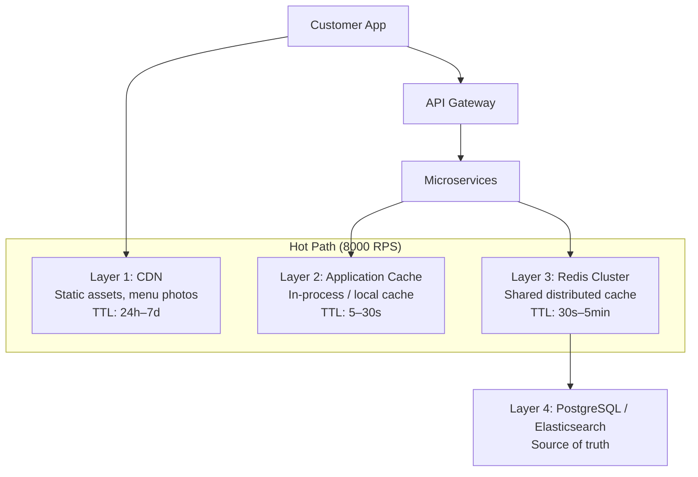

# 09 — Caching Strategy: Food Delivery Platform

---

## Objective

Define a layered caching strategy that handles 8,000 RPS menu reads, 5,000 RPS search queries, and 100,000 RPS driver location reads without overwhelming the database. Explicitly identify what MUST NOT be cached. Design cache invalidation as carefully as cache population — stale data in food delivery can be costly.

---

## 1. Caching Layers



---

## 2. Layer 1: CDN (Edge Caching)

### What is Cached

| Asset | CDN TTL | Invalidation Trigger |
|-------|---------|---------------------|
| Menu item photos | 7 days | Restaurant uploads new photo |
| Restaurant logos | 7 days | Restaurant updates logo |
| Static app assets (JS/CSS) | 1 year (with hash in filename) | New deployment (filename changes) |
| Category banner images | 24 hours | Marketing team deploys new banners |

### Cache Invalidation at CDN

- For images: Use content-addressed URLs (hash in filename). Old URL is never invalidated — it just becomes unused. New upload = new URL. No cache purge needed.
- For banner images: Manual cache purge via CDN API on marketing deployment.
- Emergency purge: CDN API supports selective purge by URL pattern.

**CDN Provider:** CloudFront (AWS) or Fastly. Both support cache invalidation APIs.

---

## 3. Layer 2: Application-Level (In-Process) Cache

Each service maintains a small in-memory cache (Caffeine or Guava) for the most frequently accessed, highly stable data.

### What Goes Here

| Data | Cache Duration | Notes |
|------|---------------|-------|
| City configuration (city_id → name, zone config) | 30 minutes | Changes require deployment anyway |
| Restaurant operating hours | 5 minutes | Changes are rare |
| Coupon rules (structure, not usage counts) | 5 minutes | Refreshed periodically |
| JWT public key for verification | 1 hour | Changes require key rotation procedure |
| Search ranking weights | 5 minutes | Tuned by ops team, not per-request |

**Size limit:** Max 10,000 entries per service instance. Eviction policy: LRU.

**Consistency risk:** With 20 Order Service pods, each has its own in-process cache. If city config changes, it takes up to 5 minutes for all pods to see the change. This is acceptable — city config changes are rare and not time-critical.

---

## 4. Layer 3: Redis Distributed Cache

Redis is the central shared cache layer. All service instances share the same Redis cluster.

### 4.1 Restaurant Menu Cache

```
Key:     restaurant:{restaurant_id}:menu
Type:    String (serialized JSON, gzip-compressed for large menus)
TTL:     300 seconds (5 minutes)
Size:    ~100 KB per restaurant
Total:   150K active restaurants × 100 KB = 15 GB

Population:  On first miss, Menu Service queries DB and populates cache
Invalidation: On MenuItemUpdated event → DEL restaurant:{id}:menu
             On RestaurantStatusChanged event → DEL restaurant:{id}:menu
```

**Why 5-minute TTL?**
A restaurant changes their menu a few times per day. 5 minutes of stale data is acceptable — a customer who sees "Butter Chicken available" but gets told it's not is a bad experience, but a rare one. The tradeoff is 95% reduction in DB reads.

### 4.2 Search Results Cache

```
Key:     search:{city_id}:{hash(query_params)}
Type:    String (serialized JSON)
TTL:     60 seconds (1 minute)
Size:    ~20 KB per result set

Cache Key construction:
  hash(city=bangalore, q=pizza, sort=rating, is_open=true, min_rating=4.0)
  → deterministic hash → consistent cache hits for identical queries

Why 60s TTL?
  Restaurant open/closed status changes frequently at meal boundaries.
  60s is short enough that a closed restaurant disappears quickly.
  Longer TTL means customers click on closed restaurants.
```

**Cache Hit Estimation:**
Popular searches like "restaurants near me in bangalore" hit the cache frequently. Tail queries (unique combinations) miss the cache. Expected hit rate: 40–60%.

### 4.3 Active Order State Cache

```
Key:     order:{order_id}:state
Type:    Hash
Fields:  status, restaurant_id, partner_id, eta_epoch, updated_at
TTL:     24 hours (orders complete well within this)
Update:  Write-through on every state transition

Purpose: The order tracking SSE endpoint is called by customers every time
         they open the tracking page. At 12,000 RPS peak (order status reads),
         all of these are served from Redis — not PostgreSQL.

Consistency: Write-through cache — DB is updated first, then Redis.
             If Redis write fails, the state is in DB but not in cache.
             Next request is a cache miss and repopulates from DB. Acceptable.
```

### 4.4 Driver Real-Time Location

```
Key:     geo:drivers:{city_id}        (GEO sorted set)
         order:{order_id}:driver_location  (Hash)

GEO Set (for assignment algorithm):
  GEOADD geo:drivers:bangalore {partner_id} {lat} {lng}
  GEORADIUS geo:drivers:bangalore {lat} {lng} 5km WITHCOORD COUNT 20 ASC
  → Returns 20 nearest available partners

Per-order driver location (for customer tracking):
  HSET order:{order_id}:driver_location lat 12.9716 lng 77.5946 ts 1705317000
  TTL: 30 seconds — if not updated in 30s, customer sees "location unavailable"

Update frequency: Every 5 seconds from partner app
Read frequency: Customer tracking SSE reads this every 5 seconds
```

**Why TTL of 30s on driver location?**
If the partner's app crashes or loses network, the last known location becomes stale. A 30s TTL means customers see the last known location for up to 30s, then see "location temporarily unavailable." This is better than showing a frozen location indefinitely.

### 4.5 Coupon Validity Cache

```
Key:     coupon:{coupon_code}:meta
Type:    Hash
Fields:  type, discount_value, min_order, max_discount, valid_until, usage_limit, is_active
TTL:     5 minutes

Key:     coupon:{coupon_code}:usage
Type:    String (integer counter)
TTL:     Until coupon expires (set TTL = time until coupon expires)

Purpose: Coupon validation happens on every cart submission.
         Checking the DB for each validation at 1,000 RPS would be expensive.
         Redis cache reduces this to cache miss on first use.

Invalidation: When coupon is deactivated → DEL coupon:{code}:meta
```

### 4.6 City-Level Surge Multiplier Cache

```
Key:     surge:{city_id}
Type:    Hash
Fields:  multiplier, valid_until, reason
TTL:     60 seconds (short — surge can change quickly)

Write:   Operations team updates surge via admin API
         → Writes to DB
         → Publishes SurgeUpdated event
         → All Order Service pods invalidate cache

Read:    Order placement reads this to apply delivery fee multiplier
```

### 4.7 Restaurant Availability Cache

```
Key:     restaurant:{restaurant_id}:availability
Type:    Hash
Fields:  is_open, avg_prep_time, updated_at
TTL:     60 seconds

Invalidation: On RestaurantAvailabilityChanged event → DEL key
             Also, if TTL expires, next read repopulates from DB.
```

---

## 5. Cache Patterns Used

### 5.1 Cache-Aside (Lazy Loading)

Used for: Menu cache, search results, restaurant availability

```
1. Service checks Redis for key
2. Cache HIT: return cached value
3. Cache MISS: query PostgreSQL/ES
4. Populate Redis with result + TTL
5. Return result

Risk: Cache stampede — if TTL expires and 1,000 concurrent requests
      all get a MISS at the same time, all 1,000 query the DB.

Mitigation: 
  - Probabilistic Early Expiration (PER): Refresh cache slightly before 
    TTL expires to avoid stampede
  - Mutex/locking: First miss acquires a lock, queries DB, populates cache.
    Other misses wait for lock, then hit cache.
  - Jitter: Add random ±10% to TTL so expirations are staggered
```

### 5.2 Write-Through

Used for: Active order state, driver location

```
On every DB write, also write to Redis.
Cache is never stale — it mirrors the DB.

Risk: Write latency increases by ~1ms (Redis write overhead)
      If Redis write fails, cache is stale until TTL expires.

Mitigation: Redis write failures are caught and logged.
            TTL ensures eventual consistency.
```

### 5.3 Write-Behind (Async Write)

Used for: Audit logs, analytics counters (not critical path)

```
Write to Redis immediately.
Asynchronously flush to DB.

Risk: Data loss on Redis crash before flush.
Mitigation: Only use for non-critical data.
```

---

## 6. What MUST NOT Be Cached

This is the most important section for interview discussions. Caching these would cause catastrophic bugs:

| Data | Why NOT to Cache |
|------|-----------------|
| **Order state machine transitions** | Must always go to PostgreSQL with optimistic locking. Caching order state for writes creates split-brain — two saga steps might both read an old cached state and both attempt the same transition. |
| **Payment state** | Payment.status must always be read from PostgreSQL. A cached "PENDING" status might prevent a refund from being processed after the payment was actually confirmed. |
| **Idempotency key check** | The duplicate order check (`SELECT FROM orders WHERE idempotency_key=?`) must hit the DB. A Redis cache of "this key exists" might return stale data if the key was just inserted by another pod. |
| **Coupon usage count (authoritative)** | The Redis counter is used for fast approximate checking. But before final redemption, the authoritative check is in PostgreSQL with a row-level lock. Redis counter is used only to avoid DB hits for obviously exceeded limits. |
| **Partner ACTIVE delivery state (for assignment)** | When assigning a delivery, the check for "is this partner already on a delivery?" must be authoritative. Redis stores this, but it must be updated transactionally with the delivery assignment. |

---

## 7. Cache Invalidation Patterns

Cache invalidation is "one of the two hard problems in computer science." Here is how each cache is invalidated:

| Cache | Invalidation Strategy | Latency of Invalidation |
|-------|----------------------|------------------------|
| Menu cache | Event-driven (MenuUpdated → DEL key) | < 1 second after menu update |
| Search results | TTL expiry (60s) + event-driven for availability changes | Up to 60s |
| Restaurant availability | Event-driven (AvailabilityChanged → DEL key) | < 1 second |
| Driver location | TTL expiry (30s) or partner goes offline (DEL key) | 30s for stale |
| Surge multiplier | Event-driven (SurgeUpdated → DEL key) | < 1 second |
| Active order state | Write-through (always current) | 0 seconds |
| Coupon meta | TTL (5min) or event-driven (CouponDeactivated) | Up to 5 minutes |

---

## 8. Redis Cluster Configuration

```
Cluster Mode: Redis Cluster (hash slots)
Nodes: 6 (3 primary, 3 replica)
Sharding: By key prefix
  geo:* → Shard 1 (high write volume from driver location)
  order:* → Shard 2 (order state)
  restaurant:* → Shard 3 (menu cache)
  search:* → Shard 2
  session:* → Shard 3

Memory per node: 32 GB
Total cluster memory: 96 GB (primary) — far exceeds our 30 GB estimate
Reason: 3x headroom for peak load spikes

Eviction policy: allkeys-lru (evict least recently used when memory is full)
Note: Order state cache should NOT be evicted during memory pressure.
      Use noeviction for the order cache DB (separate Redis instance or namespace).
```

### Separate Redis Instances by Criticality

| Redis Instance | Purpose | Eviction Policy |
|---------------|---------|----------------|
| redis-critical | Active order state, driver location, idempotency | noeviction + alerts on high memory |
| redis-cache | Menu cache, search results, restaurant availability | allkeys-lru |
| redis-session | User sessions, OTPs | allkeys-lru |

This prevents a cache eviction storm (when memory is full and many keys are evicted) from affecting active order state.

---

## 9. Tradeoffs

| Decision | Benefit | Cost |
|----------|---------|------|
| 5-min menu cache TTL | 95% reduction in DB reads | Customer may see unavailable item for up to 5 min |
| 60-sec search TTL | Freshness for open/closed status | Low hit rate for tail queries |
| Write-through for order state | Always fresh cache | Write latency +1ms; risk of Redis failure |
| Separate Redis instances by criticality | Isolates cache eviction from critical data | More infra to manage |
| TTL-based invalidation + event-driven | Belt-and-suspenders approach | Complexity |

---

## 10. Cache Warm-Up Strategy

On service restart or new deployment:

1. **Predictive warm-up**: Pre-load top 10,000 restaurants by order volume at startup
2. **Lazy population**: Subsequent requests populate remaining entries
3. **Order state**: On restart, Order Service reads all ACTIVE orders from DB into Redis

This avoids the "thundering herd" where all requests go to DB immediately after a deployment.

---

## Interview-Level Discussion Points

1. **What is a cache stampede and how do you prevent it?** When a popular cache key expires, hundreds of concurrent requests all get a miss simultaneously and all query the database. Prevention: (a) Mutex lock — only one request queries DB, others wait; (b) Probabilistic Early Expiration (PER) — start refreshing the cache before TTL expires; (c) TTL jitter — add random offset to TTLs so expirations are staggered.

2. **Why can't you cache order state for writes?** The order state machine uses optimistic locking (`version` field in PostgreSQL). If you read the state from Redis and write a transition to PostgreSQL, you are not using the DB's concurrency control. Two pods could both read the same state from Redis and both attempt incompatible transitions. The DB write must always read and write atomically (UPDATE WHERE version=N).

3. **How do you maintain consistency between Redis cache and PostgreSQL?** For write-through caches (order state), write DB first, then Redis. If Redis write fails, the state is in DB but not in cache — the next request is a miss and repopulates. For read-aside caches (menu), use TTL + event-driven invalidation. No cache can guarantee perfect consistency — the question is how stale, and is that acceptable for the use case.

4. **What is the risk of using Redis for coupon usage counting?** Redis INCR is atomic and handles concurrent requests well. But Redis is eventually consistent — if the primary fails and a replica promotes, the counter might go backwards by the amount of data that wasn't yet replicated. Mitigation: treat Redis counter as a soft limit. The hard limit enforcement happens in PostgreSQL with a SELECT + UPDATE in a transaction.

5. **How would you implement a cache for personalized search results (different for each user)?** Personalized caches are expensive — you cannot share results across users. Options: (a) No cache for personalized results — accept Elasticsearch latency; (b) Cache the base result (non-personalized), re-rank in the application layer using user preferences (fast, in-memory); (c) Personalize only the top 10 results for the user, cache a base set of 50. Option (b) is the practical choice.
