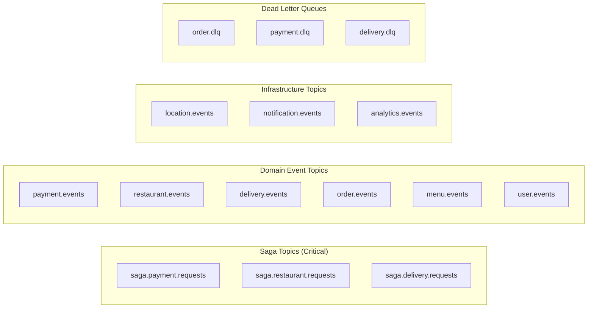
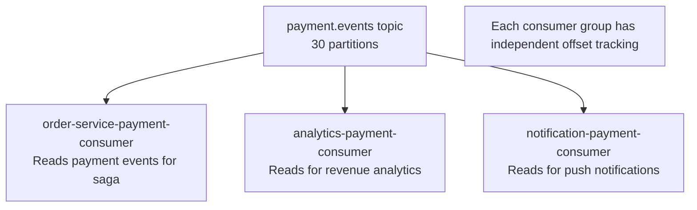

# 10 — Message Queue Design: Food Delivery Platform

---

## Objective

Design the Kafka-based messaging infrastructure for the food delivery platform. Define topic structure, partitioning strategy, consumer groups, exactly-once semantics for payments, the outbox pattern, DLQ handling, and the operational considerations for running Kafka at food delivery scale.

---

## 1. Why Kafka Over Alternatives

| Criterion | Kafka | RabbitMQ | AWS SQS | Redis Streams |
|-----------|-------|----------|---------|--------------|
| Message replay | Yes (configurable retention) | No (messages deleted after consume) | No | Limited |
| Throughput | 500K+ msg/sec | 50K msg/sec | 3K msg/sec | 100K msg/sec |
| Consumer groups | Yes (multiple independent consumers) | Yes | No (one consumer model) | Yes |
| Message ordering | Per-partition | Per-queue (limited) | No guarantees | Per-stream |
| Durability | Durable (WAL) | Durable | Durable (SQS) | Semi-durable |
| Fan-out | Yes (multiple consumer groups) | Yes (exchanges) | Limited | Yes |
| Operational complexity | High | Medium | Low | Low |
| Dead letter queue | Manual (route to DLQ topic) | Native | Native | Manual |

**Decision:** Kafka is chosen for its replay capability (critical for saga recovery), high throughput (driver location events), per-partition ordering (saga event ordering), and native fan-out (analytics + notification consuming the same events).

**When Kafka is Overkill:** For < 100K orders/day, RabbitMQ is simpler and sufficient. Kafka's operational overhead (ZooKeeper/KRaft, partition management, lag monitoring) is not justified at startup scale.

---

## 2. Topic Design

### 2.1 Complete Topic Inventory



### 2.2 Topic Configuration Table

| Topic | Partitions | Replication Factor | Min ISR | Retention | Cleanup Policy | Notes |
|-------|-----------|-------------------|---------|-----------|---------------|-------|
| `saga.payment.requests` | 30 | 3 | 2 | 7 days | delete | Critical saga step |
| `saga.restaurant.requests` | 30 | 3 | 2 | 7 days | delete | Critical saga step |
| `saga.delivery.requests` | 30 | 3 | 2 | 7 days | delete | Critical saga step |
| `payment.events` | 30 | 3 | 2 | 14 days | delete | Exactly-once required |
| `restaurant.events` | 20 | 3 | 2 | 7 days | delete | — |
| `delivery.events` | 30 | 3 | 2 | 7 days | delete | — |
| `order.events` | 30 | 3 | 2 | 30 days | delete | Full event log |
| `menu.events` | 10 | 3 | 2 | 7 days | delete | Search sync |
| `location.events` | 100 | 2 | 1 | 1 hour | delete | High volume, low retention |
| `notification.events` | 10 | 3 | 2 | 3 days | delete | — |
| `analytics.events` | 50 | 2 | 1 | 30 days | delete | Analytics consumers |
| `order.dlq` | 5 | 3 | 2 | 14 days | delete | Manual review |
| `payment.dlq` | 5 | 3 | 2 | 30 days | delete | Finance review |

### 2.3 Replication Factor = 3, Min ISR = 2

```
Replication Factor 3:
  - 3 copies of each partition (1 leader + 2 followers)
  - Survives 1 broker failure without data loss

Min ISR (In-Sync Replicas) = 2:
  - Producer must wait for ACK from 2 replicas before considering write successful
  - Producer acks = all (-1)
  - This ensures: even if the leader fails immediately after write, at least 1 follower has the data
  - Combined: Zero message loss even on leader failure

Performance cost:
  - Writes must wait for 2 replicas → adds ~5ms latency
  - For saga topics and payment topics, this is acceptable (correctness > throughput)
  
Exception: location.events — min ISR = 1 (performance over durability for location data)
```

---

## 3. Partitioning Strategy

### 3.1 Order-Based Partitioning (Saga Topics)

```
Partition Key: order_id (UUID)
Kafka partition = hash(order_id) % partition_count

Guarantee: All events for the same order land on the same partition.
           Kafka guarantees ordering within a partition.

Result: Events for order-X are consumed in sequence:
  SagaPaymentRequested → PaymentConfirmed → SagaRestaurantNotifyRequested → 
  OrderAccepted → SagaDeliveryAssignRequested → DeliveryAssigned → FoodPickedUp → Delivered

WHY THIS MATTERS:
  Without order-based partitioning, the consumer might process DeliveryAssigned
  before PaymentConfirmed — creating an impossible state.
  Order-based partitioning gives us causal ordering per order.
```

### 3.2 Partner-Based Partitioning (Location Events)

```
Partition Key: partner_id
Reason: Location events from the same partner should be processed in order
        (to compute trajectory, detect anomalies)

100 partitions: 200K partners / 100 = 2K partners per partition
                Each partition gets ~80 messages/sec (2K partners × 12 updates/min / 60s)
                Very manageable per partition.
```

### 3.3 Hot Partition Risk

If all orders for a viral restaurant go to the same partition (because restaurant_id is the key), that partition becomes a hot spot.

**Mitigation:** Partition key is `order_id`, not `restaurant_id`. Order IDs are UUIDs — randomly distributed across partitions. No hot partition risk.

---

## 4. Event Schema Design

### 4.1 Event Envelope Standard

Every Kafka message follows this envelope:

```json
{
  "eventId": "evt_uuid",
  "eventType": "payment.confirmed",
  "version": 1,
  "occurredAt": "2025-01-15T12:35:00.000Z",
  "correlationId": "ord_789xyz",
  "causationId": "evt_prev_uuid",
  "producerService": "payment-service",
  "payload": {
    // event-specific data
  }
}
```

**Field purposes:**
- `eventId`: Globally unique. Used by consumers for idempotency deduplication.
- `correlationId`: All events in a saga share the same `correlationId` (= order_id). Enables full saga tracing.
- `causationId`: Which event caused this one. Enables causal chain analysis in debugging.
- `version`: Schema version. Consumers check this and route to appropriate deserializer.

### 4.2 Key Event Payloads

**SagaPaymentRequested:**
```json
{
  "orderId": "ord_789xyz",
  "customerId": "usr_abc",
  "amountMinorUnits": 45000,
  "currency": "INR",
  "paymentMethod": "CARD",
  "paymentToken": "tok_stripe_xyz",
  "idempotencyKey": "pay_idem_xyz"
}
```

**PaymentConfirmed:**
```json
{
  "orderId": "ord_789xyz",
  "paymentId": "pay_123",
  "amountMinorUnits": 45000,
  "currency": "INR",
  "gatewayTransactionId": "ch_stripe_abc",
  "confirmedAt": "2025-01-15T12:35:02.000Z"
}
```

**DeliveryAssigned:**
```json
{
  "orderId": "ord_789xyz",
  "deliveryId": "dlv_456",
  "partnerId": "dpr_789",
  "partnerName": "Ravi K.",
  "partnerPhone": "+91987XXXXX10",
  "vehicleType": "MOTORBIKE",
  "partnerRating": 4.7,
  "etaMinutes": 28,
  "assignedAt": "2025-01-15T12:38:00.000Z"
}
```

---

## 5. Schema Registry

All Kafka schemas are registered in Confluent Schema Registry (or AWS Glue Schema Registry).

### Why Schema Registry?

- **Schema validation**: Producers cannot publish invalid messages
- **Compatibility enforcement**: BACKWARD compatibility means consumers can read old messages with new schema
- **Schema evolution**: Add optional fields — consumers ignoring unknown fields remain compatible
- **Code generation**: Avro/Protobuf schemas generate strongly-typed Java classes

### Compatibility Rules

| Change Type | Compatibility | Allowed? |
|------------|--------------|---------|
| Add optional field | BACKWARD compatible | Yes |
| Add required field | BREAKING | No |
| Remove field | FORWARD compatible | Only with deprecation |
| Change field type | BREAKING | No — create new version |
| Rename field | BREAKING | No — add new field, deprecate old |

---

## 6. Consumer Groups

### 6.1 Consumer Group Design



**Key Principle:** One topic can have multiple consumer groups. Each group reads the topic independently from its own offset. Adding a new consumer group (e.g., fraud detection service) does not affect existing consumers.

### 6.2 Consumer Group Configuration

| Consumer Group | Topics | Normal Instances | Peak Instances | Key Config |
|---------------|--------|-----------------|----------------|-----------|
| `order-service-saga` | payment.events, restaurant.events, delivery.events | 6 | 30 | auto.offset.reset=earliest |
| `payment-service` | saga.payment.requests | 4 | 20 | enable.idempotence=true |
| `restaurant-service` | saga.restaurant.requests | 4 | 20 | — |
| `delivery-service` | saga.delivery.requests | 4 | 20 | — |
| `notification-service` | notification.events, delivery.events | 3 | 15 | — |
| `search-service` | menu.events, restaurant.events | 2 | 4 | — |
| `analytics-service` | analytics.events | 10 | 20 | fetch.max.bytes=10MB |
| `location-processor` | location.events | 20 | 50 | max.poll.records=50 |

**Scaling Rule:** Number of consumer instances cannot productively exceed partition count. If `payment.events` has 30 partitions and you run 31 consumer instances in a group, the 31st instance is idle.

---

## 7. Exactly-Once Semantics for Payment Events

Payment events are the most critical. Duplicate processing = double charge.

### 7.1 Kafka Idempotent Producer

```
Producer config:
  enable.idempotence = true
  acks = all
  retries = Integer.MAX_VALUE

Effect: Kafka broker deduplicates duplicate produces from the same producer
        (same epoch + sequence number).
        Safe to retry on network failure without duplicates.
```

### 7.2 Transactional Producer (Kafka Transactions)

For the Payment Service writing to both DB and Kafka:

```
Problem:
  Payment Service:
  1. Charge payment gateway → success
  2. Write to PostgreSQL (payment.status=CONFIRMED)
  3. Publish PaymentConfirmed to Kafka
  Step 3 can fail → DB has payment confirmed but no Kafka event

Solution A: Outbox Pattern (Recommended)
  1. Charge payment gateway → success
  2. BEGIN TRANSACTION
  3. Write payment record to DB (status=CONFIRMED)
  4. Write outbox_event (PaymentConfirmed) to DB
  5. COMMIT
  6. Outbox relay (Debezium) reads WAL → publishes to Kafka
  → DB and Kafka are always in sync (or relay is catching up)

Solution B: Kafka Transactions (More complex)
  Producer.beginTransaction()
  Producer.send(PaymentConfirmed event)
  DB.update(payment.status=CONFIRMED)  ← Not in Kafka transaction scope
  Producer.commitTransaction()
  → Still has the DB-Kafka dual write problem
  → Outbox pattern is simpler and more reliable
```

### 7.3 Idempotent Consumer for Payment Service

```
Before processing SagaPaymentRequested:
  1. Check: SELECT 1 FROM payments WHERE order_id = ?
  2. If exists: Publish PaymentConfirmed again (return existing result)
  3. If not: Process charge, create payment record

Before processing SagaPaymentRefundRequested:
  1. Check: SELECT 1 FROM payments WHERE order_id = ? AND status = 'REFUNDED'
  2. If already refunded: Publish RefundCompleted again (return existing result)
  3. If not: Process refund
```

---

## 8. Dead Letter Queue (DLQ) Design

### 8.1 When Messages Go to DLQ

```
Retry Policy per Consumer:
  Attempt 1: Process immediately
  Attempt 2: Retry after 1 second
  Attempt 3: Retry after 2 seconds
  Attempt 4: Retry after 4 seconds
  After 4 attempts: MOVE to DLQ, COMMIT offset

Reason for committing offset after DLQ:
  If we do not commit, the message blocks the entire partition.
  All subsequent messages for ALL orders in that partition are stuck.
  At 580 orders/sec, this is catastrophic.

DLQ message includes:
  - Original message payload
  - Error reason and stack trace (last failure)
  - Attempt count
  - Original topic and partition
  - Failure timestamp
```

### 8.2 DLQ Alerting and Replay

```
Alerting:
  - Any message in payment.dlq → PagerDuty (critical)
  - Any message in order.dlq → Slack (high priority)
  - DLQ rate > 10/min → Incident opened

Manual Replay:
  - Ops engineer fixes root cause (e.g., bug in Payment Service)
  - Admin tool reads from DLQ topic
  - Re-publishes messages to original topic
  - Consumer processes successfully

Automated Replay (V2):
  - DLQ consumer monitors for transient errors (network timeout)
  - Automatically replays after 5-minute cooldown
  - Tracks replay attempt count — stops after 3 replays
```

---

## 9. Kafka Operations and Cluster Management

### 9.1 Kafka Cluster Sizing

```
Peak load:
  Driver location: 50,000 msg/sec
  Saga events: 1,700 msg/sec
  Analytics: 5,000 msg/sec
  Total peak: ~60,000 msg/sec

Kafka throughput:
  Per broker: ~100 MB/s write throughput
  Avg message size: 1 KB
  → 100,000 msg/sec per broker

Cluster sizing:
  3 brokers (minimum for replication factor 3)
  Each broker: 8 CPU, 32 GB RAM, 2 TB SSD
  Total cluster capacity: 300,000 msg/sec — 5x headroom over peak
```

### 9.2 Monitoring Critical Kafka Metrics

| Metric | Alert Threshold | Action |
|--------|----------------|--------|
| Consumer lag (saga topics) | > 10,000 messages | Scale consumer pods |
| Consumer lag (payment.events) | > 100 messages | Immediate investigation |
| Under-replicated partitions | > 0 | Broker health check |
| Producer error rate | > 0.1% | Investigate producer |
| DLQ message rate | > 1/min | Engineer alert |
| Broker disk usage | > 70% | Increase retention or add brokers |
| Controller election | Any election | Investigate broker crash |

### 9.3 Kafka vs KRaft Mode

As of Kafka 3.x, ZooKeeper is optional — KRaft (Kafka Raft Metadata Mode) replaces ZooKeeper for metadata management.

**Recommendation:** Use KRaft mode for new deployments. Eliminates ZooKeeper operational overhead (no separate ZooKeeper cluster to manage).

---

## 10. Event-Driven Patterns Used

### 10.1 Event Sourcing (Partial)

Order events are not strictly event-sourced (the current state is stored in PostgreSQL, not derived from events). However, the `order.events` topic retains all events for 30 days, which provides a partial event log for:
- Debugging saga failures
- Replaying order state for analytics
- Future event sourcing migration

### 10.2 CQRS via Kafka

The Analytics Context maintains its own read model by consuming all domain events from Kafka. This is the write side (transactional services) and read side (analytics) decoupled via Kafka.

### 10.3 Event Notification vs Event-Carried State Transfer

| Pattern | Example | Trade-off |
|---------|---------|----------|
| Event notification (thin) | `MenuItemUpdated { item_id }` — consumer fetches details | Low payload, but consumer must make another API call |
| Event-carried state transfer (fat) | `MenuItemUpdated { item_id, name, price, description, ... }` — all data in event | Higher payload, consumer is self-sufficient |

**Decision:** Use fat events for cross-context integration. The Elasticsearch indexer consumes `MenuItemUpdated` and must update the index — it needs the full item data. Thin events would require the indexer to call Menu Service API, adding latency and coupling.

---

## 11. Tradeoffs

| Decision | Benefit | Cost |
|----------|---------|------|
| Outbox pattern | Reliable event publishing | CDC pipeline (Debezium) or polling relay required |
| Kafka transactions | Atomic produce | Complex; not needed if using outbox |
| Fat events | Consumer self-sufficiency | Large message sizes; schema evolution harder |
| Per-topic DLQ | Isolation of failures per domain | More topics to manage |
| At-least-once delivery (default) | Simple, reliable | All consumers must be idempotent |
| 1-hour retention for location.events | Low disk usage | Cannot replay historical location events |

---

## Interview-Level Discussion Points

1. **How do you guarantee at-most-once payment processing?** Three layers: (1) Kafka idempotent producer ensures no duplicate publishes from the producer; (2) Payment Service checks for existing payment record (by order_id) before charging gateway; (3) Payment gateway idempotency key prevents duplicate charges at the gateway level. Any one layer failing is caught by the others.

2. **What happens to the Kafka cluster during a broker failure?** With RF=3 and min ISR=2, a single broker failure is transparent to producers and consumers. Kafka reelects a new leader for affected partitions within seconds. Consumer rebalancing happens — consumers reconnect to new partition leaders. The lag accumulates during rebalancing (seconds) and is quickly consumed. No messages are lost.

3. **Why not use Kafka transactions for the Payment Service?** Kafka transactions guarantee exactly-once within Kafka. But the Payment Service also writes to PostgreSQL — this is a cross-system transaction that Kafka cannot coordinate. The Outbox pattern solves this more reliably by using the DB as the single source of truth and deriving Kafka events from it via CDC.

4. **How do you handle schema evolution without breaking existing consumers?** Register schemas in Schema Registry with BACKWARD compatibility. New optional fields can be added without breaking consumers that don't know about them. Consumers ignore unknown fields. When removing a field, deprecate first (leave the field, stop populating it), then remove after all consumers are updated.

5. **What is the maximum consumer lag tolerance for the saga?** Order Service consuming `payment.events`: 100-message lag = < 1 second. If Payment Service processes at 580 TPS and lag = 100, the lag represents ~0.17 seconds of processing. Restaurant timeout SLA is 3 minutes — this lag is negligible. Alert at 1,000 messages (1.7 seconds) for operational awareness; act at 10,000 messages (17 seconds) to prevent SLA breach.
