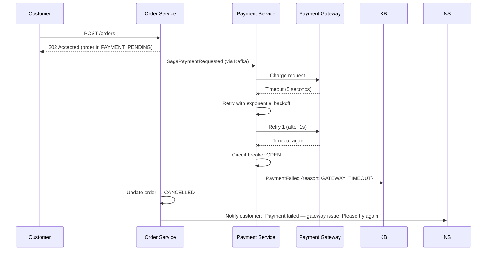
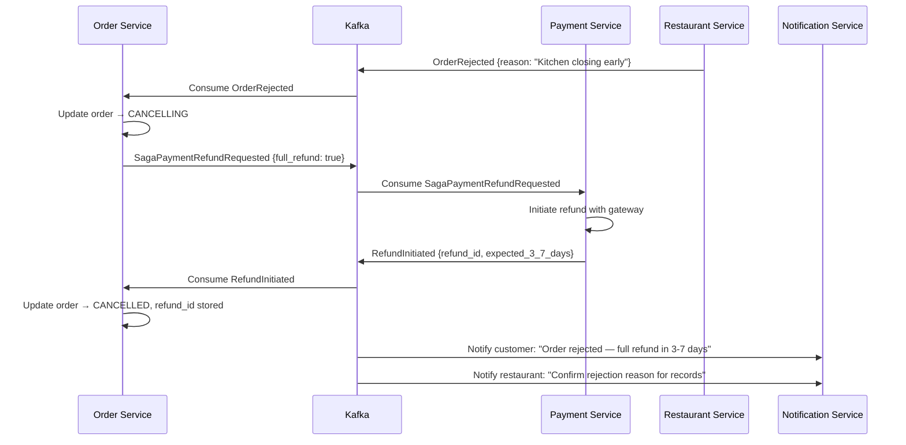

# 11 — Failure Scenarios and Resilience: Food Delivery Platform

---

## Objective

Enumerate the critical failure scenarios in the food delivery platform and define detection, mitigation, and recovery strategies for each. Think in terms of blast radius, recovery time objective (RTO), recovery point objective (RPO), and the customer/restaurant/partner experience during failures. Production systems fail — the question is whether they fail gracefully.

---

## 1. Failure Taxonomy

```mermaid
graph TD
    F[Failure Types] --> INF[Infrastructure Failures]
    F --> SVC[Service Failures]
    F --> NET[Network Partitions]
    F --> DAT[Data Corruption]
    F --> BIZ[Business Logic Failures]
    F --> EXT[External Dependency Failures]

    INF --> INF1[DB primary failure]
    INF --> INF2[Redis cluster failure]
    INF --> INF3[Kafka broker failure]
    INF --> INF4[Pod crash/OOM]

    SVC --> SVC1[Order Service crash mid-saga]
    SVC --> SVC2[Payment Service timeout]
    SVC --> SVC3[Restaurant goes offline]

    NET --> NET1[Kafka consumer lag spike]
    NET --> NET2[Driver app disconnects]
    NET --> NET3[API Gateway → Service timeout]

    EXT --> EXT1[Payment gateway outage]
    EXT --> EXT2[SMS provider failure]
    EXT --> EXT3[Maps API failure]

    BIZ --> BIZ1[Coupon abuse burst]
    BIZ --> BIZ2[Restaurant rejection surge]
```



---

## 2. Scenario 1: Payment Gateway Timeout / Outage

**Description:** Stripe/Razorpay is down or responding slowly (> 5 seconds).

**Impact:** New orders cannot be paid. Estimated 580 orders/min blocked at peak.

**Detection:**
- Payment Service: circuit breaker trips after 5 consecutive failures
- Prometheus alert: `payment_gateway_error_rate > 5% for 30s`
- PagerDuty: immediate page to on-call engineer

**Behavior during outage:**



**Mitigation:**
1. Offer alternative payment method (COD, wallet) if card gateway is down
2. Circuit breaker prevents overloading a struggling gateway
3. Implement a secondary payment gateway (Razorpay as backup to Stripe)

**RTO:** 0 minutes for new orders (fail fast). Recovery when gateway is restored.
**RPO:** 0 data loss. Orders in PAYMENT_PENDING are cleanly cancelled.

---

## 3. Scenario 2: Restaurant Rejects Order After Payment Confirmed

**Description:** Customer has paid. Restaurant rejects the order (item unavailable, too busy, closing soon).

**Impact:** Customer is debited but has no food. Requires full refund + strong notification.

**Saga Compensation Flow:**



**Customer Impact:** 3–7 day refund window is a UX failure. Mitigate with:
- Instant wallet credit (platform absorbs float) instead of waiting for gateway refund
- "Order Again" deep link in notification with 10% additional discount as apology

**Restaurant Impact:**
- Restaurant rejection rate tracked per restaurant
- High rejection rate → automatic penalty score → lower search ranking
- Pattern of last-minute rejections → restaurant account review

---

## 4. Scenario 3: Order Service Crashes Mid-Saga

**Description:** Order Service pod crashes after writing `RESTAURANT_ACCEPTED` to DB but before publishing `SagaDeliveryAssignRequested` to Kafka.

**Impact:** Order is stuck in RESTAURANT_ACCEPTED state. Delivery partner is never assigned. Restaurant is waiting. Customer is waiting.

**Why This Works (Saga Recovery):**

```
Order Service saga recovery (on pod startup):

1. Query: SELECT * FROM saga_state WHERE status NOT IN ('COMPLETED', 'FAILED', 'CANCELLED')
          AND timeout_at > NOW()

2. For each incomplete saga:
   - Read current_step
   - Re-publish the pending event (idempotent)

3. For stuck saga (current_step = RESTAURANT_ACCEPTED):
   - Re-publish SagaDeliveryAssignRequested to Kafka
   - Delivery Service is idempotent — checks if delivery already exists
   - If delivery exists: returns existing assignment (idempotent)
   - If not: creates new assignment

4. Timeout handling:
   - saga_state.timeout_at = created_at + 10 minutes
   - Sagas stuck past timeout are force-compensated
```

**Design Requirements for This to Work:**
- Saga state is stored in PostgreSQL (survives pod crash)
- All saga event consumers are idempotent (re-publishing is safe)
- Outbox pattern ensures events are published reliably after DB write

**RTO:** < 60 seconds (pod restart + saga recovery query)
**RPO:** Zero — state is durable in PostgreSQL

---

## 5. Scenario 4: PostgreSQL Primary Failure

**Description:** The primary PostgreSQL node (orders DB) fails. Read-write operations are disrupted.

**Recovery Timeline:**

```
T=0:    Primary node fails (hardware failure, OOM, etc.)
T=0s:   Health checks fail on primary
T=5s:   RDS/Cloud SQL detects primary failure
T=10s:  Automated failover begins — promoting standby
T=25s:  New primary is promoted (standby was in sync via streaming replication)
T=30s:  DNS updated to point to new primary
T=35s:  Application reconnects (connection pool retry logic kicks in)
T=60s:  Order Service fully operational on new primary

Impact:
  - Orders created during T=0 to T=35 may fail (transactions aborted)
  - These orders remain in PAYMENT_PENDING in the client
  - Saga has not started → no compensation needed
  - Customer sees "payment pending" and can check status after 60 seconds

Active orders (RESTAURANT_ACCEPTED, PICKED_UP):
  - Redis has active order state — tracking continues
  - Kafka consumers continue processing from Kafka
  - DB writes buffer and retry when connection is restored
  - 30-second window: saga events may be delayed but not lost
```

**Mitigation:**
- PostgreSQL synchronous streaming replication (not async — ensures RPO = 0)
- Connection pool with retry and circuit breaker
- Saga timeout of 10 minutes — far longer than 60-second failover

**RTO:** ~60 seconds
**RPO:** 0 (synchronous replication)

---

## 6. Scenario 5: Delivery Partner Disconnects Mid-Delivery

**Description:** Partner has picked up food. Partner's app goes offline (network loss, phone battery dies) and does not reconnect within 5 minutes.

**Detection:**
```
Delivery Service monitors: last_location_update_at for all active deliveries
Check frequency: Every 30 seconds
Alert threshold: No update for > 5 minutes

Detection query (in Delivery Service background job):
  SELECT order_id, partner_id, last_location_at
  FROM active_deliveries
  WHERE last_location_at < NOW() - INTERVAL '5 minutes'
  AND status = 'PICKED_UP'
```

**Response Flow:**

```
Stage 1 (5 min offline):
  - Show customer "Location temporarily unavailable"
  - Internal alert to delivery ops team
  - Attempt to call partner via automated IVR

Stage 2 (10 min offline):
  - If no response: Attempt to re-assign delivery to a new partner
  - New partner dispatched to current stale location of original partner
  - (Food may still be in transit — estimated GPS position used)

Stage 3 (20 min offline):
  - Manual investigation triggered
  - Support team contacts customer
  - If food not delivered: Full refund issued (rare but handled)

Stage 4 (Partner reconnects):
  - If order is still assigned to original partner: Resume tracking
  - If order was re-assigned: Original partner is debited (penalty)
  - Partner account flagged for review
```

**Key Design:** The food cannot be "refunded" once picked up — it is in transit. The system must focus on ensuring delivery, not compensation. Compensation is a last resort.

---

## 7. Scenario 6: Kafka Consumer Lag Spike During Peak

**Description:** Lunch peak causes Kafka consumers to fall behind. `order-service-saga` consumer group has 50,000 message lag on `payment.events`.

**Impact:** Orders are stuck in `PAYMENT_PENDING` for minutes. Customers are worried. Restaurants are not notified.

**Detection:**
```
Prometheus metric: kafka_consumer_group_lag
Alert: lag > 10,000 for payment.events consumer group
SLA breach: lag > 50,000 (> 2 minutes delay at peak)
```

**Response:**
```
Immediate:
  1. Scale Order Service pods (KEDA or manual)
     New pods join consumer group → rebalancing → more consumers
  2. Rebalancing takes ~30 seconds — temporary additional lag
  3. After rebalance: Lag begins draining

Structural fix (if recurring):
  1. Increase partition count for payment.events (requires migration)
  2. Optimize consumer processing (batch reads, async processing)
  3. Pre-scale consumers before peak (time-based KEDA)
```

**Why lag spikes happen:**
- Consumer processing is slow (external DB calls, gateway calls)
- Consumer crashes during rebalancing
- Peak load exceeds consumer throughput

**Prevention:**
- Keep consumer processing fast (< 100ms per message)
- Avoid synchronous external calls in consumer critical path
- Pre-scale based on time-of-day

---

## 8. Scenario 7: Restaurant Tablet Goes Offline (Multiple Active Orders)

**Description:** Restaurant's internet connection drops while they have 5 unaccepted orders and 3 orders in preparation.

**Impact:** Orders in `RESTAURANT_NOTIFIED` will timeout (3 minutes). Orders in `RESTAURANT_ACCEPTED` are being prepared — physical prep may continue even though the system doesn't know.

**Response:**

```
For orders in RESTAURANT_NOTIFIED (unaccepted):
  1. After 3-minute timeout: Auto-trigger OrderRejected
  2. Saga compensation: Full refund to customers
  3. Search Service: Temporarily lower restaurant rank (non-responsive)
  4. Ops team: Alert — restaurant connectivity issue

For orders in RESTAURANT_ACCEPTED/FOOD_BEING_PREPARED:
  1. These orders may complete (restaurant physically continues prep)
  2. System cannot confirm until restaurant comes back online
  3. Customer sees last known status ("Your food is being prepared")
  4. If restaurant comes back online within 15 minutes: Normal flow resumes
  5. If offline > 15 minutes: Manual intervention, customer notified of delay

Auto-close restaurant:
  - If restaurant is offline for > 10 minutes: Set isOpen=false in DB
  - Remove from search results immediately
  - New order placement blocked until manually re-opened
```

---

## 9. Scenario 8: Redis Cluster Failure

**Description:** Redis cluster goes down — loss of active order cache, driver location, and session data.

**Impact Assessment:**

| Data in Redis | Impact if Lost | Recovery |
|--------------|----------------|---------|
| Active order cache | Order tracking slows (DB fallback) | Repopulate from DB on read (cache-aside) |
| Driver GEO data | Delivery assignment fails for ~30 seconds | Drivers re-push location; repopulated in 30s |
| Session tokens | Users logged out | Re-authenticate via OTP |
| Coupon counters | Coupon usage counts reset | Repopulate from DB |
| Surge multipliers | No surge pricing during outage | Accept default pricing |

**Design for Redis Failure Tolerance:**
```
Order Service:
  - If Redis GET fails: Fall back to PostgreSQL read
  - If Redis SET fails: Log warning, continue (DB is source of truth)
  - Do NOT throw 500 to user because Redis is down

Session tokens:
  - JWT is stateless — no Redis needed for token verification
  - Revocation list (revoked JTIs) in Redis: If Redis down, skip revocation check
    → Accept all non-expired JWTs during Redis downtime
    → Security risk is low (attacker would need a recently revoked token)

Driver location:
  - Assignment algorithm degrades gracefully (expands radius, uses last known from DB)
```

**Redis Cluster (Not Sentinel) for HA:**
- Redis Cluster automatically promotes a replica when primary fails
- Failover time: < 5 seconds
- With 6 nodes (3 primary, 3 replica), cluster survives 1 primary failure transparently

---

## 10. Scenario 9: Surge During Major Event (New Year's Eve)

**Description:** New Year's Eve — 3x normal expected load. Unexpected 5x actual spike starting at 11:50 PM.

**Response Runbook:**

```
T-7 days:  Load test at 3x capacity on staging
T-48 hours: Freeze deployments (no new code until post-event)
T-24 hours: Pre-provision extra Kubernetes nodes
T-3 hours:  Manual scale Order Service to 20 pods (pre-warm)
T-1 hour:   Alert all on-call engineers
T=0:        Peak hits

During surge:
  1. Monitor order success rate — should be > 99.5%
  2. Monitor PostgreSQL replication lag — should be < 1 second
  3. Monitor Kafka consumer lag — saga topics < 1,000 messages
  4. Monitor Redis memory — should be < 70%
  5. If any metric breaches threshold: Auto-scale or manual intervention

Graceful degradation if overwhelmed:
  1. Disable non-critical features (review submission, loyalty points calculation)
  2. Increase search cache TTL from 60s to 180s (reduce ES load)
  3. Return 429 for order placement with Retry-After=30s (shed load)
  4. Broadcast in-app message: "High demand — slight delays expected"
```

---

## 11. Scenario 10: Data Corruption in Order State

**Description:** A bug deploys that incorrectly marks some orders as `DELIVERED` when they are actually `PICKED_UP`.

**Detection:**
- Anomaly detection: `DELIVERED` rate jumps 3x normal at 2 PM (not a meal peak)
- Partner apps: Partners still sending location updates for "delivered" orders
- Customer complaints: Spike in "order not received" support tickets

**Recovery:**
```
1. Rollback deployment immediately (blue-green: swap back to previous version)
2. Identify affected orders:
   SELECT id FROM orders
   WHERE status = 'DELIVERED'
   AND actual_delivery_time BETWEEN '14:00' AND '14:30'
   AND updated_at > 'deployment_time'

3. For each affected order:
   a. Check if delivery partner confirmed delivery (cross-reference delivery_events Kafka topic)
   b. If not confirmed in Kafka: Revert status to PICKED_UP
   c. If confirmed in Kafka: Order is genuinely delivered — no action

4. Audit trail:
   - All state transitions are in order_audit_log table
   - Incorrect transitions visible and traceable
   - Kafka order.events topic also has full event history (30-day retention)
```

**Prevention:**
- State machine validation: Invalid transitions rejected at DB level (CHECK constraint)
- Event sourcing-lite: Kafka `order.events` provides independent audit trail
- Deployment health gates: Monitor order state metrics during canary deployment

---

## 12. CAP Theorem Positioning

| Component | CAP Position | Rationale |
|-----------|-------------|-----------|
| PostgreSQL (orders) | CP (Consistency + Partition Tolerance) | During network partition, refuse writes to prevent split-brain. Orders cannot have inconsistent state. |
| Redis (location) | AP (Availability + Partition Tolerance) | During partition, return possibly stale location data. Better to show 10-second-old location than error. |
| Elasticsearch (search) | AP (Availability + Partition Tolerance) | During ES cluster partition, may show stale results. Search is not safety-critical. |
| Kafka | CP (with ISR) | Producer gets error if min ISR not met. Prefer failure over data loss. |

---

## 13. Resilience Patterns Summary

| Pattern | Where Used | Purpose |
|---------|-----------|---------|
| Circuit Breaker | Payment Service → Gateway | Prevent cascading failure when gateway is slow |
| Retry with backoff | All service-to-service calls | Handle transient failures |
| Bulkhead | Payment Service isolation | Payment failure doesn't affect restaurant notifications |
| Timeout | All external calls | Bounded failure window |
| Saga + Compensation | Order lifecycle | Distributed transaction consistency |
| Outbox Pattern | All event publishers | Reliable event publishing |
| Optimistic Locking | Order state transitions | Concurrent update safety |
| Idempotency Keys | Orders, Payments | Safe retries |
| Dead Letter Queue | All Kafka consumers | No stuck pipelines |

---

## Interview-Level Discussion Points

1. **What is the blast radius of the Order Service going down?** New order placements fail. Existing orders in RESTAURANT_ACCEPTED, PICKED_UP states continue — tracking works from Redis and delivery partners continue operating. Restaurant tablets show existing orders. The only broken flow is placing new orders and new saga step progressions. At 5M orders/day, 1 minute of Order Service downtime loses ~3,500 orders — significant but bounded.

2. **How does the system handle a network partition between Order Service and Payment Service?** The Outbox pattern means Order Service writes the payment request to its own DB (outbox table). The event relay will publish it to Kafka when the partition heals. Payment Service will eventually process it. The saga has a timeout (10 minutes) — if the partition lasts longer, the saga is compensated and the customer is notified.

3. **What is your RTO and RPO for the order placement critical path?** RTO: < 60 seconds (pod restart + PostgreSQL failover). RPO: 0 (synchronous replication + outbox pattern). Orders in-flight during failure are either in PAYMENT_PENDING (clean cancel) or in a later saga stage (saga recovery on restart).

4. **How do you test failure scenarios without impacting production?** Chaos engineering: inject failures in staging weekly. Tools: Chaos Monkey (random pod kill), Toxiproxy (inject network latency/partition). Monthly game days: simulate specific failure scenarios (e.g., "Redis cluster down during lunch peak"). Pre-production load testing before every major feature.

5. **What is the "thundering herd" problem and where does it manifest in this system?** When Redis cache TTL expires for popular menu pages, hundreds of simultaneous requests all hit PostgreSQL. Mitigation: TTL jitter (random ±10%), mutex on cache miss, probabilistic early expiration. In location: if Redis cluster restarts, all 200K drivers re-push location simultaneously. Mitigation: Accept location updates gracefully without backpressure — Redis handles the write storm.
