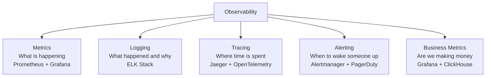
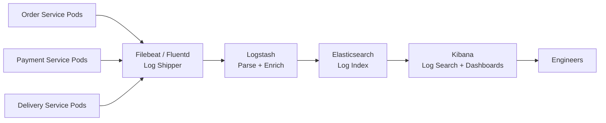

# 12 — Observability: Food Delivery Platform

---

## Objective

Define the complete observability strategy for the food delivery platform — metrics, logging, tracing, alerting, SLI/SLO definitions, dashboards, and business observability. A food delivery platform without observability is flying blind at 5M orders/day. Define what "good" looks like and what needs to be true for operations teams to sleep at night.

---

## 1. Observability Pillars



---

## 2. SLI / SLO / SLA Definitions

### 2.1 Order Placement SLO

| SLI | Measurement | SLO Target |
|-----|-------------|-----------|
| Order placement availability | (successful_order_requests / total_order_requests) × 100 | ≥ 99.9% |
| Order placement latency | P99 response time for POST /orders | ≤ 2 seconds |
| Order placement latency | P50 response time for POST /orders | ≤ 500ms |
| Saga completion time | Time from order placed to DELIVERY_ASSIGNED | ≤ 10 minutes (P95) |

### 2.2 Search SLO

| SLI | Measurement | SLO Target |
|-----|-------------|-----------|
| Search availability | (successful_search / total_search) × 100 | ≥ 99.9% |
| Search latency | P99 GET /search | ≤ 500ms |
| Search latency | P50 GET /search | ≤ 150ms |

### 2.3 Tracking SLO

| SLI | Measurement | SLO Target |
|-----|-------------|-----------|
| Location update lag | Time between driver update and customer SSE push | ≤ 10 seconds (P99) |
| Tracking availability | % of active orders with working SSE stream | ≥ 99.5% |

### 2.4 Business SLO

| SLI | Measurement | Target |
|-----|-------------|--------|
| Order success rate | (delivered_orders / placed_orders) × 100 | ≥ 95% |
| Payment failure rate | (failed_payments / total_payment_attempts) × 100 | ≤ 2% |
| Restaurant acceptance rate | (accepted_orders / notified_restaurants) × 100 | ≥ 85% |
| Delivery SLA breach | % orders delivered > 60 minutes from placement | ≤ 5% |
| Average delivery time | Mean minutes from order placed to delivered | ≤ 40 minutes |

### 2.5 Error Budget

```
SLO: 99.9% availability
Error budget: 0.1% = 43.8 minutes/month

If we burn 30 minutes in one incident, we have 13.8 minutes left.
If error budget < 20% remaining: FREEZE non-critical deployments.
If error budget = 0: No feature deployments until next month.
```

---

## 3. Metrics Strategy

### 3.1 Four Golden Signals (Per Service)

Instrument every service with these four metrics:

| Signal | Metric | Alert Threshold |
|--------|--------|----------------|
| Latency | P50, P95, P99 response time | P99 > 2s for order placement |
| Traffic | Requests per second | Baseline deviation > 3 sigma |
| Errors | Error rate (5xx) | > 0.5% for 2 minutes |
| Saturation | CPU, memory, connection pool utilization | CPU > 80%, pool > 90% |

### 3.2 Business Metrics (Custom)

```
# Order lifecycle metrics
order_placement_total{status="success|failure", city, payment_method}
order_state_transition_total{from_state, to_state, reason}
order_cancellation_total{cancelled_by, reason, city}
saga_step_duration_seconds{step, status}
saga_completion_total{status="success|compensated|timeout"}

# Payment metrics
payment_processing_duration_seconds{gateway, method}
payment_failure_total{reason, gateway}
refund_initiation_total{trigger}
refund_completion_latency_seconds

# Delivery metrics
delivery_assignment_duration_seconds{city}
delivery_eta_accuracy_seconds{city}  -- actual vs estimated
delivery_partner_acceptance_rate{city}
delivery_completion_total{status, city}

# Driver location metrics
driver_location_update_lag_seconds{city}
active_drivers_online{city}
driver_location_stale_total  -- locations older than 30s

# Restaurant metrics
restaurant_acceptance_rate{city}
restaurant_response_time_seconds  -- time from notification to accept/reject
restaurant_rejection_rate{reason}

# Search metrics
elasticsearch_query_duration_seconds{index, query_type}
search_cache_hit_rate
search_result_count{city, query_type}
```

### 3.3 Infrastructure Metrics

```
# PostgreSQL
postgres_replication_lag_seconds{instance}
postgres_active_connections{instance}
postgres_query_duration_seconds{query_type, table}  -- from pg_stat_statements
postgres_deadlocks_total
postgres_table_size_bytes{table}
postgres_index_hit_ratio{table}  -- should be > 99%

# Redis
redis_connected_clients
redis_memory_used_bytes
redis_keyspace_hits_total
redis_keyspace_misses_total  -- used for cache hit rate
redis_geo_commands_total{command}

# Kafka
kafka_consumer_group_lag{group, topic, partition}
kafka_messages_in_total{topic}
kafka_messages_out_total{topic, consumer_group}
kafka_under_replicated_partitions  -- must be 0
kafka_broker_disk_usage_bytes{broker}
kafka_producer_error_rate{topic}
```

---

## 4. Logging Strategy

### 4.1 Structured Logging (JSON)

All services emit structured JSON logs. Never use unstructured string logs in production.

```json
{
  "timestamp": "2025-01-15T12:35:02.123Z",
  "level": "INFO",
  "service": "order-service",
  "pod": "order-service-7d9f-abc123",
  "trace_id": "abc123def456",
  "span_id": "789xyz",
  "correlation_id": "ord_789xyz",
  "user_id": "usr_abc123",
  "event": "order_state_transition",
  "order_id": "ord_789xyz",
  "from_state": "PAYMENT_PENDING",
  "to_state": "PAYMENT_CONFIRMED",
  "duration_ms": 1230,
  "city": "bangalore"
}
```

### 4.2 Correlation ID Propagation

Every request entering the system gets a `correlation_id` injected by the API Gateway. This ID propagates through all service calls, all Kafka messages, and all database writes.

```
API Gateway: Inject X-Correlation-ID header
Order Service: Extract correlation_id from header → add to all logs, Kafka events, DB records
Payment Service: Extract from Kafka event → add to all logs
Notification Service: Extract from Kafka event → add to SMS/push logs

Result: Given a correlation_id (= order_id), find every log line across every service
        for that order in a single ELK query.
```

### 4.3 Log Levels and Sampling

| Level | When | Volume |
|-------|------|--------|
| ERROR | Exceptions, saga failures, payment errors | All logged |
| WARN | Retries, cache misses, degraded mode | All logged |
| INFO | State transitions, major events | All logged |
| DEBUG | Every request/response, DB queries | Sampled (10% in production) |
| TRACE | Internal method calls | Off in production |

**Cost Control:** DEBUG and TRACE logs at full volume would generate terabytes/day. Sampling at 10% keeps them manageable while preserving debuggability.

### 4.4 Log Aggregation (ELK Stack)



**Index Strategy:**
- Index per day per service: `order-service-2025.01.15`
- Retention: 7 days for DEBUG, 30 days for INFO+, 90 days for ERROR+, 1 year for audit logs
- ILM (Index Lifecycle Management) manages rotation and deletion automatically

---

## 5. Distributed Tracing

### 5.1 OpenTelemetry Integration

All services instrument with OpenTelemetry SDK. Traces are exported to Jaeger (or Tempo for Grafana-native tracing).

```mermaid
sequenceDiagram
    participant C as Customer App
    participant GW as API Gateway
    participant OS as Order Service
    participant PS as Payment Service
    participant RS as Restaurant Service
    participant JAE as Jaeger

    C->>GW: POST /orders [traceparent: 00-trace123-span1-01]
    GW->>OS: [traceparent: 00-trace123-span2-01]
    OS->>OS: Saga step 1 [span3]
    OS->>PS: Kafka: SagaPaymentRequested [traceparent in Kafka headers]
    PS->>PS: Payment processing [span4]
    PS->>OS: Kafka: PaymentConfirmed [traceparent]
    OS->>RS: Kafka: SagaRestaurantNotifyRequested [traceparent]

    OS->>JAE: Export all spans
    PS->>JAE: Export all spans
    RS->>JAE: Export all spans

    Note over JAE: Full trace: API → Saga → Payment → Restaurant
                  Visible as single distributed trace
```

### 5.2 What Traces Enable

1. **Identify which saga step is slowest** (e.g., delivery assignment P99 is 8 seconds)
2. **Trace a specific order's complete journey** across all services
3. **Detect N+1 query patterns** (many DB spans in sequence)
4. **Measure external gateway latency** (payment gateway span duration)
5. **Correlate with errors** (which trace ID correlates with this error log)

### 5.3 Trace Sampling Strategy

```
Default: 10% trace sampling (high volume systems cannot trace 100%)
Exception: 100% sampling for:
  - All ERROR traces
  - All traces with duration > 5 seconds (slow transactions)
  - All payment-related traces (for audit)
  - 100% sampling for new service versions during canary (detect regressions)
```

---

## 6. Alerting Strategy

### 6.1 Alert Hierarchy

| Severity | Response Time | Channel | Example |
|----------|--------------|---------|---------|
| P1 — Critical | Immediate (< 5 min) | PagerDuty + Phone call | Payment failure rate > 5%, Order Service down |
| P2 — High | < 30 min | PagerDuty + Slack | Consumer lag spike, search down |
| P3 — Medium | < 4 hours | Slack | High 4xx error rate, cache miss rate spike |
| P4 — Low | Next business day | Email/ticket | Disk usage > 60%, slow query detected |

### 6.2 Critical Alerts

```yaml
# P1: Payment failure spike
alert: PaymentFailureSpike
condition: rate(payment_failure_total[5m]) / rate(payment_total[5m]) > 0.05
for: 2m
severity: critical
annotations:
  summary: "Payment failure rate >5% for 2 minutes"
  runbook: "https://runbooks.internal/payment-failure"

# P1: Order Service unavailable
alert: OrderServiceDown
condition: up{job="order-service"} == 0
for: 30s
severity: critical

# P1: Kafka consumer lag spike on saga topics
alert: SagaConsumerLagCritical
condition: kafka_consumer_group_lag{group="order-service-saga"} > 50000
for: 2m
severity: critical
annotations:
  summary: "Saga consumer lag >50K messages — orders stuck"

# P1: Payment DLQ messages
alert: PaymentDLQNotEmpty
condition: kafka_messages_in_total{topic="payment.dlq"} > 0
for: 0m  # Alert immediately
severity: critical

# P2: PostgreSQL replication lag
alert: PostgresReplicationLag
condition: postgres_replication_lag_seconds > 30
for: 1m
severity: high

# P2: Delivery partner location stale
alert: DriverLocationStale
condition: driver_location_stale_total / active_drivers_total > 0.1
for: 2m
severity: high
annotations:
  summary: ">10% of active drivers have stale location"

# P2: Restaurant acceptance rate drop
alert: RestaurantAcceptanceRateDrop
condition: rate(restaurant_acceptance_total{status="accepted"}[10m]) /
           rate(restaurant_notified_total[10m]) < 0.7
for: 5m
severity: high
```

### 6.3 Alert Fatigue Prevention

- Alerts must be actionable — no alert that fires if no action can be taken
- Deduplication: Multiple pods reporting the same failure = one alert
- Cooldown periods: Do not re-alert within 30 minutes for same condition
- Alert correlation: If Order Service is down, suppress downstream alerts (no need to alert about consumer lag — it's caused by the same root issue)

---

## 7. Dashboards

### 7.1 Operational Command Center Dashboard

Real-time (< 30 second refresh) — visible to on-call engineers:

```
Row 1: Business Health
  - Order success rate (last 5 min)       Target: > 99%
  - Orders per minute                      Current: 8,200
  - Payment failure rate                   Target: < 2%
  - Average delivery time                  Current: 37 min

Row 2: Service Health
  - Order Service P99 latency             Target: < 2s
  - Payment Service P99 latency           Target: < 3s
  - Search P99 latency                    Target: < 500ms
  - Active pods per service               Sparkline

Row 3: Infrastructure Health
  - Kafka consumer lag (per consumer group)
  - PostgreSQL connections (vs limit)
  - Redis memory utilization
  - Elasticsearch cluster health

Row 4: Delivery Operations
  - Active orders by state (Sankey diagram)
  - Partners online by city
  - Average assignment time
  - Deliveries in SLA breach
```

### 7.2 City-Level Operations Dashboard

One dashboard per city, visible to city operations teams:

```
- Orders placed (hourly, with yesterday comparison)
- Orders by state (real-time count)
- Restaurant acceptance rate by restaurant
- Partners online vs estimated demand
- Average delivery time by zone
- Top cancellation reasons
- Surge pricing status
```

### 7.3 Business Intelligence Dashboard (ClickHouse / BigQuery)

Daily refresh, visible to product and business teams:

```
- Revenue by city / cuisine / restaurant
- Order frequency by customer cohort
- NPS score trend (from review ratings)
- Restaurant churn rate
- New customer activation funnel
- Coupon ROI analysis
```

---

## 8. Distributed Tracing: Saga Step Timing

One of the most valuable traces in this system:

```
Trace: Order ord_789xyz (total duration: 8.3 minutes from PLACED to DELIVERY_ASSIGNED)

Span breakdown:
  POST /orders handling           → 320ms
  DB write (order + outbox)       → 45ms
  Kafka publish (outbox relay)    → 85ms
  Payment Service processing      → 1.23s  ← includes gateway call
  Payment event → Order Service   → 0.8s   (Kafka lag + processing)
  Restaurant notification          → 0.2s
  Restaurant response wait        → 4.2m   ← restaurant was slow to accept
  Delivery assignment algorithm   → 1.1s
  Partner assignment offer loop   → 2.3s   (3 partners declined)
  Kafka → customer SSE push       → 0.3s

Bottleneck identified: Restaurant response time (4.2 minutes)
Action: Investigate why this restaurant is slow to accept
```

---

## 9. Synthetic Monitoring

Beyond real-user monitoring, run synthetic probes every minute:

| Probe | What it checks | Alert |
|-------|---------------|-------|
| Search probe | GET /search?city=bangalore&q=pizza | P99 > 1s, any error |
| Order placement probe | Full order flow in staging-like environment | Failure = P1 |
| Login probe | OTP flow (test phone) | Failure = P2 |
| Tracking probe | SSE connection establishment | Failure = P2 |
| Payment probe | Test payment in sandbox mode | Failure = P1 |

Synthetic monitoring detects issues before real users do.

---

## 10. On-Call Runbooks

Every P1 alert must have a runbook:

| Alert | Runbook Steps |
|-------|--------------|
| PaymentFailureSpike | 1. Check gateway status page. 2. Check Payment Service logs. 3. Check Kafka payment.dlq. 4. If gateway down: enable fallback gateway. |
| SagaConsumerLagCritical | 1. Check Order Service pod count. 2. Scale pods. 3. Check for consumer errors in logs. 4. Check Kafka broker health. |
| OrderServiceDown | 1. Check pod status (kubectl get pods). 2. Check recent deployment. 3. Rollback if needed. 4. Check DB connectivity. |
| PostgresReplicationLag | 1. Check replica sync status. 2. Check network between primary and replica. 3. If > 5 minutes lag: investigate WAL sender. |

---

## 11. Tradeoffs

| Decision | Benefit | Cost |
|----------|---------|------|
| 10% trace sampling | Low overhead | Miss some failures in traces |
| 100% payment trace sampling | Full audit trail | 10x storage for payment traces |
| Structured JSON logging | Machine-parseable, filterable | Slightly larger log volume |
| OpenTelemetry (vendor-neutral) | Switch backends without code changes | Less native integration than vendor SDKs |
| Separate analytics from operational metrics | Analytics doesn't impact Prometheus | Delay in business metrics (T+minutes) |

---

## Interview-Level Discussion Points

1. **What is the difference between SLI, SLO, and SLA?** SLI (Service Level Indicator) is the measurement (e.g., P99 order placement latency). SLO (Service Level Objective) is the internal target (e.g., P99 < 2s). SLA (Service Level Agreement) is the external commitment with penalties (e.g., contractual 99.9% uptime guarantee). SLOs should be stricter than SLAs to have a buffer.

2. **How do you distinguish a real spike in errors from a monitoring noise?** Use rate over time, not raw counts. `rate(errors[5m]) > 0.05` rather than `errors > 10`. Use `for: 2m` to require the condition to persist before alerting. Use burn rate alerts (how quickly error budget is being consumed) rather than instantaneous spike alerts.

3. **What would you trace first when an order is slow?** Pull the distributed trace by correlation_id (= order_id). Look at the span tree — identify which span took the most time. Common culprits: (1) Payment gateway call (high latency), (2) Restaurant response wait (restaurant is slow), (3) Kafka consumer lag (saga step delayed), (4) Delivery assignment (no partners nearby).

4. **Why does every service need the `correlation_id` from the Kafka event?** Because a failure might happen in the middle of the saga — in Delivery Service, for example. To trace the root cause, you need to correlate the Delivery Service logs back to the original order (correlation_id = order_id). Without propagating correlation_id through Kafka events, you cannot cross the event bus boundary in your traces.

5. **How do you handle alert fatigue?** Four strategies: (1) Actionability — every alert must require immediate human action. If no action, it should be a metric on a dashboard, not an alert. (2) Correlation — suppress child alerts when root cause alert fires. (3) Cooldown — no alert twice for same condition within 30 minutes. (4) Regular review — quarterly review of alert trigger rates; tune or remove high-frequency alerts.
