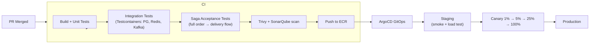

# 13 — Deployment Architecture: Food Delivery Platform

## Objective
Define the full deployment topology, Kubernetes strategy, CI/CD pipeline, multi-region design, and operational model for a production food delivery platform. Food delivery has unique deployment challenges: massive lunch/dinner traffic peaks (5–10× baseline), multi-party coordination (user + restaurant + delivery partner), and the Saga orchestration service which must be highly available — a crash mid-saga means orphaned orders.

---

## Infrastructure Overview

```mermaid
graph TB
    subgraph "Edge Layer"
        CDN["CloudFront CDN<br/>(Menu images, static assets)"]
        GA["AWS Global Accelerator<br/>(Delivery partner WebSocket)"]
    end

    subgraph "Region: ap-south-1 (India Primary)"
        ALB["ALB — API Traffic (rider/restaurant apps)"]
        NLB["NLB — WebSocket (delivery partner GPS)"]

        subgraph "EKS: API Cluster"
            OS["Order Service<br/>(Saga Orchestrator)"]
            RS["Restaurant Service"]
            MS["Menu Service"]
            DS["Delivery Service"]
            PS["Payment Service"]
            SS["Search Service"]
            NS["Notification Service"]
            CS["Customer Service"]
        end

        subgraph "Data Layer"
            PG["Aurora PostgreSQL (Multi-AZ)<br/>(orders, users, restaurants)"]
            RD["ElastiCache Redis Cluster<br/>(6 shards — locations, cache, sessions)"]
            ES["OpenSearch Cluster<br/>(restaurant + menu search)"]
            KF["MSK Kafka (3 brokers)<br/>(saga events, analytics)"]
            S3["S3 (menu images, receipts)"]
        end
    end

    subgraph "Region: us-east-1"
        ALB2["ALB"]
        EKS2["EKS (read-heavy API)"]
        PG2["Aurora Global DB Replica"]
        ES2["OpenSearch Replica"]
    end

    CDN --> ALB
    GA --> NLB
    ALB --> EKS API Cluster
    NLB --> DS
    OS --> KF
    OS --> PG
    DS --> RD
    SS --> ES
    CDN -->|"Static assets"| S3
```

---

## Kubernetes Cluster Design

### Node Pools

| Pool | Services | Node Type | Scaling |
|------|----------|-----------|---------|
| **api-pool** | Order, Restaurant, Menu, Customer | c5.2xlarge, spot | HPA: CPU |
| **saga-pool** | Order Service (Saga Orchestrator) | c5.2xlarge, **on-demand** | HPA: CPU + Kafka lag |
| **delivery-ws** | Delivery Service (WebSocket) | r5.2xlarge, on-demand | HPA: active connections |
| **search-pool** | Search Service | c5.xlarge, spot | HPA: CPU |
| **payment-pool** | Payment Service | c5.xlarge, **on-demand** | HPA: CPU (conservative) |

**Why Saga Orchestrator on on-demand?**: A spot interruption mid-saga (order placed, payment processing) creates an orphaned transaction requiring manual reconciliation. Never run financial state machines on spot instances.

**Why Delivery WebSocket on on-demand?**: Active delivery partner connections cannot afford sudden node termination. 60-second drain period + on-demand nodes.

---

## Autoscaling Strategy

### HPA Configuration

| Service | Trigger | Min | Max |
|---------|---------|-----|-----|
| Order Service | CPU > 60% OR Kafka saga-events lag > 100 | 3 | 60 |
| Delivery Service | WebSocket connections > 8K/pod | 5 | 80 |
| Restaurant Service | CPU > 65% | 2 | 30 |
| Search Service | CPU > 70% | 3 | 30 |
| Payment Service | CPU > 50% | 3 | 15 |
| Notification Service | Kafka notification-events lag > 500 | 2 | 20 |

### Peak Load Strategy (Lunch/Dinner)
Food delivery traffic is highly predictable: 12–2 PM and 7–10 PM are 5–10× baseline.

- **Pre-scaling** (Kubernetes CronJob): scale up Order Service, Delivery Service, and Search Service 30 minutes before predicted peak.
- **KEDA** on Notification Service for Kafka-driven scaling during peak.
- **Cluster Autoscaler**: new EC2 nodes provisioned in ~3 min — not fast enough for sudden spikes. Pre-scaling compensates.

Pre-scale CronJob schedule:
```
Scale UP:   11:30 AM, 6:30 PM (IST)
Scale DOWN: 3:00 PM, 11:30 PM (IST)
```

---

## CI/CD Pipeline



### Saga Acceptance Tests in CI
Critical: Run a full end-to-end saga (order placement → payment → restaurant accept → delivery assign → complete) using Testcontainers in CI. If the saga flow breaks, the build fails. This is non-negotiable — saga regression is a P0 incident.

### Deployment Strategies

| Service | Strategy | Reason |
|---------|----------|--------|
| Order Service (Saga) | Canary (1% → 100% over 2h) | Saga state machine changes are highest risk |
| Payment Service | Canary (0.1% → 1% → 5% → 100%) | Financial impact of regression |
| Restaurant Service | Rolling update | Low state complexity |
| Delivery Service | Rolling with drain | WebSocket connections must drain |
| Search Service | Blue-Green | Algorithm changes need instant rollback |
| Notification Service | Rolling | Stateless, low risk |

### Database Migration Strategy
All database migrations follow Expand-Contract:
1. **Expand**: add new column nullable (no downtime).
2. **Backfill**: background job fills existing rows.
3. **Contract**: make column NOT NULL, drop old column.
4. Never lock tables in production. Never drop a column in the same deploy that uses it.

---

## Multi-Region Deployment

### Region-to-City Mapping

| Region | Cities | Data Residency |
|--------|--------|----------------|
| ap-south-1 | India (Mumbai, Bangalore, Delhi, Hyderabad) | India data stays in India (DPDP Act) |
| ap-southeast-1 | SE Asia (Jakarta, Bangkok, Singapore) | Country-specific |
| eu-west-1 | Europe | GDPR — EU data stays in EU |
| us-east-1 | US + Canada | — |

### Cross-Region Data Strategy

| Component | Cross-Region |
|-----------|-------------|
| Aurora (orders) | Global DB read replicas for analytics only |
| Redis (delivery locations) | No replication — ephemeral, city-local |
| Kafka | Per-region MSK — no cross-region |
| Elasticsearch | Per-region cluster — re-indexed from Kafka |
| Menu images (S3) | CRR to all regions — served via CDN |

### Traffic Routing
- Route 53 Geolocation → nearest region.
- Health check → failover in < 30s.
- Delivery partner WebSocket via Global Accelerator (consistent latency for GPS stream).

---

## Environment Strategy

| Environment | Purpose | Data |
|-------------|---------|------|
| **local** | Development | Docker Compose: PG, Redis, Kafka, ES, MinIO |
| **dev** | Integration | Shared EKS namespace, seed data |
| **staging** | Pre-production | Dedicated cluster, 20% prod scale, anonymized data |
| **production** | Live | Full scale, real data |

### Local Docker Compose Stack
- PostgreSQL 15
- Redis 7 (single node)
- Kafka + Zookeeper (single broker)
- OpenSearch (single node)
- MinIO (S3-compatible for menu images)
- Wiremock for payment gateway
- Fake SMS/Push notification sink (logs to console)
- Seed data: 50 restaurants, 200 menu items, 10 delivery zones

---

## Secrets Management

| Secret | Storage | Rotation |
|--------|---------|----------|
| DB credentials | AWS Secrets Manager + K8s ExternalSecrets | 30 days auto |
| JWT signing key | AWS KMS | 90 days |
| Payment gateway API keys | Secrets Manager | On change |
| FCM/APNs push credentials | Secrets Manager | On certificate expiry |
| Maps API key | Secrets Manager | On change |
| Kafka SASL credentials | Secrets Manager | 60 days |

---

## Disaster Recovery

| Scenario | RTO | RPO | Response |
|----------|-----|-----|----------|
| Single pod failure | < 30s | 0 | K8s self-healing |
| AZ failure | < 2 min | 0 | Multi-AZ EKS + Aurora |
| Saga Orchestrator outage | < 3 min | < 1 min | Kafka offsets preserved — replay events on recovery |
| Payment gateway down | < 5 min | 0 | Circuit breaker open → switch to backup gateway |
| Database regional failure | < 5 min | < 1s | Aurora Global DB promote |
| Full region failure | < 15 min | < 5 min | Route 53 failover + data plane promote |

### Active Order During Outage
- Orders in PAYMENT_PROCESSING state: resume on recovery (idempotency key prevents double charge).
- Orders in RESTAURANT_ACCEPTED / DELIVERY_ASSIGNED: Kafka events replay → Saga resumes from last confirmed step.
- Orders in FOOD_PICKED_UP: Delivery Service resumes tracking from last GPS point.
- Timeout: any order in a transient state for > 30 min → auto-cancel with full refund.

---

## Observability Integration

- All pods emit structured logs → Fluent Bit sidecar → Elasticsearch.
- Prometheus scrape annotations on all deployments.
- OpenTelemetry SDK in all services → Jaeger collector.
- Saga trace: single trace spans the entire order lifecycle (order creation → payment → restaurant → delivery).
- Business metrics: order volume, payment failure rate, delivery SLA breach → Grafana.

---

## Interview-Level Discussion Points

- **How do you prevent a Saga crash from leaving orders in broken state?** — Saga state is persisted to PostgreSQL on every step. On restart, Saga Orchestrator reads all orders in non-terminal states from DB and replays from last confirmed Kafka offset. Idempotency on every step prevents double-processing.
- **Why pre-scale instead of relying on autoscaler?** — Cluster Autoscaler takes 3–5 minutes to provision new nodes. At lunch peak, the spike is nearly instantaneous. Pre-scaling ensures capacity is ready before demand arrives. The cost of running extra pods for 30 extra minutes is negligible vs the revenue loss of failed orders.
- **How do you deploy a Saga state machine change without breaking active orders?** — Deploy new version with backward-compatible state handling. Old orders continue on old state machine (version tag on order). New orders use new state machine. After all old orders complete (usually < 2h), old version code paths can be removed.
- **How do you test the full saga in CI?** — Testcontainers: PostgreSQL + Kafka + Redis + WireMock (payment gateway). Full saga acceptance test creates an order, verifies each state transition via Kafka event assertions, verifies DB state at each step. Runs in < 2 minutes in CI.
