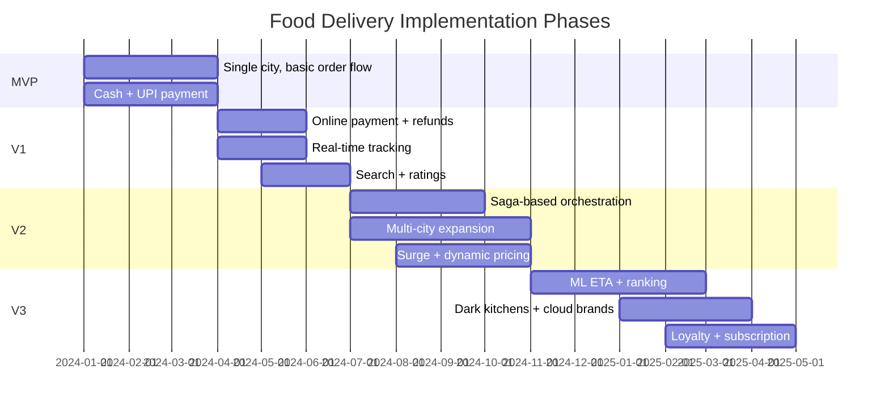

# 15 — Implementation Roadmap: Food Delivery Platform

## Objective
Define a realistic, phased path from a single-city MVP to a global, ML-powered food delivery platform. Each phase is justified by business value, calls out premature complexity traps, and identifies the specific architectural tipping points that force the next evolution.

---

## Phase Overview

---

## MVP — Single City, Manual Dispatch (Months 1–3)

### Goal
One city. Users browse restaurants, place orders, pay cash or UPI, delivery partners are dispatched manually (operations team assigns). Prove demand exists before building complex automation.

### Features
- User app: browse restaurants by category, view menu, add to cart, place order
- Restaurant app (tablet): receive order notification, accept/reject, mark food ready
- Delivery partner app: view assigned order, GPS tracking, mark delivered
- Cash + UPI payment (no card gateway initially)
- Manual dispatch: ops team calls delivery partner, assigns via admin panel
- Basic order tracking: status updates (PLACED → ACCEPTED → PICKED UP → DELIVERED)
- SMS notifications at each status change
- Admin dashboard: live orders, partner status, restaurant status

### Architecture
- **Single Spring Boot monolith** with modules: order, restaurant, delivery, user, notification.
- PostgreSQL for all data (orders, restaurants, menus, users, delivery partners).
- Redis for session storage only.
- Firebase Realtime Database for delivery partner GPS (free tier, avoids WebSocket infra).
- No Kafka — synchronous flow throughout.
- NGINX + single EC2 instance, RDS PostgreSQL.

### Team
- 3–4 engineers: 1 backend, 1 Android (user app), 1 Android (restaurant + delivery app), 0.5 DevOps.
- 1–2 operations staff: manual dispatch.

### Risks
- Manual dispatch is not scalable — ops bottleneck at > 50 orders/hour.
- Firebase vendor lock-in for tracking — plan extraction at V1.
- No fault tolerance — single server failure = complete outage.
- No payment reconciliation — cash payments require manual settlement.

### MVP Success Criteria
- 500 orders/day in one city.
- Restaurant acceptance rate > 80%.
- Average delivery time < 45 minutes.
- Zero order data loss.

---

## V1 — Automated Core Platform (Months 4–6)

### Goal
Automated delivery partner dispatch, real-time GPS tracking, online payment with refunds, search, and ratings. End manual dispatch entirely.

### New Features
- Automated delivery partner matching (nearest available within 5 km of restaurant)
- Real-time order tracking via WebSocket (replace Firebase)
- Online payment integration (Razorpay/Stripe — card, UPI, wallet)
- Refund pipeline for cancellations
- Restaurant search (text + cuisine filter)
- Post-delivery ratings (both rider and delivery partner)
- Push notifications (FCM for Android, APNs for iOS)
- iOS user app
- Delivery partner acceptance timeout (30s → re-assign)
- Basic ETA estimate (distance-based, static formula)
- Cancellation policy (free within 60s of placement)

### Architecture Evolution
- Extract **Delivery Service** from monolith (WebSocket server for GPS, Redis GEO for partner locations).
- **Payment Service** extracted (PCI compliance isolation).
- Redis introduced: delivery partner locations (GEO), session cache, order state cache.
- Kafka introduced for payment events and notifications (async, decouple delivery).
- Search: Elasticsearch for restaurant name + cuisine search (replace PostgreSQL LIKE queries).
- Monolith retains: order management, restaurant management, ratings, menu.
- PostgreSQL Multi-AZ + read replica for restaurant catalog reads.

### Infrastructure
- EKS (2 node pools: API + Delivery WebSocket).
- ElastiCache Redis (primary + replica).
- MSK Kafka (3 brokers).
- Aurora PostgreSQL (Multi-AZ).
- OpenSearch (3 nodes).
- CloudFront CDN for menu images.
- GitHub Actions CI + ArgoCD.

### Team
- 7–9 engineers: delivery service, payment service, search, iOS app, Android (iterate), backend core, DevOps/SRE.

### Risks
- WebSocket stateful infra — needs connection draining on deployment.
- Payment gateway integration testing complexity.
- Elasticsearch mapping must be designed carefully (schema changes require re-index).

### V1 Success Criteria
- 10,000 orders/day, 1,000 active delivery partners.
- Automated dispatch match rate > 85%.
- Payment success rate > 99%.
- Order tracking lag < 5 seconds.

---

## V2 — Scale & Multi-City (Months 7–10)

### Goal
Production-grade Saga orchestration, multi-city expansion, surge pricing, analytics, and the platform capable of handling 10× peak loads.

### New Features
- **Saga orchestration**: Order Service becomes the saga orchestrator (replaces simple monolith flow) — handles multi-step coordination with compensating transactions
- **Outbox pattern**: reliable event publishing to Kafka via Transactional Outbox
- **Multi-city expansion**: city-level configuration, per-city delivery zones, local payment methods
- **Surge pricing**: demand/supply ratio per delivery zone, dynamic delivery fee multiplier
- **Dynamic ETA**: per-restaurant average prep time model (updated daily from historical data)
- **Restaurant portal**: web dashboard for order analytics, menu management, payout history
- **Coupons and promotions**: discount codes, first-order free, cashback
- **Customer support chat**: in-app chat with support agents for issue resolution
- **Real-time business analytics**: orders/hour per city, match rate, cancellation rate dashboard
- **Split-city delivery zones**: restaurant can serve multiple zones, zones have independent surge

### Architecture Evolution
- **Order Service** becomes full Saga Orchestrator — stateful, persisted state machine.
- Outbox pattern on Order Service: every state transition persisted atomically with outbox events.
- **Analytics pipeline**: Kafka → Flink → ClickHouse for real-time city dashboards.
- **Pricing Service** extracted: surge multiplier calculation, delivery fee, promo application.
- **City Config Service**: per-city regulatory rules, delivery zone polygons, vehicle types, payment methods.
- Redis cluster (6 shards) for multi-city delivery location storage.
- Pre-scaling CronJob for lunch/dinner peaks.

### Infrastructure
- Per-region EKS clusters for new cities.
- Flink cluster for stream analytics.
- ClickHouse for OLAP analytics.
- Chaos engineering: Chaos Monkey runs to validate failure handling.

### Team
- 15–20 engineers: saga/platform (2), payments (2), search (1), analytics (2), multi-city ops (2), restaurant portal (2), growth/promos (2), mobile (2 iOS + 2 Android), infra/SRE (2).

### Risks
- Saga introduces new failure modes — needs comprehensive testing.
- Multi-city regulatory complexity: different GST rules, local payment methods, language support.
- Surge pricing regulatory risk: some markets regulate surge (e.g., India post-COVID).

### V2 Success Criteria
- 500,000 orders/day across 20 cities.
- Saga success rate > 99.5%.
- Peak load handling without degradation (5× lunch peak).
- Restaurant portal adoption > 70% of partners.

---

## V3 — Intelligence & Ecosystem (Months 11–18)

### Goal
ML-based ETA and ranking, dark kitchen integration, loyalty program, subscription service, and platform ecosystem play.

### New Features
- **ML ETA**: per-restaurant, per-menu-item prep time prediction (LSTM model trained on order history)
- **ML restaurant ranking**: personalized restaurant ordering based on user history + collaborative filtering
- **Dark kitchen support**: virtual restaurant brands from shared kitchens, brand-level menu management
- **Subscription service**: monthly membership for free delivery / discounts (like Swiggy One / Zomato Gold)
- **Loyalty points system**: earn points per order, redeem for discounts
- **Multi-restaurant cart**: order from multiple restaurants in one cart (complex saga extension)
- **Advanced fraud detection**: ML model for payment fraud, account takeover, coupon abuse
- **Contactless delivery**: delivery confirmation via OTP or photo proof
- **Grocery and essentials**: expand beyond restaurants to grocery delivery (significant catalog expansion)
- **B2B catering**: bulk order management for corporate clients
- **Driver earnings optimization**: ML-suggested optimal hours, zones, vehicle type

### Architecture Evolution
- ML pipeline: feature store (Redis + S3) → training (SageMaker) → serving (Triton inference server).
- Multi-restaurant saga: nested saga with branch per restaurant + convergence step for delivery assignment.
- Grocery catalog service: separate from restaurant menu (different data model, much larger catalog, inventory tracking).
- Fraud ML service: real-time scoring on payment events (< 100ms latency requirement).
- Service mesh (Istio): mTLS between services, advanced traffic management, circuit breaker at mesh level.

### Infrastructure
- Global multi-region deployment (India, SE Asia, Middle East, Europe).
- Aurora Global Database for user data + loyalty points.
- ML inference cluster (GPU-backed Triton).
- Snowflake for central data warehouse (analytics + ML training data).
- Istio service mesh.
- A/B testing platform (LaunchDarkly or in-house).

### Team
- 60–100 engineers: ML (5–8), dark kitchens (3), grocery (5), B2B (3), loyalty/subscription (3), fraud (3), platform SRE (5), regional teams per market, mobile (8+).

### V3 Success Criteria
- 5M orders/day globally.
- ML ranking improves conversion rate by 10%.
- Subscription service achieves 2M paid subscribers.
- Dark kitchen brands contribute 15% of order volume.

---

## Architecture Evolution Summary

| Phase | Style | Key Additions |
|-------|-------|---------------|
| MVP | Monolith | PostgreSQL, Firebase, manual dispatch |
| V1 | Partial Microservices | Redis, WebSocket, Kafka, ES, automated dispatch |
| V2 | Event-Driven Microservices | Saga, Outbox, Flink, ClickHouse, multi-city |
| V3 | Global Microservices + ML | ML pipeline, mesh, dark kitchens, grocery |

---

## Overengineering Traps

| Temptation | Why to Resist |
|------------|--------------|
| Saga from day one | Until you have 3+ services, synchronous calls are simpler and faster |
| Elasticsearch in MVP | PostgreSQL ILIKE is fine for 500 restaurants in one city |
| ML ranking before 1M orders | No training data → model worse than simple sort by rating + distance |
| Multi-restaurant cart in V1 | Complex saga, partner coordination, fare split — builds on stable V1 foundation |
| Subscription before loyalty base | No subscriber retention without understanding order behavior first |

---

## Interview-Level Discussion Points

- **Why does the Saga replace the monolith in V2, not V1?** — In V1, the order flow is simple enough (place → match → deliver) that synchronous calls within the monolith work. V2 introduces multi-city, promotional pricing, and surge — the number of failure modes requiring compensation grows beyond what synchronous calls can handle cleanly.
- **When would you add the outbox pattern?** — When you need a guarantee that every database write produces a Kafka event, even if the Kafka publish fails. Without outbox: "payment processed" written to DB, Kafka publish fails, delivery service never knows. With outbox: write DB + outbox atomically, CDC/poller guarantees eventual Kafka delivery.
- **How do you decide when to extract a service?** — When: (1) the module has a different scaling axis than the monolith, (2) it has a separate team/owner, (3) it needs independent deployability, or (4) it's a clear bottleneck that can't be fixed in the monolith. Not before all three.
