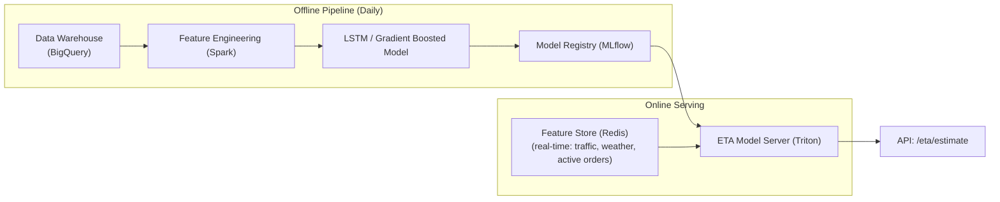
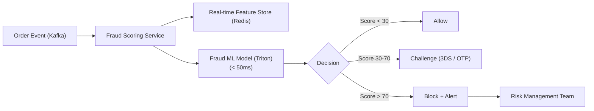
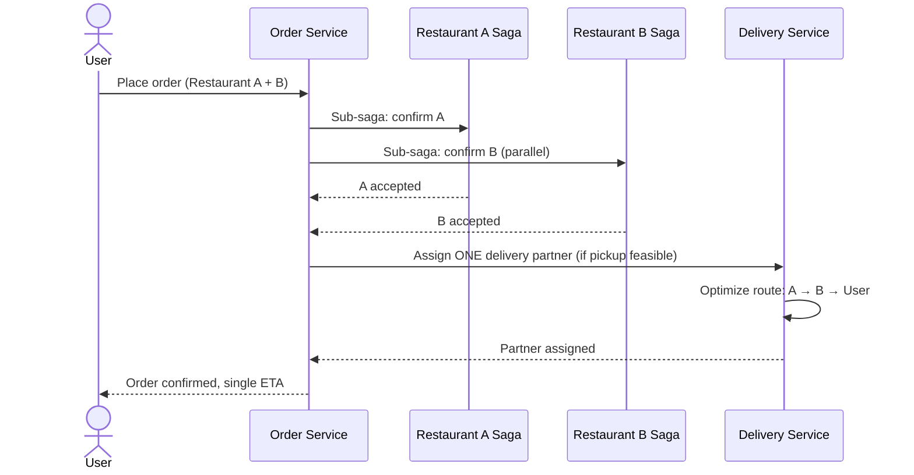

# 16 — Advanced Improvements: Food Delivery Platform

## Objective
Document frontier engineering improvements that separate category-defining food delivery platforms (Swiggy, DoorDash) from commodity implementations. Each improvement is grounded in real engineering problems, quantified by business impact, and honest about the complexity cost.

---

## 1. ML-Based ETA Prediction Engine

### Problem
Static ETA formula (distance ÷ average speed + fixed prep time) has ±15 minute error. This causes: order cancellations ("it says 20 min but it's been 45"), poor restaurant planning, and incorrect customer expectations.

### Why It Matters
Swiggy's internal research: 1-minute ETA accuracy improvement correlates with 0.5% improvement in order conversion. At 500K orders/day, that's 2,500 more orders/day from ETA accuracy alone.

### Architecture

### Features for Prep Time Model
| Feature | Type |
|---------|------|
| Restaurant | Restaurant ID, kitchen capacity, current active orders |
| Menu items ordered | Item complexity score, prep time historical avg |
| Time of day, day of week | Batch |
| Weather (rain → slower cooks) | Real-time |
| Historical delivery times for this restaurant × time slot | Batch |

### Features for Travel Time Model
| Feature | Type |
|---------|------|
| Road distance (OSRM) | Real-time |
| Traffic conditions (Google Maps API) | Real-time |
| Weather (rain → slower travel) | Real-time |
| Historical delivery times for this zone × hour | Batch |
| Delivery partner historical speed profile | Batch |

### Accuracy Improvement
- Static formula: ±15 min error (MAE).
- Gradient boosted model: ±5 min error.
- LSTM (sequential learning): ±3 min error.
- Production deployment: A/B tested, 10% → 50% → 100% rollout after validation.

---

## 2. Dynamic Delivery Zone Optimization

### Problem
Delivery zones are static polygons defined at city launch and rarely updated. A restaurant in South Mumbai delivering to Bandra is configured to serve "all of South+Central Mumbai" — but historical data shows 80% of orders > 8 km take > 60 min and have high cancellation rates.

### Solution
- **Weekly batch job**: for each restaurant × zone combination, compute:
  - Average delivery time
  - Cancellation rate (delivery-related)
  - Customer rating correlation with delivery time
- **Zone shrink recommendation**: if avg delivery time > 50 min for a zone → flag for ops review.
- **Automated zone adjustment**: if zone consistently > 60 min and > 10% cancellation → auto-reduce zone polygon by 20% in that direction.
- **Restaurant notification**: "Your delivery zone in [Area] was reduced to improve customer experience."

### Implementation
- H3 hexagonal grid for zone representation (variable resolution: city-level H3 resolution 8 ≈ 0.7 km² hexagons).
- Delivery performance computed per hexagon per restaurant.
- Zone polygon = union of hexagons with acceptable performance metrics.

---

## 3. Fraud Detection ML Pipeline

### Problem
At scale, food delivery fraud includes: fake accounts (bonus abuse), payment fraud (stolen cards), delivery fraud (partner marks delivered without delivering), restaurant fraud (ghost orders for payout).

### Fraud Signals by Type

| Fraud Type | Signals | Detection |
|------------|---------|-----------|
| Account bonus abuse | Multiple accounts same device_id, phone, IP | Graph clustering + rule engine |
| Card fraud | New account + high-value order + card not matching region | ML score + 3DS challenge |
| Delivery fraud | GPS shows partner at location but photo proof missing | Computer vision on proof photo + GPS validation |
| Restaurant fraud | Order patterns inconsistent with capacity | Anomaly detection on order volume |

### Architecture

### Key Design Decisions
- Model must score in < 50ms (payment flow is synchronous — can't hold user for fraud check).
- Model features: account age, device fingerprint, order history, payment method trust score, velocity (orders in last 1h, 24h).
- False positive cost: blocking a legitimate order = lost revenue + angry user. False negative cost: fraud loss + chargeback. Tune threshold conservatively (tolerate some fraud to minimize false positives).
- Rules engine runs before ML: hard blocks (known fraudulent cards, banned accounts) need no ML.

---

## 4. Multi-Restaurant Cart & Consolidated Delivery

### Problem
Users frequently want to order from multiple restaurants (family with different preferences). Today: place two separate orders = two deliveries = two delivery fees = worse experience.

### Solution Architecture

### Feasibility Check
- Only consolidated delivery if Restaurant A and Restaurant B are within 2 km of each other.
- If not feasible → two separate delivery assignments.
- Delivery fee split: charged once to user, platform absorbs extra cost (marketing spend).

### Complexity
- Nested saga: one parent saga coordinates two restaurant sub-sagas.
- If Restaurant A accepts but Restaurant B rejects → cancel A order, refund → user must reorder from A separately.
- ETA is max(ETA_A, ETA_B) + consolidated delivery time.
- This is a V3+ feature — adds enormous saga complexity. Solve single-restaurant at scale first.

---

## 5. Intelligent Restaurant Ranking (Personalized)

### Problem
Every user sees the same restaurant ranking. A vegetarian user sees biryani restaurants before salad restaurants. A user who always orders pizza at lunch is shown pasta restaurants first.

### Personalized Ranking Architecture
- **Candidate generation**: for user's location → all restaurants within delivery zone (could be 200+).
- **Personalization scoring**: for each restaurant, compute: predicted CTR (will user click?), predicted conversion (will user order?), predicted satisfaction (based on past ratings from similar users).
- **Re-ranking**: personalized score × base score (rating + popularity) → final order.
- **Cold start**: new users → popularity-based ranking. After 3 orders → collaborative filtering kicks in.

### Signals Used
| Signal | Source |
|--------|--------|
| User's past order history | Order DB |
| User's cuisine preferences (explicit) | User profile |
| Time of day / meal type | Request context |
| Similar users' behavior (collaborative filtering) | Recommendation model |
| Restaurant freshness / new on platform | Catalog |
| Current promotions applicable to user | Pricing service |

---

## 6. Real-Time Inventory Management for Grocery

### Problem
When expanding to grocery delivery, restaurant-style "always available" doesn't apply. A product can go out of stock between the user adding it to cart and placing the order.

### Solution
- Inventory Service: per-SKU stock level per dark store / grocery partner.
- Real-time stock updates: grocery partner pushes inventory updates via API or Kafka.
- At cart add: check availability (optimistic — no reservation).
- At order placement: **inventory reservation** (deduct from available stock). If reservation fails → notify user, show alternatives.
- On delivery: confirm dispatch → inventory deducted from physical stock.
- On cancellation: reservation released → stock returned.

### Technical Concern
- Inventory updates at high frequency (grocery partner scans items) → high write load.
- Redis for in-memory stock level (fast read/write). PostgreSQL as durable store (async sync).
- Race condition on last item: two users add last item → both see available → first to checkout wins (optimistic locking on reservation).

---

## 7. Architecture Self-Critique

### Weaknesses in This Design

| Weakness | Impact | Mitigation |
|----------|--------|-----------|
| Saga Orchestrator is a single service | Becomes bottleneck at very high order volume | Partition sagas by city; horizontal scaling with idempotent processing |
| Elasticsearch updated via Kafka consumer | Search index lags by seconds | Acceptable; show "updating" for newly onboarded restaurants |
| Delivery partner GPS via WebSocket | Stateful pods — complex scaling and deployment | Sticky sessions on NLB + graceful drain |
| No inventory management in food delivery | Restaurant marks item unavailable only when order placed | Restaurants can set item availability proactively in restaurant app |
| Cash payment reconciliation | Cash flows are untracked outside the platform | Wallet-first strategy: encourage digital payments with cashback |

### Scaling Limits

| Component | Current Limit | Next Level |
|-----------|--------------|------------|
| Saga Orchestrator | ~5K concurrent sagas per pod | Shard by city, horizontal scale |
| Elasticsearch | 10M restaurant+menu documents | Add shards, optimize index mapping |
| Redis (delivery locations) | 1M active partners across 6 shards | Add shards, compress location data |
| Kafka | 1M msg/s | More partitions per topic |
| PostgreSQL orders | 100K inserts/s with PgBouncer | Vitess sharding by city |

### FAANG Interviewer Challenges
- "Your Saga uses Kafka for inter-step communication. What if a step succeeds but the Kafka publish fails?" → Outbox pattern. Every saga state transition is written to PostgreSQL + outbox atomically. Outbox reader guarantees eventual Kafka delivery. The step is not considered complete until the event is in Kafka.
- "A restaurant accepts an order but then goes offline. The food is being prepared but no delivery partner can reach the restaurant." → Delivery Service GPS shows partner at restaurant location. After 10 min at restaurant with no pickup confirmation → contact restaurant via phone (ops team fallback). After 15 min → cancel order, full refund, flag restaurant for review. Automated retry with different partner if restaurant is reachable.
- "How do you handle a city-wide delivery partner strike? All partners go offline simultaneously." → Graceful degradation: show riders "High demand — delivery times are longer than usual." Surge pricing activates (incentivize new partners). City ops team escalates. Platform shows honest messaging. Cannot force partners to work — partner model is gig economy.
- "Your Elasticsearch re-indexes nightly. A restaurant updates their menu during lunch peak. When does the user see the new menu?" → Near-real-time via Kafka consumer updating ES on every menu change event. Re-index is only for full recovery, not incremental updates. Menu change → `MenuUpdated` event → ES consumer → index update in < 5 seconds.
