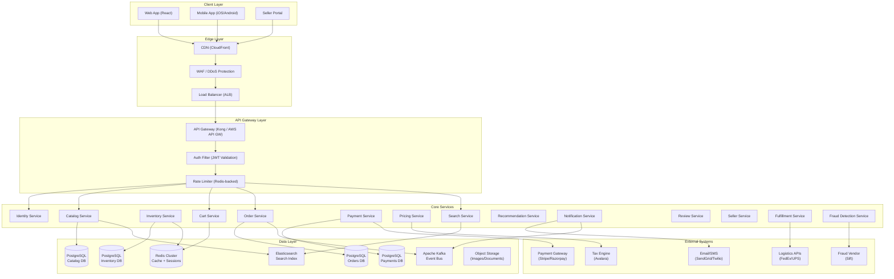
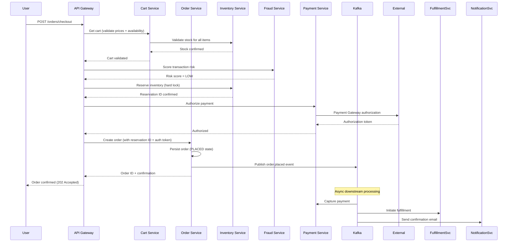
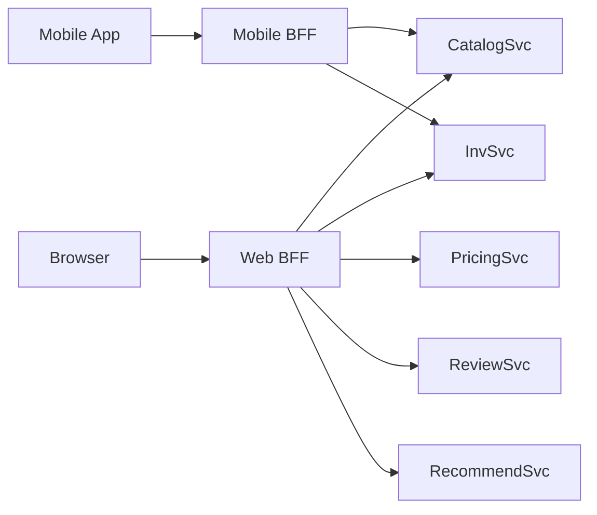

# 01 — High-Level Architecture: E-Commerce Platform

---

## Objective

Define the overall architectural style, service decomposition strategy, and communication patterns for the e-commerce platform. Justify the architecture choice and provide a clear migration path from startup to FAANG scale.

---

## 1. Architecture Decision: Microservices (Domain-Partitioned)

### Why Not Modular Monolith?

A modular monolith is the correct starting point for a new product, but this document describes an Amazon-scale platform where:

- Individual domains (Inventory, Payments, Orders) have fundamentally different scaling, consistency, and availability requirements
- Teams are large and independent — shared deployments create bottlenecks
- Catalog, Search, and Recommendations need radically different infrastructure (Elasticsearch, ML pipelines) that cannot coexist efficiently in a monolith
- Flash sale traffic must be isolated — a bad deployment in the Recommendations service must not take down Order placement

**At startup scale (< 1M users, < 50 engineers):** Begin with a modular monolith. Extract services only when deployment independence or scaling independence is demonstrably needed. Premature microservices is a well-known industry trap.

**Migration path:**
1. Start: Spring Boot modular monolith with DDD packages
2. Extract: Payment and Inventory first (highest isolation need)
3. Extract: Order Management (complex lifecycle, dedicated team)
4. Extract: Catalog + Search (different scaling profile)
5. Extract: Recommendations (ML infrastructure separate)
6. Remaining: User, Notification, Review services

---

## 2. Core Services

| Service | Responsibility | Data Store |
|---|---|---|
| API Gateway | Routing, auth, rate limiting, SSL termination | — |
| Identity Service | Auth, JWT/OAuth2, session management | PostgreSQL + Redis |
| Catalog Service | Product CRUD, variant management, categories | PostgreSQL (write) + Elasticsearch (read) |
| Inventory Service | Stock levels, reservations, flash sale allocation | PostgreSQL + Redis |
| Cart Service | Persistent cart, price + availability validation | Redis (primary) + PostgreSQL (persistence) |
| Order Service | Order lifecycle state machine | PostgreSQL |
| Payment Service | Payment orchestration, refunds, ledger | PostgreSQL |
| Pricing Service | Price rules, promotions, tax calculation | PostgreSQL + Redis |
| Search Service | Full-text search, facets, autocomplete | Elasticsearch |
| Recommendation Service | Personalized product recommendations | Redis + ML data warehouse |
| Notification Service | Email, SMS, push notifications | PostgreSQL (event log) |
| Review Service | Ratings, comments, moderation | PostgreSQL |
| Seller Service | Seller onboarding, dashboard, payouts | PostgreSQL |
| Fulfillment Service | Shipping integration, tracking aggregation | PostgreSQL |
| Fraud Detection Service | Pre-authorization risk scoring | Redis + ML model |
| Analytics Service | Business metrics, seller analytics | Redshift/BigQuery |

---

## 3. High-Level Architecture Diagram

---

## 4. Communication Patterns

### 4.1 Synchronous (REST/gRPC)
Used for: user-facing flows where response is needed immediately

| Caller | Target | Protocol | Reason |
|---|---|---|---|
| API Gateway | All services | REST/HTTP2 | Standard, tooling support |
| Order Service | Inventory Service | gRPC | Low-latency reservation call |
| Order Service | Payment Service | gRPC | Transactional, needs ack |
| Order Service | Fraud Service | gRPC | Pre-payment check |
| Cart Service | Pricing Service | REST | Price calculation at checkout |
| Cart Service | Inventory Service | REST | Availability check |

### 4.2 Asynchronous (Kafka Events)
Used for: cross-domain state propagation, eventual consistency

| Producer | Event | Consumers |
|---|---|---|
| Order Service | `order.placed` | Inventory, Notification, Fulfillment, Analytics |
| Order Service | `order.cancelled` | Inventory (release), Payment (refund trigger), Notification |
| Order Service | `order.delivered` | Review (unlock), Seller (payout trigger), Analytics |
| Payment Service | `payment.captured` | Order (confirm), Notification, Ledger |
| Payment Service | `payment.failed` | Order (fail), Notification |
| Inventory Service | `inventory.low_stock` | Seller Notification |
| Fulfillment Service | `shipment.updated` | Order, Notification |
| Catalog Service | `product.published` | Search (index), Recommendation (signal) |

---

## 5. Request Flow: Product Purchase (Happy Path)

---

## 6. Data Isolation Strategy

Each service owns its data. No shared database tables across service boundaries.

| Principle | Implementation |
|---|---|
| Service owns its schema | Separate PostgreSQL instances or schemas per service |
| No cross-service joins | Denormalize data needed across boundaries |
| Reference by ID only | Services store foreign IDs, not foreign keys |
| Event-driven sync | Kafka events keep derived data consistent |
| API composition at gateway | BFF (Backend for Frontend) aggregates data from multiple services for UI |

---

## 7. Backend for Frontend (BFF) Pattern

The product detail page requires data from: Catalog, Inventory, Pricing, Reviews, Recommendations. Calling 5 services from the browser is inefficient.

A **BFF layer** (one per client type: web, mobile, seller) aggregates these calls server-side, caches the aggregated response, and returns a single payload to the client.

---

## 8. Tradeoffs

| Decision | Benefit | Cost |
|---|---|---|
| Microservices | Independent scaling, team autonomy, fault isolation | Operational complexity, distributed transactions, network overhead |
| gRPC for internal calls | Performance, type safety, streaming support | Steeper learning curve, harder to debug than REST |
| Kafka for events | Decoupling, replay, buffering | Operational complexity, eventual consistency debugging |
| Redis for cart | Sub-millisecond reads, TTL-based expiry | Data can be lost if Redis fails without persistence |
| Separate DBs per service | Schema independence, service isolation | Complex cross-domain queries, data duplication |

---

## 9. Alternatives Considered

| Option | Why Rejected |
|---|---|
| GraphQL at API Gateway | Useful for flexible queries, but adds complexity; REST + BFF achieves same result with better caching semantics |
| CQRS at system level from day 1 | Adds significant complexity; apply CQRS within Order and Inventory services only, not system-wide |
| Event sourcing everywhere | Operationally very heavy; apply only in Order Service where full audit trail has business value |
| Single shared PostgreSQL | Violates service isolation; a slow query in Catalog takes down Order processing |

---

## 10. Overengineering Risks

- Building a full microservices mesh for a team of 10 engineers is a fatal mistake — operational overhead will consume all capacity
- Event sourcing in every service adds 3x the code complexity without proportional benefit; reserve for Order and Payment
- Implementing a custom recommendation engine before having meaningful user data is premature; start with rule-based ("trending", "similar category") and graduate to ML
- gRPC everywhere vs REST is a premature optimization at early stages; REST with HTTP/2 and proper connection pooling is sufficient for most internal communication

---

## 11. Startup vs FAANG Differences

| Aspect | Startup | FAANG |
|---|---|---|
| Architecture | Modular monolith | Full microservices mesh |
| Teams | 5-15 engineers own everything | 50-500 engineers per service cluster |
| Infrastructure | Single cloud region, managed services | Multi-region active-active, custom infrastructure |
| Recommendations | "Customers also viewed" rule-based | Deep learning, real-time inference |
| Fraud Detection | Third-party vendor (Sift) | Proprietary ML models, sub-10ms scoring |
| Search | Single Elasticsearch cluster | Custom distributed search with ML ranking |
| Cart | Redis with fallback | Distributed geo-replicated session store |

---

## 12. Interview-Level Discussion Points

- **Why microservices over monolith at this scale?** At Amazon/FAANG scale, the real driver is team independence. Each service can be deployed, scaled, and failed independently. The two-pizza team model only works if each team owns a deployable unit.
- **How do you handle distributed transactions?** Saga pattern with compensating transactions. Order placement uses an orchestrated saga coordinating Inventory reservation, Payment authorization, and Order creation. Each step has a compensating action if a subsequent step fails.
- **What is the first service to extract from a monolith?** Usually Payments (PCI-DSS isolation, dedicated security review) and Inventory (scaling and consistency requirements differ from catalog). These have the clearest bounded context boundaries.
- **How do you prevent the distributed monolith anti-pattern?** Services must not synchronously call each other in chains > 2 hops deep. If Service A calls B which calls C, that's a coupling smell. Introduce events or a saga orchestrator.
