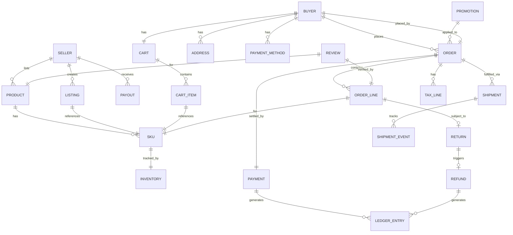
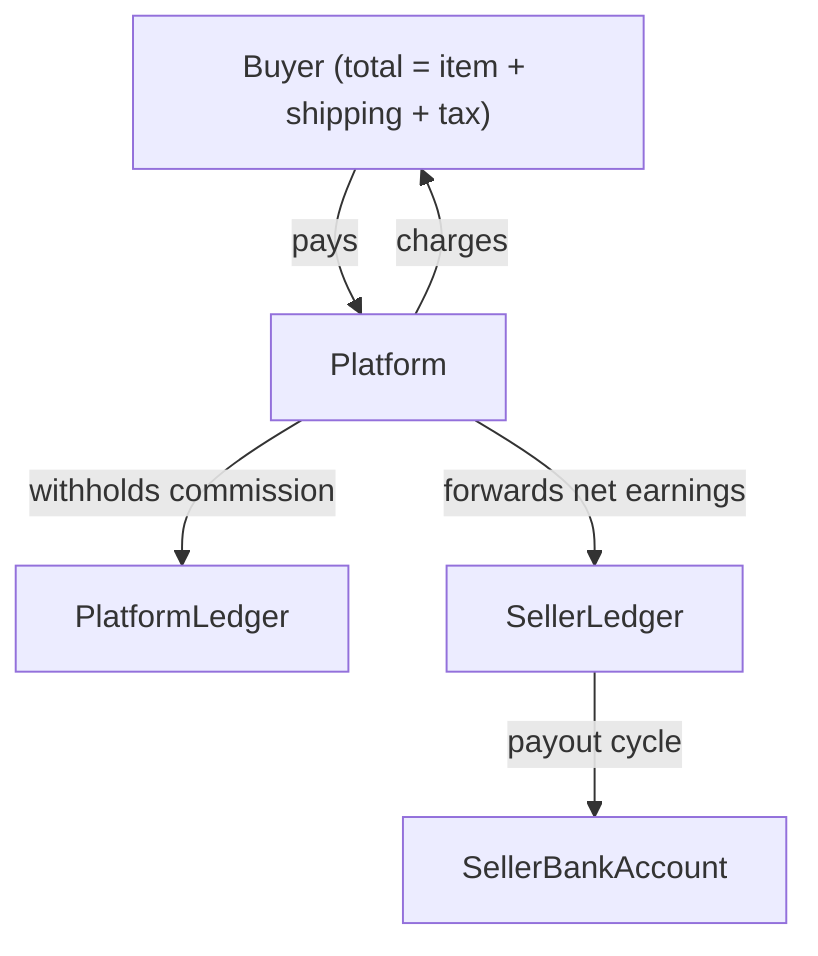
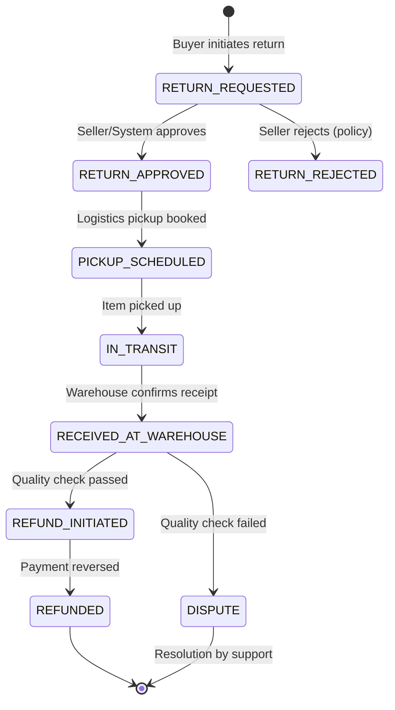

# 02 — Domain Modeling: E-Commerce Platform

---

## Objective

Define the core domain entities, aggregates, value objects, and domain events using Domain-Driven Design (DDD) principles. Establish a ubiquitous language shared across engineering, product, and business teams.

---

## 1. Ubiquitous Language

The following terms have precise, agreed-upon meanings across all teams:

| Term | Definition |
|---|---|
| **Product** | A sellable item with a title, description, and base attributes. A product is always listed by a Seller. |
| **SKU** (Stock Keeping Unit) | A specific, purchasable variant of a Product (e.g., Blue T-Shirt, Size L). Has a unique barcode and an inventory record. |
| **Listing** | A Product offered for sale at a specific price by a specific Seller. A single Product may have multiple Listings (different sellers). |
| **Reservation** | A temporary hold on SKU inventory, placed when an item is added to cart or checkout begins. Expires after TTL. |
| **Cart** | An ordered collection of Cart Items associated with a Buyer session. Can survive across sessions. |
| **Order** | A confirmed purchase intent, created after successful payment authorization. Contains Order Lines. |
| **Order Line** | A single SKU at a specific quantity and price within an Order. Tracks fulfillment independently. |
| **Shipment** | A physical package containing one or more Order Lines from a single warehouse. Has its own tracking number. |
| **Fulfillment** | The process of picking, packing, and dispatching a Shipment. |
| **Seller** | An entity that lists Products and ships Orders. May be a business or individual. |
| **Buyer** | A registered or guest user who places Orders. |
| **Ledger Entry** | A double-entry bookkeeping record for any money movement (charge, refund, commission, payout). |
| **Payout** | A transfer of earnings from the platform ledger to a Seller's bank account. |
| **Promotion** | A time-bound discount rule applied at the cart or order level. |
| **Tax Line** | A jurisdiction-specific tax amount applied to an Order or Order Line. |
| **Refund** | A partial or full reversal of a captured payment, triggered by a return or cancellation. |
| **Return** | A buyer-initiated process to send goods back to a Seller or warehouse in exchange for a Refund. |

---

## 2. Domain Model Overview

---

## 3. Core Aggregates

Aggregates are clusters of entities and value objects treated as a single unit for data changes. The aggregate root is the only externally referenceable entity within the aggregate.

### 3.1 Order Aggregate

**Root:** `Order`

**Entities within aggregate:**
- `OrderLine` — cannot exist without an Order
- `TaxLine` — computed at order creation
- `ShippingAddress` (value object snapshot — immutable after placement)
- `OrderStatusHistory` — append-only log of status transitions

**Invariants enforced by Order aggregate:**
- Total amount = sum of OrderLine amounts + shipping + taxes - discounts
- An Order can only be cancelled if ALL OrderLines are in cancellable states
- OrderLine quantity must be > 0
- An Order cannot transition from DELIVERED back to any prior state
- Only one Payment per Order (captures can be split, but authorization is single)

**Why this boundary?** Order and OrderLine have a lifecycle together. Splitting them into separate aggregates would require cross-aggregate transactions for something as simple as adding a line item.

---

### 3.2 Product Aggregate

**Root:** `Product`

**Entities within aggregate:**
- `SKU` (variant) — always belongs to a Product
- `ProductAttribute` — key-value pairs per variant
- `ProductImage` — ordered list of media references
- `ProductCategory` (reference only — not owned)

**Invariants:**
- A Product must have at least one active SKU to be listable
- SKU price must be > 0
- Product status transitions: DRAFT → PENDING_REVIEW → ACTIVE → ARCHIVED
- Only ACTIVE products are visible to buyers

---

### 3.3 Inventory Aggregate

**Root:** `InventoryRecord` (per SKU per warehouse)

**Value Objects:**
- `ReservationRecord` — SKU, quantity, buyer session ID, expiry timestamp
- `StockMovement` — append-only log of stock changes with reason codes

**Invariants:**
- `available_quantity = total_quantity - reserved_quantity`
- Available quantity must never go below 0 (enforced by distributed lock)
- Reservations older than TTL are released automatically
- Stock adjustments require a reason code (PURCHASE, RETURN, MANUAL_ADJUSTMENT, DAMAGED)

**Why separate from Product?** Inventory has completely different scaling and consistency requirements. A flash sale may generate 100,000 concurrent writes to a single InventoryRecord. This aggregate is isolated in its own service and its own data store.

---

### 3.4 Cart Aggregate

**Root:** `Cart`

**Entities:**
- `CartItem` — SKU reference, quantity, snapshot of price at add time, seller ID

**Invariants:**
- Cart total is always re-validated at checkout (price may have changed)
- A cart can contain items from multiple sellers
- Max 50 line items per cart (business limit)
- Coupon codes applied to cart must be re-validated at checkout

**Note:** Cart is intentionally NOT an Order. A Cart is a scratchpad; an Order is a commitment. This distinction drives the data model — Cart lives in Redis (ephemeral, fast), Orders live in PostgreSQL (durable, auditable).

---

### 3.5 Payment Aggregate

**Root:** `Payment`

**Entities:**
- `PaymentAttempt` — each authorization or capture attempt with gateway response
- `LedgerEntry` — immutable double-entry bookkeeping records
- `Refund` — sub-aggregate for refund lifecycle

**Invariants:**
- Total refunded amount ≤ total captured amount
- A Payment can only move forward in status (no rollbacks)
- LedgerEntries are immutable — corrections are made with reversing entries
- Refund status: INITIATED → PROCESSING → COMPLETED or FAILED

---

## 4. Value Objects

Value objects have no identity — they are defined entirely by their values and are immutable.

| Value Object | Fields | Used In |
|---|---|---|
| `Money` | amount (BigDecimal), currency (ISO 4217) | Order, Cart, Payment, Listing |
| `Address` | street, city, state, postal_code, country, lat/lng | Order (snapshot), Buyer profile |
| `PhoneNumber` | country_code, number (validated) | Buyer, Seller |
| `DateRange` | start_date, end_date | Promotion validity |
| `Weight` | value, unit (kg/lb) | SKU, shipping calculation |
| `Dimensions` | length, width, height, unit | SKU, packaging |
| `TaxCode` | jurisdiction, tax_type, rate | TaxLine |
| `TrackingInfo` | carrier, tracking_number, estimated_delivery | Shipment |

**Key principle:** `Money` must always carry its currency. Never store a bare decimal for monetary values. Use `BigDecimal` for precision — floating point is unacceptable for financial calculations.

---

## 5. Domain Events

Domain events represent facts that have occurred in the domain. They are the boundary between bounded contexts.

| Event | Producer Aggregate | Key Payload |
|---|---|---|
| `OrderPlaced` | Order | order_id, buyer_id, order_lines[], total_amount, payment_auth_token |
| `OrderConfirmed` | Order | order_id, confirmed_at |
| `OrderCancelled` | Order | order_id, reason, cancelled_by |
| `OrderDelivered` | Order | order_id, delivered_at |
| `PaymentCaptured` | Payment | payment_id, order_id, captured_amount |
| `PaymentFailed` | Payment | payment_id, order_id, failure_reason |
| `RefundInitiated` | Payment | refund_id, payment_id, amount |
| `RefundCompleted` | Payment | refund_id, payment_id, completed_at |
| `InventoryReserved` | Inventory | reservation_id, sku_id, quantity, expiry |
| `InventoryReleased` | Inventory | reservation_id, sku_id, quantity, reason |
| `InventoryDepleted` | Inventory | sku_id, warehouse_id |
| `LowStockAlert` | Inventory | sku_id, seller_id, current_quantity |
| `ProductPublished` | Product | product_id, seller_id, sku_ids[] |
| `ProductUpdated` | Product | product_id, changed_fields[] |
| `ShipmentDispatched` | Fulfillment | shipment_id, order_id, tracking_info |
| `ShipmentDelivered` | Fulfillment | shipment_id, order_id, delivered_at |
| `ReturnRequested` | Return | return_id, order_line_id, reason |
| `ReviewSubmitted` | Review | review_id, product_id, order_line_id, rating |

---

## 6. Seller Domain Model

The marketplace model introduces a critical distinction: the Platform, the Seller, and the Buyer have separate concerns and separate financial ledgers.

**Commission Model:**
- Platform charges a commission percentage per category (e.g., 5% on electronics, 15% on apparel)
- Commission is deducted from seller earnings at order confirmation
- Payouts are batched (weekly or biweekly) and include a statement of earnings

**Financial Isolation:** Seller earnings and platform revenue are tracked in separate ledger partitions. A bug in seller payout logic must not corrupt buyer payment records.

---

## 7. Return and Refund Flow

---

## 8. Risks and Design Tensions

| Tension | Description | Resolution |
|---|---|---|
| Cart vs Order boundary | Price changes between cart add and checkout | Re-validate all prices at checkout time; show diff to user |
| Order split by seller | One cart → multiple Orders or one Order with sub-orders? | One Order per cart, with Order Lines grouped by seller; Shipment is per-seller |
| Inventory aggregate size | One record per SKU per warehouse = billions of records | Partition by warehouse region; archive historical movements |
| Address snapshot vs live address | If buyer updates address after order placed, which applies? | Always snapshot Address value object at order creation |
| Refund before return | Platform may offer "returnless refunds" for low-value items | Refund state machine must support skipping RETURN steps |

---

## 9. Interview-Level Discussion Points

- **What is an aggregate root and why does it matter?** It is the only entry point for external operations on an aggregate. This enforces invariants — you cannot modify an OrderLine without going through the Order, which can validate total amounts, state consistency, etc.
- **How do you handle price changes during checkout?** The cart stores the price at add-time for display, but always re-fetches live price from Pricing Service at checkout. The user sees a warning if the price changed. This avoids stale price orders while providing transparency.
- **Why is Cart not stored in PostgreSQL?** Cart is ephemeral, read-heavy, and highly concurrent. Redis provides O(1) reads, natural TTL expiry, and sub-millisecond latency. PostgreSQL for cart at scale would require aggressive indexing and cache layers anyway — just use Redis directly. The tradeoff is that cart data is at risk if Redis loses data without persistence, so we configure Redis with AOF persistence and replicate.
- **How do you model the marketplace commission?** As a Ledger pattern. Every money movement — charge, commission, payout — is a LedgerEntry. The platform's P&L and each seller's earnings are derived from the ledger, not stored as mutable balances. This makes auditing trivial and prevents floating-point balance corruption.
