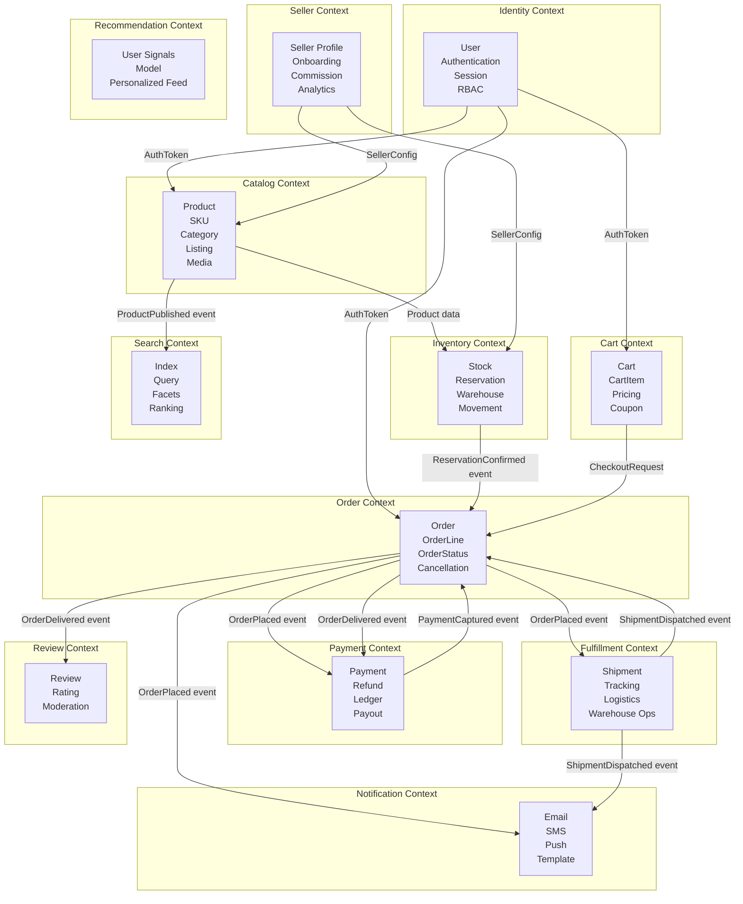
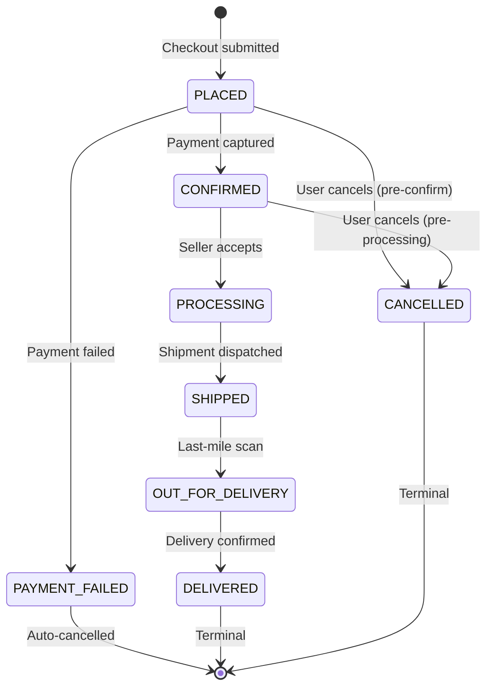

# 03 — DDD Bounded Contexts: E-Commerce Platform

---

## Objective

Define the bounded contexts of the e-commerce platform, their ownership, the contracts between them, and the context mapping patterns used. Bounded contexts are the primary driver for microservice boundaries.

---

## 1. Bounded Contexts Overview

A bounded context is a semantic boundary within which a specific domain model applies consistently. The same word can mean different things in different contexts — "Product" in Catalog means a sellable item; "Product" in Fulfillment means a physical box with dimensions and weight.



---

## 2. Bounded Context Definitions

### 2.1 Identity Context

**Ubiquitous Language:** User, Session, Role, Permission, Credential, Token

**Responsibilities:**
- Registration, login, password reset, MFA
- JWT issuance and validation
- OAuth2 / Social login (Google, Facebook)
- RBAC: BUYER, SELLER, ADMIN, SUPPORT roles
- Session management and invalidation

**What this context does NOT own:**
- Buyer shipping addresses (owned by Order/Profile context)
- Seller business profile (owned by Seller context)

**Anti-corruption layer:** Every other service validates tokens against Identity's public JWKS endpoint. Services do not call Identity synchronously for every request — they validate JWT locally using the public key.

---

### 2.2 Catalog Context

**Ubiquitous Language:** Product, SKU, Variant, Category, Attribute, Listing, Media

**Responsibilities:**
- Product lifecycle management (DRAFT → ACTIVE → ARCHIVED)
- Category taxonomy management
- Product attribute schema per category
- Media management (image/video references; actual files in S3)
- Listing management (which seller, at what price)
- Product publishing workflow (review, approval for new sellers)

**Catalog vs. Inventory:** Catalog owns the product's existence and description. Inventory owns the quantity. These are deliberately separate because catalog data changes infrequently and is read by billions of requests, while inventory changes with every purchase.

**Catalog vs. Pricing:** Catalog stores the base/list price. Pricing Service applies promotions, buyer-specific pricing, bulk discounts. The cart always fetches effective price from Pricing, never from Catalog directly.

---

### 2.3 Inventory Context

**Ubiquitous Language:** StockRecord, Reservation, Movement, Warehouse, BinLocation

**Responsibilities:**
- Tracking available quantity per SKU per warehouse
- Soft reservation on cart add (TTL: 15 min)
- Hard reservation on order placement
- Inventory deduction on shipment confirmation
- Stock reconciliation and adjustment
- Backorder and pre-order queues
- Flash sale allocation slots

**Critical invariants:**
- Available stock cannot go negative
- Reservations must expire if not converted to orders
- All stock movements are append-only (audit trail)

**Scaling note:** This is the hottest write path in the system. During a flash sale, a single SKU may receive 100,000 concurrent decrement requests. The Inventory context uses Redis atomic operations as the source of truth for available count, with asynchronous reconciliation to PostgreSQL.

---

### 2.4 Cart Context

**Ubiquitous Language:** Cart, CartItem, SavedItem, GuestCart

**Responsibilities:**
- Cart CRUD for authenticated and guest users
- Merging guest cart on login
- Price and availability validation at display time (eventually consistent, refreshed on view)
- Strict price and availability validation at checkout (strongly consistent)
- Coupon code holding (not validation — that's Pricing)
- Multi-seller cart organization

**What Cart does NOT do:**
- Cart does not persist to PostgreSQL as primary store (Redis is primary)
- Cart does not own pricing logic
- Cart does not perform inventory reservation (only reads availability)

---

### 2.5 Order Context

**Ubiquitous Language:** Order, OrderLine, CancellationRequest, DeliveryAttempt

**Responsibilities:**
- Order creation from checkout
- Order state machine management
- Cancellation handling with compensation
- Order history for buyers and sellers
- Order splitting by seller (logical grouping, not physical orders)
- Invoice generation

**This context is event-sourced:** Every state transition is recorded as an immutable event. The current state is derived by replaying events. This gives a perfect audit trail required for financial compliance.

**Order state machine:**


---

### 2.6 Payment Context

**Ubiquitous Language:** Payment, PaymentAttempt, Capture, Authorization, Refund, LedgerEntry, Payout

**Responsibilities:**
- Payment authorization and capture orchestration
- Gateway integration (Stripe, Razorpay, Adyen)
- Refund processing and tracking
- Double-entry ledger for all money movements
- Seller payout scheduling and disbursement
- Payment method tokenization (delegated to gateway)

**Ledger model:**
```
Every Order → DEBIT Buyer Account, CREDIT Platform Holding
Every Capture → DEBIT Platform Holding, CREDIT Seller Account (net of commission)
Every Commission → DEBIT Seller Account, CREDIT Platform Revenue
Every Payout → DEBIT Seller Account, CREDIT External Bank
Every Refund → DEBIT Platform Revenue, CREDIT Buyer Account
```

This double-entry model means the ledger always balances and any discrepancy is immediately detectable.

---

### 2.7 Fulfillment Context

**Ubiquitous Language:** Shipment, PickList, Package, TrackingEvent, DeliveryAttempt, ReturnShipment

**Responsibilities:**
- Shipment creation from Order (one or more shipments per order)
- Carrier API integration (FedEx, UPS, local couriers)
- Tracking event aggregation and normalization
- Delivery attempt management
- Return shipment scheduling
- Warehouse operations signaling (pick, pack, dispatch)

**What Fulfillment does NOT own:**
- Inventory levels (signals Inventory context via event)
- Order status (publishes events; Order context updates its own state)

---

### 2.8 Seller Context

**Ubiquitous Language:** SellerProfile, SellerTier, CommissionRate, PayoutSchedule, SellerMetrics

**Responsibilities:**
- Seller registration and KYC
- Seller tier management (Standard, Premium, Enterprise)
- Commission rate configuration per category
- Seller performance metrics (order defect rate, late shipment rate)
- Seller suspension and appeals
- Seller-facing analytics dashboard

---

### 2.9 Search Context

**Ubiquitous Language:** SearchIndex, Query, Facet, SearchResult, Autocomplete, RankingSignal

**Responsibilities:**
- Elasticsearch index management
- Full-text search with typo tolerance
- Faceted filtering and aggregation
- Autocomplete and search suggestions
- Search ranking (BM25 + personalization signals)
- Sponsored listing injection

**Relationship with Catalog:** Search is a read model for Catalog. When Catalog publishes `ProductPublished` or `ProductUpdated` events, Search consumes them and updates its index. Search never writes back to Catalog.

---

### 2.10 Recommendation Context

**Ubiquitous Language:** UserSignal, ItemEmbedding, RecommendationSet, ClickEvent, PurchaseSignal

**Responsibilities:**
- Collecting user behavior signals (views, clicks, purchases, dwell time)
- Serving pre-computed recommendation sets (collaborative filtering)
- Session-based recommendations (real-time, last N items viewed)
- Similar items ("customers also viewed")
- "Frequently bought together"

**Computation:** Offline batch jobs (Spark on EMR or Dataproc) run daily to retrain collaborative filtering models. Results are written to Redis as pre-computed sets keyed by user ID. The Recommendation Service reads from Redis — it never runs real-time ML inference per request.

---

## 3. Context Mapping

Context mapping describes the relationships and integration patterns between bounded contexts.

| Context A | Pattern | Context B | Notes |
|---|---|---|---|
| Catalog → Search | Published Language / Event Subscription | Search | Catalog publishes events; Search consumes |
| Order → Payment | Orchestrator (saga) | Payment | Order orchestrates payment flow |
| Order → Inventory | Customer-Supplier | Inventory | Order depends on Inventory reservations |
| Inventory → Catalog | Conformist | Catalog | Inventory uses Catalog's product IDs as-is |
| Order → Fulfillment | Published Language / Event | Fulfillment | Order publishes OrderConfirmed; Fulfillment reacts |
| Fulfillment → Order | Event-Driven Update | Order | Fulfillment publishes ShipmentDelivered; Order updates state |
| Cart → Pricing | Customer-Supplier | Pricing | Cart calls Pricing API for effective prices |
| Seller → Catalog | Customer-Supplier | Catalog | Seller feeds product data into Catalog |
| Review → Order | Anti-Corruption Layer | Order | Review validates purchase via Order API |
| Payment → Seller | Downstream Notification | Seller | Payment triggers payout events |

### Pattern Definitions

- **Published Language:** Well-defined event schema that consumers depend on; producer owns the schema
- **Customer-Supplier:** Upstream owns API; downstream conforms; upstream accommodates downstream in planning
- **Conformist:** Downstream adopts upstream model without modification
- **Anti-Corruption Layer (ACL):** Downstream translates upstream model to its own; shields from upstream changes
- **Orchestrator:** One context drives a multi-step process across contexts (saga pattern)

---

## 4. Shared Kernel

Some concepts are shared across contexts but must remain tightly controlled:

| Concept | Shared By | Ownership |
|---|---|---|
| `ProductId` (UUID) | Catalog, Inventory, Cart, Order, Search | Catalog (authoritative) |
| `UserId` (UUID) | All user-facing contexts | Identity |
| `SellerId` (UUID) | Catalog, Order, Fulfillment, Payment, Seller | Seller |
| `OrderId` (UUID) | Order, Payment, Fulfillment, Notification | Order |
| `Money` (amount + currency) | Cart, Order, Payment, Pricing | Shared kernel |
| `Address` (value object) | Order, Fulfillment, Seller | Shared kernel |

**Shared kernel changes require coordination.** Any schema change to a shared concept must be versioned and announced to all consuming contexts. This is managed via a shared library with semantic versioning.

---

## 5. Anti-Pattern Warnings

| Anti-Pattern | Risk | Prevention |
|---|---|---|
| Shared database between contexts | Schema coupling, deployment coupling | Each context has its own DB schema or instance |
| Synchronous chain calls (A→B→C→D) | Cascading failure, latency compounding | Max 2-hop sync chains; use events for deeper flows |
| Context that owns everything | Anemic domain model | Force each context to own its invariants |
| Catalog owning inventory | Conflates availability with description | Separate bounded contexts with event-driven sync |
| Order context doing payment logic | Mixed concerns, compliance risk | Payment is its own context with PCI-DSS isolation |

---

## 6. Risks

- **Model drift:** Different teams use the same word to mean different things over time. Enforce a shared ubiquitous language glossary reviewed quarterly.
- **Event schema versioning:** A producer changing an event schema without backward compatibility breaks all consumers. Use schema registry (Confluent Schema Registry) with Avro or protobuf for all Kafka events.
- **Anti-corruption layer neglect:** Teams stop maintaining ACLs when upstream changes, leading to silent data corruption. ACLs must have automated contract tests.

---

## 7. Interview-Level Discussion Points

- **How do you determine bounded context boundaries?** Follow Conway's Law in reverse: design boundaries that match the team structure. Then validate by asking: "Can this context deploy independently?" and "Does this context have a single, coherent ubiquitous language?" If the answer to both is yes, the boundary is right.
- **Why separate Cart and Order contexts?** Cart is ephemeral, mutable, and user-facing. Order is durable, append-only, and legally binding. They have different consistency requirements, different SLAs, and different data stores. Merging them would force PostgreSQL onto the Cart hot path.
- **What happens when Inventory and Order disagree?** If the Inventory service says 0 stock but an Order was placed with a reservation, the reservation has priority (it was a hard reservation acquired atomically). The reconciliation process detects and resolves these inconsistencies. The invariant is: never reject an Order that has a confirmed reservation.
- **How do you prevent the Catalog context from becoming a God context?** Strict event-driven outbound only. Catalog publishes events; it never receives commands from other contexts. Other contexts maintain their own read models derived from Catalog events (e.g., Inventory maintains a sku_catalog_ref table updated by ProductPublished events).
