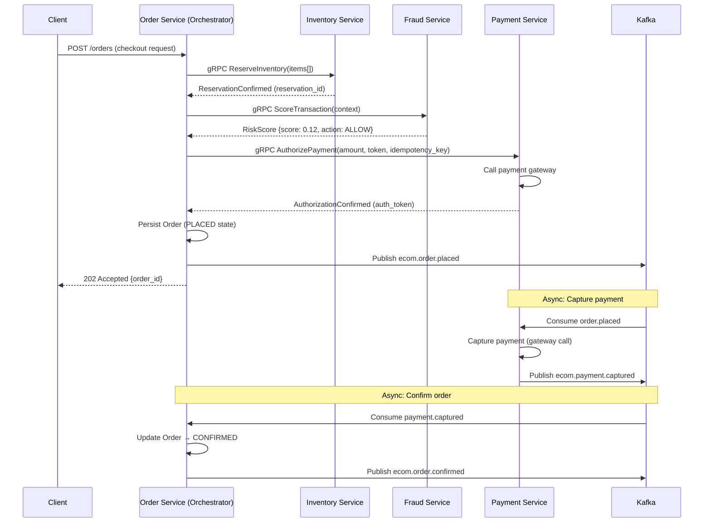
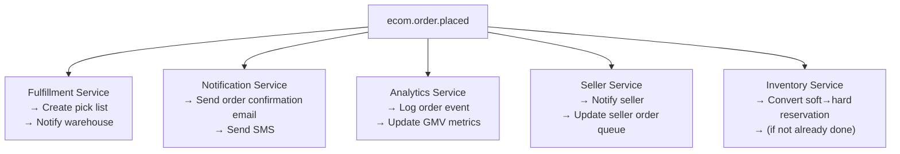
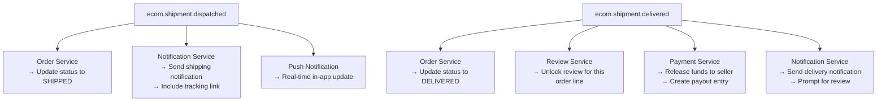
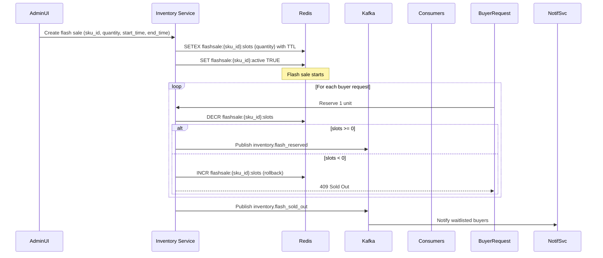
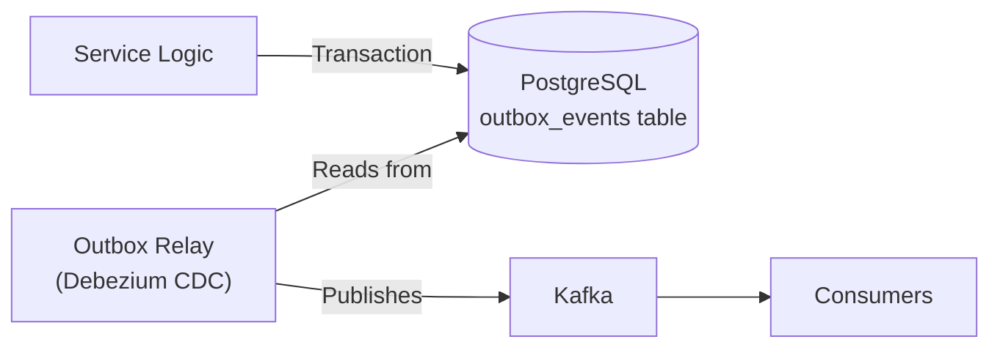

# 06 — Event Flow: E-Commerce Platform

---

## Objective

Define the event-driven architecture of the platform: which events are produced, by whom, consumed by whom, and the patterns used (choreography vs. orchestration, outbox pattern, saga, dead letter queues).

---

## 1. Event-Driven Architecture Rationale

The e-commerce platform uses Kafka as its event bus. Events serve multiple purposes:

1. **Cross-context state propagation** — When an Order is placed, Inventory, Notification, Fulfillment, and Analytics all need to react
2. **Decoupling** — Payment Service does not need to know about Notification Service; it just emits events
3. **Audit trail** — All significant state changes produce events that are retained for 7 days in Kafka and archived to S3 indefinitely
4. **Replay** — If Search index is corrupted, replaying `product.published` events from Kafka rebuilds it
5. **Backpressure buffering** — During flash sales, events buffer in Kafka rather than overloading downstream services

**Orchestration vs. Choreography:**

- **Checkout/Order placement saga:** Orchestrated (Order Service drives the saga, knows all steps)
- **Post-order processing:** Choreographed (Fulfillment, Notification, Analytics react to events independently)
- **Reason:** Checkout is a complex, time-sensitive transaction where rollback logic is critical. Choreography would scatter compensation logic across services. Choreography is preferred for simple, independent reactions.

---

## 2. Kafka Topic Design

### 2.1 Topic Naming Convention
```
{domain}.{entity}.{event-type}
```
Examples:
- `ecom.order.placed`
- `ecom.inventory.reserved`
- `ecom.payment.captured`
- `ecom.product.published`

### 2.2 Topic Configuration

| Topic | Partitions | Replication | Retention | Key |
|---|---|---|---|---|
| ecom.order.placed | 50 | 3 | 7 days | order_id |
| ecom.order.status_changed | 50 | 3 | 7 days | order_id |
| ecom.inventory.reserved | 100 | 3 | 2 days | sku_id |
| ecom.inventory.released | 100 | 3 | 2 days | sku_id |
| ecom.payment.captured | 30 | 3 | 7 days | payment_id |
| ecom.payment.failed | 30 | 3 | 7 days | payment_id |
| ecom.product.published | 30 | 3 | 7 days | product_id |
| ecom.product.updated | 30 | 3 | 7 days | product_id |
| ecom.shipment.dispatched | 30 | 3 | 7 days | shipment_id |
| ecom.shipment.delivered | 30 | 3 | 7 days | shipment_id |
| ecom.notification.trigger | 50 | 3 | 1 day | user_id |
| ecom.analytics.events | 200 | 3 | 3 days | — |
| ecom.fraud.signals | 50 | 3 | 7 days | user_id |

**Partitioning strategy:** Partition key is the entity ID. This ensures all events for the same entity (same order, same SKU) are handled by the same consumer instance, preserving ordering.

---

## 3. Event Schema

All events follow a standard envelope (Avro schema, registered in Confluent Schema Registry):

```json
{
  "event_id": "uuid",
  "event_type": "OrderPlaced",
  "aggregate_id": "uuid",
  "aggregate_type": "Order",
  "version": 1,
  "occurred_at": "2026-05-18T10:30:00Z",
  "correlation_id": "uuid",
  "producer": "order-service",
  "payload": { ... }
}
```

**Schema evolution:** Use Avro with backward-compatible schema evolution. New optional fields can be added without bumping the version. Breaking changes require a new schema version registered in the Schema Registry.

---

## 4. Order Placement Saga (Orchestrated)

The order placement flow is the most critical saga in the system. It involves Inventory, Fraud, Payment, and Order services, with compensating transactions at each step.



### 4.1 Compensation Logic

| Step Fails | Compensation |
|---|---|
| Inventory reservation fails | Return error to client immediately (no reservation to undo) |
| Fraud check blocks (HIGH risk) | Release reservation, return 422 to client |
| Payment authorization fails | Release inventory reservation, return payment error to client |
| Order persistence fails | Release inventory reservation, void payment authorization |
| Payment capture fails (async) | Order moves to PAYMENT_FAILED state, release reservation |

**Saga state is stored in the Order aggregate.** The orchestrator (Order Service) records each saga step's completion in the order_events table. If the process restarts, it reads the events to determine which steps completed.

---

## 5. Post-Order Event Choreography

After `ecom.order.placed` is published, multiple consumers react independently:





---

## 6. Inventory Flash Sale Event Flow

During flash sales, inventory is pre-allocated to a Redis slot pool. The flow is:



**Key design:** `DECR` on Redis string is atomic. No locks needed. If the result after DECR is negative, the operation is reversed immediately. This handles 100K+ concurrent requests safely.

---

## 7. Outbox Pattern

To prevent the "dual write" problem (write to DB succeeds but Kafka publish fails, or vice versa), all services use the Transactional Outbox Pattern.



**Flow:**
1. Service writes to its primary table AND inserts into `outbox_events` table in the **same transaction**
2. Debezium CDC connector reads the outbox table's WAL (Write-Ahead Log)
3. Debezium publishes events to Kafka
4. Processed events are marked/deleted from outbox

**outbox_events schema:**
```
TABLE outbox_events
  id              UUID        PK
  aggregate_type  VARCHAR(100)
  aggregate_id    UUID
  event_type      VARCHAR(200)
  payload         JSONB
  created_at      TIMESTAMPTZ NOT NULL DEFAULT now()
  published_at    TIMESTAMPTZ NULL
  INDEX: (created_at) WHERE published_at IS NULL
```

This guarantees at-least-once delivery. Consumers must be idempotent (process the same event multiple times without side effects).

---

## 8. Consumer Groups

| Consumer Group | Consumes | Purpose |
|---|---|---|
| fulfillment-service | ecom.order.confirmed | Create shipment/pick list |
| notification-order | ecom.order.* | All order status notifications |
| notification-shipment | ecom.shipment.* | Shipping notifications |
| search-indexer | ecom.product.* | Elasticsearch index updates |
| analytics-ingestor | ecom.analytics.events | Real-time analytics pipeline |
| seller-dashboard | ecom.order.placed, ecom.order.confirmed | Seller order feed |
| payment-capturer | ecom.order.placed | Trigger payment capture |
| inventory-reconciler | ecom.payment.failed | Release reservations |
| fraud-signal | ecom.order.placed, ecom.payment.failed | Fraud model training signals |

---

## 9. Dead Letter Queue (DLQ) Strategy

When a consumer fails to process an event after N retries, the event is moved to a DLQ.

| Topic | DLQ Topic | Max Retries | Alert Threshold |
|---|---|---|---|
| ecom.order.placed | ecom.order.placed.dlq | 3 | > 5 events in DLQ |
| ecom.payment.captured | ecom.payment.captured.dlq | 5 | > 1 event in DLQ |
| ecom.inventory.reserved | ecom.inventory.reserved.dlq | 3 | > 10 events in DLQ |

**DLQ monitoring:** PagerDuty alerts fire when DLQ messages appear. On-call engineers investigate and either fix the consumer or replay the events after fixing the root cause.

**DLQ replay:** A separate admin tool reads from DLQ topics and re-publishes to the original topic after the root cause is resolved. Events in DLQ are retained for 30 days.

---

## 10. Event Ordering Guarantees

Kafka guarantees ordering within a partition. We use entity ID as the partition key.

| Scenario | Ordering Guaranteed? | Notes |
|---|---|---|
| All events for the same Order | Yes | order_id is partition key |
| All events for the same SKU's inventory | Yes | sku_id is partition key |
| Events across different Orders | No | Not needed |
| Payment events for the same Payment | Yes | payment_id is partition key |

**Reordering risk:** If a consumer processes events out of order (e.g., `order.delivered` before `order.shipped`), the Order service's state machine must reject invalid transitions. The state machine acts as the guard.

---

## 11. Tradeoffs

| Decision | Benefit | Cost |
|---|---|---|
| Orchestrated saga for checkout | Clear compensation logic, one place to debug | Orchestrator becomes a complexity hub; tighter coupling |
| Choreographed post-order events | Loose coupling, each service independently scalable | Harder to trace end-to-end flow, debugging across services |
| Outbox pattern | Guaranteed at-least-once delivery | CDC infrastructure (Debezium) to manage |
| At-least-once delivery | Simpler producer logic | Consumers must handle duplicates |
| Avro with Schema Registry | Strong typing, evolution rules enforced | Schema Registry is a new dependency |

---

## 12. Interview-Level Discussion Points

- **Orchestration vs. choreography: when do you use each?** Orchestration when the flow has complex compensation logic, time ordering matters, and a single team owns the flow. Choreography when reactions are independent, loosely coupled, and multiple teams own different parts of the reaction.
- **What happens if Kafka is down?** The outbox pattern insulates the primary database writes — orders are still created. The outbox relay accumulates events. When Kafka recovers, events are delivered (possibly with delay). For user-facing operations that depend on downstream reactions (e.g., order confirmation email), we accept eventual delivery.
- **How do you prevent an event from being processed twice?** Consumers use idempotency keys. For example, the payment capture consumer checks if `payment_id` already has a `CAPTURED` status before attempting capture. Storing a processed event ID set in Redis provides fast O(1) deduplication.
- **How does the saga handle partial failures at scale?** At 5,000 orders/second, partial failures are routine. Each saga step's result is stored in the order_events table. A background saga recovery job scans for orders stuck in `PLACED` state for > 5 minutes and triggers the appropriate retry or compensation. This is a critical operational component that must be monitored.
