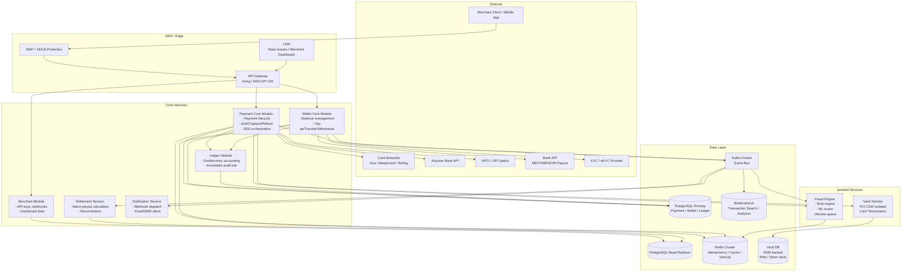
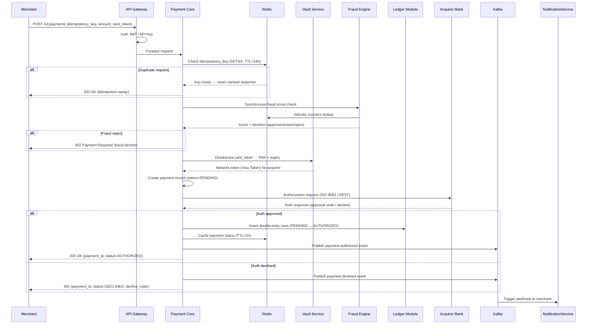
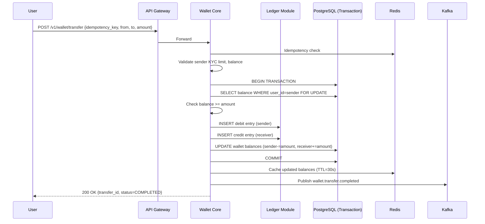
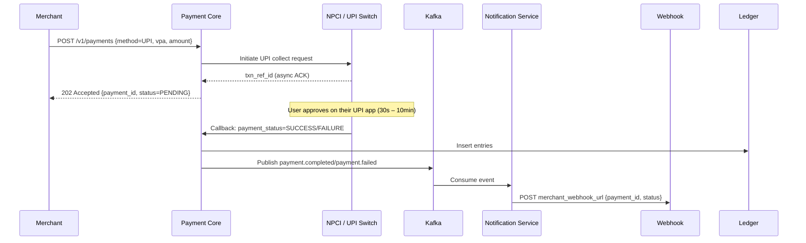
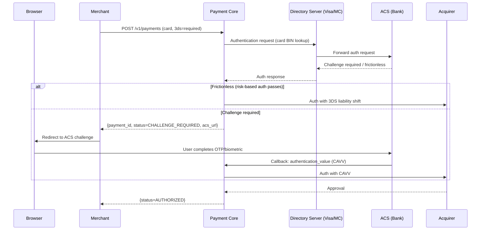

# 01 — High-Level Architecture: Payment Gateway / Wallet System

## Objective

Define the overall architectural style, service topology, communication patterns, and request flows for the Payment Gateway / Wallet system. Justify the architectural choice against alternatives and document the migration path as the system scales.

---

## 1. Architecture Decision: Modular Monolith → Selective Microservices

### Chosen Approach: Phased Decomposition

Start as a **Modular Monolith with DDD boundaries** enforced at the package/module level. Selectively extract high-stakes or independently-scaling services early (Vault, Fraud Engine). Migrate to full microservices only when operational burden of the monolith demonstrably exceeds decomposition cost.

### Justification

| Factor | Why Modular Monolith Wins at Day 1 |
|---|---|
| Correctness | ACID transactions across payment, ledger, and wallet are trivially maintained within one process; distributed transactions (Saga) add failure modes before you have the team to manage them |
| Operational simplicity | One deployment artifact, one database connection pool, one log stream |
| PCI DSS compliance surface | Smaller network perimeter to certify |
| Team size | A 5–15 engineer team cannot operationally manage 15 microservices |
| Time to market | First version of a payment system needs to prove trust, not architectural purity |

### When to Extract to Microservices

- **Vault Service**: Must be extracted immediately — PCI DSS requires the cardholder data environment (CDE) to be network-isolated and separately auditable.
- **Fraud Engine**: Extract when ML model serving needs independent scaling and data science team ownership.
- **Settlement Service**: Extract when settlement batch processing causes resource contention with the online payment path.
- **Notification Service**: Stateless, IO-bound, independently scalable — extract early.
- **Merchant Portal API**: Extract when merchant-facing API has different SLOs and release cadence.

### What NOT to Extract Prematurely

- Do not separate Wallet from Payment core in V1 — they share ledger consistency requirements.
- Do not create a separate "Transaction Service" and "Order Service" — you will end up with distributed transactions on day one.

---

## 2. Service Topology

---

## 3. Request Flow: Card Payment

---

## 4. Request Flow: Wallet Transfer

---

## 5. Async Flow: UPI Collect Payment

---

## 6. 3DS2 Authentication Flow

---

## 7. Sync vs Async Communication Decisions

| Interaction | Protocol | Reason |
|---|---|---|
| Merchant → Payment Core | REST/HTTPS | Synchronous response required; merchant needs payment_id immediately |
| Payment Core → Vault | REST/gRPC (internal mTLS) | Synchronous; token needed before acquirer call |
| Payment Core → Fraud Engine | gRPC (sync) | Inline fraud check must complete before auth |
| Payment Core → Acquirer | REST/ISO 8583 | Dictated by acquirer protocol |
| Payment Core → Kafka | Async publish | Post-auth events; failure doesn't block payment |
| Kafka → Notification Service | Async consume | Webhook delivery is at-least-once; retries acceptable |
| Settlement → Ledger | Batch read | Nightly; no real-time requirement |
| Fraud Engine → Redis | Sync read | Velocity counters must be millisecond-latency |

---

## 8. Tradeoffs

### Modular Monolith Tradeoffs

| Pro | Con |
|---|---|
| Simple distributed transaction story | Single point of deployment failure if not run with multiple instances |
| Easier debugging (one log stream, one trace) | Module boundary violations possible if team discipline is low |
| Shared database = no eventual consistency headaches on ledger | Cannot scale individual modules independently (mitigated by async read replicas) |
| Lower operational overhead | Large codebase — must enforce module boundaries via Architecture tests (ArchUnit) |

### Why Not Microservices on Day 1

Microservices would require: distributed transactions (Saga) for payment + ledger + wallet, inter-service mTLS setup, independent CI/CD for each service, distributed tracing from day one, service mesh (Istio/Linkerd), and a team large enough to own each service. A 10-engineer team cannot safely operate 12 microservices in a regulated financial environment.

---

## 9. Alternatives Considered

| Approach | Why Rejected |
|---|---|
| Full microservices from day 1 | Premature operational complexity; distributed transaction risk on day 1 |
| Event-sourcing for all state | Extreme complexity for query paths; CQRS required; team must be event-sourcing-experienced |
| CQRS for all domains | Overkill for V1; introduce CQRS for settlement/analytics read models in V2 |
| GraphQL primary API | Payment APIs are RPC-style, not graph-style; REST + webhooks is industry standard |

---

## 10. Interview-Level Discussion Points

- **"Why not use Saga from day one?"** Saga manages distributed transactions — you only need it when the transaction spans services. In a modular monolith, a single DB transaction handles the payment + ledger entries atomically.
- **"How do you ensure the Vault is truly isolated?"** Network segmentation (separate VPC/subnet), separate database, separate deployment pipeline, separate PCI audit scope. The Vault exposes only two endpoints: tokenize and detokenize. Nothing else.
- **"What happens if Kafka is down during payment?"** The payment still succeeds — Kafka publish is post-commit. The Outbox pattern ensures events are eventually published even if Kafka was down at commit time.
- **"When would you move the Ledger module to its own service?"** When ledger write throughput exceeds what the monolith's DB connection pool can handle, or when the accounting team needs to own and deploy it independently.
- **"How do you handle the 5,000 TPS spike?"** Horizontal pod autoscaling on the Payment Core, Redis for idempotency and status caching (avoids DB reads on polling), read replicas for merchant dashboard queries. The acquirer is usually the bottleneck — implement a queue/throttle before the acquirer calls.
