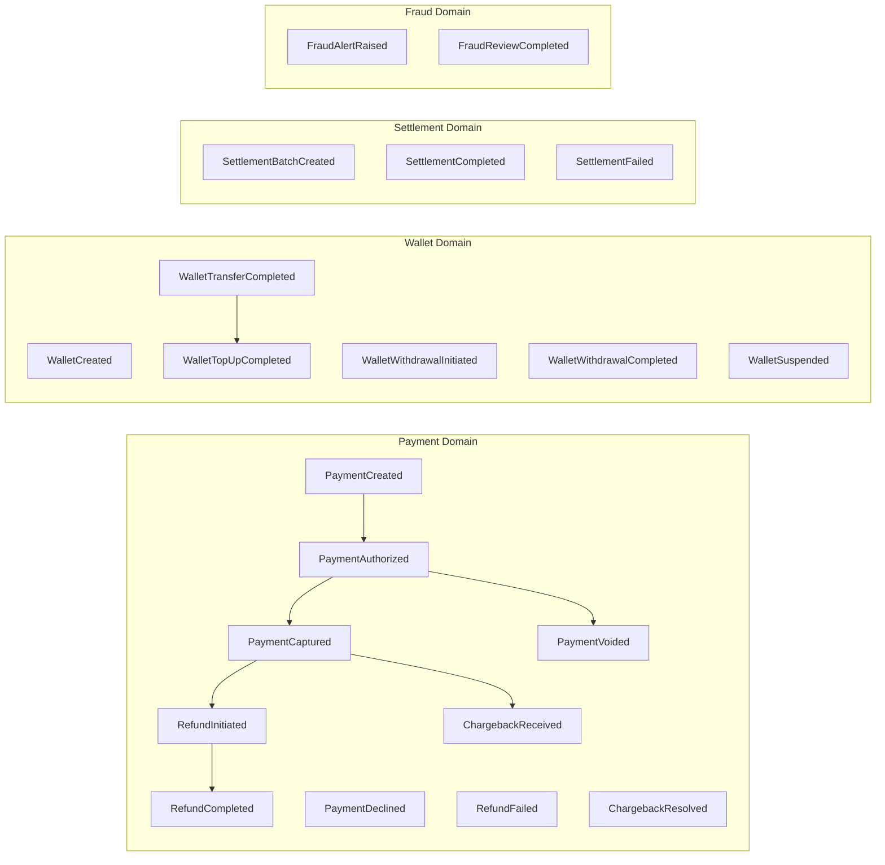
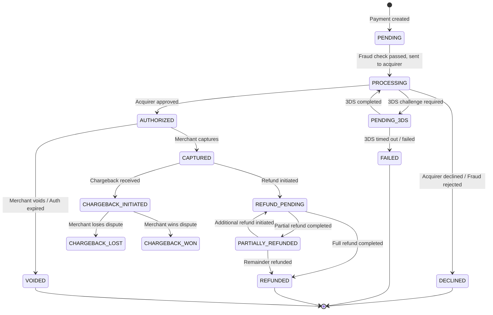
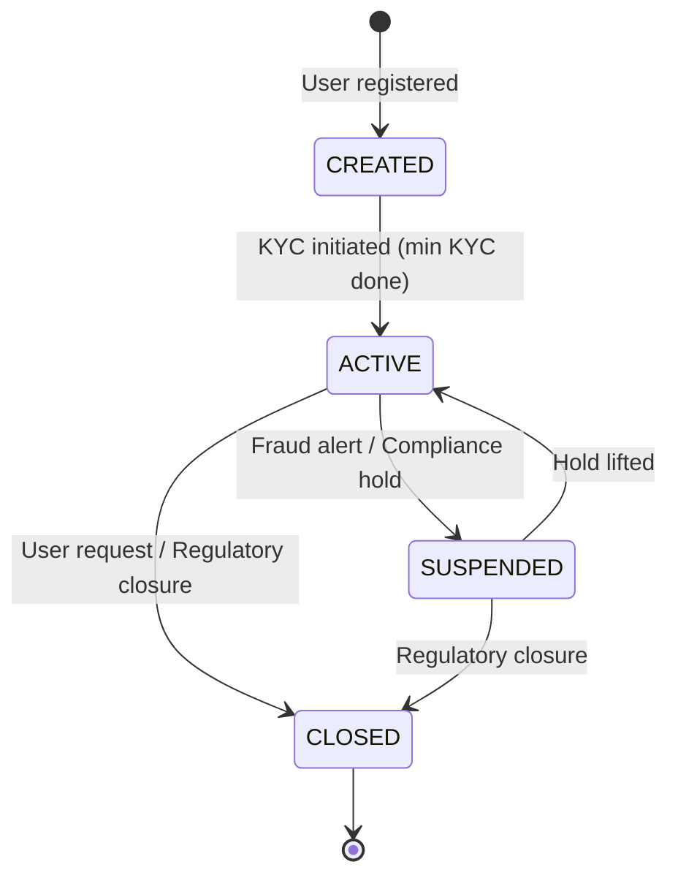

# 02 — Domain Modeling: Payment Gateway / Wallet System

## Objective

Define the core domain entities, value objects, aggregates, and domain events for the Payment Gateway / Wallet system using Domain-Driven Design (DDD) principles. Establish the ubiquitous language that engineering, product, compliance, and finance teams share.

---

## 1. Ubiquitous Language

These terms must be used consistently across code, documentation, and conversations:

| Term | Definition |
|---|---|
| **Payment** | A financial transaction initiated by a payer to transfer money to a payee, routed through the gateway |
| **Charge** | A payment where the merchant initiates collection from a customer |
| **Authorization** | A hold placed on funds — funds are reserved but not yet captured |
| **Capture** | Actual transfer of authorized funds; settles the authorization |
| **Void** | Cancellation of an authorized-but-not-captured payment |
| **Refund** | Return of captured funds to the original payment instrument |
| **Chargeback** | Dispute initiated by cardholder through their bank; funds forcibly returned pending resolution |
| **Settlement** | Batch transfer of net funds from acquirer to merchant bank account |
| **Reconciliation** | Process of matching gateway ledger entries against acquirer statements |
| **Wallet** | A digital pre-paid account holding a user's spendable balance |
| **Ledger Entry** | A single debit or credit line in the double-entry accounting system |
| **Payment Method** | An instrument used to fund a payment (card, UPI, wallet, bank account) |
| **Token** | A surrogate value replacing a sensitive PAN; safe to store in application DB |
| **Network Token** | A token issued by a card network (Visa Token Service) for a specific merchant |
| **Idempotency Key** | A client-provided unique key to deduplicate API requests |
| **Merchant** | A business entity accepting payments through the gateway |
| **Acquirer** | The bank that processes card payments on behalf of the merchant |
| **Issuer** | The bank that issued the customer's card |
| **PSP** | Payment Service Provider — this system acts as a PSP |
| **PPI** | Prepaid Payment Instrument — the regulatory classification for our Wallet |

---

## 2. Core Aggregates

### 2.1 Payment Aggregate

The central aggregate. Everything in the payment lifecycle belongs here.

```
Payment (Aggregate Root)
├── paymentId: PaymentId (UUID)
├── merchantId: MerchantId
├── customerId: CustomerId (optional — guest checkout possible)
├── idempotencyKey: IdempotencyKey
├── amount: Money (value, currency)
├── status: PaymentStatus
├── paymentMethod: PaymentMethod (polymorphic)
│   ├── CardPaymentMethod
│   │   ├── cardToken: CardToken
│   │   ├── networkToken: NetworkToken
│   │   └── threeDsData: ThreeDsAuthentication
│   ├── UpiPaymentMethod
│   │   └── vpa: VirtualPaymentAddress
│   ├── WalletPaymentMethod
│   │   └── walletId: WalletId
│   └── BankTransferPaymentMethod
│       └── accountRef: BankAccountRef
├── authorizationCode: AuthorizationCode (nullable)
├── captureDetails: CaptureDetails (nullable)
├── refunds: List<Refund>
├── fraudSignal: FraudSignal
├── metadata: Map<String, String> (merchant-provided)
├── createdAt: Instant
└── updatedAt: Instant
```

**Invariants:**
- A Payment may only be captured if status is AUTHORIZED.
- Total refunded amount cannot exceed captured amount.
- A voided payment cannot be captured or refunded.
- idempotencyKey + merchantId must be unique within 24 hours.

**Domain Events emitted:**
- PaymentCreated
- PaymentAuthorized
- PaymentCaptured
- PaymentDeclined
- PaymentVoided
- RefundInitiated
- RefundCompleted
- ChargebackReceived

### 2.2 Wallet Aggregate

```
Wallet (Aggregate Root)
├── walletId: WalletId (UUID)
├── userId: UserId
├── currency: Currency
├── balance: Money (non-negative invariant)
├── kycStatus: KycStatus (NONE / MINIMUM / FULL)
├── status: WalletStatus (ACTIVE / SUSPENDED / CLOSED)
├── limits: WalletLimits
│   ├── dailyTopUpLimit: Money
│   ├── dailyTransferLimit: Money
│   └── maxBalance: Money
├── linkedPaymentMethods: List<LinkedPaymentMethod>
└── createdAt: Instant
```

**Invariants:**
- balance must never go negative (enforced by SELECT FOR UPDATE before debit).
- Daily transfer limit enforced at the aggregate level — limit counter resets at midnight IST.
- NONE KYC wallets: max balance ₹10,000, max total load ₹10,000/month.
- FULL KYC wallets: max balance ₹2,00,000.

**Domain Events emitted:**
- WalletCreated
- WalletTopUpCompleted
- WalletTransferCompleted
- WalletWithdrawalInitiated
- WalletWithdrawalCompleted
- WalletSuspended

### 2.3 Merchant Aggregate

```
Merchant (Aggregate Root)
├── merchantId: MerchantId
├── businessName: String
├── kybStatus: KybStatus
├── settlementAccount: BankAccount
├── apiCredentials: List<ApiCredential>
│   ├── apiKeyId: ApiKeyId
│   ├── apiKeyHash: HashedValue
│   └── permissions: Set<Permission>
├── webhooks: List<WebhookEndpoint>
│   ├── url: URL
│   ├── events: Set<EventType>
│   └── signingSecret: HashedValue
├── settlementConfig: SettlementConfig
│   ├── settlementCycle: T_PLUS_1 | T_PLUS_2
│   └── holdPercentage: Percentage (for rolling reserve)
└── status: MerchantStatus
```

### 2.4 Ledger Aggregate (Append-Only)

The Ledger is modeled differently — it is a log, not a mutable aggregate. Each LedgerEntry is immutable once written.

```
LedgerEntry (Entity — Append Only)
├── entryId: LedgerEntryId (UUID)
├── journalId: JournalId (groups debit + credit pair)
├── accountId: AccountId (merchant account / user wallet / settlement account)
├── direction: DEBIT | CREDIT
├── amount: Money
├── referenceType: PAYMENT | REFUND | CHARGEBACK | SETTLEMENT | TOPUP | TRANSFER | FEE
├── referenceId: UUID (points to the Payment / Wallet / Settlement aggregate)
├── runningBalance: Money (denormalized for fast balance reads — computed at write time)
├── createdAt: Instant
└── description: String
```

**Invariants:**
- For every DEBIT entry, there is exactly one corresponding CREDIT entry in the same journal.
- LedgerEntry is never updated or deleted.
- runningBalance is computed at insert time under serializable isolation.

### 2.5 Settlement Aggregate

```
SettlementBatch (Aggregate Root)
├── batchId: SettlementBatchId
├── settlementDate: LocalDate
├── merchantId: MerchantId
├── totalGrossAmount: Money
├── totalFees: Money
├── totalRefunds: Money
├── totalChargebacks: Money
├── netPayoutAmount: Money
├── status: SettlementStatus (PENDING / PROCESSING / COMPLETED / FAILED)
├── transactions: List<SettlementTransactionRef>
└── payoutDetails: PayoutDetails
```

---

## 3. Value Objects

| Value Object | Fields | Notes |
|---|---|---|
| Money | amount (BigDecimal), currency (ISO 4217) | Immutable; arithmetic creates new instance; never use float |
| PaymentId | UUID | Prefixed: pay_xxxx |
| CardToken | tokenValue, tokenType (NETWORK/VAULT), expiryMonth, expiryYear | Never stores PAN |
| VirtualPaymentAddress | vpa (e.g. user@upi) | Validated format |
| IdempotencyKey | String (max 64 chars) | Client-provided; merchant-scoped |
| AuthorizationCode | String (6 chars) | From acquirer |
| FraudSignal | score (0.0–1.0), riskLevel (LOW/MEDIUM/HIGH), signals (List<String>) | Snapshot at decision time |
| Currency | ISO 4217 code, symbol, decimalPlaces | Enum-backed |
| BankAccount | ifscCode, accountNumber, accountName | Masked for display |
| ThreeDsAuthentication | eci, cavv, xid, version, status | 3DS2 auth values |

---

## 4. Domain Events Catalog



---

## 5. Payment State Machine



---

## 6. Wallet State Machine



---

## 7. Account Model: Double-Entry Ledger

The double-entry model requires that every financial movement debit one account and credit another. The sum of all entries must always be zero.

| Account Type | Description |
|---|---|
| MERCHANT_RECEIVABLE | Funds owed to merchant (credited on capture) |
| MERCHANT_PAYOUT | Funds paid out to merchant (debited on settlement) |
| USER_WALLET | User's spendable wallet balance |
| SETTLEMENT_LIABILITY | Funds collected but not yet settled |
| REFUND_SUSPENSE | Holding account during refund processing |
| CHARGEBACK_RESERVE | Rolling reserve held for chargeback risk |
| FEE_INCOME | Gateway's revenue on each transaction |
| ACQUIRER_NOSTRO | Mirror account representing acquirer-side funds |

**Example — Card Payment Capture:**
```
DEBIT   ACQUIRER_NOSTRO          ₹1000   (acquirer holds funds)
CREDIT  MERCHANT_RECEIVABLE      ₹970    (merchant's net after fee)
CREDIT  FEE_INCOME               ₹30     (gateway fee)
```

**Example — Settlement Payout:**
```
DEBIT   MERCHANT_RECEIVABLE      ₹970    (clear receivable)
CREDIT  MERCHANT_PAYOUT          ₹970    (funds disbursed)
```

This structure allows instant balance computation (SUM of credits minus SUM of debits for any account), full audit trail, and reconciliation by cross-referencing ACQUIRER_NOSTRO against bank statements.

---

## 8. Risks in Domain Modeling

| Risk | Mitigation |
|---|---|
| Money arithmetic with floating point | Always use BigDecimal with explicit scale; never float/double |
| Race condition on wallet debit | SELECT FOR UPDATE on wallet row within transaction |
| Ledger entry corruption | INSERT-only design; no UPDATE/DELETE on ledger_entries table |
| State machine violation | State transitions enforced in aggregate, not in service layer |
| Idempotency key collision across merchants | Key must be scoped to (merchantId, idempotencyKey) compound |

---

## 9. Startup vs FAANG Differences

**Startup approach:** Simpler Payment entity with status field, no formal value objects, Money stored as integer cents (pragmatic), no formal double-entry ledger — just a balance column with update-in-place.

**FAANG/Scale approach:** Full double-entry ledger (essential when regulators audit), strong value objects (Money, CardToken), formal aggregate boundaries enforced by code structure, event sourcing for the ledger (advanced V3 evolution).

**When NOT to over-model:** Do not introduce full event sourcing for the Wallet in V1 — the complexity of rehydrating state from events and managing snapshots is not justified until you need point-in-time balance recovery or complex temporal queries.

---

## 10. Interview-Level Discussion Points

- **"Why use double-entry accounting instead of just a balance column?"** A balance column can become inconsistent under concurrent updates. Double-entry is self-checking (debits = credits always), makes reconciliation trivial, provides a complete audit trail, and is required by accounting standards.
- **"How do you prevent a wallet going negative?"** SELECT FOR UPDATE on the wallet row within a database transaction. The debit and the balance update happen atomically. No optimistic locking (compare-and-swap) because the failure retry rate would be too high under contention.
- **"What's the difference between Authorization and Capture?"** Authorization places a hold — the bank verifies funds are available but doesn't transfer them. Capture triggers the actual transfer. This two-step model exists for hotel reservations, fuel pumps, and any case where the final amount is unknown at auth time.
- **"How do you model partial refunds in the domain?"** The Payment aggregate maintains a list of Refund entities. Each Refund has its own amount and status. A domain invariant ensures sum(refund.amounts) <= capturedAmount.
