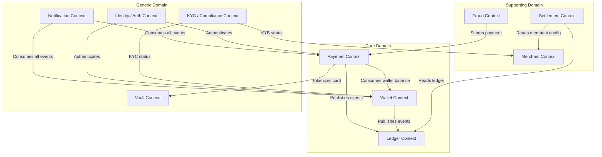
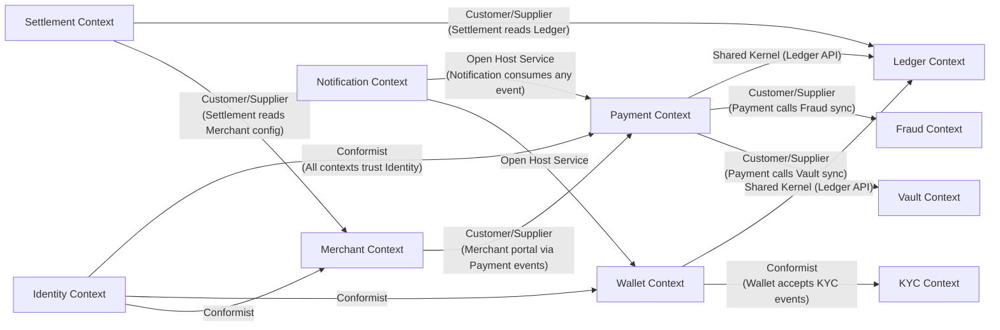

# 03 — DDD Bounded Contexts: Payment Gateway / Wallet System

## Objective

Define the bounded contexts of the Payment Gateway / Wallet system, their internal ubiquitous languages, their relationships (context map), anti-corruption layers, and the rationale for each boundary. Establish which contexts must remain strongly consistent with each other and which can tolerate eventual consistency.

---

## 1. Bounded Contexts Overview

---

## 2. Context Definitions

### 2.1 Payment Context (Core Domain)

**Why core?** This is the primary revenue-generating capability. It contains the deepest domain logic, has the most complex state machine, and directly drives business value.

**Responsibilities:**
- Payment lifecycle management (create, authorize, capture, void, refund)
- 3DS orchestration
- Acquirer routing and failover
- Chargeback intake and lifecycle
- Idempotency enforcement
- Payment method abstraction

**Ubiquitous Language:** Payment, Charge, Authorization, Capture, Void, Refund, Chargeback, Idempotency Key, Acquirer, Decline Code, Payment Method, Network Token

**Owns:** `payments`, `refunds`, `chargebacks`, `payment_methods`, `idempotency_keys` tables

**Does NOT own:** Wallet balances, Ledger entries, Merchant settlement config, Fraud scores (receives them as input)

---

### 2.2 Wallet Context (Core Domain)

**Why core?** Wallets are a regulated financial product (PPI) with their own compliance requirements, limit rules, and user experience. The complexity of KYC-tier limits, multi-currency, P2P transfer semantics, and withdrawal flows warrants its own bounded context.

**Responsibilities:**
- Wallet lifecycle (create, suspend, close)
- Balance management with KYC-enforced limits
- Top-up via payment instruments
- Peer-to-peer transfer
- Withdrawal initiation and tracking
- Daily limit tracking

**Ubiquitous Language:** Wallet, Balance, Top-Up, Transfer, Withdrawal, KYC Tier, Daily Limit, PPI

**Owns:** `wallets`, `wallet_daily_limits` tables

**Does NOT own:** The ledger entries (written by Ledger Context on Wallet's behalf), KYC status (owned by KYC Context)

---

### 2.3 Ledger Context (Core Domain — Shared Kernel approach)

**Why core?** The double-entry ledger is the source of financial truth. Every other context depends on its correctness. Incorrect ledger entries = regulatory violations and reconciliation failures.

**Design decision:** The Ledger Context is a **Shared Kernel** with thin but critical API. Payment Context and Wallet Context both write to the Ledger through a defined Ledger Service interface, not by directly inserting to the ledger table.

**Responsibilities:**
- Maintaining double-entry bookkeeping
- Computing account balances
- Providing the reconciliation data for Settlement Context
- Enforcing ledger invariants (every debit has a matching credit in same journal)

**Ubiquitous Language:** Ledger Entry, Journal, Account, Debit, Credit, Running Balance, Journal ID

**Owns:** `ledger_entries`, `accounts` tables

---

### 2.4 Merchant Context (Supporting Domain)

**Why supporting?** Merchants are important but their management (onboarding, configuration, API credentials) does not contain the deepest payment business rules.

**Responsibilities:**
- Merchant onboarding and KYB status tracking
- API key management and rotation
- Webhook endpoint registration and management
- Settlement configuration (T+1, T+2, rolling reserve percentage)
- Merchant-facing reporting

**Ubiquitous Language:** Merchant, API Key, Webhook, Settlement Account, KYB, Rolling Reserve

**Owns:** `merchants`, `api_credentials`, `webhook_endpoints`, `settlement_configs` tables

---

### 2.5 Settlement Context (Supporting Domain)

**Why supporting?** Settlement is a critical business process but is largely a read-and-compute batch operation on top of data owned by other contexts.

**Responsibilities:**
- Daily batch job: calculate net payout per merchant
- Generate settlement records
- Initiate bank payouts via NEFT/IMPS
- Match against acquirer statements (reconciliation)
- Flag discrepancies for manual review

**Ubiquitous Language:** Settlement Batch, Net Payout, Gross Volume, Fee, Rolling Reserve, Reconciliation, Discrepancy

**Owns:** `settlement_batches`, `reconciliation_records` tables

**Consumes:** Ledger entries (read-only), Merchant settlement config

---

### 2.6 Fraud Context (Supporting Domain)

**Why supporting?** Fraud detection is critical but it serves the Payment and Wallet contexts — it does not own payment or wallet state.

**Responsibilities:**
- Real-time rule evaluation (velocity, blacklists, device fingerprint)
- Near-real-time ML model scoring
- Manual review queue management
- Feedback loop: chargeback outcome → model retraining signal

**Ubiquitous Language:** Fraud Score, Risk Level, Rule, Velocity, Blacklist, Feature Vector, Review Queue

**Owns:** `fraud_rules`, `fraud_signals`, `review_queue`, Redis velocity counters

---

### 2.7 Vault Context (Generic Domain — Isolated)

**Why generic / isolated?** The Vault's role is purely technical: it stores sensitive card data and provides tokenization. It has no business logic beyond format validation and token mapping. However, its isolation is non-negotiable due to PCI DSS.

**Responsibilities:**
- Tokenize card PAN → opaque token
- Detokenize token → network token for acquirer call
- Store mapping in HSM-backed encrypted storage
- Provide no other capabilities

**Isolation requirements:**
- Separate network zone (PCI Cardholder Data Environment)
- Separate database (not shared with any other context)
- Separate deployment pipeline
- Separate audit log stream

---

### 2.8 Notification Context (Generic Domain)

**Responsibilities:**
- Deliver webhooks to merchants
- Send email/SMS to users for wallet events
- Retry failed deliveries with exponential backoff
- Maintain delivery log

---

### 2.9 Identity / Auth Context (Generic Domain)

**Responsibilities:**
- Issue and validate JWT tokens for users
- Issue and validate API keys for merchants
- OAuth2 for merchant portal
- Session management

---

### 2.10 KYC / Compliance Context (Generic Domain)

**Responsibilities:**
- Integrate with eKYC providers (Aadhaar, CKYC)
- Track KYC status per user (NONE / MINIMUM / FULL)
- Track KYB status per merchant
- Emit events when KYC status changes (affects wallet limits)

---

## 3. Context Map

### Relationship Patterns Explained

| Relationship | Pattern | Rationale |
|---|---|---|
| Payment ↔ Ledger | Shared Kernel | Both Payment and Wallet write to Ledger — shared API contract, not independent |
| Payment → Fraud | Customer/Supplier | Payment drives Fraud's API contract; Fraud must serve Payment's latency needs |
| Payment → Vault | Customer/Supplier | Payment defines what it needs from Vault (tokenize/detokenize) |
| Wallet → KYC | Conformist | Wallet accepts KYC status as-is; KYC context defines the contract |
| Notification → All | Open Host Service | Notification publishes a stable API for event consumption |
| Identity → All | Conformist | All contexts accept Identity's JWT/API key contracts |
| Settlement → Ledger | Customer/Supplier | Settlement queries Ledger's read model |

---

## 4. Anti-Corruption Layers (ACLs)

### Payment Context ACL for Acquirer Integration

Acquirers speak ISO 8583 (binary), legacy REST with proprietary error codes, or SOAP. The ACL translates:
- Acquirer-specific decline codes → canonical DeclineReason enum
- Acquirer auth response → PaymentAuthorization value object
- Acquirer settlement file format → SettlementRecord

Without this ACL, acquirer-specific concepts (e.g., "response code 51" meaning "insufficient funds" in one acquirer but "declined" in another) would leak into the core Payment domain.

### Wallet Context ACL for KYC Provider

KYC providers have their own user models, status terminology, and data formats. The ACL translates:
- KYC provider status → canonical KycStatus (NONE / MINIMUM / FULL)
- KYC provider events → WalletKycStatusChanged domain event

### Settlement Context ACL for Bank Payout API

Each bank's payout API (NEFT, IMPS, UPI payout) has different response formats and asynchronous patterns. The ACL normalizes:
- Bank payout response → PayoutResult (SUCCESS / FAILED / PENDING)
- Bank transaction reference → PayoutReference

---

## 5. Consistency Requirements Across Contexts

| Context Pair | Consistency Required | Mechanism |
|---|---|---|
| Payment ↔ Ledger | Strong | Same DB transaction (within monolith) |
| Wallet ↔ Ledger | Strong | Same DB transaction (within monolith) |
| Payment → Notification | Eventual | Outbox pattern → Kafka |
| Payment → Fraud (scoring) | Synchronous call | Inline gRPC call before auth |
| Payment → Fraud (feedback) | Eventual | Kafka event (chargeback → fraud model) |
| Settlement → Ledger | Eventual (batch reads) | Nightly read of committed ledger data |
| Wallet ↔ KYC | Eventual | Kafka event: KycStatusChanged |

**Critical insight:** The strong consistency boundary is the DB transaction. When Payment and Ledger are in the same modular monolith sharing one database, atomicity is trivial. If you extract them to separate services, you lose this and must implement Saga — a much harder engineering problem.

---

## 6. Bounded Context Risks

| Risk | Mitigation |
|---|---|
| Wallet and Payment contexts sharing too much — becoming one monolithic context | Define clear API boundaries at the package level; enforce with ArchUnit |
| Settlement context reading ledger data that's not yet consistent | Settlement batch runs after all payment captures for the day are committed; enforced by scheduling |
| Fraud context becoming a bottleneck if synchronous score call is slow | Timeout fallback: if Fraud Engine > 50ms, apply default rules and allow-through with elevated monitoring |
| KYC status staleness causing incorrect wallet limit enforcement | Use event-driven KYC status propagation with at-most-30s lag; not acceptable for same-second wallet operation |
| Vault becoming a shared bottleneck | Vault must be horizontally scalable (stateless beyond the encrypted data store) |

---

## 7. Overengineering Warning

- **Do not create a separate Reporting Context** in V1 — serve merchant dashboard from read replicas.
- **Do not create a Pricing/Fee Context** in V1 — hardcode fee logic in Payment Context; extract only when fee structure becomes complex enough (tiered pricing per merchant category, dynamic MDR).
- **Do not create a Currency Exchange Context** in V1 — use a third-party FX rate service and a thin adapter.

---

## 8. Interview-Level Discussion Points

- **"How do you decide where one bounded context ends and another begins?"** Follow the ubiquitous language boundary: when you find yourself translating concepts (a "merchant" in Payment context is different from a "merchant" in Settlement context), that's a sign of a context boundary.
- **"Why is the Ledger a Shared Kernel rather than an independent service?"** Because Payment and Wallet both need atomic writes to the Ledger. If the Ledger were a service, every payment would be a distributed transaction. The Shared Kernel approach lets us share the API contract while maintaining single-database atomicity.
- **"What happens when the Fraud Context is wrong (approves a fraudulent transaction)?"** The Fraud Context publishes signals, not decisions. The Payment Context makes the final call. A chargeback loss feeds back as a training signal. The system is designed to minimize fraud loss, not eliminate it — elimination would mean too many false positives (declined legitimate payments).
- **"How does the ACL for acquirer integration help during acquirer switching?"** When you switch from one acquirer to another, only the ACL adapter changes. The Payment domain model remains stable — it always works with canonical PaymentAuthorization objects, never with acquirer-specific response structures.
