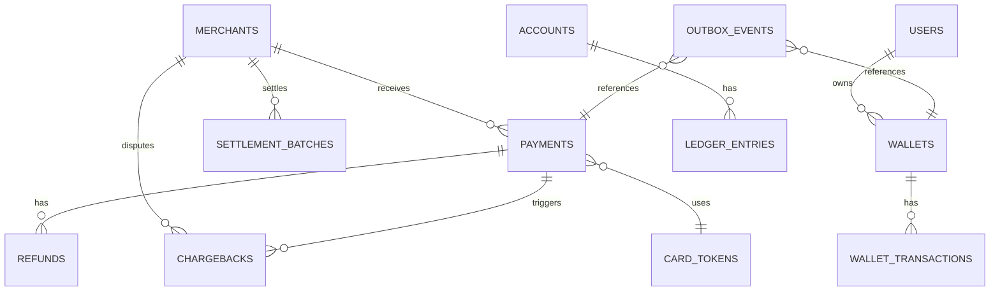

# 05 — Database Design: Payment Gateway / Wallet System

## Objective

Design the database schema, indexing strategy, partitioning plan, consistency model, and data lifecycle strategy for the Payment Gateway / Wallet system. Every design decision must be justified against correctness, performance at scale, and compliance requirements.

---

## 1. Database Technology Choices

### Primary Database: PostgreSQL

**Why PostgreSQL:**
- ACID transactions are non-negotiable for a ledger system — PostgreSQL's serializable isolation level eliminates anomalies.
- Advisory locks, row-level locking (`SELECT FOR UPDATE`), and `SKIP LOCKED` are essential for wallet operations and job queues.
- Supports partial indexes, composite indexes, functional indexes — critical for query performance.
- `JSONB` for flexible metadata storage without schema rigidity.
- `BIGSERIAL` for high-throughput ID generation without external services.
- Mature tooling: Patroni for HA, pgBouncer for connection pooling, pg_partman for partition management.

**Why not MySQL/Aurora MySQL:** MySQL's MVCC implementation can have phantom read issues under certain isolation levels. PostgreSQL's SSI (Serializable Snapshot Isolation) is more robust for financial workloads.

**Why not MongoDB:** Ledger requires ACID multi-document transactions — MongoDB's multi-document transactions are slower and less mature. Schema enforcement matters in financial systems.

### Vault Database: Separate PostgreSQL Instance

- Isolated in PCI CDE network zone.
- Encrypted at rest (AES-256) and in transit (TLS 1.3).
- Fewer connections, simpler schema — only token↔PAN mapping.
- HSM (Hardware Security Module) for key management.

### Redis: Caching, Idempotency, Velocity Counters

See 09-caching-strategy.md for detail. Summary: Redis Cluster for availability; used for idempotency keys, payment status cache, fraud velocity counters, wallet balance cache (short TTL).

---

## 2. Schema Design

### 2.1 Payments Table

```sql
CREATE TABLE payments (
    id                  UUID PRIMARY KEY DEFAULT gen_random_uuid(),
    merchant_id         UUID NOT NULL REFERENCES merchants(id),
    customer_id         UUID REFERENCES customers(id),
    idempotency_key     VARCHAR(64) NOT NULL,
    amount              BIGINT NOT NULL,           -- in minor units (paise)
    currency            CHAR(3) NOT NULL,           -- ISO 4217
    status              VARCHAR(30) NOT NULL,       -- PENDING/AUTHORIZED/CAPTURED/...
    capture_method      VARCHAR(10) NOT NULL DEFAULT 'automatic',
    amount_captured     BIGINT NOT NULL DEFAULT 0,
    amount_refunded     BIGINT NOT NULL DEFAULT 0,
    payment_method_type VARCHAR(20) NOT NULL,       -- card/upi/wallet/bank_transfer
    card_token_id       UUID REFERENCES card_tokens(id),
    upi_vpa             VARCHAR(100),
    wallet_id           UUID REFERENCES wallets(id),
    authorization_code  VARCHAR(20),
    acquirer_txn_id     VARCHAR(100),
    acquirer_id         UUID REFERENCES acquirers(id),
    fraud_score         DECIMAL(5,4),
    fraud_risk_level    VARCHAR(10),
    three_ds_status     VARCHAR(20),
    three_ds_eci        CHAR(2),
    three_ds_cavv       VARCHAR(50),
    description         VARCHAR(500),
    metadata            JSONB,
    failure_code        VARCHAR(50),
    failure_message     VARCHAR(500),
    captured_at         TIMESTAMPTZ,
    created_at          TIMESTAMPTZ NOT NULL DEFAULT NOW(),
    updated_at          TIMESTAMPTZ NOT NULL DEFAULT NOW(),
    CONSTRAINT uq_merchant_idempotency UNIQUE (merchant_id, idempotency_key)
);

CREATE INDEX idx_payments_merchant_created ON payments (merchant_id, created_at DESC);
CREATE INDEX idx_payments_customer_created ON payments (customer_id, created_at DESC) WHERE customer_id IS NOT NULL;
CREATE INDEX idx_payments_status ON payments (status) WHERE status IN ('PENDING', 'PROCESSING', 'AUTHORIZED');
CREATE INDEX idx_payments_acquirer_txn ON payments (acquirer_txn_id) WHERE acquirer_txn_id IS NOT NULL;
CREATE INDEX idx_payments_created_at ON payments (created_at DESC);  -- settlement batch scans
```

### 2.2 Refunds Table

```sql
CREATE TABLE refunds (
    id              UUID PRIMARY KEY DEFAULT gen_random_uuid(),
    payment_id      UUID NOT NULL REFERENCES payments(id),
    merchant_id     UUID NOT NULL REFERENCES merchants(id),
    idempotency_key VARCHAR(64) NOT NULL,
    amount          BIGINT NOT NULL,
    currency        CHAR(3) NOT NULL,
    status          VARCHAR(20) NOT NULL,   -- PENDING/SUCCEEDED/FAILED
    reason          VARCHAR(30),
    acquirer_refund_id VARCHAR(100),
    failure_reason  VARCHAR(500),
    metadata        JSONB,
    created_at      TIMESTAMPTZ NOT NULL DEFAULT NOW(),
    updated_at      TIMESTAMPTZ NOT NULL DEFAULT NOW(),
    CONSTRAINT uq_refund_idempotency UNIQUE (merchant_id, idempotency_key)
);

CREATE INDEX idx_refunds_payment ON refunds (payment_id);
CREATE INDEX idx_refunds_status ON refunds (status) WHERE status = 'PENDING';
```

### 2.3 Wallets Table

```sql
CREATE TABLE wallets (
    id              UUID PRIMARY KEY DEFAULT gen_random_uuid(),
    user_id         UUID NOT NULL REFERENCES users(id),
    currency        CHAR(3) NOT NULL DEFAULT 'INR',
    balance         BIGINT NOT NULL DEFAULT 0 CHECK (balance >= 0),
    kyc_status      VARCHAR(20) NOT NULL DEFAULT 'NONE',
    status          VARCHAR(20) NOT NULL DEFAULT 'ACTIVE',
    daily_topup_limit    BIGINT NOT NULL DEFAULT 1000000,  -- ₹10,000 in paise
    daily_transfer_limit BIGINT NOT NULL DEFAULT 1000000,
    max_balance          BIGINT NOT NULL DEFAULT 1000000,
    created_at      TIMESTAMPTZ NOT NULL DEFAULT NOW(),
    updated_at      TIMESTAMPTZ NOT NULL DEFAULT NOW(),
    UNIQUE (user_id, currency)
);

CREATE INDEX idx_wallets_user ON wallets (user_id);
```

**Note on balance column:** The balance column is kept for fast read performance but is always updated atomically with the ledger entry in the same transaction. The ledger is the source of truth; the balance column is a materialized view.

### 2.4 Wallet Transactions Table

```sql
CREATE TABLE wallet_transactions (
    id                  UUID PRIMARY KEY DEFAULT gen_random_uuid(),
    wallet_id           UUID NOT NULL REFERENCES wallets(id),
    type                VARCHAR(30) NOT NULL,   -- TOPUP/TRANSFER_SENT/TRANSFER_RECEIVED/PAYMENT/WITHDRAWAL
    direction           VARCHAR(10) NOT NULL,   -- DEBIT/CREDIT
    amount              BIGINT NOT NULL,
    balance_after       BIGINT NOT NULL,
    reference_type      VARCHAR(30),            -- PAYMENT/TRANSFER/WITHDRAWAL
    reference_id        UUID,
    counterparty_wallet_id UUID REFERENCES wallets(id),
    description         VARCHAR(500),
    idempotency_key     VARCHAR(64),
    created_at          TIMESTAMPTZ NOT NULL DEFAULT NOW()
);

CREATE INDEX idx_wallet_txns_wallet_created ON wallet_transactions (wallet_id, created_at DESC);
CREATE INDEX idx_wallet_txns_reference ON wallet_transactions (reference_type, reference_id);
```

### 2.5 Ledger Entries Table (Double-Entry)

```sql
CREATE TABLE ledger_entries (
    id              BIGSERIAL PRIMARY KEY,           -- sequential for ordering
    journal_id      UUID NOT NULL,                   -- groups debit+credit pair
    account_id      UUID NOT NULL REFERENCES accounts(id),
    direction       CHAR(6) NOT NULL CHECK (direction IN ('DEBIT', 'CREDIT')),
    amount          BIGINT NOT NULL CHECK (amount > 0),
    currency        CHAR(3) NOT NULL,
    running_balance BIGINT NOT NULL,                 -- denormalized for fast balance
    reference_type  VARCHAR(30) NOT NULL,
    reference_id    UUID NOT NULL,
    description     VARCHAR(500),
    created_at      TIMESTAMPTZ NOT NULL DEFAULT NOW()
);

-- Immutability enforced: no UPDATE or DELETE permissions granted on this table
-- Only INSERT is permitted for the application role

CREATE INDEX idx_ledger_journal ON ledger_entries (journal_id);
CREATE INDEX idx_ledger_account_created ON ledger_entries (account_id, created_at DESC);
CREATE INDEX idx_ledger_reference ON ledger_entries (reference_type, reference_id);
CREATE INDEX idx_ledger_created_at ON ledger_entries (created_at DESC);  -- settlement scans
```

**Partitioning:** Range partition by `created_at` monthly. Each month's partition is approximately 500M rows at 5,000 TPS scale. Partition pruning makes settlement batch queries efficient.

### 2.6 Accounts Table (Ledger Accounts)

```sql
CREATE TABLE accounts (
    id              UUID PRIMARY KEY DEFAULT gen_random_uuid(),
    account_type    VARCHAR(30) NOT NULL,  -- MERCHANT_RECEIVABLE/USER_WALLET/FEE_INCOME/...
    owner_type      VARCHAR(20),           -- MERCHANT/USER/SYSTEM
    owner_id        UUID,                  -- merchant_id or user_id
    currency        CHAR(3) NOT NULL,
    created_at      TIMESTAMPTZ NOT NULL DEFAULT NOW()
);

CREATE INDEX idx_accounts_owner ON accounts (owner_type, owner_id);
```

### 2.7 Merchants Table

```sql
CREATE TABLE merchants (
    id                  UUID PRIMARY KEY DEFAULT gen_random_uuid(),
    business_name       VARCHAR(200) NOT NULL,
    business_type       VARCHAR(50),
    kyb_status          VARCHAR(20) NOT NULL DEFAULT 'PENDING',
    status              VARCHAR(20) NOT NULL DEFAULT 'ACTIVE',
    settlement_cycle    VARCHAR(10) NOT NULL DEFAULT 'T_PLUS_1',
    holding_reserve_pct DECIMAL(5,2) NOT NULL DEFAULT 0.00,
    settlement_account_ifsc    VARCHAR(20),
    settlement_account_number  VARCHAR(50),     -- encrypted
    settlement_account_name    VARCHAR(200),
    webhook_url         VARCHAR(500),
    webhook_secret_hash VARCHAR(200),           -- hashed signing secret
    created_at          TIMESTAMPTZ NOT NULL DEFAULT NOW(),
    updated_at          TIMESTAMPTZ NOT NULL DEFAULT NOW()
);
```

### 2.8 Outbox Table (Transactional Outbox Pattern)

```sql
CREATE TABLE outbox_events (
    id              UUID PRIMARY KEY DEFAULT gen_random_uuid(),
    aggregate_type  VARCHAR(50) NOT NULL,       -- PAYMENT/WALLET/SETTLEMENT
    aggregate_id    UUID NOT NULL,
    event_type      VARCHAR(100) NOT NULL,
    payload         JSONB NOT NULL,
    status          VARCHAR(20) NOT NULL DEFAULT 'PENDING',  -- PENDING/PUBLISHED/FAILED
    published_at    TIMESTAMPTZ,
    created_at      TIMESTAMPTZ NOT NULL DEFAULT NOW(),
    retry_count     INT NOT NULL DEFAULT 0
);

CREATE INDEX idx_outbox_pending ON outbox_events (created_at) WHERE status = 'PENDING';
```

### 2.9 Settlement Batches Table

```sql
CREATE TABLE settlement_batches (
    id                  UUID PRIMARY KEY DEFAULT gen_random_uuid(),
    merchant_id         UUID NOT NULL REFERENCES merchants(id),
    settlement_date     DATE NOT NULL,
    gross_amount        BIGINT NOT NULL DEFAULT 0,
    total_fees          BIGINT NOT NULL DEFAULT 0,
    total_refunds       BIGINT NOT NULL DEFAULT 0,
    total_chargebacks   BIGINT NOT NULL DEFAULT 0,
    net_payout_amount   BIGINT NOT NULL DEFAULT 0,
    status              VARCHAR(20) NOT NULL DEFAULT 'PENDING',
    payout_reference    VARCHAR(100),
    payout_completed_at TIMESTAMPTZ,
    created_at          TIMESTAMPTZ NOT NULL DEFAULT NOW(),
    UNIQUE (merchant_id, settlement_date)
);
```

### 2.10 Chargebacks Table

```sql
CREATE TABLE chargebacks (
    id                  UUID PRIMARY KEY DEFAULT gen_random_uuid(),
    payment_id          UUID NOT NULL REFERENCES payments(id),
    merchant_id         UUID NOT NULL REFERENCES merchants(id),
    network_case_id     VARCHAR(100) NOT NULL,
    amount              BIGINT NOT NULL,
    currency            CHAR(3) NOT NULL,
    reason_code         VARCHAR(20) NOT NULL,
    reason_description  VARCHAR(500),
    status              VARCHAR(30) NOT NULL DEFAULT 'RECEIVED',
    evidence_due_date   DATE,
    resolution          VARCHAR(20),           -- WON/LOST/REVERSED
    resolved_at         TIMESTAMPTZ,
    created_at          TIMESTAMPTZ NOT NULL DEFAULT NOW(),
    updated_at          TIMESTAMPTZ NOT NULL DEFAULT NOW()
);
```

---

## 3. ER Diagram



---

## 4. Partitioning Strategy

### Ledger Entries — Range Partitioning by Month

```
ledger_entries (parent)
├── ledger_entries_2026_01 (Jan 2026)
├── ledger_entries_2026_02 (Feb 2026)
├── ...
└── ledger_entries_2026_12 (Dec 2026)
```

**Benefits:**
- Settlement queries (date range scans) hit only relevant partitions.
- Old partitions can be moved to cheaper tablespace (cold storage).
- VACUUM and ANALYZE operate per-partition — reduces maintenance window impact.

### Payments — Range Partitioning by Month

Same strategy. Merchant dashboard queries filtered by date range hit < 2 partitions typically.

### Wallet Transactions — Range Partitioning by Month

---

## 5. Indexing Strategy

| Table | Index | Type | Reason |
|---|---|---|---|
| payments | (merchant_id, created_at DESC) | Composite | Merchant transaction history |
| payments | (status) WHERE PENDING/PROCESSING | Partial | Active payment monitoring |
| payments | (merchant_id, idempotency_key) | Unique | Idempotency enforcement |
| ledger_entries | (account_id, created_at DESC) | Composite | Balance queries |
| ledger_entries | (reference_type, reference_id) | Composite | Trace payment to entries |
| wallet_transactions | (wallet_id, created_at DESC) | Composite | User transaction history |
| outbox_events | (created_at) WHERE PENDING | Partial | Outbox poller |
| chargebacks | (merchant_id, status) | Composite | Merchant dispute queue |

---

## 6. Consistency and Isolation Levels

| Operation | Isolation Level | Reason |
|---|---|---|
| Wallet debit/credit | SERIALIZABLE | Prevent balance going negative under concurrent debits |
| Ledger entry insert | READ COMMITTED | Ledger inserts are append-only; no phantom risk |
| Payment status update | READ COMMITTED | Idempotency key check in Redis handles concurrency |
| Settlement batch read | READ COMMITTED (read replica) | Snapshot read; minor inconsistency acceptable |
| Refund creation | READ COMMITTED + advisory lock | Lock on payment_id to prevent concurrent over-refund |

**Why not SERIALIZABLE everywhere?** SERIALIZABLE has higher abort rate and CPU overhead. Use it only where phantom reads or write skew are a real risk (wallet balance). For payment status updates, the idempotency key mechanism + database unique constraint handles concurrency at a lower cost.

---

## 7. Data Lifecycle and Retention

| Data | Hot Storage | Warm Storage | Cold/Archive |
|---|---|---|---|
| Payments (recent 2 years) | PostgreSQL primary | — | — |
| Payments (2-7 years) | PostgreSQL read replica | Compressed tablespace | S3 Glacier after 7 years |
| Ledger entries | Always hot (settlement needs any date) | Partition-based cold tablespace | — |
| Wallet transactions | 1 year hot | S3 via pg_dump partition export | S3 Glacier |
| Outbox events (published) | Delete after 7 days | — | — |
| Fraud signals | 90 days hot | — | — |

**Regulatory requirement:** RBI mandates 5-year retention for payment records; 7 years is conservative to cover potential audits.

---

## 8. Soft Delete Strategy

- **Payments, Ledger Entries:** Never soft-deleted. These are financial records.
- **Merchants:** `status = SUSPENDED | CLOSED` — no DELETE operation.
- **Wallets:** `status = CLOSED` — balance must be zero before closing.
- **Card Tokens:** `status = REVOKED` with revoked_at timestamp. Token mapping in Vault is retained for chargeback evidence.

---

## 9. Sharding Considerations

At scale beyond 100,000 TPS (FAANG-scale):

- **Shard key for payments:** `merchant_id` — all of a merchant's data in one shard avoids cross-shard joins for settlement.
- **Shard key for wallets:** `user_id` — P2P transfers between users on different shards require 2-phase commit or Saga.
- **Ledger sharding challenge:** The ledger needs global balance computation across shards — this requires a fan-out aggregation layer.
- **V1–V2 approach:** Single PostgreSQL cluster with partitioning suffices up to ~50,000 TPS with 32-core hardware. Sharding is a V3 concern.

---

## 10. Multi-Tenant Considerations

- All tables include `merchant_id` for merchant-scoped data.
- Row-Level Security (RLS) is considered but not implemented in V1 (application-level tenant filtering is simpler to reason about).
- In V2: PostgreSQL RLS can be enabled as a defense-in-depth layer to prevent cross-tenant data leaks in case of application bugs.

---

## 11. Risks and Bottlenecks

| Risk | Impact | Mitigation |
|---|---|---|
| Ledger table hot spot | Contention on latest partition | Partitioning + multiple tablespaces; sequence-based ID avoids hot index pages |
| Wallet row lock contention | High-traffic wallet transfers slow down | Separate wallet operations by user; queue mechanism for ultra-high-frequency wallets |
| Settlement batch full table scan | Slow daily job | Partition pruning + index on created_at; read replica for batch |
| Outbox table growth | Slow poller if published events not cleaned | Periodic cleanup job for PUBLISHED events older than 7 days |
| Read replica lag during spikes | Stale merchant dashboard | Monitor replica lag; alert if > 30 seconds |

---

## 12. Interview-Level Discussion Points

- **"Why store balance in the wallet table if the ledger is the source of truth?"** Denormalization for read performance. Computing balance from ledger (SUM of all entries) for every API request is too expensive. The balance column is kept in sync within the same DB transaction that writes the ledger entry — they cannot diverge.
- **"How do you prevent two concurrent wallet debits from both reading the same balance and both succeeding?"** `SELECT balance FROM wallets WHERE id = ? FOR UPDATE` acquires a row-level exclusive lock. Only one concurrent transaction can proceed; the other waits. PostgreSQL's lock manager handles this.
- **"Why partition by month instead of by merchant?"** Date-range queries (settlement, reporting) are the dominant access pattern. Partitioning by merchant would help if queries were merchant-filtered, but settlement needs cross-merchant date range scans.
- **"What happens to the ledger if the database goes down mid-transaction?"** PostgreSQL's WAL (Write-Ahead Log) ensures durability. A partial transaction is rolled back on recovery. The ledger entry and wallet balance update are in the same transaction — either both commit or neither does.
