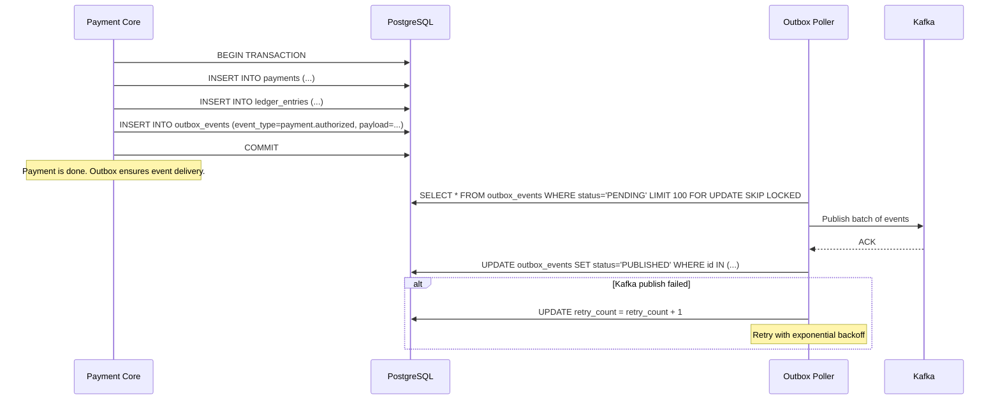
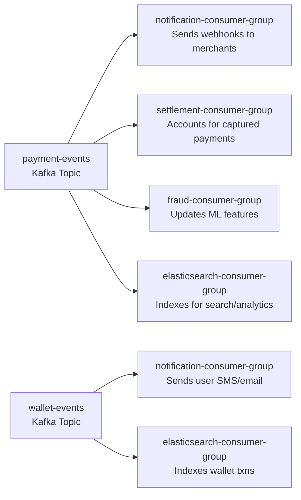
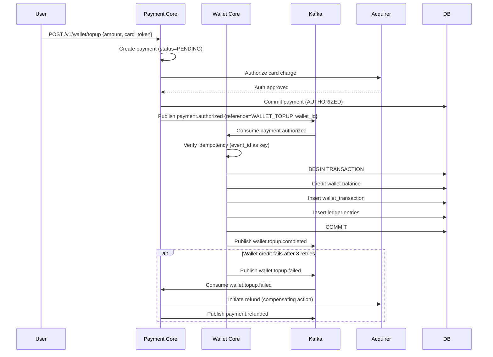

# 06 — Event Flow: Payment Gateway / Wallet System

## Objective

Define the event-driven architecture for the Payment Gateway / Wallet system. Document the Outbox Pattern for reliable event publishing, the Kafka topic design, consumer group strategy, event schema, Saga pattern for distributed payment flows, and the deduplication strategy at every layer.

---

## 1. Why Event-Driven Architecture

The payment gateway has multiple downstream consumers that must react to payment events:
- **Notification Service** must send webhooks to merchants and SMS/email to users.
- **Settlement Service** must account for captured payments in the nightly batch.
- **Fraud Engine** must update ML features based on payment outcomes and chargeback feedback.
- **Analytics Pipeline** must index payment events for reporting.
- **Wallet Service** must update balance after a wallet top-up payment completes.

**Option 1: Synchronous calls in the payment flow**
- Increases latency of the payment API.
- Creates tight coupling — if Settlement Service is slow, Payment API slows down.
- Creates cascading failures — if Notification Service is down, payment fails.

**Option 2: Async event publishing (Kafka)**
- Payment Core publishes an event after committing to the DB.
- Downstream consumers process independently.
- Failure in a consumer does not affect the payment transaction.
- Consumer can replay from Kafka offset if it was down.

**Decision: Async event publishing** via Kafka with the Outbox Pattern for guaranteed at-least-once delivery.

---

## 2. The Outbox Pattern

### Problem Without Outbox

A naive implementation publishes to Kafka after the DB commit:
1. DB commit succeeds.
2. Kafka publish fails (network error / broker down).
3. Payment was processed but no events were published → downstream systems missed the event.

Alternatively, if you publish to Kafka first then commit to DB:
1. Kafka publish succeeds.
2. DB commit fails.
3. Events published for a payment that doesn't exist in DB.

### Outbox Pattern Solution

Write the event to an `outbox_events` table **within the same DB transaction** as the payment record. A separate Outbox Poller process reads pending outbox events and publishes them to Kafka. Only marks them as PUBLISHED after Kafka ACK.



### Outbox Poller Design

- **Polling interval:** 100ms during business hours; 1s off-peak.
- **Batch size:** 100 events per poll cycle.
- `SKIP LOCKED` allows multiple poller instances without contention.
- **Retry limit:** 10 retries. After 10, status → DEAD_LETTER, alert raised.
- **Ordering guarantee:** Events per aggregate (same payment_id) are published in order by using the same Kafka partition key.

---

## 3. Kafka Topic Design

### Topic Naming Convention

```
{environment}.{domain}.{entity}.{event-type}
Example: prod.payment.payment.authorized
```

Simplified to flat topics for operational simplicity:

| Topic | Retention | Partitions | Purpose |
|---|---|---|---|
| `payment-events` | 7 days | 32 | All payment lifecycle events |
| `wallet-events` | 7 days | 16 | All wallet lifecycle events |
| `fraud-events` | 30 days | 16 | Fraud signals and decisions |
| `settlement-events` | 7 days | 8 | Settlement batch events |
| `notification-events` | 3 days | 8 | Webhook delivery queue |
| `chargeback-events` | 30 days | 8 | Chargeback lifecycle |
| `dead-letter` | 30 days | 8 | Failed events for manual inspection |

### Partition Key Strategy

| Topic | Partition Key | Reason |
|---|---|---|
| `payment-events` | `payment_id` | All events for a payment go to same partition → ordered processing |
| `wallet-events` | `wallet_id` | Wallet operations ordered per wallet |
| `fraud-events` | `payment_id` | Correlate fraud signal with payment |
| `notification-events` | `merchant_id` | Rate-limit per merchant; ordered delivery |

### Why 32 Partitions for Payment Events?

At 5,000 TPS payment creates + updates, each payment generates 3–5 events → 25,000 events/second. With 32 partitions and typical 800 events/second per partition per consumer, 32 consumer instances can keep up. Over-partition conservatively — reducing partitions later requires topic recreation.

---

## 4. Event Schema Design

All events follow a common envelope:

```json
{
  "event_id": "evt_abc123",
  "event_type": "payment.authorized",
  "event_version": "1.0",
  "aggregate_type": "Payment",
  "aggregate_id": "pay_xxxxxxxxxxx",
  "occurred_at": "2026-05-18T10:00:00.000Z",
  "correlation_id": "req_zzz",
  "causation_id": "evt_previous",
  "payload": {
    // event-specific data
  }
}
```

**Schema evolution:** Use Avro with Confluent Schema Registry. Schema compatibility mode: `BACKWARD_COMPATIBLE` — new consumers can read old events, old consumers ignore new fields.

### Key Event Payloads

**payment.authorized:**
```json
{
  "payment_id": "pay_xxx",
  "merchant_id": "mer_xxx",
  "amount": 100000,
  "currency": "INR",
  "authorization_code": "ABC123",
  "payment_method_type": "card",
  "fraud_score": 0.12
}
```

**payment.captured:**
```json
{
  "payment_id": "pay_xxx",
  "merchant_id": "mer_xxx",
  "amount_captured": 100000,
  "fee_amount": 3000,
  "net_merchant_amount": 97000
}
```

**chargeback.received:**
```json
{
  "chargeback_id": "cb_xxx",
  "payment_id": "pay_xxx",
  "merchant_id": "mer_xxx",
  "amount": 100000,
  "reason_code": "4853",
  "reason_description": "Cardholder Dispute"
}
```

---

## 5. Consumer Group Design



Each consumer group:
- Maintains its own offset → independent processing speed.
- Can replay from any offset if it needs to reprocess.
- Is scaled independently (Notification may need more instances than Analytics).

---

## 6. Saga Pattern: Distributed Payment Flows

The Saga pattern is needed for flows that span multiple steps with compensating actions. In V1 (modular monolith), most flows are within one DB transaction and don't need Saga. Saga is needed for:

1. **Wallet Top-Up**: Payment charge + Wallet credit (involves calling external acquirer; can fail after DB commit).
2. **Settlement Payout**: Batch calculation + Bank payout initiation + Ledger entry.
3. **Refund to Bank Account**: Initiate refund with acquirer + Update ledger + Notify.

### Saga: Wallet Top-Up (Choreography-Based)



### Why Choreography Over Orchestration Here?

Choreography (event-based, no central coordinator) is simpler for linear flows like top-up. Each service reacts to events.

Orchestration (central Saga orchestrator) is better for complex branching flows with many steps, like a multi-leg international transfer. The orchestrator explicitly tracks state and issues commands.

**V1 decision:** Choreography for top-up and simple refunds. Orchestration reserved for complex flows introduced in V2.

---

## 7. Deduplication Strategy

Events can be delivered more than once (Kafka at-least-once guarantee). Consumers must be idempotent.

### Consumer-Side Deduplication

Each consumer stores processed `event_id` values in Redis with a TTL matching maximum expected redelivery window (7 days for most topics).

```
Redis Key: dedup:{consumer-group}:{event_id}
Value: "1"
TTL: 7 days
Command: SETNX — only processes if key did not exist
```

For database-backed consumers (Settlement, Wallet), use the event_id as a unique constraint in the insert:
```sql
INSERT INTO wallet_transactions (..., source_event_id)
VALUES (..., 'evt_abc123')
ON CONFLICT (source_event_id) DO NOTHING;
```

This makes the database the deduplication store — more durable than Redis for settlement-critical events.

---

## 8. Event Ordering and Consistency

**Within a payment:** All events for a payment go to the same partition (partition key = payment_id). Within a partition, Kafka guarantees ordering. This means a consumer sees `payment.authorized` before `payment.captured` for the same payment.

**Across payments:** No ordering guarantee. Settlement service must not assume event order across different payment IDs.

**At-least-once vs exactly-once:**

| Consumer | Required Semantic | Implementation |
|---|---|---|
| Notification Service | At-least-once (idempotent webhooks via event_id) | Merchant deduplicates on event_id |
| Settlement Service | At-most-once processing (financial) | DB unique constraint on event_id |
| Fraud Feature Update | At-least-once (minor over-count acceptable) | Redis SETNX |
| Elasticsearch Indexing | At-least-once (reindexing safe) | Document ID = event_id |

---

## 9. Event Replay and Recovery

**Scenario:** Settlement Service was down for 4 hours. It missed events.

**Recovery:**
1. Kafka retains events for 7 days.
2. Settlement consumer group resets offset to 4 hours ago.
3. Events are replayed. Deduplication via DB unique constraint prevents double-counting.
4. Settlement batch re-runs correctly.

**Scenario:** Fraud Engine needs to reprocess all payments for the last 30 days (model retraining).

**Recovery:**
1. Create a new consumer group (`fraud-retraining-group`).
2. Set offset to 30 days ago.
3. Process all events independently from the live consumer group.
4. No impact on live fraud processing.

---

## 10. Risks and Bottlenecks

| Risk | Impact | Mitigation |
|---|---|---|
| Outbox Poller falls behind under load | Events delayed → webhooks delayed | Multiple poller instances with SKIP LOCKED; monitor lag |
| Kafka partition count too low | Consumer throughput bottleneck | Pre-partition conservatively; monitor consumer lag per partition |
| Deduplication store (Redis) miss | Duplicate processing by consumer | Use DB unique constraint as backup for financial consumers |
| Saga compensating action also fails | Inconsistent state (wallet credited but refund failed) | Dead letter queue → manual intervention queue; alert ops team |
| Schema evolution breaking consumers | Consumer cannot deserialize event | Schema Registry with BACKWARD_COMPATIBLE mode; consumers ignore unknown fields |

---

## 11. Overengineering Warning

- **Do not implement event sourcing** as the primary persistence model in V1. Event sourcing requires: projections, snapshot management, schema versioning for events, and a team experienced with temporal queries. Use it only if you need point-in-time state reconstruction as a core feature (e.g., an audit ledger with time-travel queries).
- **Do not use exactly-once semantics (EOS) in Kafka** in V1. EOS (Kafka transactions + idempotent producers) adds producer overhead and complexity. At-least-once + consumer deduplication achieves the same result with simpler operational model.

---

## 12. Interview-Level Discussion Points

- **"Why Outbox Pattern instead of Kafka transactions?"** Kafka transactions give you exactly-once from producer to consumer, but they don't solve the DB + Kafka atomicity problem. The Outbox Pattern uses the DB as the source of truth — if the DB commits, the event will eventually be published. If the DB rolls back, the event is never written. This is the cleanest solution to the dual-write problem.
- **"What if the Outbox Poller is slow and webhooks are delayed?"** Outbox events for webhooks go to the notification-events topic. The Notification Service has its own retry logic. The delay is bounded by Kafka retention (7 days) and Outbox Poller throughput. Monitoring: alert if Outbox lag > 30 seconds.
- **"How does the Saga compensating action work if it fails too?"** It goes to the dead letter queue. An ops workflow is triggered (PagerDuty). A human reviews and either manually initiates the refund or marks it as resolved. Financial systems always have a manual escape hatch — full automation of compensating actions is dangerous without human oversight for edge cases.
- **"Why choreography for top-up instead of orchestration?"** Top-up is a linear 2-step flow: charge card → credit wallet. Choreography handles this cleanly with 2 events. An orchestrator would add a central coordinator service that needs to be deployed, scaled, and monitored — complexity not justified for a linear flow. Orchestration makes sense when the flow has 5+ steps with conditional branching.
