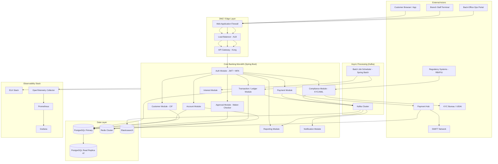
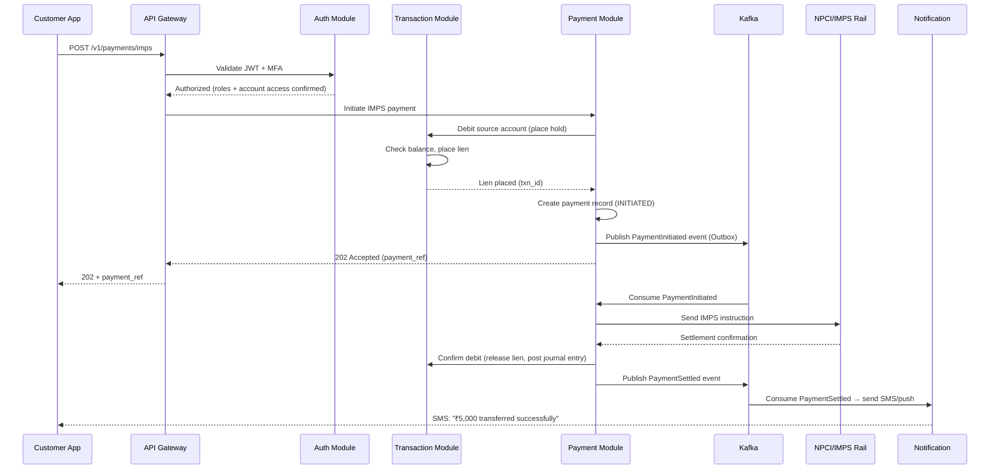

# 01 — High-Level Architecture: Banking Core System

## Objective

Define the top-level architectural approach for the Banking Core System, justify the choice of Modular Monolith with Domain-Driven Design over microservices, describe service boundaries, and present the overall request flow and system topology.

---

## 1. Architecture Decision: Modular Monolith with DDD

### Why NOT Microservices (for a Banking Core)

The default instinct in modern system design is to reach for microservices. For a Banking Core, this is the wrong instinct — and it requires deliberate justification.

| Concern | Microservices Impact | Modular Monolith Reality |
|---|---|---|
| Distributed transactions | Saga / 2PC required for every cross-service operation — enormous complexity for a ledger | ACID transactions within modules, no saga overhead |
| Consistency | Eventual consistency between services is fundamentally unacceptable for a ledger | Strong consistency via a single ACID-capable database |
| Operational overhead | 15–20 services with separate CI/CD, logging, scaling, on-call | Single deployable unit, simpler ops — critical for small bank teams |
| Latency | Network hop between services for every ledger operation | In-process calls, no serialization overhead |
| Debugging | Distributed traces across 10 services for a single payment | Single stack trace, single log stream |
| Team size | Microservices pay off when 8+ teams own separate services | Most banks have 3-5 backend engineers owning the core |

**The key insight**: Microservices optimize for *independent deployability* and *team autonomy*. A core banking system optimizes for *data consistency*, *auditability*, and *correctness*. These are fundamentally opposing forces. A modular monolith gives you bounded context separation (DDD) without distributed transaction hell.

### Why Modular Monolith with DDD IS Right

- Each DDD module enforces strict API boundaries — another module cannot reach into another module's database tables
- A module can be extracted into a standalone service later if scale demands it (and it rarely does for the core ledger)
- ACID transactions span module boundaries within the same process — no saga needed for fund transfers
- Simpler runbook for incident response — one service, one place to look
- Banking regulators prefer simpler, auditable architectures — fewer moving parts = fewer failure modes to explain

### Migration Path to Microservices (When Justified)

Modules that are natural extraction candidates when scale demands it:
1. **Notification Service** — stateless, high-volume, no transactional dependency on ledger
2. **Reporting & Statement Service** — heavy read workload, can use a read replica
3. **AML/Fraud Screening** — ML-heavy, compute-intensive, separate scaling profile
4. **Payment Hub** — already interfaces with external rails, natural seam

The core ledger (accounts, transactions, journal) should remain a monolith unless the bank crosses 50M+ customers and requires per-module independent scaling.

---

## 2. High-Level System Topology

---

## 3. Module Breakdown

### 3.1 Auth Module
- Handles login, MFA (TOTP + SMS OTP), JWT issuance, session management
- Role resolution: maps user identity to RBAC roles (Teller, BranchManager, etc.)
- Token introspection for downstream modules
- HSM-backed token signing

### 3.2 Customer Module (CIF)
- Single view of customer: personal data, KYC status, linked accounts, risk profile
- Maker-checker for customer data updates (address change, mobile number change)
- KYC workflow orchestration: document submission → bureau verification → approval
- Customer deduplication via name + DOB + PAN matching

### 3.3 Account Module
- Account lifecycle: opening → active → frozen → closed
- Product configuration: interest rates, minimum balance, overdraft limit
- Lien/hold management: place and release holds on balances
- Dormancy detection and activation workflows

### 3.4 Transaction / Ledger Module (Core of Core)
- Double-entry journal: every transaction creates at least two journal entries
- Atomic posting: all legs of a transaction post or none do
- Balance computation: current balance = sum of posted journal entries (cached in Redis)
- Immutable ledger: no UPDATE/DELETE on journal entries table
- Supports intraday entries and future-dated (value-dated) transactions

### 3.5 Payment Module
- Orchestrates NEFT, RTGS, IMPS, SWIFT outbound and inbound flows
- Payment lifecycle state machine
- Outbox pattern: ensures payment instructions survive process crash before reaching the rail
- Integration with Payment Hub middleware

### 3.6 Interest Module (Batch)
- EOD batch: compute accrued interest across all interest-bearing accounts
- Posts interest accrual entries to the ledger
- Handles broken periods for mid-month account closures
- FD maturity: credit principal + interest on maturity date

### 3.7 Compliance Module
- KYC status gating: blocks transactions on accounts with expired KYC
- AML engine: rule-based screening (velocity checks, geography, amount thresholds)
- CTR/STR auto-generation and filing queue
- Sanctions list screening (OFAC, UN, domestic)

### 3.8 Approval Module (Maker-Checker)
- Approval request creation, routing, and status management
- Approval matrix: configurable thresholds per operation type
- Escalation timer: if not approved within SLA, escalate to senior level
- Complete audit trail of approval chain

### 3.9 Reporting Module
- On-demand statement generation (pulls from read replica)
- Regulatory reports: Basel III, CTR files, CRILC reporting
- GL (General Ledger) summary reports for finance team
- Asynchronous: large reports are queued and delivered via Kafka → Notification

### 3.10 Notification Module
- Email, SMS, push notification delivery
- Driven by Kafka events from transaction, payment, and approval modules
- Template management for all notification types
- Delivery tracking and retry for failed notifications

---

## 4. Request Flow: Fund Transfer (IMPS)

---

## 5. Component Interaction Principles

- **Intra-module**: Direct Java method calls — no HTTP, no messaging
- **Inter-module within monolith**: Well-defined service interfaces (ports) — no direct repository access across modules
- **External system calls**: Always async via Kafka outbox or synchronous with circuit breaker + timeout
- **Database**: Modules share the PostgreSQL instance but use separate schemas — `cif.*`, `accounts.*`, `ledger.*`, `payments.*`
- **Cache**: Redis is shared but with module-namespaced key prefixes

---

## 6. Technology Justifications

| Component | Technology | Justification |
|---|---|---|
| Core Application | Spring Boot (Java) | Mature ecosystem, Spring Security, Spring Batch, Spring Data — banking-grade libraries available. Java's strong typing reduces financial calculation errors. |
| Primary DB | PostgreSQL | ACID guarantees, mature partitioning, row-level locking, advisory locks for ledger operations. WAL-based CDC for event streaming. |
| Cache | Redis Cluster | Low-latency balance reads. Distributed locking for idempotency. Sorted sets for rate limiting. |
| Messaging | Kafka | Durable, ordered, replayable event log. Outbox pattern implementation. Exactly-once semantics for payment events. |
| Search | Elasticsearch | Transaction search, customer search, AML pattern analysis. Separate from the OLTP path. |
| Auth | Spring Security + JWT | Industry-standard, HSM-backed signing. OAuth2 for third-party integrations. |

---

## 7. Tradeoffs

| Tradeoff | Decision | Consequence |
|---|---|---|
| Monolith vs Microservices | Modular Monolith | Simpler ops, ACID transactions, harder to scale individual components independently |
| Strong consistency vs Availability | Strong consistency (CP) | Ledger operations may be unavailable during partition; correctness over uptime |
| Synchronous vs Async payment | Async (202 Accepted) | Better UX under load; adds complexity in tracking payment status |
| Shared DB vs DB per module | Shared PostgreSQL with schema isolation | Easier joins, ACID across modules; limits future microservice extraction |
| JWT vs Session cookies | JWT with short expiry + refresh | Stateless at API layer; requires token revocation strategy |

---

## 8. What Would Break First

At 10x current load:
1. **PostgreSQL write throughput** — journal table insert rate becomes the bottleneck
2. **EOD batch duration** — interest calculation across 8M accounts may exceed the batch window
3. **NPCI integration** — external rail has its own throughput limits
4. **Statement generation** — PDF generation is CPU-intensive; spikes during month-end
5. **AML screening** — synchronous rule evaluation at 10,000 TPS is unsustainable

---

## 9. Interview-Level Discussion Points

**Q: Why do you put compliance and payments in the same monolith as the ledger?**
A: Because a payment cannot post to the ledger without passing compliance checks — they are in the same transaction boundary. Separating them into microservices means either eventual consistency between compliance result and ledger posting (dangerous) or a distributed transaction (complex). Keeping them co-located is the correct call until scale forces the issue.

**Q: How do you handle monolith deployments without downtime?**
A: Blue-green deployment on Kubernetes. The new version is deployed alongside the old. Database migrations are backward-compatible (expand-contract pattern). Traffic shifts at the load balancer level. Old pods drain before shutdown. Rolling restarts for minor changes.

**Q: What's the risk of a shared PostgreSQL?**
A: A poorly optimized query in one module can table-lock or saturate connection pool for others. Mitigations: per-module connection pool limits (HikariCP), separate read replicas for reporting modules, query timeouts enforced at the application level, and schema-level access control to prevent accidental cross-module joins.

**Q: Startup vs Taking differences?**
A: A startup with 50K customers would skip maker-checker, AML screening, and SWIFT — ship with IMPS + basic ledger. A Taking-scale bank (like JPMorgan) would have the core ledger as a microservice with 50+ teams, a dedicated platform team managing shared Kafka, and a financial data mesh for reporting — but they have 10,000 engineers. A mid-size bank should stay modular monolith until pain forces the split.
