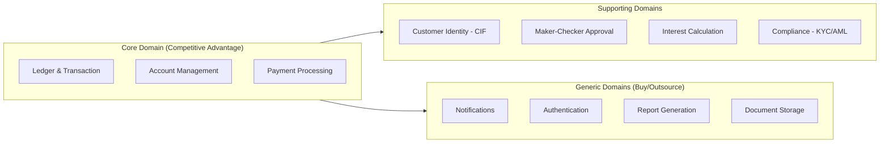
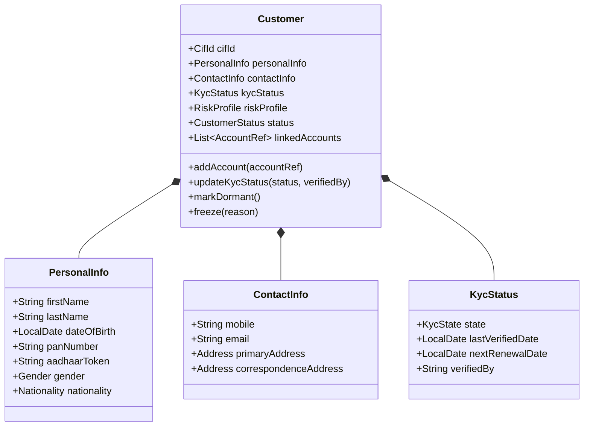
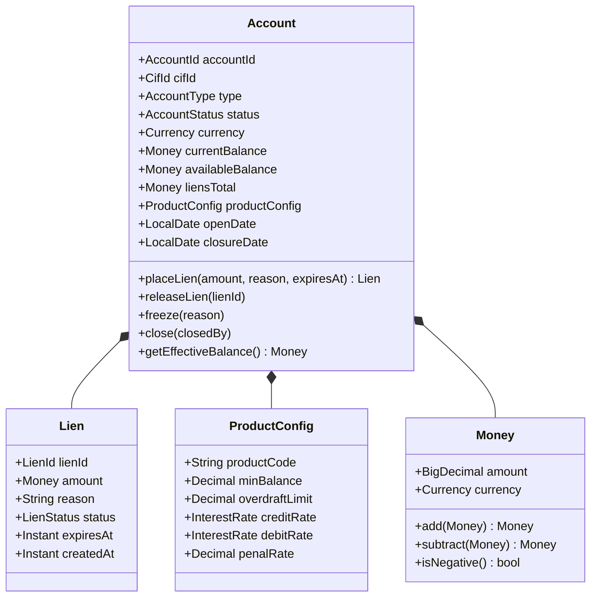
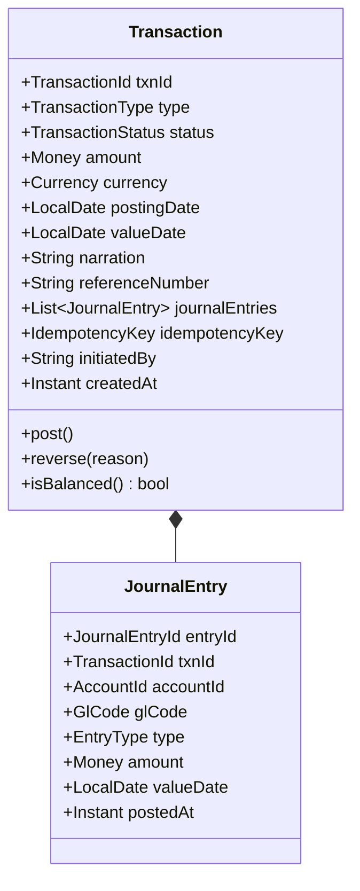
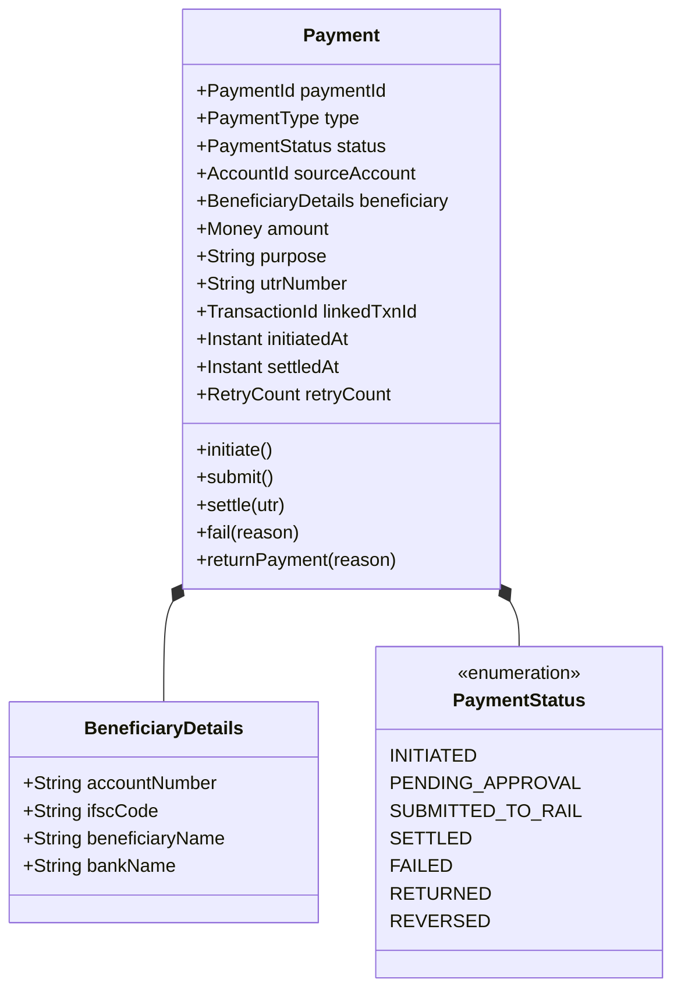
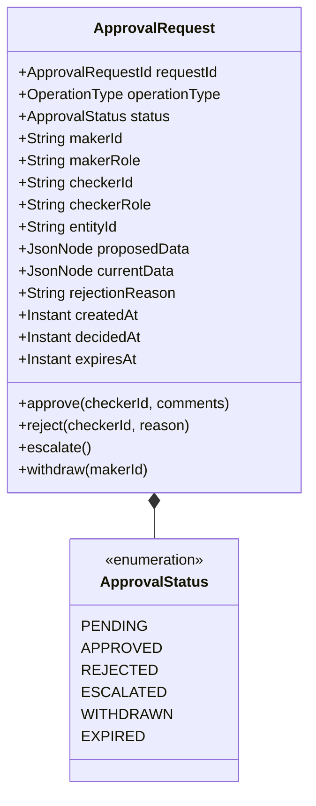

# 02 — Domain Modeling: Banking Core System

## Objective

Define the core domain entities, value objects, aggregates, and domain events for the Banking Core System using Domain-Driven Design (DDD) principles. This document establishes the ubiquitous language, aggregate boundaries, and invariants that protect business rules.

---

## 1. Ubiquitous Language

These terms must be used consistently across documentation, code, conversations with domain experts, and APIs. Ambiguity in language leads to ambiguity in code.

| Term | Definition |
|---|---|
| **CIF** | Customer Information File — the master record of a customer across all products |
| **Account** | A financial product instance linked to a CIF (savings, current, FD, loan) |
| **Journal Entry** | A single debit or credit leg in the double-entry ledger |
| **Transaction** | A business event that produces two or more journal entries (always balanced) |
| **Posting** | The act of recording journal entries against accounts |
| **Value Date** | The date from which interest calculations begin for a transaction |
| **Posting Date** | The date on which the transaction is recorded in the system |
| **Lien / Hold** | A temporary restriction placed on part of an account balance |
| **Maker** | The officer who initiates a sensitive operation |
| **Checker** | The officer who reviews and approves/rejects the maker's request |
| **Nostro** | Our account held with a foreign bank (used in SWIFT) |
| **Vostro** | A foreign bank's account held with us |
| **NPA** | Non-Performing Asset — a loan overdue beyond 90 days |
| **EOD** | End of Day — the batch processing window after market close |
| **GL** | General Ledger — the master chart of accounts |
| **Remittance** | An outward payment sent to another party |
| **Beneficiary** | The receiver of a payment |
| **IFSC** | Indian Financial System Code — identifies a bank branch |
| **UTR** | Unique Transaction Reference — payment rail reference number |

---

## 2. Core Domain vs Supporting Domains

**Strategic decision**: Invest engineering excellence in the Core Domain. Use standard patterns and libraries for Supporting Domains. Buy or use SaaS for Generic Domains.

---

## 3. Aggregate Design

### 3.1 Customer Aggregate

**Invariants**:
- A Customer cannot have transactions if KycStatus is EXPIRED or PENDING
- PAN is unique across all customers
- Mobile number change requires maker-checker approval

---

### 3.2 Account Aggregate

**Invariants**:
- `availableBalance = currentBalance - liensTotal`
- A debit cannot proceed if `availableBalance < debitAmount` (unless overdraft configured)
- Lien cannot exceed available balance at time of placement
- A CLOSED account cannot receive or initiate transactions

---

### 3.3 Transaction Aggregate (Ledger)

**Invariants**:
- `sum(debits) == sum(credits)` — the double-entry rule; transaction cannot post if unbalanced
- JournalEntries are immutable once posted — no UPDATE or DELETE ever
- A Transaction in POSTED status can only be reversed by creating a compensating Transaction
- `idempotencyKey` ensures the same business event cannot post twice

---

### 3.4 Payment Aggregate

**Invariants**:
- A payment in SETTLED or RETURNED status cannot transition to any other state
- RTGS payments must have amount >= ₹2,00,000
- Payment cannot be initiated from a FROZEN or CLOSED account
- Payment above configurable threshold requires maker-checker before SUBMITTED state

---

### 3.5 ApprovalRequest Aggregate (Maker-Checker)

**Invariants**:
- The maker and checker must be different persons
- The checker must have equal or higher authority level than the maker
- An approval request expires after the configured SLA (e.g., 4 hours for high-value payments)
- Once APPROVED or REJECTED, the request is immutable

---

## 4. Domain Events

Domain events are the lingua franca of the system. They represent facts that have happened and are published to Kafka for other modules/systems to react to.

| Event | Trigger | Consumers |
|---|---|---|
| `CustomerOnboarded` | Customer CIF created | Notification, Compliance |
| `KycStatusUpdated` | KYC verification complete | Account (unblock), Notification |
| `AccountOpened` | New account activated | Notification, Reporting |
| `AccountFrozen` | Fraud/compliance freeze | Notification, Payment (block) |
| `TransactionPosted` | Journal entries committed | Reporting, AML, Statement |
| `PaymentInitiated` | Payment outbox written | Payment processor |
| `PaymentSettled` | Rail confirms settlement | Notification, Reconciliation |
| `PaymentFailed` | Rail rejects or timeout | Notification, Reversal trigger |
| `LienPlaced` | Hold on account balance | Notification |
| `LienReleased` | Hold released | Notification |
| `ApprovalRequested` | Maker submits | Notification (to checkers) |
| `ApprovalDecided` | Checker approves/rejects | Originating module action |
| `InterestAccrued` | EOD batch posts interest | Reporting, Statement |
| `SuspiciousActivityDetected` | AML engine flags | Compliance team alert |

---

## 5. Value Objects

Value objects have no identity — they are defined entirely by their values and are immutable.

| Value Object | Fields | Notes |
|---|---|---|
| `Money` | amount (BigDecimal), currency (ISO 4217) | All arithmetic via Money, never raw BigDecimal |
| `AccountId` | UUID string | Globally unique, prefixed by product code |
| `CifId` | String | Bank-assigned customer ID |
| `IFSCCode` | 11-char string | Validated against RBI IFSC master |
| `PAN` | 10-char string | Format validated, not stored in plaintext |
| `AadhaarToken` | 72-char token | Masked/tokenized — raw Aadhaar never stored |
| `Address` | line1, line2, city, state, pincode, country | Immutable once set; update via new value object |
| `InterestRate` | rate (BigDecimal), basis (SIMPLE/COMPOUND), period | Rate changes tracked via history table |
| `IdempotencyKey` | UUID or client-provided string | Used for dedup at transaction layer |

---

## 6. Domain Invariant Enforcement Strategy

| Invariant | Where Enforced | Rationale |
|---|---|---|
| Double-entry balance | Transaction aggregate (Java) | Domain logic — not a DB constraint |
| Sufficient balance before debit | Account aggregate + DB advisory lock | Race condition protection at DB layer |
| Unique PAN per customer | DB unique constraint + application layer | Defense in depth |
| Immutable journal entries | DB: no UPDATE/DELETE grants on journal table | Physical enforcement — not just convention |
| Maker ≠ Checker | ApprovalRequest aggregate | Business rule, tested in unit tests |
| KYC gate for transactions | Account aggregate via domain service | Checked before any debit/credit |

---

## 7. Alternatives Considered

### Active Record vs Rich Domain Model
**Active Record** (common in Rails/JPA shortcuts): entities are thin data containers, logic in services.
**Rich Domain Model** (chosen): aggregates contain business rules, enforce invariants, emit events.
**Why Rich Domain**: Banking invariants (double-entry, balance guards, immutability) are best expressed as aggregate methods that cannot be bypassed. If balance checking is in a service, it can be accidentally skipped. If it's in the aggregate, it cannot.

### Aggregate Size
Temptation: make Transaction contain the full Account snapshot.
Decision: Transaction only references AccountId — it does not embed Account state. This prevents the aggregate from growing unbounded and simplifies optimistic locking scope.

---

## 8. Risks

- **Invariant drift**: As the system grows, new developers may bypass aggregates and write directly to repositories — strict code review gates and architecture tests (ArchUnit) must enforce this
- **Money precision**: Using `double` or `float` for monetary calculations causes rounding errors — all amounts must use `BigDecimal` with explicit scale and rounding mode
- **Timezone handling**: All timestamps stored in UTC; value dates are business-calendar aware and must account for bank holidays

---

## 9. Interview-Level Discussion Points

**Q: How do you enforce the double-entry rule without a DB constraint?**
A: The `Transaction` aggregate's `post()` method calls `isBalanced()` before allowing state transition to POSTED. If the sum of debit and credit entries doesn't match, the method throws a domain exception. This is a domain invariant — enforced in Java code. The DB only stores entries that passed this check. Additionally, a DB-level assertion can be implemented as a deferred constraint trigger for defense in depth.

**Q: What is the risk of making Money a value object shared across aggregates?**
A: Value objects are safe to share because they're immutable. The risk is currency mismatch — adding Money(100, INR) to Money(100, USD) is a domain error. Money's arithmetic methods enforce same-currency assertions.

**Q: Why separate Posting Date and Value Date?**
A: Regulatory and interest calculation requirement. A cheque deposited on Friday has a posting date of Friday but the value date (funds available) may be Monday. Interest accrual, minimum balance calculations, and overdraft penalty all use value date, not posting date. Conflating the two causes incorrect interest calculations.

**Q: How do you handle the "same business event submitted twice" problem?**
A: The `IdempotencyKey` on the Transaction aggregate. Before creating a new transaction, the system checks if a transaction with the same idempotency key already exists. If it does, the existing transaction result is returned. This check is protected by a unique DB constraint on the idempotency key, making it safe under concurrent requests.
