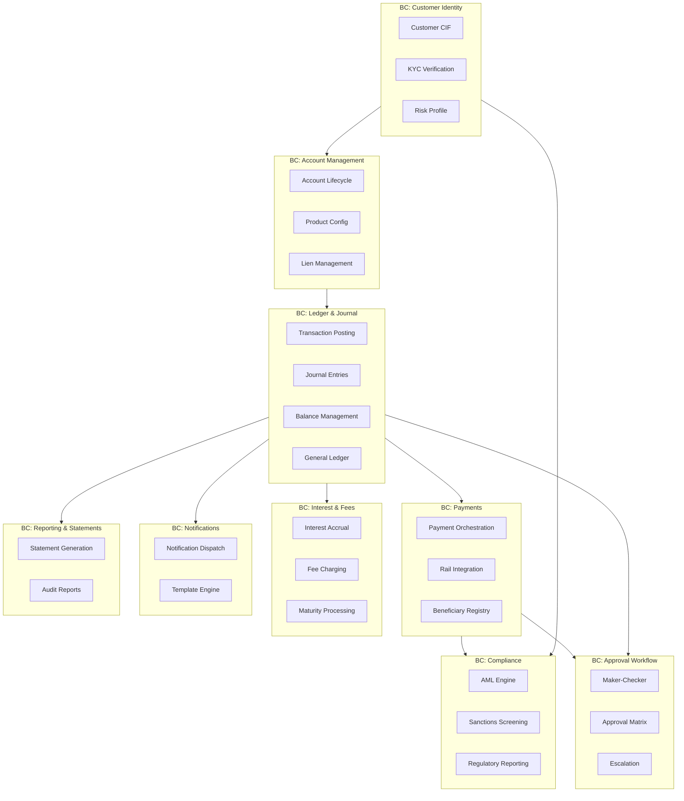
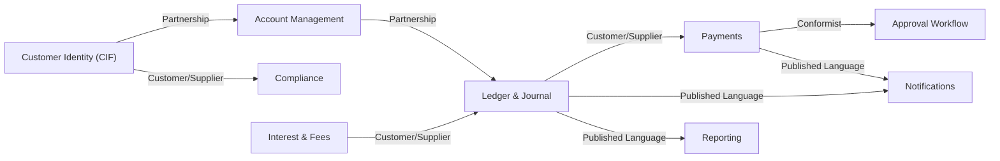

# 03 — DDD Bounded Contexts: Banking Core System

## Objective

Define the bounded contexts, their responsibilities, interaction patterns, and context maps for the Banking Core System. Explain how module isolation is enforced within the modular monolith and where Anti-Corruption Layers are applied for external system integrations.

---

## 1. Bounded Context Overview

A bounded context is a linguistic boundary — within the boundary, every term has a single, precise meaning. Across boundaries, the same word may mean something different and must be translated.



---

## 2. Bounded Context Definitions

### 2.1 Customer Identity (CIF)

**Purpose**: Master the customer lifecycle — from prospecting to KYC completion to account closure.

**Owns**:
- Customer entity (CIF ID, personal data, contact info)
- KYC state machine (PENDING → IN_REVIEW → VERIFIED → EXPIRED)
- Risk profile (risk rating, PEP flag, sanction flag)

**Language within this context**:
- "Customer" = the entity with a CIF ID
- "KYC" = the regulatory verification process
- "Risk Rating" = internal scoring (LOW/MEDIUM/HIGH)

**Does NOT own**:
- Account data (delegates to Account Management BC)
- Transaction history (belongs to Ledger BC)

**Published Events**:
- `CustomerOnboarded`, `KycVerified`, `KycExpired`, `CustomerFrozen`, `CustomerRiskRatingChanged`

---

### 2.2 Account Management

**Purpose**: Manage financial product instances — their lifecycle, configuration, and balance.

**Owns**:
- Account entity: type, status, balance, lien state
- Product configuration: rates, limits, overdraft
- Dormancy logic

**Language within this context**:
- "Account" = a product instance owned by a customer
- "Available Balance" = current balance minus all active liens
- "Product" = the template from which account configuration is derived (Savings Basic, Savings Premium, etc.)

**Consumes**:
- `KycExpired` from CIF BC → freezes all accounts of that customer

**Published Events**:
- `AccountOpened`, `AccountFrozen`, `AccountClosed`, `LienPlaced`, `LienReleased`

---

### 2.3 Ledger & Journal (Core of Core)

**Purpose**: The immutable financial record of all monetary movements. This is the beating heart of the bank.

**Owns**:
- Transaction entity (business event)
- Journal Entry (individual debit/credit leg)
- Balance store (current state derived from journal)
- General Ledger (chart of accounts: assets, liabilities, income, expenses)

**Language within this context**:
- "Transaction" = a business event that produces balanced journal entries
- "Journal Entry" = a single debit or credit posting against an account
- "Posting" = the act of committing journal entries
- "Value Date" = the date used for interest calculations
- "GL Code" = the chart-of-accounts classification of an entry

**Critical Invariants Owned Here**:
- Double-entry balance (sum debits = sum credits)
- Immutability of posted entries
- Idempotency of transaction posting

**Published Events**:
- `TransactionPosted`, `TransactionReversed`, `BalanceUpdated`

---

### 2.4 Payments

**Purpose**: Orchestrate the lifecycle of a payment instruction from initiation to final settlement, across multiple payment rails.

**Owns**:
- Payment entity (lifecycle state machine)
- Beneficiary registry (registered payees)
- Rail-specific adapters (NEFT, RTGS, IMPS, SWIFT)
- Payment outbox (reliability guarantee)

**Language within this context**:
- "Payment" = an instruction to move money via a specific rail
- "UTR" = Unique Transaction Reference (rail-assigned ID)
- "Settlement" = final confirmation from the rail that money has moved
- "Return" = a payment that was rejected by the beneficiary bank

**Important**: In the Payment BC, "Transaction" means something different from the Ledger BC. In Payments, a "transaction" refers to the payment instruction. In the Ledger, a "transaction" is the double-entry posting. An Anti-Corruption Layer translates between them.

**Consumes**:
- `ApprovalDecided` from Approval BC → submits approved payments to rail

**Published Events**:
- `PaymentInitiated`, `PaymentSubmitted`, `PaymentSettled`, `PaymentFailed`, `PaymentReturned`

---

### 2.5 Compliance (KYC/AML)

**Purpose**: Ensure all customer interactions and transactions comply with regulatory requirements.

**Owns**:
- AML rule engine configuration
- Sanctions list (refreshed from external sources)
- CTR/STR generation and filing
- Compliance case management

**Language within this context**:
- "Screening" = checking an entity against sanctions/AML rules
- "Alert" = a flagged transaction requiring human review
- "Case" = an open compliance investigation
- "SAR/STR" = Suspicious Activity/Transaction Report

**Does NOT own**:
- Customer data (reads from CIF BC via event)
- Transaction data (subscribes to `TransactionPosted` events)

**Anti-Corruption Layer**: The AML engine has its own internal representation of "customer" (risk score, transaction velocity, geography). This is translated from the CIF BC's Customer via an ACL — the AML engine does not directly read from the CIF database schema.

---

### 2.6 Approval Workflow (Maker-Checker)

**Purpose**: Enforce the 4-eyes principle on sensitive operations. No sensitive change takes effect without dual authorization.

**Owns**:
- Approval request entity
- Approval matrix configuration (who can approve what, at what amount)
- Escalation rules
- Approval audit trail

**Language within this context**:
- "Maker" = the initiating officer
- "Checker" = the approving officer (must be different from maker)
- "Authority Level" = the financial or operational authority of a role
- "Approval Matrix" = the table mapping operation type × amount → required authority level

**Consumes**: Nothing — it is called synchronously by other BCs that need approval

**Published Events**:
- `ApprovalRequested`, `ApprovalApproved`, `ApprovalRejected`, `ApprovalEscalated`, `ApprovalExpired`

---

### 2.7 Interest & Fees

**Purpose**: Compute and post interest accruals, fees, and charges as batch operations.

**Owns**:
- Interest calculation engine
- Fee schedule configuration
- Accrual records (daily accrual ledger before actual posting)
- Maturity processing for FDs and RDs

**Language within this context**:
- "Accrual" = interest that has been earned but not yet posted to the account
- "Capitalization" = posting accrued interest to the principal account
- "Broken Period" = partial interest for a period shorter than the standard term

**Depends On**: Ledger BC to post actual journal entries. Interest module does not post directly — it creates TransactionRequest objects that the Ledger BC processes.

---

## 3. Context Map



**Context Map Patterns Used**:

| Relationship | Pattern | Rationale |
|---|---|---|
| CIF → Account Management | Partnership | Both modules co-evolve; a customer cannot exist without an account model, and vice versa |
| Account Mgmt → Ledger | Partnership | Account balance is derived from Ledger; tightly coupled |
| Ledger → Payments | Customer/Supplier | Payments depend on Ledger's transaction posting capability; Ledger defines the contract |
| Payments → Rail Systems | Anti-Corruption Layer | External NEFT/SWIFT have their own data formats; ACL translates to/from domain model |
| Payments → Compliance | Conformist | Payments must fully comply with AML screening; no negotiation on this interface |
| Ledger → Notifications | Published Language | Ledger publishes domain events; Notification subscribes — no coupling back to Ledger |

---

## 4. Module Isolation Enforcement (Within Monolith)

Even within a single deployable, bounded contexts must not bleed into each other.

### Rule 1: No Cross-Schema Direct Queries
Each BC has its own PostgreSQL schema:
- `cif.*` — Customer Identity
- `accounts.*` — Account Management
- `ledger.*` — Ledger & Journal
- `payments.*` — Payments
- `compliance.*` — Compliance
- `approvals.*` — Approval Workflow

A repository in the `ledger` package cannot issue a query against `accounts.*` tables directly. Cross-module data needs must go through the module's service interface (Java API).

### Rule 2: No Direct Repository Access Across Modules
```
// FORBIDDEN: LedgerService reaching into AccountRepository
// ALLOWED: LedgerService calls AccountService.getAccount(accountId)
```
ArchUnit tests enforce this at build time — if a `ledger.*` class imports from `accounts.repository.*`, the build fails.

### Rule 3: Events Over Synchronous Calls for Non-Critical Paths
- Notifications are always async (Kafka events)
- Reporting reads from read replica or Kafka-fed Elasticsearch — never blocks ledger operations
- AML screening can be sync for high-value transactions, async for low-value

### Rule 4: Shared Kernel
A `shared-kernel` package contains:
- `Money` value object
- `AuditMetadata` (created by, created at, correlation ID)
- `DomainEvent` base class
- Common exceptions and error codes

This package is the only cross-module shared code. It is stable and changes require cross-team review.

---

## 5. Anti-Corruption Layers (ACL)

### 5.1 Payment Rail ACL
External systems (NEFT file format, SWIFT MT103 message, NPCI ISO 8583) have their own data models. The ACL translates:

```
Domain: PaymentInstruction → NEFT FileRecord
Domain: PaymentInstruction → SwiftMT103Message
Inbound: SwiftMT202 → Domain: IncomingPaymentEvent
```

This means changes in SWIFT message format do not propagate into the domain model — only the ACL adapter changes.

### 5.2 KYC Bureau ACL
External KYC bureaus (CKYC Registry, UIDAI, Experian) return their own response formats. The ACL:
- Translates bureau response → `KycVerificationResult` domain object
- Normalizes field names, handles missing data gracefully
- Shields the domain from bureau API changes

### 5.3 AML Vendor ACL (if using external vendor)
If the AML engine is a third-party vendor (NICE Actimize, Oracle FCCM), an ACL:
- Translates domain `TransactionPosted` event → vendor API request format
- Translates vendor screening response → domain `AmlScreeningResult`

---

## 6. Tradeoffs

| Decision | Benefit | Cost |
|---|---|---|
| Shared PostgreSQL with schema isolation | ACID transactions across contexts | Cannot independently scale context databases |
| Rich domain model with aggregates | Business rules enforced in code, not scattered | Steeper learning curve for new developers |
| Events for cross-context communication | Loose coupling, replayable | Eventual consistency for non-ledger operations |
| ACL for all external systems | Domain model insulated from external change | Extra translation layer to maintain |
| Shared Kernel for Money/Audit | Consistent handling everywhere | Any change to shared kernel is a cross-team decision |

---

## 7. Risks

- **Big Ball of Mud**: Without strict ArchUnit enforcement, developers gradually break context boundaries. Code review is not sufficient — automated enforcement is required.
- **Anemic Domain Model Creep**: Developers used to transaction-script patterns put logic in services, not aggregates. Regular DDD workshops and architecture ADRs help.
- **Shared Kernel Growth**: The shared kernel will attract "just put it in shared" additions. It must be kept minimal and stable.

---

## 8. Interview-Level Discussion Points

**Q: How do you prevent one team from accidentally breaking another's module?**
A: Two mechanisms. First, ArchUnit tests at build time that verify no cross-module repository access. Second, CI gate: if a module's internal package is imported by another module's non-ACL code, the build fails. For a modular monolith, this is the primary guardrail.

**Q: In a microservices architecture, how would these bounded contexts map?**
A: Natural service boundaries would be: Customer Service (CIF), Account Service, Ledger Service (core), Payment Service, Compliance Service, Approval Service. The Ledger Service would be the most critical — likely on dedicated infrastructure. Interest and Notifications would be separate lightweight services. The challenge: Ledger and Account services need ACID across their boundary — requiring a Saga pattern which adds significant complexity.

**Q: Why is "Transaction" different in Payments vs Ledger?**
A: This is a classic bounded context vocabulary collision. In the Payments BC, a "Transaction" is the payment instruction — it has a sender, receiver, amount, and rail. In the Ledger BC, a "Transaction" is a balanced double-entry posting. These are different concepts that happen to share the same English word. Without explicit bounded contexts, developers conflate them and create bugs. The ACL between Payment and Ledger explicitly translates `PaymentInstruction → LedgerTransactionRequest`.

**Q: What is a Shared Kernel and when does it become dangerous?**
A: A Shared Kernel is code co-owned by multiple bounded contexts — changes require agreement from all owners. It's valuable for genuinely universal concepts (Money, CurrencyCode, AuditMetadata). It becomes dangerous when teams start adding business-specific logic to avoid API contracts — turning it into a dumping ground. Rule: Shared Kernel must be stable and business-logic-free.
