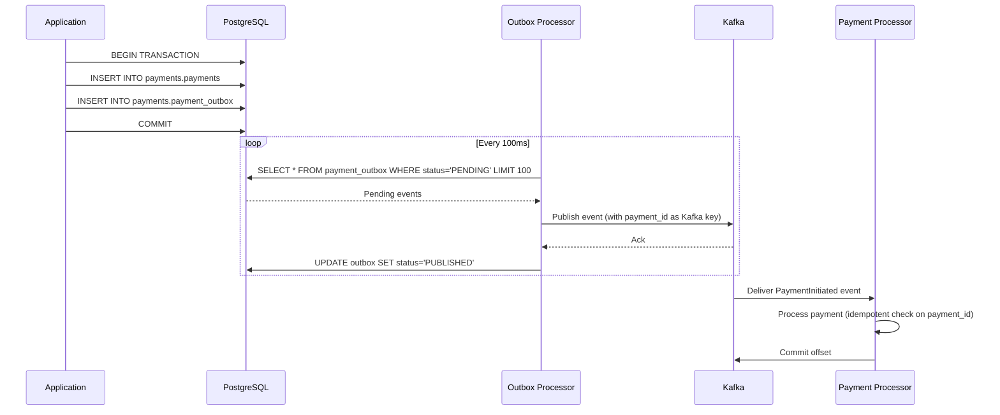
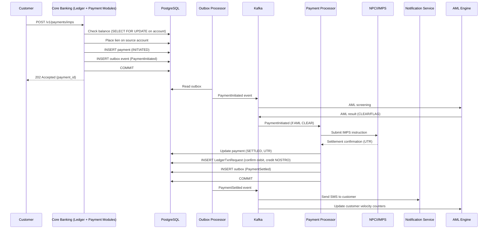
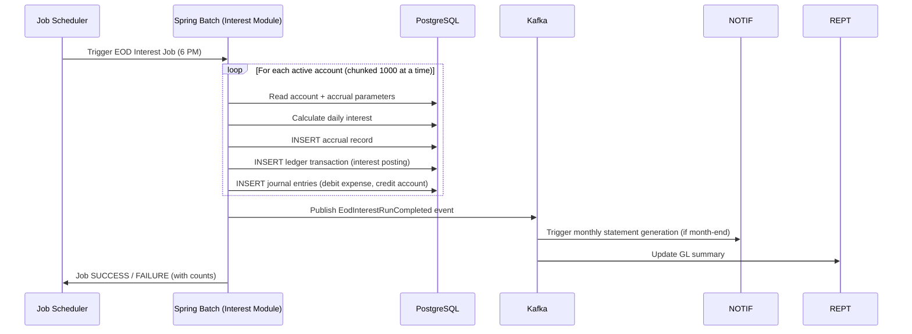
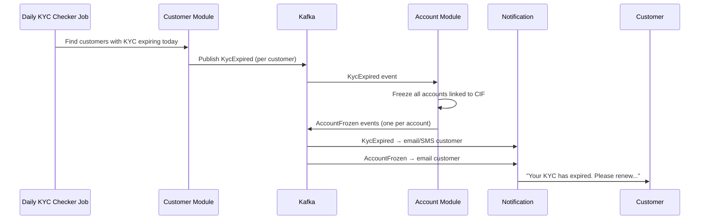

# 06 — Event Flow: Banking Core System

## Objective

Design the event-driven architecture for the Banking Core System. Cover Kafka topic design, event schemas, the transactional outbox pattern, event replay strategy, exactly-once semantics, and the flow of key business processes through the event backbone.

---

## 1. Why Event-Driven for a Banking System

Banking systems are inherently event-driven in the real world:
- A payment is initiated → the payment rail processes it → a settlement arrives later
- A KYC check is submitted → an external bureau processes it → result arrives asynchronously
- An EOD batch runs → interest accrues → account statements must be generated

However, banking also requires strong consistency for the core ledger. The design therefore uses a **hybrid model**:
- **Synchronous (ACID)**: Ledger posting, balance checks, idempotency validation
- **Asynchronous (Kafka)**: Notifications, reporting, AML screening, reconciliation, audit log fan-out

The core financial truth (journal entries) is always synchronous. Everything that reacts to that truth is asynchronous.

---

## 2. Kafka Topic Design

### Topic Naming Convention
```
{domain}.{aggregate}.{event-type}
Examples:
  banking.account.account-opened
  banking.ledger.transaction-posted
  banking.payment.payment-settled
  banking.compliance.aml-alert-raised
  banking.approval.approval-decided
```

### Topic Configuration

| Topic | Partitions | Replication | Retention | Compaction |
|---|---|---|---|---|
| `banking.ledger.transaction-posted` | 24 | 3 | 30 days | No |
| `banking.payment.payment-initiated` | 12 | 3 | 7 days | No |
| `banking.payment.payment-settled` | 12 | 3 | 30 days | No |
| `banking.payment.payment-failed` | 6 | 3 | 30 days | No |
| `banking.account.account-events` | 12 | 3 | 90 days | Yes (by account_id) |
| `banking.cif.customer-events` | 6 | 3 | 90 days | Yes (by cif_id) |
| `banking.compliance.aml-alerts` | 6 | 3 | 90 days | No |
| `banking.notification.outbound` | 12 | 3 | 1 day | No |
| `banking.batch.eod-events` | 3 | 3 | 7 days | No |
| `banking.payment.outbox` | 12 | 3 | 7 days | No |
| `banking.audit.events` | 24 | 3 | 365 days | No |

### Partitioning Keys

| Topic | Partition Key | Rationale |
|---|---|---|
| `transaction-posted` | `account_id` | All events for an account go to the same partition — ordered per account |
| `payment-initiated` | `payment_id` | Idempotent processing per payment |
| `account-events` | `account_id` | Account lifecycle events must be ordered |
| `aml-alerts` | `cif_id` | AML analysis is per customer — co-locate events |
| `notification.outbound` | `customer_id` | Fair distribution, no ordering requirement |

---

## 3. Event Schema Design

All events share a common envelope:

```json
{
  "eventId": "uuid-v4",
  "eventType": "TransactionPosted",
  "version": "1.0",
  "occurredAt": "2024-01-15T14:32:01.234Z",
  "correlationId": "corr-abc123",
  "producedBy": "ledger-module",
  "payload": { ... }
}
```

### 3.1 TransactionPosted Event

```json
{
  "eventType": "TransactionPosted",
  "payload": {
    "txnId": "TXN-20240115-ABC123",
    "txnType": "IMPS_DEBIT",
    "amount": 25000.00,
    "currency": "INR",
    "postingDate": "2024-01-15",
    "valueDate": "2024-01-15",
    "journalEntries": [
      {
        "accountId": "SAV-10000001",
        "entryType": "D",
        "amount": 25000.00,
        "glCode": "1001.SAVINGS"
      },
      {
        "accountId": "NOSTRO-IMPS",
        "entryType": "C",
        "amount": 25000.00,
        "glCode": "2001.PAYMENT_TRANSIT"
      }
    ],
    "narration": "IMPS Transfer",
    "initiatedBy": "CUST-10000001"
  }
}
```

### 3.2 PaymentSettled Event

```json
{
  "eventType": "PaymentSettled",
  "payload": {
    "paymentId": "PMT-IMPS-20240115-001",
    "paymentType": "IMPS",
    "utrNumber": "HDFC124500012345",
    "amount": 25000.00,
    "currency": "INR",
    "settledAt": "2024-01-15T14:32:31Z",
    "sourceAccountId": "SAV-10000001",
    "beneficiaryAccount": "987654321012",
    "beneficiaryIFSC": "HDFC0001234"
  }
}
```

### 3.3 KycExpired Event

```json
{
  "eventType": "KycExpired",
  "payload": {
    "cifId": "CIF-10000001",
    "expiryDate": "2024-01-14",
    "linkedAccounts": ["SAV-10000001", "FD-20000001"],
    "autoFreezeApplied": true
  }
}
```

---

## 4. Transactional Outbox Pattern

This is the most critical reliability pattern for the payment flow. The problem it solves:

**Without Outbox**:
```
1. Write payment to DB  ✓
2. Publish to Kafka      ✗ (crash/network failure)
   → Payment record exists but Kafka event is lost
   → Payment processor never picks it up
   → Customer charged, money never sent → catastrophic
```

**With Outbox**:
```
1. DB Transaction START
   a. Write payment to payments.payments  ✓
   b. Write event to payments.payment_outbox (same DB txn) ✓
   DB Transaction COMMIT (atomic)

2. Outbox Processor (separate process):
   a. Polls payment_outbox WHERE status = 'PENDING'
   b. Publishes to Kafka
   c. Marks outbox row as PUBLISHED
   → If process crashes between (b) and (c): event published but outbox not marked
   → Outbox processor retries → duplicate event in Kafka
   → Kafka consumer must be idempotent (uses paymentId as dedup key)
```



**Outbox Processor Implementation**: Debezium CDC (Change Data Capture) is preferable to polling. Debezium reads PostgreSQL WAL and publishes changes directly to Kafka — zero polling overhead, near-zero latency.

---

## 5. Key Event Flows

### 5.1 Full IMPS Payment Flow



### 5.2 EOD Batch Event Flow



### 5.3 KYC Expiry Cascade



---

## 6. Exactly-Once Semantics

### Producer Side (Idempotent Producer)
- Kafka's idempotent producer (`enable.idempotence=true`) ensures no duplicate events from the outbox processor even on retry
- Transactions API: outbox marks and Kafka publish wrapped in a Kafka transaction (atomic)

### Consumer Side (Idempotent Consumers)
Every Kafka consumer must be idempotent — receiving the same event twice should produce the same result as receiving it once.

**Strategies**:
1. **DB idempotency check**: Before processing an event, check if `event_id` already exists in a processed_events table. Skip if already processed.
2. **Upsert semantics**: Use `INSERT ... ON CONFLICT DO NOTHING` for event-driven insertions
3. **Natural idempotency**: Some operations are naturally idempotent (e.g., updating `payment.status = 'SETTLED'` twice is a no-op)

```sql
-- Processed events dedup table (per consumer group)
CREATE TABLE payment_consumer.processed_events (
    event_id      UUID PRIMARY KEY,
    processed_at  TIMESTAMPTZ NOT NULL DEFAULT NOW()
);
-- Clean up events older than 7 days (TTL)
```

---

## 7. Event Replay Strategy

When a consumer fails or new consumers are added, they must be able to replay historical events.

**Kafka retention**:
- Critical financial events: 30 days retention in Kafka
- After 30 days: events archived to S3 via Kafka Connect S3 Sink
- For replay beyond 30 days: read from S3 (Parquet format) → inject into Kafka topic via custom publisher

**Consumer Group Isolation**:
- Each downstream system has its own consumer group (independent offset tracking)
- AML consumer group and Notification consumer group process the same `transaction-posted` topic independently
- If Notification service is down for 1 hour, it replays from its last committed offset on restart — no events lost

**When NOT to replay**:
- Time-sensitive events (notifications, AML real-time screening) should not be replayed if they are too old — produce a "reprocessing skipped" log entry
- Replay gates: consumers check event `occurredAt` vs current time — skip events older than configured threshold for time-sensitive processing

---

## 8. Schema Evolution

Banking events must be backward compatible — consumers may lag behind producers on deploys.

**Rules**:
1. Fields can be added (optional, with defaults) — backward compatible
2. Fields cannot be removed from the schema — use a deprecated flag instead
3. Field types cannot change — add a new field with the new type instead
4. Event version field enables consumers to handle multiple schema versions

**Strategy**: Apache Avro schemas registered in Confluent Schema Registry with `BACKWARD_COMPATIBLE` compatibility mode. Kafka messages carry schema ID — consumers deserialize using the registered schema.

---

## 9. Dead Letter Queue (DLQ)

Every consumer that fails processing after N retries sends the event to a DLQ topic:
- `banking.dlq.{original-topic}` (e.g., `banking.dlq.payment-initiated`)

DLQ events are:
1. Stored durably (30-day retention)
2. Alerted to the on-call team (PagerDuty integration)
3. Inspectable via an operations dashboard
4. Replayable manually after the root cause is fixed

**DLQ failure categories**:
- Transient failures (DB timeout) → retry with exponential backoff before DLQ
- Poison pill events (malformed schema, business invariant violation) → DLQ immediately after 3 retries
- Idempotency conflicts → DLQ for manual review (should not happen if consumers are correctly idempotent)

---

## 10. Tradeoffs

| Decision | Benefit | Cost |
|---|---|---|
| Outbox pattern over direct Kafka publish | At-least-once delivery guarantee | Polling overhead (or CDC setup complexity) |
| Kafka for async vs direct DB reads | Loose coupling, replayable | Added infrastructure complexity |
| Exactly-once via idempotent consumers | Correct event processing | Dedup table maintenance, slightly higher consumer complexity |
| Per-account partition key for transactions | Ordered events per account | Uneven partition load if a few accounts are very active (hot partitions) |
| Schema Registry for Avro | Backward-compatible schema evolution | Registry is another infrastructure component to manage |

---

## 11. Interview-Level Discussion Points

**Q: Why not use the "dual write" anti-pattern (write to DB + write to Kafka in the same method)?**
A: If the process crashes between the DB write and the Kafka write, you get an inconsistency. If DB write succeeds but Kafka write fails, downstream systems never know about the transaction. In banking, this means a settled payment may never trigger a customer notification or reconciliation update. The outbox pattern (or CDC via Debezium) eliminates this gap by making both writes part of the same DB transaction.

**Q: How do you handle a consumer that keeps failing on the same event?**
A: Retry with exponential backoff (1s, 2s, 4s, 8s). After 5 retries, classify as a poison pill and route to the DLQ. Alert the on-call engineer with the event payload and error details. The consumer moves past the failing event to continue processing others — never block the entire consumer on one bad event. The DLQ event is manually reviewed and either fixed-and-replayed or marked as non-actionable.

**Q: How do you guarantee ordered processing of events for a single account?**
A: By using `account_id` as the Kafka partition key, all events for the same account go to the same partition, which is consumed sequentially by a single consumer instance. This guarantees per-account ordering without any distributed coordination.

**Q: What is the risk of using Kafka as the sole source of truth?**
A: Kafka is a message broker, not a database. Its default retention is time-bounded. If a consumer is down for longer than the retention period, events are lost. The outbox table in PostgreSQL is the durable source of truth — Kafka is the delivery mechanism. Events should be archived to S3 before Kafka retention expires, and consumers should be designed to rebuild from the DB if their Kafka offset is stale.
