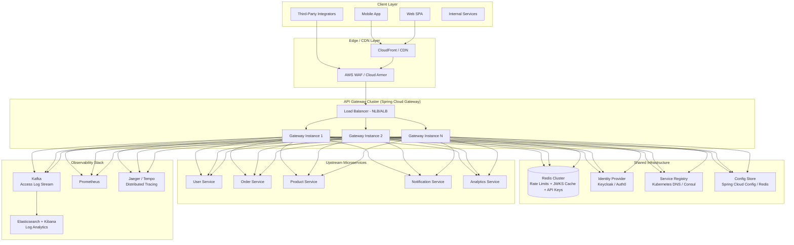
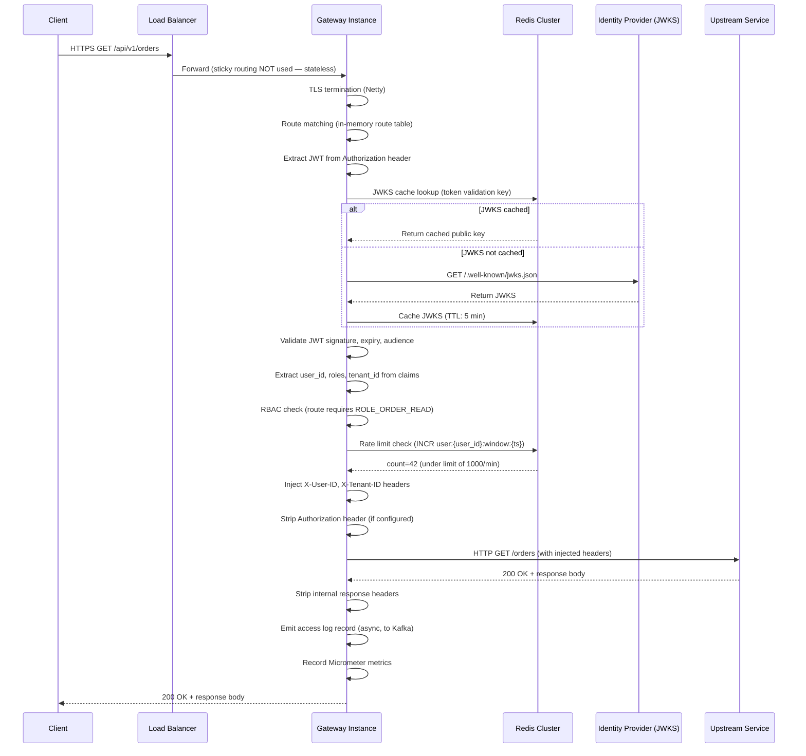
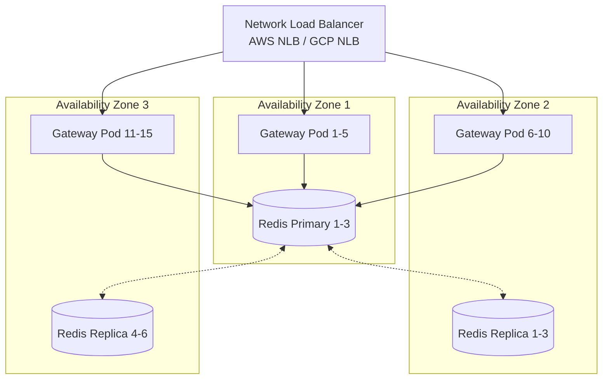

# 01 — High-Level Architecture: API Gateway

## Objective

Define the overall architectural approach for the API Gateway, justify the technology choice, map the system's major components and their interactions, and establish the traffic flow model for both north-south (client-to-backend) and considerations for east-west (service-to-service) traffic.

---

## Architecture Decision: Spring Cloud Gateway (Reactive)

### Why Spring Cloud Gateway?

Spring Cloud Gateway (SCG) is built on Project Reactor and Netty — a fully non-blocking, event-driven runtime. This is the correct foundation for a gateway because:

1. **Non-blocking I/O is mandatory at gateway scale.** The gateway's job is to receive a request, do lightweight processing (auth, rate limiting, routing), and proxy it upstream. The bottleneck is I/O, not CPU. A thread-per-request model (Tomcat/Servlet) wastes memory on blocked threads waiting for upstream responses. Netty's event loop handles thousands of concurrent connections on a handful of threads.

2. **Filter chain architecture maps naturally to gateway concerns.** SCG's pre/post filter pipeline is conceptually identical to how production gateways are built: each concern (authentication, rate limiting, circuit breaking) is an independent filter with clear ordering.

3. **Java/Spring ecosystem fit.** Teams already operate Spring Boot services. Operational tooling, JVM tuning, observability libraries (Micrometer, Sleuth/Brave), and CI/CD pipelines are reused without introducing a new runtime.

4. **Programmatic and config-driven routing.** Routes can be defined in YAML (for simple cases) and overridden programmatically (for dynamic routing from a database or service registry) — critical for zero-downtime config updates.

### Why NOT Kong?
Kong is excellent for teams that want a batteries-included solution with a plugin marketplace. However: it introduces Lua expertise requirements for custom plugins, the Admin API is REST-based and requires careful access control, and it adds an operational dependency on PostgreSQL or Cassandra. For a Java-native team, the operability cost outweighs the benefits.

### Why NOT AWS API Gateway?
AWS API Gateway is the right choice for serverless/Lambda backends and organizations fully committed to AWS. For a polyglot microservices deployment that may span multiple clouds or on-premises, it introduces unacceptable vendor lock-in. It also has a hard limit of 10,000 RPS per region (with quota increases available but bureaucratic), which is insufficient for the 500K RPS target.

### Why NOT Nginx?
Nginx as an API gateway requires OpenResty (Nginx + LuaJIT) for dynamic behavior. It is extremely performant for static routing but requires C/Lua expertise for custom logic. It does not natively integrate with JVM-based service discovery or Spring Boot actuators.

### Startup vs. Taking Perspective
- **Startup:** Use Kong or AWS API Gateway. Lower operational overhead, faster time-to-market. Custom Spring Cloud Gateway is over-engineering for < 50K RPS.
- **Mid-scale (50K–500K RPS):** Spring Cloud Gateway with Redis rate limiting is the sweet spot. Full Java control, manageable operational complexity.
- **Taking scale (> 1M RPS):** Custom-built gateway (e.g., Netflix Zuul 2, Pinterest's custom Netty gateway, Uber's GATEKEEPER) or heavy investment in Envoy/Istio. At 1M+ RPS, every millisecond of framework overhead matters and custom optimizations are worth the engineering cost.

---

## System Overview

---

## Filter Chain Architecture

Every request passes through an ordered chain of filters (pre-filters execute before proxying; post-filters execute after the upstream response is received):

```mermaid
flowchart LR
    REQ[Incoming Request] --> F1

    subgraph PreFilters["Pre-Filters (ordered)"]
        F1[1. SSL Termination\nNetty TLS handler]
        F2[2. WAF / IP Allowlist\nBlocking filter]
        F3[3. Route Matching\nPath + Host + Header]
        F4[4. API Key / JWT Auth\nFilter]
        F5[5. RBAC Authorization\nScope check]
        F6[6. Rate Limiting\nRedis token bucket]
        F7[7. Request Transform\nHeader inject, strip]
        F8[8. Circuit Breaker\nResilience4j]
        F1 --> F2 --> F3 --> F4 --> F5 --> F6 --> F7 --> F8
    end

    F8 --> PROXY[Upstream Proxy\nNetty HttpClient]
    PROXY --> RESP[Upstream Response]

    subgraph PostFilters["Post-Filters (reverse order)"]
        PF1[9. Response Transform\nHeader strip, add]
        PF2[10. Access Log\nAsync Kafka emit]
        PF3[11. Metrics\nMicrometer record]
        PF4[12. Trace Span Close\nOpenTelemetry]
        RESP --> PF1 --> PF2 --> PF3 --> PF4
    end

    PF4 --> CLIENT[Client Response]
```

**Filter ordering is critical.** Authentication must precede authorization. Rate limiting must follow authentication (rate limits are per-user, not per-IP). Circuit breaking must be immediately before the actual proxy call. Post-filter ordering is the reverse of pre-filter ordering.

---

## Traffic Flow: Standard Request

---

## North-South vs. East-West Traffic

| Dimension | North-South (Gateway) | East-West (Service Mesh) |
|---|---|---|
| Traffic type | Client → Backend | Service → Service |
| Entry point | API Gateway (this document) | Envoy sidecar |
| Auth mechanism | JWT / API key | mTLS (service identity) |
| Rate limiting | Yes — per user/key | Typically not (or per-service SLA) |
| Observability | Access logs, user traces | Internal service traces |
| Protocol | HTTP/HTTPS, WebSocket, gRPC | HTTP/2, gRPC |
| Who manages it | Platform/API team | Platform/Infra team |
| Technology | Spring Cloud Gateway | Istio / Linkerd |

**Key insight:** The API Gateway handles north-south traffic exclusively. It should NOT be used for service-to-service communication. Services call each other directly (via Kubernetes DNS) or through a service mesh. Routing internal traffic through the gateway adds unnecessary latency, creates a bottleneck, and conflates two different concerns (external API management vs. internal reliability).

---

## Deployment Topology

- Gateway pods are stateless. Any pod can serve any request. No session affinity required.
- Redis Cluster spans all three AZs. Writes go to the primary shards; reads can be served by replicas (with eventual consistency lag acceptable for rate limit counters).
- The NLB uses connection-level health checks to remove unhealthy gateway pods within 10 seconds.
- Each AZ runs independently. If an AZ fails, the NLB routes all traffic to the remaining two AZs (capacity planning must account for 2/3 → 3/3 load shift).

---

## Component Comparison: Gateway Solutions

| Feature | Spring Cloud Gateway | Kong | AWS API Gateway | Nginx (OpenResty) |
|---|---|---|---|---|
| Runtime | JVM / Netty (reactive) | Nginx + Lua | Managed (AWS) | Nginx + LuaJIT |
| Custom logic | Java / Kotlin filters | Lua plugins | Lambda authorizers | Lua scripts |
| Service discovery | Eureka, K8s, Consul | DNS, Consul | VPC Link | DNS |
| Rate limiting | Redis (custom or built-in) | Built-in (Redis) | Usage plans | Custom Lua |
| Auth | Spring Security | JWT, OAuth2 plugins | Cognito, Lambda | Custom |
| gRPC support | Yes (transcoding) | Plugin | Limited | Yes |
| WebSocket | Yes | Yes | Yes | Yes |
| Operational complexity | Medium | Medium-High | Low (managed) | High |
| Cost at scale | Infra cost only | Infra + license (Enterprise) | Per-call pricing | Infra cost only |
| Vendor lock-in | None | Moderate | High | None |

---

## Risks and Bottlenecks

| Risk | Severity | Mitigation |
|---|---|---|
| Gateway becomes single point of failure | Critical | Multi-AZ deployment, NLB with health checks, chaos testing |
| Redis unavailability breaks rate limiting | High | Fail-open policy with local in-memory fallback; alert on Redis degradation |
| JWKS cache miss storm on key rotation | Medium | Pre-warm cache after rotation; stagger rotation across instances |
| Misconfigured route exposes internal service | High | Route review process; default-deny; automated route testing |
| Hot filter (slow auth) blocks event loop | High | All filters must be non-blocking; async Redis calls; circuit break IdP |
| Config store inconsistency across instances | Medium | Use Redis pub-sub or Kafka for config push; idempotent reload |

---

## Overengineering Warnings

- **Do not implement the gateway as a microservice mesh.** The gateway is already complex. Adding a service mesh for east-west traffic on top of a custom gateway on top of Kubernetes is three layers of L7 routing — each adding latency and operational burden.
- **Do not build a BFF aggregation layer into the gateway itself for complex transformations.** The gateway should do lightweight aggregation (2–3 parallel calls, response merge). Complex orchestration belongs in a dedicated BFF service.
- **Do not store mutable session state in the gateway.** Every attempt to add "lightweight state" to the gateway ends in a distributed state management problem. Stateless is non-negotiable.

---

## Interview-Level Discussion Points

1. **Why is a reactive (non-blocking) gateway architecturally superior at high RPS?** Walk through the thread-per-request model's memory ceiling vs. the event loop model's throughput ceiling. What happens at 100K concurrent connections in each model?

2. **How does Spring Cloud Gateway handle WebSocket upgrades?** The HTTP connection is upgraded in-place; the gateway holds the connection open bidirectionally. What are the implications for the HPA (autoscaler) when thousands of WebSocket connections are held open?

3. **Sidecar proxy pattern vs. centralized gateway:** In an Istio service mesh, every service already has an Envoy sidecar doing mTLS, tracing, and circuit breaking. Does a centralized API gateway add value or duplicate functionality? Where is the line?

4. **How do you handle a misconfigured route that accidentally forwards requests to an internal admin service?** What controls prevent this? Automated testing? Manual review gates?

5. **Canary releases at the gateway vs. at the Kubernetes level:** The gateway can split traffic (5% to v2) based on route weights. Kubernetes can do the same with multiple deployments. Which layer is the right place for canary control, and what are the tradeoffs?
