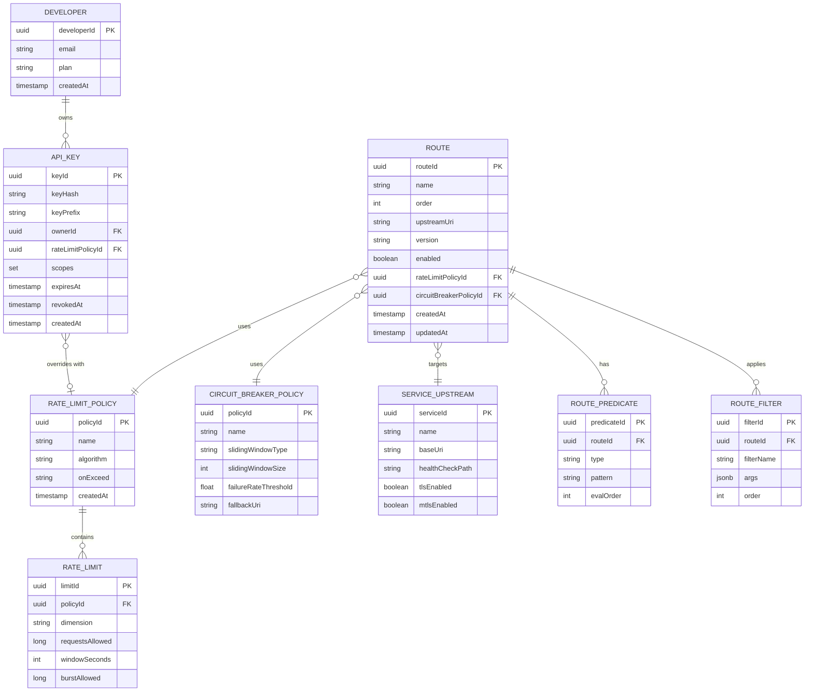
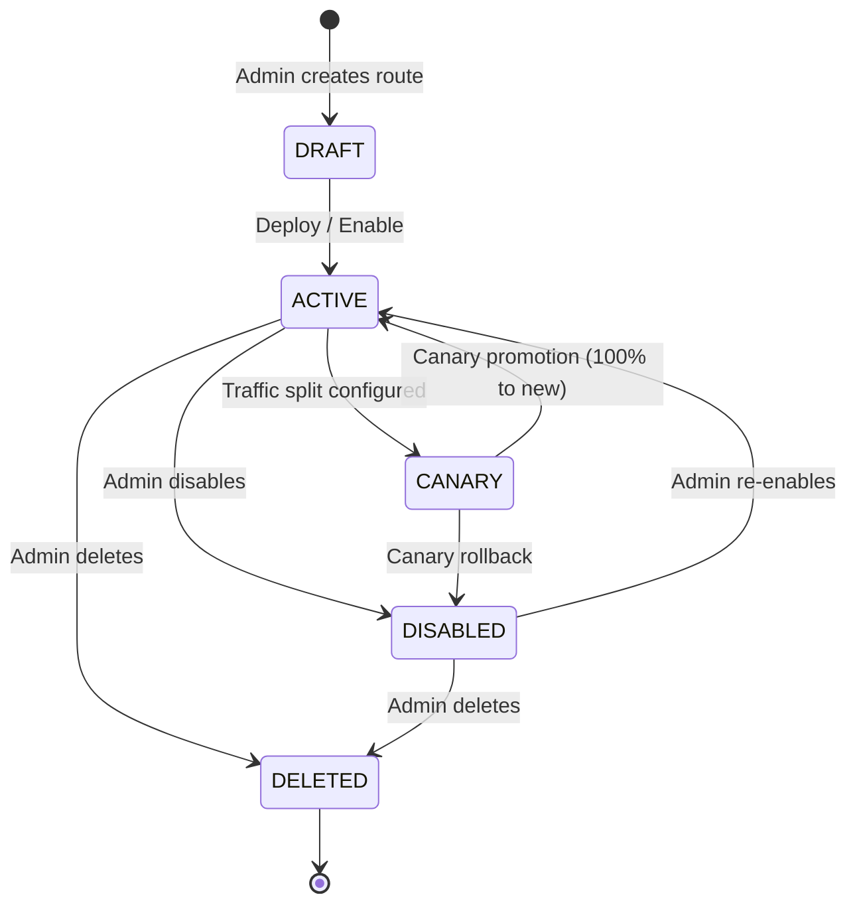
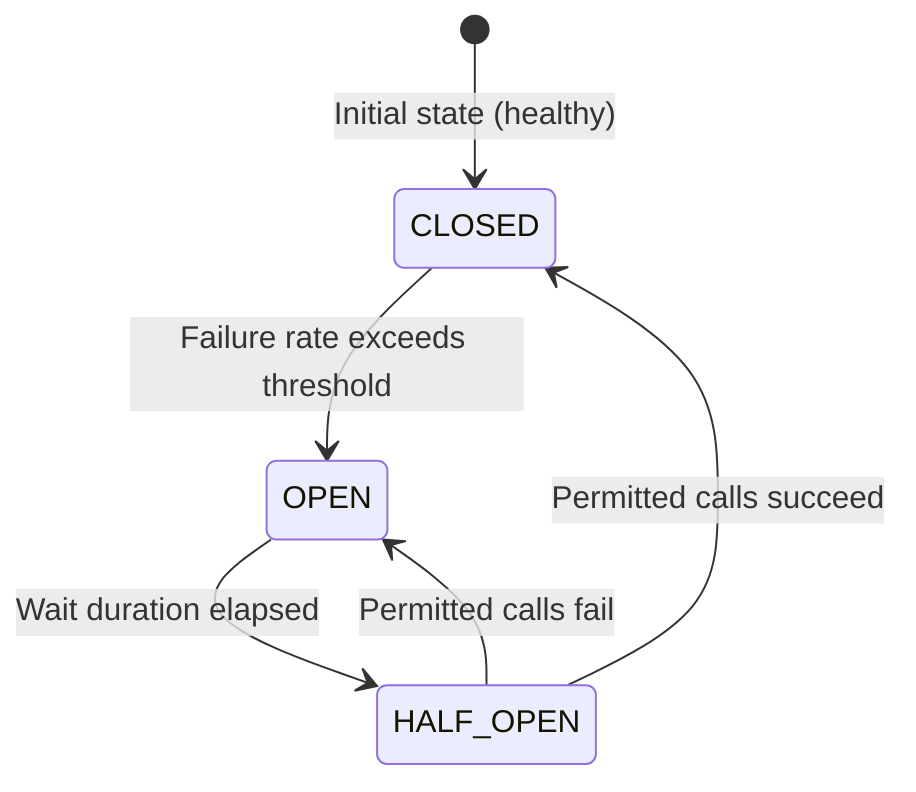
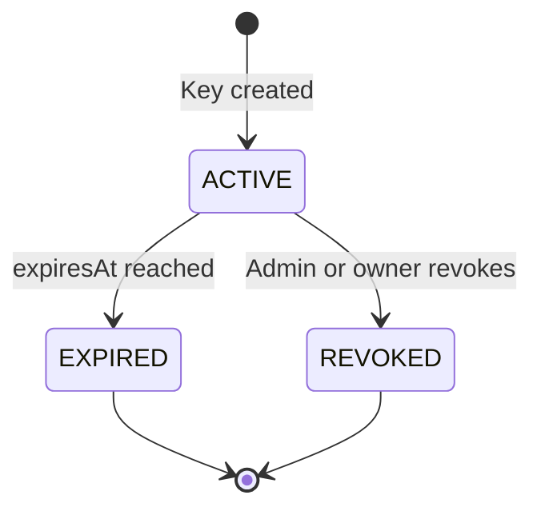

# 02 — Domain Modeling: API Gateway

## Objective

Identify the core domain concepts, entities, value objects, and aggregates that form the API Gateway's internal model. Unlike a CRUD application, the gateway's domain is primarily about **policy enforcement** and **traffic management** — the entities represent rules, identities, and contracts rather than business data. This document grounds the system in a precise vocabulary that guides database design, API contracts, and service boundaries.

---

## Domain Overview

The API Gateway domain can be divided into two distinct sub-domains:

| Sub-domain | Type | Description |
|---|---|---|
| **Traffic Routing** | Core Domain | Route matching, load balancing, upstream proxying — the primary purpose of the gateway |
| **Policy Enforcement** | Core Domain | Rate limiting, authentication, authorization, circuit breaking — the gateway's value proposition |
| **API Key Management** | Supporting Domain | Issuing, revoking, and managing API keys for developers and integrators |
| **Developer Portal** | Supporting Domain | Self-service UI and API for third-party developers |
| **Observability** | Generic Domain | Access logs, metrics, distributed traces — can be delegated to off-the-shelf tools |
| **Service Registry** | Generic Domain | Upstream service discovery — consumed from external systems (K8s DNS, Consul) |

---

## Core Domain Entities

### Route

The central concept of the gateway. A Route defines how an incoming request is matched and where it is forwarded.

```
Route
├── routeId: UUID (identity)
├── name: String (human-readable label)
├── predicates: List<Predicate>  (matching rules)
│   ├── PathPredicate: pattern, stripPrefix
│   ├── HostPredicate: hostPattern
│   ├── MethodPredicate: GET, POST, etc.
│   ├── HeaderPredicate: headerName, valuePattern
│   └── QueryParamPredicate: paramName, valuePattern
├── filters: List<FilterDefinition> (ordered)
│   ├── AuthFilter: authType, requiredScopes
│   ├── RateLimitFilter: rateLimitPolicy reference
│   ├── CircuitBreakerFilter: cbPolicy reference
│   ├── RequestTransformFilter: header add/remove rules
│   └── ResponseTransformFilter: header add/remove rules
├── upstreamUri: URI (e.g., lb://order-service)
├── order: Integer (priority when multiple routes match)
├── tags: Map<String, String> (metadata for filtering/querying)
├── version: String (e.g., "v1", "v2") 
├── trafficSplit: List<WeightedTarget> (for canary releases)
├── enabled: Boolean
├── createdAt: Instant
└── updatedAt: Instant
```

**Design decisions:**
- Routes are versioned by a monotonic `updatedAt` timestamp, not a sequence number. Instances compare their local route table version against the config store to decide if a reload is needed.
- `predicates` are evaluated in a defined order: Path → Host → Method → Header → Query. First-match wins based on `order`.
- `upstreamUri` uses Spring Cloud Gateway's `lb://` scheme for service-discovery-based routing. The actual resolution is delegated to the LoadBalancer client.

### RateLimitPolicy

Defines the rate limiting rules that can be associated with a Route or an API Key.

```
RateLimitPolicy
├── policyId: UUID
├── name: String
├── algorithm: Enum(FIXED_WINDOW, SLIDING_WINDOW, TOKEN_BUCKET, LEAKY_BUCKET)
├── limits: List<RateLimit>
│   └── RateLimit
│       ├── dimension: Enum(USER, IP, API_KEY, TENANT, ROUTE_GLOBAL)
│       ├── requestsAllowed: Long
│       ├── windowSeconds: Integer
│       └── burstAllowed: Long (for token bucket only)
├── onExceed: Enum(REJECT_429, THROTTLE_DELAY, DEGRADE_TO_CACHED)
├── retryAfterStrategy: Enum(FIXED, DYNAMIC)
└── createdAt: Instant
```

**Design decision:** Policies are separate entities from routes. Multiple routes can share a policy (e.g., all routes in the "free tier" share the same rate limit). This avoids duplicating policy definitions and enables bulk changes.

### ApiKey

Represents a credential issued to a developer or machine client for programmatic API access.

```
ApiKey
├── keyId: UUID
├── keyHash: String (SHA-256 of the actual key; plaintext never stored)
├── keyPrefix: String (first 8 chars of key, for display/lookup)
├── ownerId: UUID (developer account or service account)
├── tenantId: UUID (for multi-tenant setups)
├── name: String (human label, e.g., "Production Integration Key")
├── scopes: Set<String> (allowed OAuth scopes)
├── allowedRoutePatterns: List<String> (glob patterns of routes this key can access)
├── rateLimitPolicyId: UUID (override; null uses route's policy)
├── expiresAt: Instant (nullable — no expiry for long-lived keys)
├── revokedAt: Instant (nullable)
├── lastUsedAt: Instant (updated asynchronously)
├── metadata: Map<String, String> (key-value pairs for custom attributes)
└── createdAt: Instant
```

**Critical security decision:** The plaintext API key is generated once and shown to the user once at creation time. Only the SHA-256 hash is stored. Lookup on inbound requests hashes the key and looks up by hash. This means a compromised database does not expose live API keys.

### CircuitBreakerPolicy

Defines the failure thresholds and state machine configuration for a circuit breaker protecting an upstream route.

```
CircuitBreakerPolicy
├── policyId: UUID
├── name: String
├── slidingWindowType: Enum(COUNT_BASED, TIME_BASED)
├── slidingWindowSize: Integer (requests or seconds)
├── failureRateThreshold: Float (e.g., 0.5 = 50% failure rate opens circuit)
├── slowCallRateThreshold: Float
├── slowCallDurationThreshold: Duration
├── waitDurationInOpenState: Duration
├── permittedCallsInHalfOpenState: Integer
├── fallbackUri: URI (nullable — return cached response or error page)
└── recordedExceptions: List<ExceptionType>
```

### ServiceUpstream

Represents a registered upstream service that routes can target. This is the gateway's view of a service — separate from the service registry (Kubernetes DNS), which is the ground truth for actual instances.

```
ServiceUpstream
├── serviceId: UUID
├── name: String (matches lb:// scheme identifier)
├── baseUri: URI
├── healthCheckPath: String
├── healthCheckIntervalSeconds: Integer
├── tlsEnabled: Boolean
├── mtlsEnabled: Boolean (for service-to-gateway mTLS)
├── timeout: Duration
├── retryPolicy: RetryPolicy
│   ├── maxAttempts: Integer
│   ├── backoffBase: Duration
│   ├── backoffMultiplier: Float
│   └── retryableStatusCodes: Set<Integer>
└── tags: Map<String, String>
```

### Developer (Aggregate Root for Portal)

Represents a developer or organization registered in the Developer Portal.

```
Developer
├── developerId: UUID
├── email: String
├── organizationName: String (nullable)
├── plan: Enum(FREE, PRO, ENTERPRISE)
├── apiKeys: List<ApiKey> (aggregate, max 5 per free, 50 per enterprise)
├── usageQuota: UsageQuota
│   ├── dailyRequestLimit: Long
│   ├── monthlyRequestLimit: Long
│   └── currentMonthUsage: Long
├── verifiedAt: Instant
└── createdAt: Instant
```

---

## Value Objects

| Value Object | Fields | Notes |
|---|---|---|
| `Predicate` | type, pattern, negated | Immutable; multiple predicates are ANDed |
| `FilterDefinition` | filterName, args | Immutable; represents a filter declaration (not the filter instance) |
| `WeightedTarget` | upstreamUri, weight | Used in canary splits; weights must sum to 100 |
| `RateLimit` | dimension, requestsAllowed, windowSeconds | Immutable per policy version |
| `RetryPolicy` | maxAttempts, backoffBase, retryableStatusCodes | Embedded in ServiceUpstream |
| `KeyPrefix` | prefix (first 8 chars) | Used for fast lookup without full hash computation |

---

## Domain Events

Domain events are the mechanism for propagating state changes across gateway instances and to downstream consumers (audit systems, analytics).

| Event | Trigger | Consumers |
|---|---|---|
| `RouteCreated` | Admin creates a new route | All gateway instances (config reload), Audit log |
| `RouteUpdated` | Admin modifies a route | All gateway instances (config reload), Audit log |
| `RouteDeleted` | Admin removes a route | All gateway instances (config reload), Audit log |
| `ApiKeyCreated` | Developer creates an API key | Audit log, Usage tracking |
| `ApiKeyRevoked` | Admin or developer revokes key | All gateway instances (cache invalidation), Audit log |
| `RateLimitExceeded` | Request rejected by rate limiter | Analytics, Alert system, Developer dashboard |
| `CircuitBreakerOpened` | CB transitions to OPEN state | Alert system, On-call |
| `CircuitBreakerClosed` | CB transitions to CLOSED state | Alert system |
| `UpstreamHealthChanged` | Health check detects failure/recovery | Alert system, Ops dashboard |

Events are published to Kafka. Gateway instances subscribe to config-change events to reload their in-memory route tables without restart.

---

## Entity Relationship Overview



---

## Lifecycle States

### Route State Machine



### Circuit Breaker State Machine



### API Key State Machine



---

## Ubiquitous Language

| Term | Definition in Gateway Context |
|---|---|
| **Route** | A complete specification of how to match, transform, and forward a request |
| **Predicate** | A boolean condition evaluated against an incoming request (path, host, method, header) |
| **Filter** | A unit of processing applied to a request or response in the filter chain |
| **Upstream** | The backend service receiving the proxied request |
| **Rate Limit Window** | The time period over which request counts are measured |
| **Circuit Breaker** | A state machine that stops forwarding requests to a failing upstream |
| **API Key** | A credential issued to a developer or machine client; hashed at rest |
| **Canary** | A routing configuration that sends a fraction of traffic to a new upstream version |
| **JWKS** | JSON Web Key Set — the set of public keys used to validate JWT signatures |
| **Scope** | An OAuth2 authorization claim indicating what a token holder is permitted to do |
| **Tenant** | An organization using the platform; tenant isolation enforced at rate limit and routing level |
| **Policy** | A reusable set of rules (rate limit, circuit breaker) that can be applied to multiple routes |

---

## Aggregates and Consistency Boundaries

| Aggregate | Root Entity | Invariants |
|---|---|---|
| **Route Aggregate** | Route | Predicates must be non-overlapping per order; traffic split weights must sum to 100 |
| **RateLimitPolicy Aggregate** | RateLimitPolicy | At least one RateLimit must exist per policy |
| **ApiKey Aggregate** | ApiKey | A revoked key can never be reactivated; key hash is immutable post-creation |
| **Developer Aggregate** | Developer | Key count must not exceed plan limits |
| **ServiceUpstream Aggregate** | ServiceUpstream | HealthCheck path must be a valid URI path |

---

## Interview-Level Discussion Points

1. **Why model Rate Limit Policy as a separate aggregate rather than embedding it in the Route?** Embedding would mean updating the rate limit requires updating every affected route — a consistency nightmare. Separation enables a single policy update to affect all associated routes atomically. What consistency challenges does this introduce?

2. **API key storage as a hash — what are the operational implications?** You cannot recover a lost API key. The only recourse is to revoke and reissue. How do you design the revocation and re-issuance UX? How do you handle bulk key rotation for a compromised key?

3. **Domain events as the config sync mechanism — what happens during a Kafka partition failure?** Gateway instances may have stale route tables. How long is the window before the inconsistency is critical? Should instances also periodically poll the database as a fallback?

4. **The Route aggregate contains both predicates and filter definitions — is this the right boundary?** Predicates are purely about matching; filters are about behavior. They have different change rates (predicates rarely change; filters change when policies evolve). Should they be separated? What is the cost of doing so?

5. **How do you handle the gap between domain events (Kafka publish) and cache invalidation (Redis)?** When an API key is revoked, you publish an event AND must invalidate the Redis cache. These two operations are not atomic. What failure scenarios exist, and what compensating mechanisms are required?
