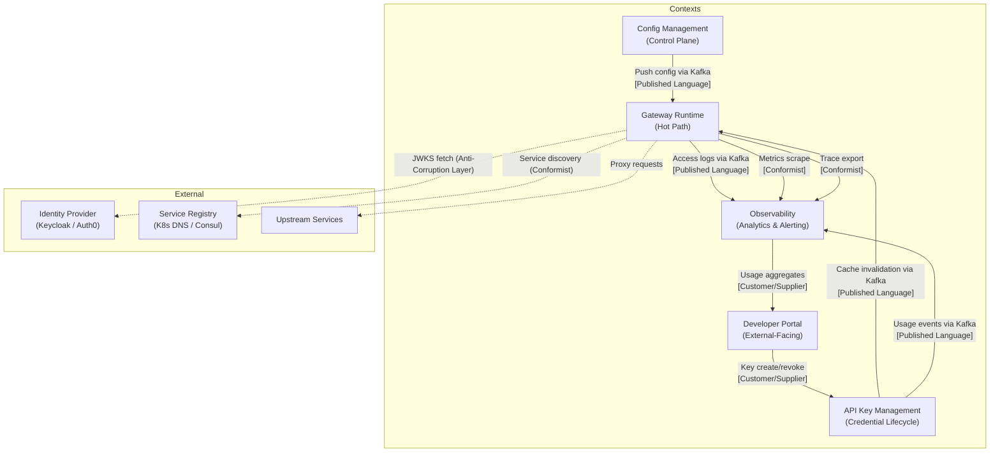

# 03 — DDD Boundaries: API Gateway

## Objective

Define the Bounded Contexts that compose the API Gateway system, establish clear context maps between them, and justify why each boundary exists. The goal is to ensure that teams, codebases, and deployment units align with the natural language boundaries of each subdomain — preventing the "big ball of mud" that emerges when all gateway concerns are crammed into a single undifferentiated codebase.

---

## Why DDD Boundaries Matter for a Gateway

An API Gateway appears deceptively simple: "receive request, forward to upstream." In practice, it encompasses at least five distinct problem spaces with different domain experts, change rates, consistency requirements, and team ownership:

- **Traffic engineers** think in terms of routes, predicates, and load balancing.
- **Security engineers** think in terms of authentication flows, token lifetimes, and key revocation.
- **Product/Developer Experience teams** think in terms of API key tiers, usage quotas, and developer onboarding.
- **SRE teams** think in terms of circuit breakers, SLOs, and alert thresholds.
- **Platform engineers** think in terms of config reloads, Kubernetes deployments, and canary strategies.

Merging these concerns into a single codebase with a shared database creates a system where a change to the developer portal schema breaks the rate limiting module — a classic coupling failure.

---

## Bounded Contexts

### 1. Gateway Runtime Context

**Purpose:** The hot path. This is the gateway process itself — the code that runs on every single request at 500K RPS.

**Domain language:**
- Route, Predicate, Filter, FilterChain, ProxyRequest, UpstreamResponse
- RateLimitResult, AuthResult, CircuitBreakerState
- AccessLogRecord, TraceContext

**Key characteristics:**
- Stateless by design. All state is read from Redis or in-memory caches (populated at startup and refreshed periodically).
- Extremely performance-sensitive. No synchronous database calls allowed in the request path.
- Config-driven. Routes and policies are loaded from the Config Management Context and cached locally.
- Consumes events from the Config Management Context to invalidate and reload caches.

**Owns:**
- In-memory route table (loaded from Config)
- In-memory JWKS cache
- Circuit breaker state machines (per upstream, per instance — not shared across instances by design)
- Local rate limit counters (L1 cache, flushed to Redis periodically to reduce Redis pressure)

**Does NOT own:**
- Route definitions (stored and managed by Config Management Context)
- API key metadata (stored by API Key Management Context, cached here)
- Developer accounts (owned by Developer Portal Context)

**Team:** Gateway Runtime Team (Platform Engineering)

---

### 2. Config Management Context

**Purpose:** The control plane for route and policy configuration. Provides the admin API for creating, updating, and deleting routes, rate limit policies, and circuit breaker policies.

**Domain language:**
- RouteDefinition, PolicyDefinition, FilterSpecification, PredicateSpecification
- ConfigVersion, ChangeSet, DeploymentRecord
- RouteReview, ApprovalWorkflow (for enterprises with change management)

**Key characteristics:**
- Moderate write frequency (routes change much less often than requests arrive).
- Must publish change events to Kafka so the Gateway Runtime Context can reload without restart.
- Stores configuration in PostgreSQL for durability and auditability.
- Caches current active config in Redis for fast consumption by Gateway Runtime instances.
- Implements optimistic locking on route updates (concurrent admin edits should not silently overwrite each other).

**Owns:**
- Route definitions database table
- RateLimitPolicy and CircuitBreakerPolicy tables
- Config version history and audit trail
- Kafka topic: `gateway.config.changes`

**Publishes:**
- `RouteCreated`, `RouteUpdated`, `RouteDeleted`
- `PolicyCreated`, `PolicyUpdated`, `PolicyDeleted`

**Team:** Gateway Platform Team (shared with Runtime, or dedicated if org is large enough)

---

### 3. API Key Management Context

**Purpose:** The lifecycle management of API keys for external developers and machine clients. Distinct from JWT-based authentication — API keys are long-lived, explicitly managed credentials.

**Domain language:**
- ApiKey, KeyRevocation, KeyRotation, KeyTier, KeyScope
- UsageQuota, QuotaExhaustion, TierUpgrade
- KeyAuditEvent

**Key characteristics:**
- Write-heavy relative to Config Management (developers create and rotate keys frequently).
- Strong consistency requirement: a revoked key must not be accepted within a bounded window (< 60 seconds).
- Key lookup in the hot path is read-only; key management (create/revoke) is in the admin path.
- Revocation must be propagated to all Gateway Runtime instances via cache invalidation.

**Owns:**
- ApiKey table (PostgreSQL, hashed keys only)
- KeyRevocation audit table
- Redis cache for active keys (populated on creation, invalidated on revocation)
- Kafka topic: `gateway.apikey.events` (for audit and cache invalidation)

**Publishes:**
- `ApiKeyCreated`, `ApiKeyRevoked`, `ApiKeyExpired`

**Consumes from Runtime:**
- `RateLimitExceeded` (to update usage tracking per key)

**Team:** Developer Experience Team or API Platform Team

---

### 4. Developer Portal Context

**Purpose:** The outward-facing interface for third-party developers. Handles developer registration, plan management, API documentation browsing, and self-service key management.

**Domain language:**
- Developer, Organization, Plan, Subscription, UsageReport
- ApiCatalog, EndpointDocumentation, ApiVersion (from developer's perspective)
- SupportTicket, BillingEvent (if monetized)

**Key characteristics:**
- Low-traffic, high-latency tolerance. Developers interacting with a portal accept 200–500ms response times.
- Read-heavy: developers mostly browse documentation and view usage dashboards.
- Calls the API Key Management Context to issue and revoke keys on behalf of developers.
- Reads usage metrics from the Analytics Context (or a pre-aggregated store) for the usage dashboard.
- Can be a separate deployable service with its own database; does not share state with the Gateway Runtime.

**Owns:**
- Developer account table
- Plan and subscription data
- API documentation content (often pulled from OpenAPI specs in upstream services)
- Usage dashboard data (aggregated, not real-time)

**Calls (via API):**
- API Key Management Context: create, revoke key
- Analytics Context: fetch usage summary

**Team:** Developer Experience Team

---

### 5. Observability Context

**Purpose:** Ingests, stores, and surfaces access logs, metrics, and distributed traces generated by the Gateway Runtime.

**Domain language:**
- AccessLogRecord, MetricSample, TraceSpan, TraceContext
- SLI, SLO, ErrorBudget
- Alert, Incident, Runbook

**Key characteristics:**
- Extremely write-heavy: 500K access log records per second.
- The Gateway Runtime Context writes to Kafka in a fire-and-forget manner. The Observability Context consumes and processes asynchronously.
- Eventual consistency is acceptable — observability data can lag by 30–60 seconds without impacting the gateway's operation.
- Separate deployment from the gateway itself; observability infrastructure failures must not affect gateway availability.

**Owns:**
- Kafka consumer group for access log topic
- Elasticsearch index for log storage and search
- Prometheus time-series database for metrics
- Jaeger / Tempo for distributed traces
- Grafana dashboards and alert rules

**Consumes:**
- `gateway.access.logs` Kafka topic
- `gateway.metrics` Prometheus scrape endpoint
- OpenTelemetry trace export from Gateway Runtime

**Team:** SRE / Platform Observability Team

---

## Context Map

### Context Map Relationship Types

| Relationship | Type | Explanation |
|---|---|---|
| Config Management → Gateway Runtime | Published Language | Config changes are published as versioned events; Runtime subscribes. Neither owns the other. |
| API Key Management → Gateway Runtime | Published Language | Revocation events trigger cache invalidation. Runtime caches key data but does not own it. |
| Gateway Runtime → Observability | Published Language | Access logs are a published schema; Runtime does not know about Elasticsearch or Prometheus internals. |
| Developer Portal → API Key Management | Customer/Supplier | Portal is the upstream caller (Customer); AKM provides a stable API (Supplier). |
| Gateway Runtime → Identity Provider | Anti-Corruption Layer | The IdP's JWKS format and token format are external. The gateway's ACL layer translates IdP concepts into gateway-native auth results. |
| Gateway Runtime → Service Registry | Conformist | The gateway conforms to Kubernetes DNS and Spring Cloud LoadBalancer conventions. No custom ACL needed. |

---

## Shared Kernel

The **Shared Kernel** between Gateway Runtime and Config Management consists of:

- Route and Policy data transfer objects (DTOs) — the canonical JSON/Protobuf schema for config exchange
- Kafka topic schemas (Avro or JSON Schema Registry contracts)
- Correlation ID format (UUID v4, propagated as `X-Correlation-ID` header)

Changes to the Shared Kernel require coordination between both context teams. It is deliberately minimal to reduce coupling.

---

## Deployment Boundaries

| Context | Deployment Unit | Database | Scaling Model |
|---|---|---|---|
| Gateway Runtime | 15–30 K8s pods | None (stateless; uses Redis) | Horizontal, HPA on RPS/CPU |
| Config Management | 2–3 K8s pods | PostgreSQL + Redis | Minimal; low traffic |
| API Key Management | 3–5 K8s pods | PostgreSQL + Redis | Moderate; key operations |
| Developer Portal | 2–3 K8s pods + CDN | PostgreSQL | Low traffic; CDN for static |
| Observability | Multiple services (Kafka, ES, Prometheus, Grafana) | Elasticsearch, Prometheus | Independent scaling per component |

---

## Anti-Patterns Avoided

### 1. God Service
A single deployable unit handling all gateway concerns — routing, key management, developer portal, observability — would be unscalable operationally. A bug in the developer portal would require redeploying the hot-path routing engine.

### 2. Shared Database Between Runtime and Config Management
If the Gateway Runtime read route definitions directly from the Config Management database, a slow admin query could exhaust the database connection pool and starve the runtime's config reads. The Redis cache as a read-through layer prevents this.

### 3. Synchronous Config Reads in the Hot Path
Every request should use the in-memory route table — never a synchronous database or Redis call. Config reloads are asynchronous events, not blocking reads.

### 4. Mixing API Key Lifecycle with JWT Validation
API key management (CRUD, revocation, tier management) is a business concern. JWT validation is a pure security operation. Merging them creates fragility: an API key schema migration breaks JWT validation code.

---

## Startup vs. FAANG Differences

| Dimension | Startup | FAANG |
|---|---|---|
| Context count | 1–2 (gateway + minimal config) | 5+ with separate teams per context |
| Config Management | YAML files in Git + CI/CD redeploy | Dedicated control plane with approval workflows |
| Developer Portal | Third-party (Readme.io, Stoplight) | Custom-built with full usage analytics |
| Observability | DataDog SaaS | Custom Prometheus/Kafka/Elasticsearch stack |
| API Key Management | Embedded in gateway code | Separate service with key rotation automation |
| Shared Kernel evolution | One engineer coordinates | Schema Registry + strict versioning process |

---

## Interview-Level Discussion Points

1. **How do you handle the transition from a monolithic gateway (single deployable) to separate bounded contexts?** What is the strangler fig pattern applied to a gateway? Which context do you extract first, and why?

2. **The Anti-Corruption Layer between the Gateway Runtime and the Identity Provider:** JWT formats, JWKS endpoints, and token claim names are IdP-specific. If you switch from Keycloak to Auth0, how does the ACL insulate the rest of the gateway from that change?

3. **Published Language via Kafka — what happens when the schema must evolve?** A new field is added to the `RouteUpdated` event. The Gateway Runtime instances have varying deployment versions and may be behind by 1–2 releases. How does schema evolution work without breaking consumers?

4. **Why is circuit breaker state NOT shared across gateway instances?** Sharing CB state requires distributed consensus, which adds latency and complexity. Each instance maintains its own CB state. What is the consequence? If 30 instances all open their CBs independently at slightly different times, is that a problem?

5. **Developer Portal as a separate bounded context — is this overengineering for a startup?** When does it become justified to extract the Developer Portal? What signals indicate the boundary is needed (team size, change rate, domain expert divergence)?
