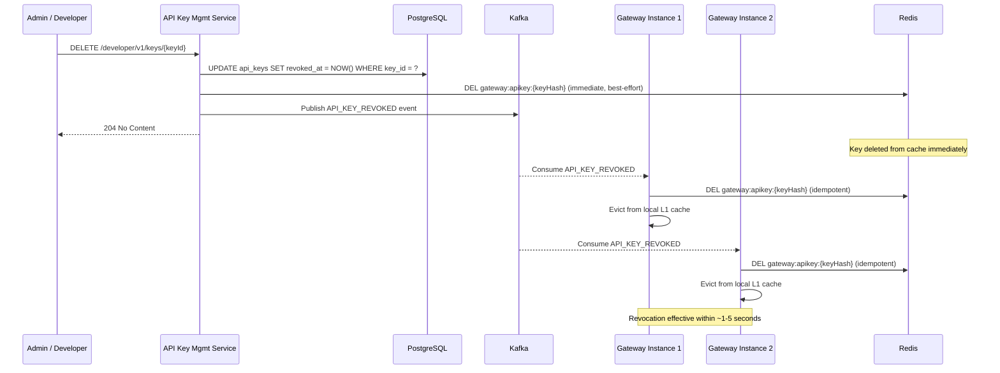
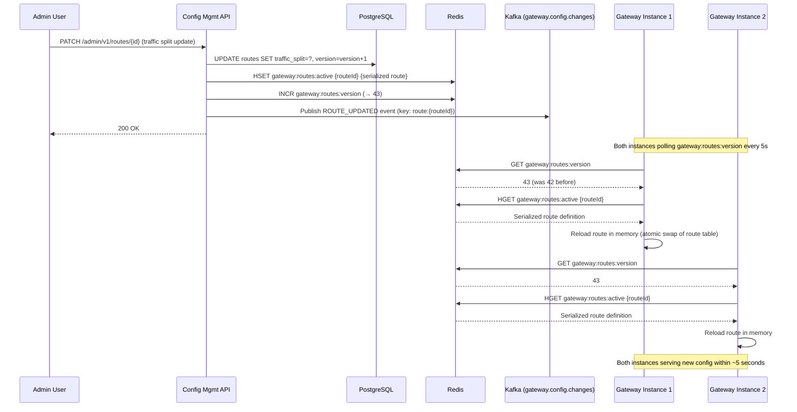

# 06 — Event Flow: API Gateway

## Objective

Define the complete event-driven architecture of the API Gateway — how configuration changes propagate across instances, how revocation events invalidate caches, how access logs flow to the observability stack, and how the gateway integrates with upstream services via async event patterns. This document establishes Kafka topic contracts, consumer group design, and the ordering/consistency guarantees required for each event type.

---

## Why Event-Driven Architecture in the Gateway?

The API Gateway is unique among event-driven systems: its primary function (request proxying) is synchronous by necessity — a client waits for a response. However, the surrounding infrastructure — config management, cache invalidation, access logging, rate limit telemetry, and developer usage tracking — is perfectly suited for asynchronous, event-driven processing.

Key motivations:

1. **Zero-downtime config reloads:** Pushing route changes via Kafka eliminates the need to restart gateway instances. An event triggers a local reload within seconds.
2. **Decoupled observability:** Access logs at 500K RPS cannot be written synchronously to Elasticsearch. Kafka absorbs the write burst; Elasticsearch consumers process at their own pace.
3. **Reliable cache invalidation:** When an API key is revoked, the invalidation must reach all gateway instances. Kafka with per-partition ordering guarantees delivery without the fire-and-forget reliability gaps of Redis pub/sub.
4. **Usage metering decoupling:** Developer usage tracking (for billing and quota enforcement) should not add latency to the request path. Events fire asynchronously after the request completes.

---

## Kafka Topic Design

### Topic: `gateway.config.changes`

**Purpose:** Propagate route, policy, and upstream configuration changes to all Gateway Runtime instances.

| Property | Value | Rationale |
|---|---|---|
| Partitions | 6 | Overkill for low-volume config events; but future-proofing for high-frequency feature flag updates |
| Replication Factor | 3 | Survive 1 broker failure without data loss |
| Retention | 7 days | Gateway instances that restart within 7 days can replay their missed config changes |
| Compaction | Enabled (key-based) | Latest config version per entity overwrites older versions; consumers don't need to replay the full history |
| Key | entity_type + entity_id (e.g., `route:f7c3a1b2-...`) | Ensures all changes for a given route land in the same partition (ordering guarantee per route) |
| Value | JSON (Avro in production for schema validation) | See event schemas below |

**Event Schema:**

```json
{
  "eventId": "uuid",
  "eventType": "ROUTE_UPDATED",
  "entityType": "ROUTE",
  "entityId": "f7c3a1b2-...",
  "configVersion": 43,
  "timestamp": "2026-05-18T10:00:00Z",
  "actorId": "admin-user-uuid",
  "payload": {
    "routeId": "f7c3a1b2-...",
    "name": "orders-service-route",
    "status": "ACTIVE",
    "predicates": [...],
    "filters": [...],
    "upstreamUri": "lb://order-service",
    "trafficSplit": [...]
  }
}
```

**Event types:** `ROUTE_CREATED`, `ROUTE_UPDATED`, `ROUTE_DELETED`, `POLICY_CREATED`, `POLICY_UPDATED`, `POLICY_DELETED`, `UPSTREAM_CREATED`, `UPSTREAM_UPDATED`, `UPSTREAM_DELETED`

**Consumer behavior:** Gateway Runtime instances maintain a consumer group `gateway-runtime-config-reload`. Each instance is a consumer in this group. Since Kafka's consumer group model ensures each partition is consumed by exactly one consumer, and config events use compaction, the instance that wins a partition processes all config changes for routes hashed to that partition. The route table is shared in-memory across all instances by having each instance maintain ALL routes (not just those from its partitions). Therefore, the consumer group must be configured so each instance receives ALL messages — this is done by having each instance use a unique consumer group ID (effectively, no consumer group coordination — each instance reads from all partitions independently):

```
Consumer Group ID: gateway-runtime-config-{instanceId}
```

This means each of 30 gateway instances independently consumes all 6 partitions — 30 × 6 = 180 consumer-partition assignments. At the low event rate of config changes, this is trivial. The benefit is that all instances always have the complete route table, not a subset.

---

### Topic: `gateway.apikey.events`

**Purpose:** Propagate API key lifecycle events for cache invalidation and audit.

| Property | Value |
|---|---|
| Partitions | 12 |
| Replication Factor | 3 |
| Retention | 30 days (no compaction — audit history preserved) |
| Key | `apikey:{keyHash}` |

**Event types:**

```json
{
  "eventId": "uuid",
  "eventType": "API_KEY_REVOKED",
  "keyId": "uuid",
  "keyHash": "sha256hex",
  "keyPrefix": "gw_prod_a1",
  "ownerId": "uuid",
  "tenantId": "uuid",
  "reason": "DEVELOPER_REQUESTED | ADMIN_FORCED | SECURITY_BREACH | EXPIRED",
  "timestamp": "2026-05-18T10:00:00Z"
}
```

**Cache invalidation flow:**



**Why both Redis DELETE and Kafka?** The Redis DELETE is the fast path — it ensures the key is invalid within milliseconds. The Kafka event ensures durability — if the Redis DELETE failed (Redis unavailable), Kafka consumers retry when Redis recovers. If the gateway instance restarts between the Redis DELETE and the Kafka consume, it will re-populate the cache from PostgreSQL (key is marked revoked there) and immediately evict it.

---

### Topic: `gateway.access.logs`

**Purpose:** Stream access log records for observability, analytics, and compliance.

| Property | Value | Rationale |
|---|---|---|
| Partitions | 60 | High throughput; each partition ~8K RPS |
| Replication Factor | 3 | Data durability |
| Retention | 7 days | Elasticsearch ingestion must complete within 7 days |
| Compaction | Disabled | Log records are append-only, no compaction semantics |
| Key | `tenantId:routeId` hash | Collocates tenant traffic in partitions for per-tenant analytics consumers |

**Access Log Record Schema:**

```json
{
  "requestId": "uuid",
  "traceId": "W3C-trace-context-id",
  "timestamp": "2026-05-18T10:00:00.123Z",
  "method": "POST",
  "path": "/api/v1/orders",
  "queryString": "status=pending",
  "statusCode": 201,
  "latencyMs": 47,
  "gatewayLatencyMs": 3,
  "upstreamLatencyMs": 44,
  "requestSizeBytes": 1024,
  "responseSizeBytes": 512,
  "clientIp": "203.0.113.42",
  "userId": "uuid-or-null",
  "tenantId": "uuid-or-null",
  "apiKeyId": "uuid-or-null",
  "routeId": "uuid",
  "upstreamService": "order-service",
  "upstreamInstance": "order-service-pod-abc123",
  "rateLimitHit": false,
  "circuitBreakerState": "CLOSED",
  "authType": "JWT | API_KEY | ANONYMOUS",
  "errorType": null
}
```

**Producers:** Gateway Runtime instances write access log records asynchronously after each request completes. The write is fire-and-forget in the gateway's reactive pipeline — it does not block the response to the client.

**Consumer Groups:**

| Consumer Group | Consumer | Purpose |
|---|---|---|
| `gateway-access-logs-es-ingest` | Logstash / Kafka Connect | Write to Elasticsearch for search and dashboards |
| `gateway-access-logs-metrics` | Custom Flink/Spark Streaming job | Compute per-route RPS, error rates, latency percentiles |
| `gateway-access-logs-billing` | Usage metering service | Aggregate per-developer/tenant request counts for billing |
| `gateway-access-logs-security` | Security analytics | Detect anomalies (unusual IPs, abnormal request rates) |
| `gateway-access-logs-s3` | Kafka Connect S3 Sink | Archive to S3 for long-term compliance storage |

---

### Topic: `gateway.rate.limit.events`

**Purpose:** Publish rate limit exceeded events for developer notifications and analytics.

| Property | Value |
|---|---|
| Partitions | 12 |
| Replication Factor | 3 |
| Retention | 7 days |

**Event Schema:**

```json
{
  "eventId": "uuid",
  "eventType": "RATE_LIMIT_EXCEEDED",
  "timestamp": "2026-05-18T10:00:00Z",
  "userId": "uuid-or-null",
  "apiKeyId": "uuid-or-null",
  "tenantId": "uuid-or-null",
  "clientIp": "203.0.113.42",
  "routeId": "uuid",
  "routePath": "/api/v1/orders",
  "dimension": "USER",
  "policyId": "uuid",
  "currentCount": 1001,
  "limit": 1000,
  "windowSeconds": 60,
  "retryAfterSeconds": 23
}
```

**Consumers:**
- Developer Portal: Aggregate to show developers when they're approaching or exceeding limits.
- Alert Manager: Trigger alert if a specific user or API key is repeatedly hitting limits (potential abuse).
- Billing Service: Trigger upsell flow if a developer on the Free plan consistently hits limits.

---

### Topic: `gateway.circuit.breaker.events`

**Purpose:** Notify operations teams of upstream health changes.

**Event types:** `CIRCUIT_BREAKER_OPENED`, `CIRCUIT_BREAKER_HALF_OPENED`, `CIRCUIT_BREAKER_CLOSED`

```json
{
  "eventId": "uuid",
  "eventType": "CIRCUIT_BREAKER_OPENED",
  "timestamp": "2026-05-18T10:00:00Z",
  "gatewayInstanceId": "gw-pod-abc123",
  "upstreamService": "order-service",
  "failureRate": 0.73,
  "callCount": 100,
  "failureCount": 73,
  "openedAt": "2026-05-18T10:00:00Z",
  "nextAttemptAt": "2026-05-18T10:00:30Z"
}
```

**Consumers:**
- PagerDuty / OpsGenie: Trigger incident.
- Grafana dashboard: Update circuit breaker status panel.
- Auto-scaling trigger: If a circuit breaker opens on `order-service`, trigger a CloudWatch alarm that can trigger an upstream service scaling event.

---

## Config Change Propagation Flow



**Kafka's role here:** The Kafka event serves as the audit trail and enables instances that missed the Redis update (Redis temporary unavailability) to catch up. When Redis recovers, instances can replay recent Kafka events to re-sync their route tables.

---

## Event Ordering Guarantees

| Topic | Ordering Required? | Mechanism |
|---|---|---|
| `gateway.config.changes` | Per-entity (per route/policy) | Kafka partition key = entity_id |
| `gateway.apikey.events` | Per-key | Kafka partition key = keyHash |
| `gateway.access.logs` | No ordering required | Partition key = tenant+route (for colocation) |
| `gateway.rate.limit.events` | No ordering required | Partition key = userId or keyId |
| `gateway.circuit.breaker.events` | Per-service per-instance | Partition key = instanceId + serviceId |

---

## Failure Scenarios in Event Flow

### Scenario 1: Kafka Unavailable During API Key Revocation

1. Admin revokes a key. `AKMAPI` updates PostgreSQL (revoked_at set).
2. AKMAPI successfully deletes the key from Redis.
3. Kafka is unavailable. Event publish fails.
4. AKMAPI retries with exponential backoff (3 retries over 30 seconds).
5. If all retries fail, the key revocation is stored in an "outbox table" in PostgreSQL.
6. A background Outbox Publisher job reads from the outbox table and republishes to Kafka when it recovers.
7. In the meantime, the Redis DELETE was successful — the key is already invalid on all instances that have evicted it. The only risk is gateway instances that haven't cached the key (no issue — they'll look up from PostgreSQL where it's revoked).

### Scenario 2: Gateway Instance Misses Config Event (Instance Restart)

1. An instance restarts and loses its in-memory route table.
2. On startup, it reads ALL active routes from Redis (`HGETALL gateway:routes:active`) and loads them into memory.
3. It records the current config version from Redis (`GET gateway:routes:version`).
4. It begins polling for version changes.
5. Any config changes that occurred during the restart window are present in Redis (the snapshot is always current) — no need to replay Kafka events for startup.

### Scenario 3: Access Log Producer Back-Pressure

At 500K RPS, the gateway produces 500K Kafka messages/second to `gateway.access.logs`. If Kafka becomes slow or the topic is lagging:

1. The gateway's Kafka producer uses `acks=1` (leader ack only) for access logs — lower durability, higher throughput.
2. The producer operates in async mode — it does not wait for Kafka ack before returning the response to the client.
3. If the Kafka producer queue is full (back-pressure), the gateway has two options:
   a. **Drop logs** (configured as default): Access log reliability is less important than gateway availability. Log loss is acceptable.
   b. **Write to local buffer**: Fallback to a local file-based log, which a sidecar (Filebeat/Fluentd) picks up asynchronously.
4. A Micrometer counter tracks dropped log records. An alert fires if the drop rate exceeds 0.1%.

---

## Interview-Level Discussion Points

1. **Why use compaction on `gateway.config.changes` but not on `gateway.access.logs`?** Compaction retains only the latest value per key — useful for config (you only need the current route state, not the full history). For access logs, every record is unique and must be preserved — compaction would delete records it considers "superseded" (same key, older timestamp).

2. **The dual-write problem: Redis DELETE + Kafka publish on revocation.** These two operations are not atomic. If Redis DELETE succeeds but Kafka publish fails (even after retries), and the instance restarts before the Outbox Publisher fires, there is a window where a revoked key might be re-cached from PostgreSQL... wait — PostgreSQL has it as revoked. So the gateway would correctly reject it. Trace through the failure scenario carefully.

3. **Per-instance consumer group for config events (not shared consumer group) — what are the Kafka quota implications?** 30 instances × 6 partitions = 180 consumer-partition assignments. Each assignment has its own offset tracking. This is 180 entries in the `__consumer_offsets` internal Kafka topic. At low event volume (< 1K config events/day), this is trivially manageable. But what if you have 1,000 gateway instances in a very large deployment?

4. **Circuit breaker events are per-instance. How do you aggregate them in Grafana to show the "fleet-wide" circuit breaker state?** A Prometheus query aggregates `cb_state{service="order-service"}` across all instances. If any instance has the CB OPEN, the fleet status is DEGRADED. If > 50% of instances have CB OPEN, the status is CRITICAL. How do you display this?

5. **Exactly-once semantics for billing consumers:** The `gateway-access-logs-billing` consumer group counts requests per developer for billing. If a Kafka consumer crashes mid-batch and restarts, it reprocesses the batch. Without idempotency, developers are billed twice for those requests. How do you ensure exactly-once billing? Idempotency key in each log record? Transactional consumers with atomic database commits?
